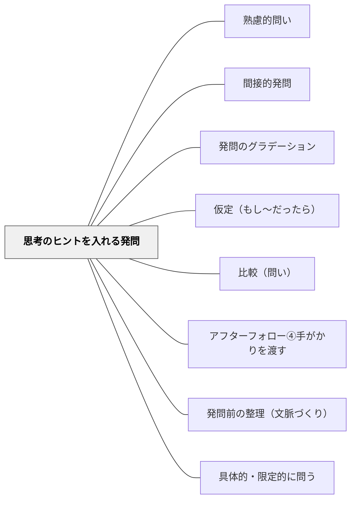

# 思考のヒントを入れる発問

> 発問の文言の中に「比較対象」「考え方の枠組み」「もしもの仮想」を埋め込むことで思考の入り口を下げ、すべての子どもが「どう考えたらいいか」を掴んで授業に参加できるようにする。

## [Pattern Connection]

- **既存パタンとの関連**：[[パタン/間接的発問]] が「迂回して問う」ことで参加しやすくする工夫であるのに対し、本パタンは「考え方の方向性を発問の文言に埋め込む」工夫であり、両者は補完的な関係にある。[[パタン/仮定（もし〜だったら）]] の教育的応用形として「もしも発問」を位置づける。
- **補強された点**：高橋達哉（2020）の「もしも発問」（「もしも事例の順序が違ったら？」「もしもこの表現が違う表現だったら？」）が、「本物と仮想を比較させる」という思考パターンとして整理された。有田和正（1988）の「思考を深化する発問」との接続も明確になった。
- **修正・拡張された点**：「ヒントを入れる」という土居の整理を、①比較ヒント、②枠組みヒント、③もしも仮想型の3タイプに体系化した。
- **他のパタンへの波及**：[[パタン/発問のグラデーション]] において、思考のヒントを入れる工夫を削ぎ落とすことで「ヒントなしの直接的な発問」へと移行できる。

## 背景（Context）

授業のねらいに向けた発問をしても、子ども达は「なぜそれを考えるのか」「どんな考え方をすればいいのか」が掴めず立ち止まることが多い。「思考の取っ掛かり」がないと、考えようとする意欲があっても思考が始まらない。教師は子どもが「こう考えてみよう」という方向性を得られるように、発問の文言自体に工夫を施すことができる。

## 問題（Problem）

発問をしたが子どもが考えをもてず沈黙する、あるいは一部の子だけが考えている状況が生まれる。子どもは「何を手がかりに考えたらいいか」がわからないため思考が始まらない。ヒントをあとから補足しても「後出し」になり、全員が同じ起点から考える機会を失う。

## 力のかたち（Forces）

- 思考の方向性が見えないと「どう考えたらいいかわからない」状態が生まれる
- 発問の文言に「比較対象」「枠組み」「仮想の設定」を入れると、子どもは考え方の手がかりを得る
- ヒントが多すぎると子どもの思考に制限をかけ、多様な考えを潰す側面もある
- ヒントなしでも考えられる子どもに対してヒントを入れ続けると、自立した思考を育てられなくなる

## 解決（Solution）

**発問の内容（授業のねらい）は変えずに、発問の文言の中に「ヒント」として考え方の方向性を埋め込む。3つのタイプを使い分ける。**

### タイプ①：比較ヒント型（「前の時間と比べて」「別の例と比べて」）

> 「この写真を見て、前の時間に扱った写真と比べてどんなことに気づきますか。」
>（社会科の実践。「比較」というヒントを発問内に組み込んでいる）

- 比較対象を示すことで「何と何を見ればいいか」が明確になる
- 「なぜこのようになっているのか、理由を考えるとどんなことに気づきますか」——因果関係というヒントを入れる

### タイプ②：枠組みヒント型（考え方の枠を発問に入れる）

有田和正（1988）の「思考を深化する発問」がこれに当たる。授業でねらいたい見方・考え方のヒントを発問に入れ込む。

> 「この日本の工業生産の強みを、生産者の立場と消費者の立場、どちらからも考えると何が言えますか。」

枠組みヒントによって、子どもは「生産者・消費者の両方の視点から考えるのか」という思考の方向が見える。

### タイプ③：もしも仮想型（「もしも〜だったら？」）

高橋達哉（2020）の「もしも発問」がこれに当たる。「本物」と「仮想した別のバージョン」を比較させることで、本物の意味・価値・必然性が浮かび上がる。

> 「もしも事例の順序が違ったら、この説明文はどう変わりますか？」
> 「もしもこの表現が別の言葉だったら、どんな印象になりますか？」

「もしもOOだったら」と問うことで、子どもは「実際と仮想」を比較する思考活動に自然と入り込む。土居（2026）はこれを「本物とは違うものを『想定』させ、それと本物とを『比較』させる」工夫と整理している。

### ヒントの量の調節（グラデーション）

- 初出事項や難しい内容：ヒントを多く入れて思考の入り口を下げる
- 既習事項の習熟場面：ヒントを減らし、子ども自身が考え方を選び取れるように育てる

## 結果（Consequences）

- 思考の取っ掛かりが見えることで、より多くの子どもが「考えてみたい」状態に入れる
- 子どもは「比較」「枠組み」「仮想」という思考パターンを体験的に学ぶ
- 授業のねらいへと焦点化した思考が生まれやすくなる
- 一方、ヒントが多すぎると思考が狭まるため、子どもの実態を見ながら「ヒントを減らすグラデーション」を設計していく必要がある

## 関連パタン

- [[パタン/熟慮的問い]] — 発問設計の上位パタン
- [[パタン/間接的発問]] — 迂回して問う工夫と並立する関係
- [[パタン/発問のグラデーション]] — ヒントを段階的に削ぎ落とす設計
- [[パタン/仮定（もし〜だったら）]] — もしも発問の論理的基盤
- [[パタン/比較（問い）]] — 比較ヒント型の基盤となる思考操作
- [[パタン/アフターフォロー④手がかりを渡す]] — 発問後にヒントを渡すアフターフォロー版
- [[パタン/発問前の整理（文脈づくり）]] — ヒントを発問前に「整理」として出すこともある
- [[パタン/具体的・限定的に問う]] — ヒントと限定化は組み合わせて使う発問工夫

## クラスター図

## Actionable Insight

- 明日の発問に「前の時間と比べて」「2つの視点から」という枠組みヒントを1つ加えてみる——子どもが「どう考えたらいいか」を掴んで手が動き始める
- 「もしも〜だったら？」という仮想の問いを1度試してみる——「本物と違うバージョン」を考えることで本物の意味が浮き立つ
- 同じ発問を「ヒントあり」と「ヒントなし」の2バージョンで用意しておき、子どもの反応を見てから選ぶ——グラデーションの「使い分け」を実感できる

## 出典

- 土居正博（2026）『自分で考え、学べる子を育てる！ 発問の技術』学陽書房
- 高橋達哉（2020）『「一瞬」で読みが深まる「もしも発問」の国語授業』東洋館出版社
- 有田和正（1988）『社会科発問の定石化』明治図書
- [[文献/自分で考え、学べる子を育てる！ 発問の技術]]

> 「発問とは、結局のところ子ども達に考えてもらうための指導言です。ですから、その授業のねらいに即した、あるべき考え方が各授業に存在するはずです。そのあるべき考え方、つまり子ども達にこんな風に考えてほしいということを発問の文言に組み込むのが、この工夫です」——土居正博（2026）
