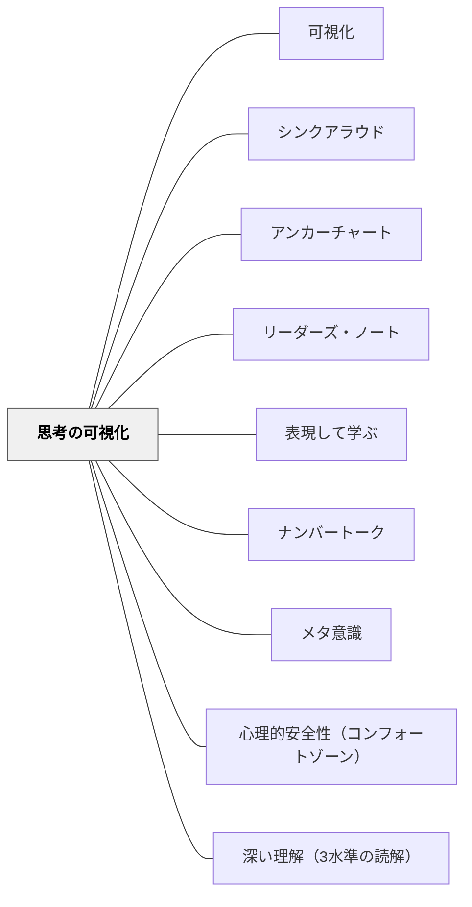

# 思考の可視化

> 学習で起きていることの多くは見えない——「考えていること」を外に出すことで初めて、思考は共有され、深まり、次の思考の足場になる。

---

## 背景（Context）

Ron Ritchhart ら Project Zero（ハーバード大学）は、「思考の文化（Thinking Culture）」の核心として**思考の可視化（Making Thinking Visible）**を位置づけた。

学習の多くは内側で起きる認知プロセスだ——推論、比較、評価、疑問。しかしこれらは外から見えない。見えなければ：
- 教師はどこで詰まっているか分からない
- 学習者は自分の思考を振り返れない
- 他の学習者の思考から学べない

**思考を外に出す**——声・言葉・図・動き——ことで、不可視の認知プロセスが共有可能な対象になる。

[[パタン/可視化]] が「抽象的な概念を目に見える形にする」という広い意味を持つのに対して、思考の可視化は**「認知プロセス（考える行為そのもの）」を外在化する**という特定の目的を持つ。

## 問題（Problem）

「理解している」かどうかは、答えの正誤だけでは分からない。正しい答えを出せても：

- なぜそう思ったか説明できない
- 次の問いに応用できない
- 別の文脈で使えない

——という「理解のふり」は頻繁に起きる。

Dorn & Soffos（2005）の問い：「理解は教えることができるか？」の背後には「ストラテジーの手順を覚えても、それが理解ではない」という洞察がある。思考を可視化しない授業では、表面的な「理解のふり」を育ててしまう危険がある。

## 力のかたち（Forces）

- 人間の認知は自動化されがちで、自分が何をどう考えているか気づかないことがある
- 思考を外に出す行為そのものが思考を整理し、深める（外在化の効果）
- 他者の思考プロセスが見えると、「そういう考え方があるのか」という学習が起きる
- 教師は可視化された思考を見て、初めて「どこで詰まっているか」を診断できる
- 可視化のルーティンが「考えることが当然の文化」を作る

## 解決（Solution）

**定期的に「考えていることを外に出す」活動を設計し、思考プロセスを共有可能にする。**

---

### 思考の可視化の3つの方法

**① 声に出す（シンクアラウド）**

教師・学習者が考えながら声を出す：
- 教師のシンクアラウド（[[パタン/シンクアラウド]]）：読みながら「今ここで私は○○と思った」
- ペアシンクアラウド：一人が解きながら声に出し、もう一人が聴く
- 「考え方を実況中継する」練習

**② 書く・描く（外在化）**

紙・ノート・ホワイトボードに考えを出す：
- クイックライト（[[パタン/表現して学ぶ]]）：「今日分かったこと・疑問」を2分で書く
- 思考地図・コンセプトマップ：概念の関係を図にする
- リーダーズ・ノート（[[パタン/リーダーズ・ノート]]）：読みながら考えたことを記録する

**③ 思考ルーティン（Thinking Routines）**

Ritchhart らが開発した構造化された思考の枠組み：

| ルーティン | 使い方 | 目的 |
|---|---|---|
| **See-Think-Wonder（見る・思う・気になる）** | 画像・実物・テキストを見て3段階で考える | 観察→推論→疑問の順序を作る |
| **I Used to Think / Now I Think（以前は〜、今は〜）** | 学習の前後で考えを比較する | 概念変化の自覚 |
| **Think-Pair-Share** | 個人→ペア→全体の順で考えを共有 | 安全な可視化の足場 |
| **Claim-Support-Question（主張・根拠・疑問）** | 主張を証拠で支え、残る疑問を示す | 論拠のある思考 |

---

### 読書指導での思考の可視化

[[パタン/リーダーズ・ノート]] との接続：

- 読みながらの考えを付箋・書き込み・ノートで記録する
- 「本を読み終わった後の感想文」ではなく「読む最中の思考の記録」が目的
- アンカーチャート（[[パタン/アンカーチャート]]）：クラスの思考を蓄積する地図として育つ

### 算数・数学での思考の可視化

[[パタン/ナンバートーク]] との接続：

- 「答えだけ」でなく「どう計算したか」を全員で共有する
- 複数の解法が可視化されることで「同じ答えに複数の道がある」という数学観が育つ
- ホワイトボード・グループボードへの書き出し——「消せる場所に書く」という安心感が思考を出しやすくする

---

## 結果（Consequences）

- 「考えることが当たり前」という教室の文化が育つ
- 教師が「今どんな思考が起きているか」をリアルタイムで把握できる
- 学習者が自分の思考を振り返り、メタ認知を働かせやすくなる
- 他者の思考プロセスから学ぶ相互学習が起きやすくなる
- ただし、「思考を出す」安心感の文化（[[パタン/心理的安全性（コンフォートゾーン）]]）なしには機能しない

## 関連パタン

- [[パタン/可視化]] — より広い意味での可視化の上位パタン
- [[パタン/シンクアラウド]] — 声による思考の可視化
- [[パタン/アンカーチャート]] — クラスの思考を蓄積する外在化の場
- [[パタン/リーダーズ・ノート]] — 読書思考の外在化
- [[パタン/表現して学ぶ]] — 書く・描く・演じるで思考を外に出す
- [[パタン/ナンバートーク]] — 算数における思考プロセスの共有
- [[パタン/メタ意識]] — 思考を可視化することでメタ認知が育つ
- [[パタン/心理的安全性（コンフォートゾーン）]] — 思考を出せる安全な環境
- [[パタン/深い理解（3水準の読解）]] — 第3水準への到達には思考の可視化が前提

---

## クラスター図

## Actionable Insight

- **授業の最後に「今日の疑問を1文書く」時間を2分作る**——答えを要求しない問いへの記録が思考の可視化の最も簡単な入口
- **ナンバートークの後「どうやって計算した？」を聞く**——答えだけでなくプロセスを問う習慣が思考の可視化文化を作る
- **「考えながら声に出してごらん」を一日一回使う**——シンクアラウドの習慣は教師のモデリングから始まる

---

## 出典

Ritchhart, R., Church, M., & Morrison, K. (2011). *Making Thinking Visible: How to Promote Engagement, Understanding, and Independence for All Learners*. Jossey-Bass.

> "Thinking is largely invisible. Making it visible is one of the most powerful things we can do to deepen learning."
> —Ritchhart et al.（2011）
