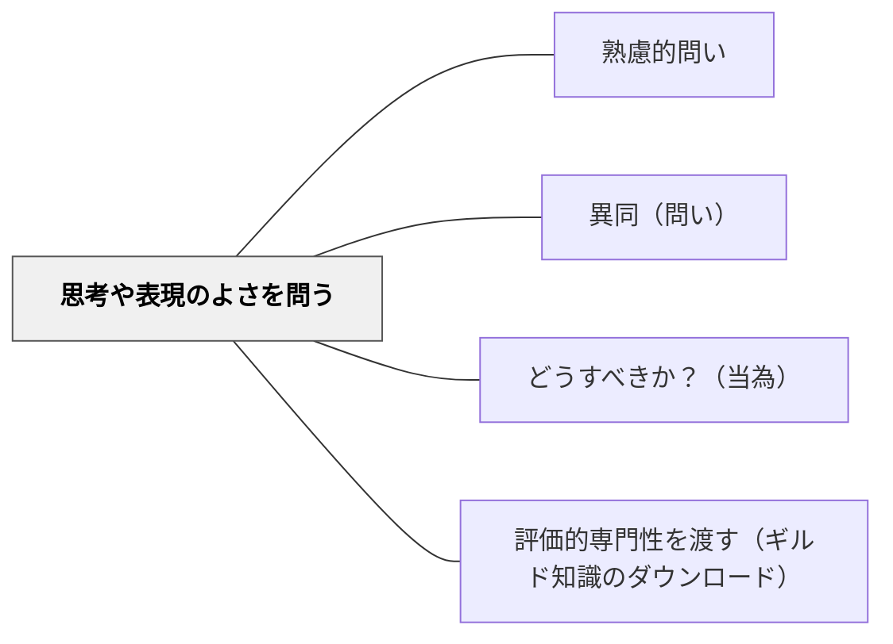

# 思考や表現のよさを問う

> 「この考え方のよさはどこか？」と問い、価値・優れた点・美しさを評価的に見る力を育てる。

## 背景（Context）
学習では「正しいか否か」の評価に集中しがちで、考え方や表現の「よさ」「優雅さ」「効率性」を問う機会が少ない。「よさ」を言語化する経験を積むことで、学習者は審美眼と評価的思考力を育てる。

## 問題（Problem）
正誤の判断だけでは、思考・表現の質を高める視点が育たない。「正しい」だけでなく「よい」を問わなければ、学習者は価値判断の言語を持てず、より高い質の思考や表現を目指す動機が生まれない。

## 力のかたち（Forces）
- よさを問うことで、基準や価値観を意識するようになる
- 「美しい解法」「わかりやすい説明」など多様な「よさ」がある
- 評価する経験が、自分の思考を磨く意欲を生む
- 他者のよさを認める姿勢が、学び合いの文化をつくる

## 解決（Solution）
「この解き方のよいところはどこだと思う？」「どの説明が一番わかりやすかった？なぜ？」「この表現の面白さや美しさはどこにある？」と問いかける。たとえば算数で複数の解法を示し「どれがエレガント（すっきりしている）だと思う？」と問う。作文の比較で「どちらの書き出しが読者を引き込む？その理由は？」と評価させる。

## 結果（Consequences）
- 評価的思考力が育ち、質を意識した学習が生まれる
- 自分と他者の思考・表現の違いを建設的に捉えられる
- 「よさ」の基準を問う習慣が、美的・倫理的判断力の基盤になる

## 関連パタン
- [[教科/算数・数学で使うパタン]]
- [[パタン/熟慮的問い]] — 親パタン
- [[パタン/異同（問い）]] — 複数の考えを比べる
- [[パタン/どうすべきか？（当為）]] — 価値判断を問う
- [[パタン/評価的専門性を渡す（ギルド知識のダウンロード）]] — 「よさはどこか」と問うことが、学習者に評価的な語彙と判断の経験を渡す（Sadler, 1989）

## クラスター図

## Actionable Insight

- 算数で複数の解き方を板書し「どれが一番すっきりしていると思う？その理由は？」と問う——正誤でなく「よさ」で評価する問いが審美眼と思考の質を育てる
- 作文の比較で「どちらの書き出しが読者を引き込む？」と問い理由を言わせる——よさを言語化する経験が自分の表現を磨く基準をつくる
- 他者の発表を聞いた後「この説明で一番わかりやすかったところはどこ？」と問う——批評的に聴く習慣が学び合いの文化を育てる

## 出典
- [[文献/熟慮的問いのパターンリスト（動画記録）]]
