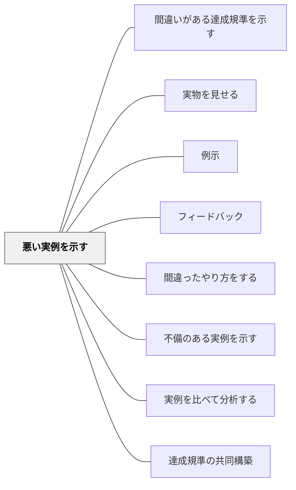

# 悪い実例を示す

> 「昔おじいさんとおばあさんがいました。終わり。」これはいい物語か？

## 背景（Context）

「良い作品」の定義は曖昧になりがちだが、「悪い例」は直感的にわかりやすい。悪い実例を示し「なぜ良くないか」を問うことで、逆説的に「良い作品の条件」を明確にできる。

## 問題（Problem）

良い実例だけを見ていると、「何があれば良いか」はわかっても、「何がなければ良くないか」がわかりにくい。

## 力のかたち（Forces）

- 悪例は学習者の既有知識でも判断しやすい
- 教師が作った架空の悪例の方が、実際の学習者の作品より安全に扱える
- 誇張された悪例の方が、違いが明確になる

## 解決（Solution）

**意図的に「明らかに質の低い例」を示し、「なぜ良くないか」「どうすれば良くなるか」を学習者と考えることで、達成規準を引き出す。**

例：
- 「昨日家に帰って寝ました」という日記 → 良い日記の条件を問う
- 「昔おじいさんとおばあさんがいました。終わり。」→ 物語に必要な要素を考える
- 音読で棒読みしてみせる → 抑揚・間の重要性を感じさせる

## 結果（Consequences）

- 達成規準が逆説的に明確になる
- 学習者が批評の語彙を得る
- 自分の作品を見直す視点が育つ

## クラスター図

## Actionable Insight

- 「昨日家に帰って寝ました」という明らかに薄い日記を見せ「なぜ良くないか」を学習者に言わせる——悪例が「良い作品の条件」を逆説的に明確にする
- 作文の授業で「意図的にひどい書き出し」を教師が作って見せ「どこが問題か」を指摘させる——教師が作った架空の悪例は学習者の作品より安全に批評できる
- 良い例と悪い例を並べて「違いを言語化しよう」と問う——対比による言語化が学習者に批評の語彙と自分の作品を見直す視点を与える

## 出典

- 一つの教育のパタン・ランゲージ（岩井輝久）

## 関連パタン
- [[パタン/間違いがある達成規準を示す]]
- [[パタン/実物を見せる]]
- [[パタン/例示]]

- [[パタン/フィードバック]] — 親パタン
- [[パタン/間違ったやり方をする]] — 実演での悪例
- [[パタン/不備のある実例を示す]] — 改善が必要な例（悪例より程度が低い）
- [[パタン/実例を比べて分析する]] — 良例との比較
- [[パタン/達成規準の共同構築]] — 悪例から規準を構築する
