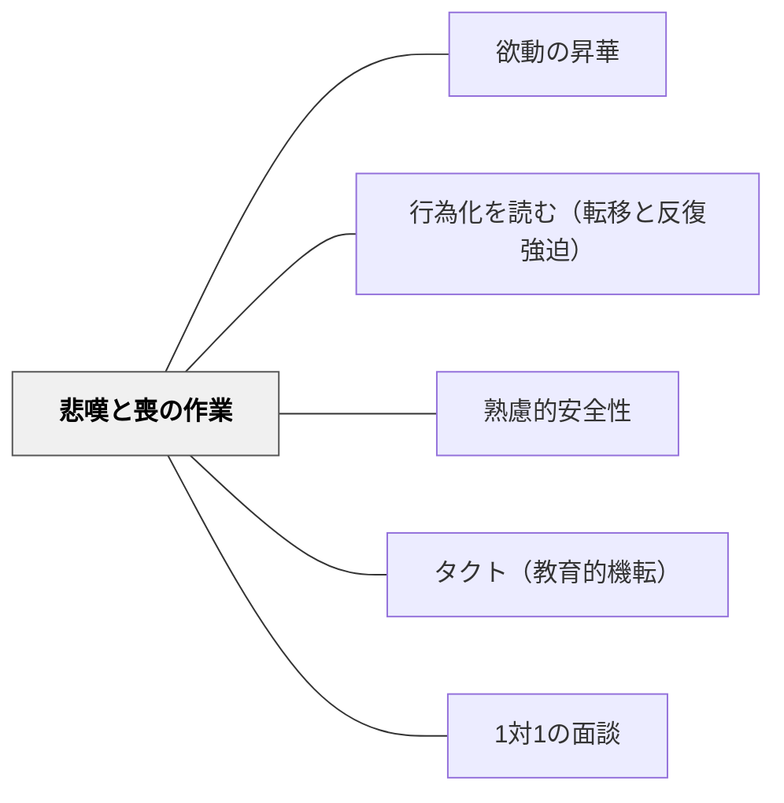

# 悲嘆と喪の作業

> 子どもが悲しんでいるとき、急いで元気にしようとしない——喪失は悼まれてこそ乗り越えられる。「早くきりかえなさい」という言葉は、悲嘆を憂鬱に変えてしまうことがある。喪の作業には時間と繰り返しが必要だ。

---

## Pattern Connection

**フロイト「人はなぜ戦争をするのか」（中山元訳）統合（2026-06-03）：**

フロイトの1917年論文「悲嘆と憂鬱（Trauer und Melancholie）」が本パタンの理論的基盤である。

- **既存パタンとの関連**：[[パタン/行為化を読む（転移と反復強迫）]] が「語れない過去が行動として繰り返される」を扱うのに対し、本パタンは「失われた愛情対象との関係を終わらせるプロセス」を扱う。行為化は時に「完了していない喪の作業」として現れる
- **補強された点**：喪失体験をした子どもに対して「元気にさせようとする介入」の危険性に、精神分析的根拠が与えられる。急いだ「切り替え」は喪の作業を阻害し、憂鬱への移行リスクを高める
- **他のパタンへの波及**：[[概念/エロスとタナトス]]（タナトスの自己への向け直しとしての憂鬱）；[[パタン/省察的評価]]（喪の作業としての「何度も向き合う」プロセス）；[[パタン/心理的安全性（コンフォートゾーン）]]（悲嘆が起きる場の心理的安全）

---

## 背景（Context）

子どもは日々、様々な喪失を体験する：
- ペットの死
- 祖父母・家族の死
- 転校・引越しによる友人や担任との別れ
- 親の離婚による別居親との別れ
- チームから外れる・役割を失う
- 失敗・挫折による理想の自己イメージの喪失

これらの喪失に対して、子どもが示す反応は様々だ。「普通に見える」ことも、「ひどく落ち込む」こともある。問題は「落ち込むこと」ではなく、「喪失とどう向き合っているか」——正常な悲嘆を「病的な憂鬱」に誘導してしまう大人の介入にある。

フロイトは1917年に「悲嘆と憂鬱」を区別し、喪の作業（Trauerarbeit）という概念を提示した。

## 問題（Problem）

喪失体験に対する教師・大人のよくある介入が、悲嘆の正常なプロセスを妨げる：

- 「もう泣かないで」「早く元気になって」——悲嘆の時間を奪う
- 「あなたのために頑張ってくれたんだよ」——感情の方向を変えようとする
- 「違うことを考えよう」——喪失対象から注意をそらす
- 「〇〇はあなたを見ている」——失われていないという幻想を提供する
- 無視・話題を変える——悲嘆は「扱いにくいもの」として回避される

これらは善意からくるが、「喪の作業」——失われたものを繰り返し思い出し、現実（もうここにない）と向き合い、徐々にリビドーを引き上げる——というプロセスを妨げる。

## 力のかたち（Forces）

- 悲嘆は「失ったものとの関係を終わらせるプロセス」——時間をかけた繰り返しの作業が必要
- 喪の作業を急かすと、失われた対象との関係が「未完了」のまま残り、憂鬱に転化するリスクがある
- 子どもは「悲しんでいい」という許可を必要としている——泣くこと・悼むことが「弱さ」として扱われると、感情が内向する
- 一方で、悲嘆と憂鬱は区別が必要——長期間の自己批判・「自分がダメだから失った」という思考は憂鬱のサイン

## 解決（Solution）

**悲嘆の時間と場を保証し、喪の作業が完了するまで「共に待つ」。急かさない・消させない・代替しない。**

---

### 1. 悲嘆と憂鬱を見分ける

| 観点 | 悲嘆（正常） | 憂鬱（要注意） |
|---|---|---|
| 中心的感情 | 「世界（外の現実）が貧しくなった」 | 「自分が貧しく・ダメになった」 |
| 自己評価 | 保たれている | 著しく低下。「自分のせいだ」 |
| 語れるか | 失った対象について語れる | 語れない・語りたくない |
| 時間経過 | 徐々に和らぐ | 長期化・深化する |
| 行動 | 悲しみの中でも食事・睡眠はある程度保てる | 生活機能の著しい低下 |

悲嘆は正常なプロセス。憂鬱のサインが見えたとき（特に「自分がダメだ」「消えたい」という言葉）は、専門家との連携を検討する。

---

### 2. 喪の作業を支える三つの姿勢

**①「悲しんでいい」という許可を与える**

> 「悲しいね」「泣いていいよ」「つらいね」

感情を「受け取る」だけでいい。解決しようとしない。「なぜ」も聞かなくていい。悲嘆は理由を必要としない。

**②「失ったもの」を語れる場を作る**

喪の作業の核心は、失われた対象の記憶を一つひとつ「呼び出して、今はいない」と向き合うことの繰り返し。

- 「〇〇のこと、話してくれる？」
- 「どんなところが好きだった？」
- 「一番の思い出は？」

語ることが作業。語れる場所がある子は、喪の作業を進められる。

**③ 時間を保証する**

「もう元気になったはず」というタイムラインを設けない。誕命日・記念日・似た状況に「また出てくる」のは正常。「また悲しくなったんだね」と受け取る。

---

### 3. 憂鬱への転化を防ぐ「自己批判への介入」

憂鬱のサイン：「自分のせいだ」「自分がいなければよかった」「自分はダメだ」

これはフロイトが示した憂鬱のメカニズム——失った対象への「怒り」が「自己批判」に転化している状態。

**介入の方向**：
- 「そんなことないよ」という否定は機能しない（超自我への攻撃になる）
- 「そう思っているんだね」と受け取りながら、「〇〇（失った対象）は、あなたのことをどう思っていたと思う？」という問いで、失われた対象との関係を呼び直す
- 自己批判が激しいときは専門家へ

---

### 4. 集団としての悲嘆——クラスが喪失体験をするとき

クラスメイトの死・転校・大事にしていたものの喪失は、学級全体の喪の体験になる：

- 「みんなで悼む」時間を作る（悲嘆の集団化）
- 「悲しんでいい」という学級全体への許可
- 「覚えていること」を語り合う場
- 記念（写真・作品・掲示・記録）が集団の喪の作業を支える

---

## 結果（Consequences）

- 悲嘆の時間と場を保証された子どもは、喪の作業を完了し、最終的に喪失を受け入れて前に進める
- 急かされなかった悲嘆は、憂鬱に転化せず、「失ったものを大切にしながら生きる」という健全な関係に落ち着く
- ただし：教師一人で「喪の作業の支援」をすることには限界がある。長期化・深化するケースは専門家（スクールカウンセラー・心理士）との連携が必要

## 関連パタン
- [[パタン/欲動の昇華]]
- [[概念/エロスとタナトス]] — タナトスの自己への向け直しとしての憂鬱；喪失の精神分析的基盤
- [[概念/無意識と教育]] — 転移・反復強迫と喪の作業の関係
- [[パタン/行為化を読む（転移と反復強迫）]] — 未完了の喪の作業が行為化として現れる
- [[パタン/心理的安全性（コンフォートゾーン）]] — 悲嘆を語れる場の心理的安全
- [[パタン/タクト（教育的機転）]] — 悲嘆に向き合う教師のタクト
- [[パタン/1対1の面談]] — 悲嘆の作業を支援する個別の対話
- [[文献/人はなぜ戦争をするのか（フロイト、中山元訳）]] — 本パタンの主出典

---

## クラスター図

## Actionable Insight

- **「早く元気になって」を言わない一週間を試す**——子どもが悲しそうにしているとき、元気づけるより「悲しいね」と受け取るだけにする。解決しなくていい。受け取るだけで喪の作業は進む
- **「失ったものの思い出を聞く」という関わりを一つ試す**——「どんなところが好きだった？」という問いは、悲嘆を喜びに変えようとするのではなく、失ったものとの関係を語れる場を作る
- **「自分のせいだ」という言葉に気をつける**——これは悲嘆から憂鬱への転化のサイン。「そんなことないよ」より「そう思っているんだね」から始め、「〇〇は、あなたのことをどう思っていたと思う？」と問う

---

## 出典

フロイト, S.（中山元訳）．*人はなぜ戦争をするのか　エロスとタナトス*．光文社古典新訳文庫．

- Freud, S. (1917). Trauer und Melancholie.

> 「悲嘆において世界は貧しくなる。憂鬱においては自我が貧しくなる」——フロイト（1917年）

> 「憂鬱における自己批判の声を聞くとき、われわれはそれが実は愛情対象への批判であることを理解しなければならない」——フロイト（1917年）
