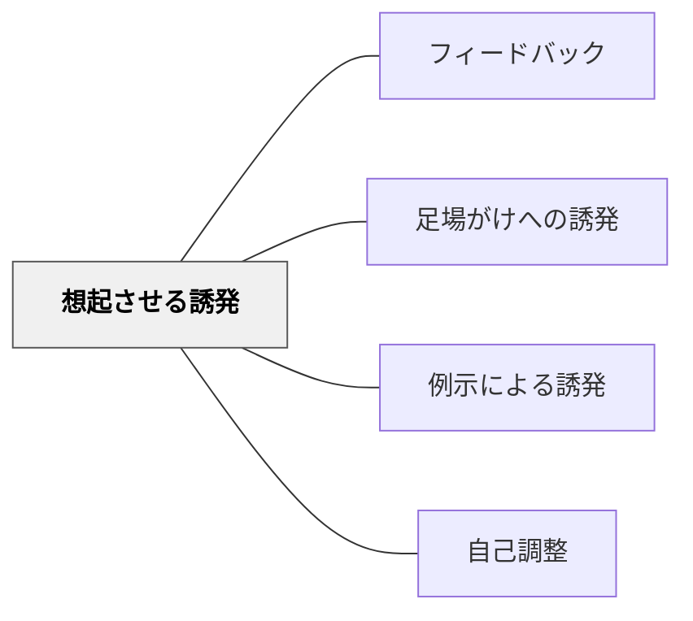

# 想起させる誘発

> 「前に似た問題をやったよね」——答えを教えるのではなく、既習の知識・経験を思い出すことで、学習者が自ら解決へ向かうよう促す。

## 背景（Context）

学習者が行き詰まったとき、教師がとりうる応答は多様である。答えを直接教える・ヒントを与える・足場を示す・問い返す、などの選択肢の中で、「想起させる誘発」は既習事項や関連する経験を思い出させることで、学習者自身の力で解決に向かわせることを目的とする。

誘発型フィードバック（Cued Feedback / Prompting）は、直接教えるより学習者の自律性と転移を促すフィードバックのあり方であり、ヴィゴツキーの「最近接発達領域（ZPD）」の概念とも関連する。

## 問題（Problem）

行き詰まった学習者にすぐ答えを教えることは、その場の問題は解決するが、「思い出す・つなげる」という認知プロセスを飛ばしてしまう。この省略が積み重なると、学習者は「詰まったら誰かに聞けばいい」という依存的な学習態度を形成しやすくなる。

一方で、想起の誘発が機能するためには、思い出すべき既習事項が実際に学習されていること、そしてそれが現在の問題と接続できることが前提となる。誘発しても何も出てこない状態では別の対応が必要になる。

## 力のかたち（Forces）

- 既習事項と現在の問題をつなげる経験が転移の能力を育てる
- 思い出す行為そのものが記憶の強化と知識ネットワークの構築につながる
- 学習者の既有知識がない・薄い場合は想起誘発が機能せず、別のアプローチが必要になる

## 解決（Solution）

学習者が詰まったとき、まず「今の問題と似ているものを前にやったことがあるか」「前の単元でどんな方法を使ったか」「同じような状況を別の場面で経験したか」という想起を促す発問・コメントをする。「第3章でやった公式を思い出してみて」「先月の実験と今回の条件はどこが違う？」という具体的な誘発も有効である。

想起が難しい場合には[[パタン/足場がけへの誘発]]に移行し、参照できる材料を示す。想起の経験を重ねることで、学習者が自ら「以前の経験とつなげる」習慣を身につける[[パタン/自己調整]]につながる。

## 結果（Consequences）

- 既習事項と新しい問題の接続が強まり、知識の転移が促進される
- 学習者が「詰まったら想起する」という自律的な問題解決の習慣を育てる
- 既有知識が不十分な場合は機能しないため、学習者の状態を把握した使い分けが必要

## 関連パタン

- [[パタン/フィードバック]] — 親パタン
- [[パタン/足場がけへの誘発]] — 想起が難しい場合に移行するパタン
- [[パタン/例示による誘発]] — 具体例を示す形の誘発フィードバック
- [[パタン/自己調整]] — 想起の習慣が育てる学習者の自律性

## クラスター図

## Actionable Insight

- 学習者が行き詰まったとき「前の単元でこれと似たものをやったよね」と既習事項へ誘導する——答えを教えずに想起を促すことで転移の力が育つ
- 授業の冒頭に「先週学んだことで今日と関係しそうなものは？」と問う——既習と新規の接続を意識させる1問が想起の習慣を育てる
- 「思い出せない」学習者には「第○章を開いてみて」という参照誘発に移行する——想起が難しい場合の代替手段があることで指導が止まらない

## 出典

Roediger, H. L. & Karpicke, J. D. (2006). Test-Enhanced Learning. *Psychological Science*, 17(3), 249–255.
Vygotsky, L. S. (1978). *Mind in Society*. Harvard University Press.
