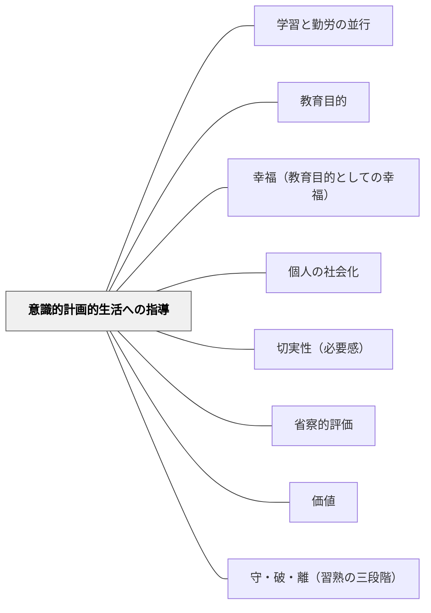

# 意識的計画的生活への指導

> 教育は、盲目的・無意識な生活を、意識的・計画的な生活へと引き上げる仕事である。

## Pattern Connection

### 牧口常三郎（1930）——教師活動の四段階：第四段が「意識的計画的生活」の技術的到達点

牧口は *創価教育学体系 第4巻*（教育技術論）において、教師の技術水準を「教師と学習者の目的意識・計画性の有無」を組み合わせた四段階で示した。この四段階は、本パタンが目標として掲げる「学習者が意識的・計画的に生きる」状態を、**教師の技術として達成するプロセス**として具体化したものである。

**教師活動の四段階**

| 段階 | 内容 | 学習者の状態 |
|---|---|---|
| **第一段** | 教師に目的意識はあるが無計画 | 学習者は目的なし・無計画（盲目的） |
| **第二段** | 教師が目的あり・計画的に動く | 学習者はまだ受動的——教師主導 |
| **第三段** | 教師が学習者を「有目的な活動」へ導く | 学習者に目的意識が生まれ始める |
| **第四段** | 学習者が**明目的・計画的に**自ら活動する | 学習者が完全に意識的・計画的——教師の目的達成 |

> 「被教育者をして明目的・計画的に活動せしめる合理的活動に導く教師の合理的活動」——牧口常三郎（第4巻 第七編）

**接続の意味**

第1巻の本パタンが「教育の目的として意識的計画的生活を目指す」と示したのに対し、第4巻はその目的を「教師の技術的段階として**どう達成するか**」として展開した。

- 第一段に留まる教師（目的はあるが無計画）では、学習者の盲目的生活は変わらない
- 第四段に到達した教師は、学習者自身が「なぜやるか・どうやるか」を持って動ける状態を実現する
- これが本パタンの「解決」の技術的な実装形である

また牧口は「教壇にあって弁々、児童に考える暇も与えず演じて参観者をアッと言わせる教師」を最下級と断じ、「自分が踊るよりは児童を踊らせる」教師が真の技師だと示した——学習者の主体的な活動こそが「意識的計画的生活への指導」の証拠である。

**補強点**：本パタンに「なぜそうするのか」を問う・理由を言語化させる、という解決策が既にある。第4巻の四段階はその根拠を「教師の技術的段階」として裏付け、「学習者が自分で動ける段階への移行」という視点を付け加える。

- **他のパタンへの波及**：[[パタン/産婆役としての教師]]（産婆役 = 第四段を実現する教師）・[[パタン/学習指導の三方面]]（第四段で学習者が自ら認識・評価・創価するようになる）

---

## 背景（Context）

牧口常三郎は「教育とは何か」を問い直し、その本質を「無意識的生活から意識的生活への転換指導」として定式化した。人は生まれながらに社会の中に生きているが、その社会との関係、自分の行動の価値、生活の方向性を意識していない。教育はその無意識を意識化し、盲目的な行動を計画的な価値創造へと変えていく働きである。

## 問題（Problem）

学習者は日々生きているが、「なぜそう生きるのか」「自分の行動はどんな価値を生んでいるか」を意識していないことが多い。この無意識的な生活のままでは、知識が増えても、社会の中で価値を創造し幸福に生きる力は育たない。

## 力のかたち（Forces）

- 盲目的・習慣的な行動は安定しているが、変化の時代には危うい
- 意識化には抽象的思考力が必要で、年齢・発達によって段階がある
- 意識化を強制しすぎると自発性が失われる
- 社会との関係を意識してはじめて、個人の行動の価値が判断できる

## 解決（Solution）

**教育活動のすべてを「この子が自分の生活と社会との関係を意識できるようになる」という基準で設計する。**

牧口は教育目的観の進化を次のように描いた：

| 段階 | 目的観 |
|---|---|
| 第一期 | 無意識・盲目的——何となくやっている |
| 第二期 | 道徳的目的——社会のルールを意識する |
| 第三期 | 経済的・物質的目的——生存基盤を意識する |
| 第四期 | 文化的目的——利・善・美の価値を意識して創造する |

この段階は個人の発達でも、授業の設計でも適用できる。子どもが今どの段階にいるかを見取り、次の段階への意識化を支援するのが教師の仕事である。

> 「教育は無意識に暮して居る社会的生活を意識的に計画的に遂げさせて、幸福乃至安楽の境界に達せしめんとするのである」（牧口常三郎）

具体的には：
- 「なぜそうするのか」を問い、理由を言語化させる
- 「今日の活動はどんな価値を生んだか」を振り返る機会を作る
- 学習と生活の結びつきを可視化する（「これが生活のどこで役立つか」）
- 社会との関係（「自分の行動が他の人にどう影響するか」）を意識させる場面を作る

## 結果（Consequences）

- 学習者が「ただやらされている」から「意味を持って行動している」への変化を体験する
- 価値創造（利・善・美）の意識が生まれ、内発的動機が育つ
- 社会との関係への意識が高まり、共存共栄の感覚が育つ
- 教師自身も「何のためにこれを教えているか」を問い直すきっかけになる

## 関連パタン
- [[パタン/学習と勤労の並行]]

- [[パタン/教育目的]] — 幸福な生活という目的
- [[パタン/幸福（教育目的としての幸福）]] — 意識的生活の目標としての幸福
- [[パタン/個人の社会化]] — 社会との関係の意識化
- [[パタン/切実性（必要感）]] — 意識化の入口としての切実性
- [[パタン/省察的評価]] — 意識化の実践としての省察
- [[パタン/価値]] — 意識化の目標としての三価値
- [[パタン/守・破・離（習熟の三段階）]] — 無意識から意識・独創へという段階的成長と対応する

## クラスター図

## Actionable Insight

- 授業の終わりに「今日の学びは自分の生活のどこに使えるか」を1行書かせる——「知識」を「生活への意識」へ転換する最小の問い
- 単元の始まりに「この学習が意識化されない場合、生活の何が盲目的になるか」を問う——無意識の問題化が意識化への動機になる
- 「なぜそうするの？」を問う回数を増やす——理由を言語化することが意識的生活の訓練になる
- グループ活動の後に「自分の役割が他の人にどう影響したか」を一人ずつ話す場を作る——社会との関係の意識化の最も小さな実践

## 出典

- 牧口常三郎（1930/2017）『創価教育学体系 第1巻』聖教新聞社（第二編第三章「教育目的と社会」）
- 牧口常三郎（1972）『牧口常三郎全集第4巻 創価教育学体系 上』聖教新聞社
- [[文献/創価教育学体系 1（牧口常三郎）]]
- [[文献/創価教育学体系 2（牧口常三郎）]] — 意識的創価作用のみが教育可能
