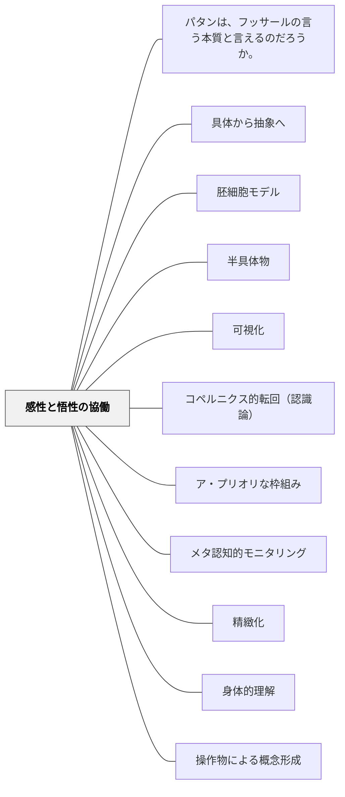

# 感性と悟性の協働

> 直観なき概念は空虚、概念なき直観は盲目。——カント『純粋理性批判』

---

## [Pattern Connection]

**カント（1781/1787）統合：**

- **哲学的基盤の提供**：[[パタン/具体から抽象へ]] が実践的に示していた「具体→抽象の学習順序」に、カントの認識論が哲学的基盤を与える。感性（直観体験）と悟性（概念思考）の協働は、人間の認識が成立するための必然的構造である。
- **補強する既存パタン**：[[パタン/胚細胞モデル]] — 胚細胞的概念（抽象的な鍵概念）は、具体的な直観体験なしには「空虚」になる。悟性の概念は感性の直観に接地して初めて機能する。
- **修正・拡張**：「体験学習は大事」という経験主義的主張に留まらず、「概念なき体験は盲目」という逆向きの批判も同時に含む。直観だけでも概念だけでも不十分。
- **他のパタンへの波及**：[[パタン/半具体物]]（感性と悟性の橋渡し）、[[パタン/可視化]]（概念を感性化する）、[[パタン/図式化]]（直観と概念の媒介）

---

## 背景（Context）

カント（1781）は『純粋理性批判』において、人間の認識は「感性」と「悟性（知性）」という二つの能力の協働によって成立すると論じた。

**感性**（Sinnlichkeit）は対象に触発されて受動的に直観を受けとる能力である。空間・時間という形式のもとで対象の「生の素材」を受けとる。

**悟性**（Verstand）はカテゴリー（量・質・関係・様相の純粋概念）によって、感性が受けとった素材を能動的に概念化・思考する能力である。

この二つが揃って初めて認識が成立する。感性がなければ概念に内容（素材）がない——空虚。悟性がなければ直観に秩序（形式）がない——盲目。

教室では、この構造が授業設計の核心的な問いを生む：**学習者に感性的な直観体験を提供しているか。そしてその直観を概念化する悟性の働きを引き出しているか。**

## 問題（Problem）

授業設計には二つの極端な失敗パターンがある。

**失敗①「概念だけの授業」**：公式・定義・法則を言語で先に提示する。学習者は言葉を暗記するが、それを具体的な現象・直観体験に結びつけられない。「直観なき概念は空虚」——概念が宙に浮く。

**失敗②「体験だけの授業」**：活動・操作・体験は豊富だが、そこから何を概念として引き出すかが設計されていない。学習者は楽しんだが何を学んだかわからない。「概念なき直観は盲目」——体験が素通りする。

## 力のかたち（Forces）

- 直観（体験・具体物・視覚的表現）は感性を豊かにするが、概念化なしに転移しない
- 概念（定義・法則・原理）は思考を整理するが、直観なしに空虚になる
- 感性と悟性は本来「異なる能力」であり、自動的につながるわけではない——意図的な設計が必要
- 年齢・経験・認知スタイルによって、感性の「入り口」の形は異なる（視覚・触覚・聴覚・身体感覚）
- 概念を早く提示したい教師の衝動と、直観体験を十分に積まない学習者の準備不足が常に緊張している

## 解決（Solution）

**感性（直観体験）と悟性（概念化）の両方を意図的に設計し、この二つが協働する授業をつくる。直観で始まり概念で閉じ、概念が次の直観を導くサイクルを回す。**

---

### 設計の三段階

**① 感性に働きかける（直観体験を先行させる）**

概念を提示する前に、その概念が説明すべき現象・問題・不思議を体験させる。具体物の操作、視覚的表現、身体的活動、問題との格闘——感性が「触発される」設計。

例：「平行」を教える前に、鉄道の線路・ノートの罫線・廊下の縁などを観察し「どんな共通点があるか」を探る。

**② 悟性を働かせる（概念化の問いを立てる）**

直観体験の後に「これをどう言葉で表すか」「何がここで起きているのか」という問いで悟性を引き出す。学習者自身の言語化が最初に来る。教師による定義はその後。

例：「さっき見た線路・罫線・廊下に共通することを一言で言うと？」→ 子どもの言葉を板書 → 数学的な定義「平行」と照合。

**③ 感性と悟性のサイクルを閉じる**

習得した概念を使って新しい直観（現象・問題）を見直す。概念が新しい直観を切り開き、新しい直観が概念を鍛える。これが「転移」の仕組み。

---

### 実践例①：算数「面積の概念」

**感性段階**：教室の床・机の天板・本の表紙など、様々な大きさの面を眺め、触れ、「どちらが広いか」を体感する。1cm²の紙をたくさん並べて「いくつ分かで広さを測れる」ことを発見する。

**悟性段階**：「今やっていることを一言で言うと？」「正方形の数で比べることの何がよいのか？」という問いで概念化を促す。「面積とは……」という定義は子どもの言語化の後で提示。

**サイクル**：面積の概念を使って「三角形の面積はなぜ（底辺×高さ÷2）なのか」という新しい問いへ。直観（図を切り貼りする操作）と悟性（式の意味の解釈）が再び協働する。

---

### 実践例②：国語「対比（対照）の技法」

**感性段階**：山上の垂訓・光と影・春と冬——対比が使われている表現を複数読む。「なんか気持ちがはっきりする感じがする」という直観的な気づきを引き出す。

**悟性段階**：「なぜこの表現はわかりやすいのか」「共通することは何か」と問い、「対比（対照）」という概念と技法名を位置づける。

**サイクル**：対比の概念を使って自分の詩や作文を見直す——「ここに対比を使えばより印象的になるか？」。

---

## 結果（Consequences）

**成功した場合：**
- 学習者が「わかった」の後に「なぜそうなるのか」まで説明できる深い理解が生まれる
- 概念が新しい場面に転移する——一つの概念で複数の現象を見渡せる
- 感性体験が記憶に残り、概念の「錨」になる

**留意点（不均衡が起きる場合）：**
- 感性の段階が長すぎると体験が散漫になる——「何を学ぶのか」が見えない盲目状態
- 悟性の段階が早すぎると感性が置いてきぼりになる——定義の暗記に戻る
- 感性と悟性のつなぎ目となる「問い」の質が授業の分岐点——問いの設計が最重要

## 関連パタン
- [[パタン/パタンは、フッサールの言う本質と言えるのだろうか。]]

- [[パタン/具体から抽象へ]] — 感性論・図式論の実践的展開。本パタンの上位構造と共鳴
- [[パタン/胚細胞モデル]] — 胚細胞的概念（悟性）は直観体験（感性）なしに空虚になる
- [[パタン/半具体物]] — 感性（具体）と悟性（抽象）の橋渡しとしての半具体物
- [[パタン/可視化]] — 悟性の概念を感性化（見える形に）する技術
- [[パタン/コペルニクス的転回（認識論）]] — 認識論的転換の実践的パタン
- [[パタン/ア・プリオリな枠組み]] — 学習者が既に持つ感性・悟性の構造
- [[パタン/メタ認知的モニタリング]] — 自己の感性・悟性の働きを観察する能力
- [[パタン/精緻化]] — 概念に直観的内容を結びつけて精緻にする
- [[パタン/身体的理解]] — 感性の身体的側面
- [[パタン/操作物による概念形成]] — 操作物は感性段階（直観体験）の実装形態。操作→言語化が感性と悟性の協働サイクルの基本単位
- [[文献/純粋理性批判 1（カント、中山元訳）]] — 出典

---

## クラスター図

## Actionable Insight

- 概念（公式・定義・法則）を提示する前に「これを説明するための体験」を先行させる——「平行とは何か」を教える前に、平行な線が身近にどこにあるかを探させる
- 体験・操作の後に必ず「今やっていたことを一言で言うと？」と概念化の問いを立てる——直観が概念に昇華する瞬間を意図的に作る
- 「この公式、なぜこうなるのか図で見せて」と学習者に問う——概念が直観に接地しているかを確認する問い
- 単元設計シートに「感性段階（体験）」と「悟性段階（概念化）」の列を作り、バランスを確認する——一方だけに偏っていないか点検する
- 「直観なき概念は空虚、概念なき直観は盲目」を黒板に書いて子どもたちと共有する——メタ認知的な授業観を育てる

---

## 出典

Kant, I. (1781/1787). *Kritik der reinen Vernunft* [純粋理性批判].  
中山元訳（2010）『純粋理性批判 1』光文社古典新訳文庫.

> 「感性が直観の能力であるとすれば、知性はそれに対応する思考の能力（概念による認識能力）である。直観なき概念は空虚であり、概念なき直観は盲目である」——カント『純粋理性批判』分析論B75/A51

→ 関連文献：[[文献/純粋理性批判 1（カント、中山元訳）]]
