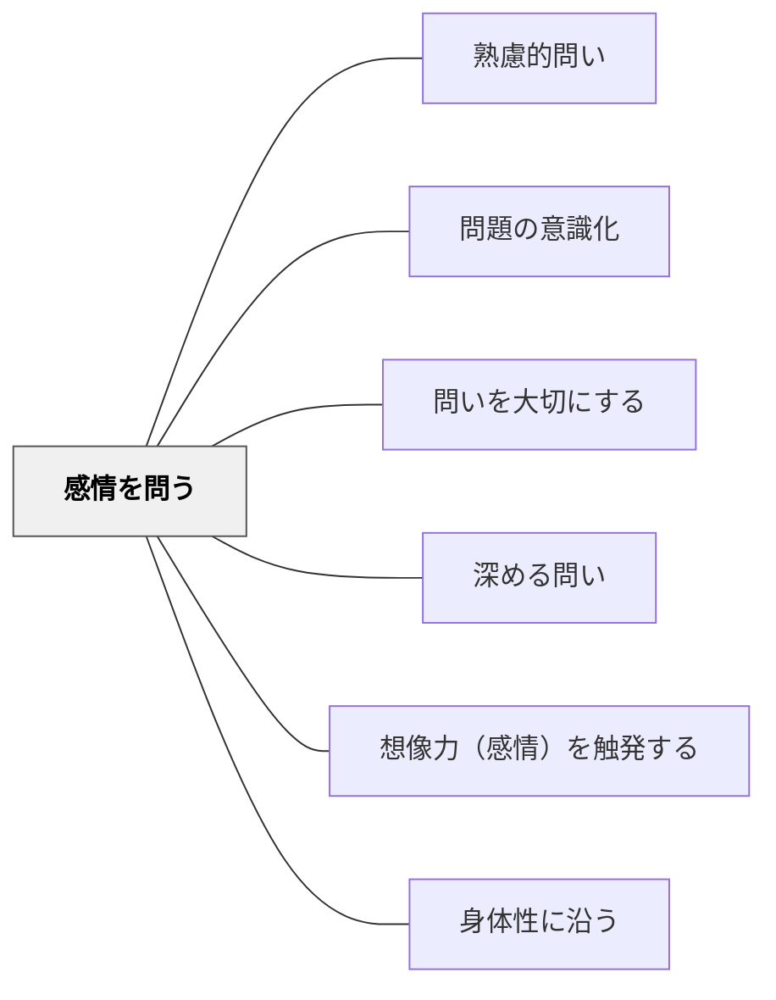

# 感情を問う

> 「どう感じたか」と感情・情動・感覚を問うことで、学習者は自らの内側にある学びの手がかりを発見する。

## 背景（Context）
認知と感情は切り離せない。何かを学ぶとき、学習者は必ず何らかの感情を経験している——驚き、疑問、喜び、戸惑い、違和感。こうした感情は、単なる「気持ち」ではなく、学びの重要な情報源である。しかし多くの授業では感情は周辺的なものとして扱われ、問われることが少ない。

## 問題（Problem）
感情を問われない学習者は、自分の情動的な反応を「学びと無関係なもの」として処理してしまう。疑問や違和感を感じても、それを探究の出発点にできない。また、学習における感情的なつまずき（不安・恥・退屈）も、言語化される機会がなければ放置され、動機の低下につながる。

## 力のかたち（Forces）
- 感情は認知の重要な情報源であり、何に注意を向けるかを決定する
- 「感じたことを話してよい」という環境が、心理的安全性を高める
- 感情を問うことは、自己認識・メタ認知の発達と直結する
- 過度な感情の問いかけは、内省が苦手な学習者に負担をかける場合がある

## 解決（Solution）
「この話を聞いてどう感じましたか？」「この実験の結果を見て、どんな気持ちがしましたか？」「この問題を解いているとき、どこで困った感じがしましたか？」と問いかける。例えば、歴史の授業で史実を学んだ後に「あなたがこの時代に生きていたらどう感じただろう？」と問い、感情的共感から批判的思考へとつなぐ。学習の最後に「今日の学びで一番驚いたこと・気になったことは何？」と振り返りに感情を組み込む。

## 結果（Consequences）
- 学習者が自分の感情を学びのリソースとして活用できるようになる
- 問いを立てる原動力（違和感・驚き・疑問）を意識的に捉える力が育まれる
- 教室の心理的安全性が高まり、多様な反応を認め合う文化が生まれる

## 関連パタン
- [[パタン/熟慮的問い]] — 親パタン
- [[パタン/問題の意識化]] — 感情的な違和感が問いの前段階となる
- [[パタン/問いを大切にする]] — 感情を問える文化が心理的安全性を支える

- [[パタン/深める問い]] — 感情への問いが内省を深める
- [[パタン/想像力（感情）を触発する]] — 感情を問う問いが想像力・感性を動かす
- [[パタン/身体性に沿う]] — 感情と身体感覚の問いを組み合わせる
## クラスター図

## Actionable Insight

- 「この話を聞いてどう感じましたか？」「この実験の結果を見てどんな気持ちがしましたか？」と問いかける——学習者が自分の感情を学びのリソースとして活用できるようになる
- 歴史の授業で史実を学んだ後に「あなたがこの時代に生きていたらどう感じただろう？」と問い感情的共感から批判的思考へつなぐ——感情の問いが探究の動機になる
- 学習の最後に「今日の学びで一番驚いたこと・気になったことは何？」と振り返りに感情を組み込む——問いを立てる原動力（違和感・驚き・疑問）を意識的に捉える力が育まれる

## 出典
- [[文献/熟慮的問いのパターンリスト（動画記録）]]
