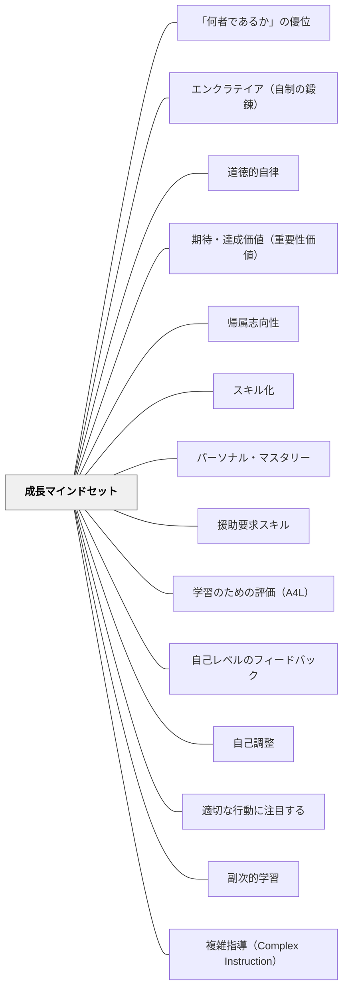

# 成長マインドセット

**一文でいうと**：能力は固定ではなく伸ばせるという見方を、課題・言葉・評価で支える。

## 使いどころ・使いすぎ注意

| 観点         | 内容                                               |
| ------------ | -------------------------------------------------- |
| 使いどころ   | 失敗や困難の意味づけを変えたいとき。               |
| 使いすぎ注意 | 努力を強調しすぎると、環境や支援の問題を見落とす。 |

> 能力は生まれつき固定されたものではなく、努力と戦略によって伸びる。— キャロル・ドゥエック

## Pattern Connection

### Dewey（1938）

Deweyの _Experience and Education_（1938）の「副次的学習（Collateral Learning）」概念は、成長マインドセットの理論的根拠を深める。DweckとBoalarが「どのように育てるか」を論じるのに対し、Deweyは「なぜ態度が内容より重要か」という哲学的根拠を提供する。

- **既存パタンとの関連**：「能力は伸びる」という成長マインドセットそのものが、副次的学習として授業の中で育てられる（あるいは壊される）ものだ。内容を教えている時間に、同時に学びへの態度が形成されている——これがDeweyの洞察。
- **補強された点**：成長マインドセットが授業設計の問いとして位置づけられる。「能力は伸びる」と声に出して教えることより、「この授業で子どもが経験することが、学び続けたいという態度を強めるか弱めるか」を問うことが根本的。

**副次的学習としての「学び続けたい」態度**

> "The most important attitude that can be formed is that of desire to go on learning. If impetus in this direction is weakened instead of being intensified, something much more than mere lack of preparation takes place. The pupil is actually robbed of native capacities which otherwise would enable him to cope with the circumstances that he meets in the course of his life."（Dewey, 1938, Ch.3）

Deweyの視点では、学校教育の最大の害は「誤った内容を教えること」ではなく「学び続けたいという生来の能力を奪うこと」にある。成長マインドセットが守ろうとするものと完全に一致する。

- **他のパタンへの波及**：[[パタン/副次的学習]]（成長マインドセットは副次的学習の典型例）・[[パタン/経験の質を問う]]（授業の経験が学びへの態度を形成するかどうかが経験の質の基準）

---

### Boaler（2016）

Boaler（2016）の **Mathematical Mindsets** は、算数教育における成長マインドセットの実装を具体化する。「スマートという言葉を教室から取り除く」「間違いにも必ずロジックがある」という実践は、ドゥエックの理論を教師の言葉レベルで使えるようにする。

- **補強点**：脳科学（ニューロン接続・シナプス形成）を子どもが理解できる言葉で共有する具体的な方法を提供。また「全問正解=学習なし」という逆説的なメッセージ（Carol Dweck）が、成功体験への依存から脱する視点を提供
- **拡張点**：「努力を賞賛する」だけでは不十分——「どの戦略を使ったか」を問うことで、戦略的思考を賞賛する。さらに固定マインドセットは「苦手な子」だけでなく「得意な子」にも有害——「スマートを証明しなければ」という恐れが難問を避けさせる
- **修正**：ピアジェの「不均衡（disequilibrium）」概念との接続——新しい情報が既存の認知構造と合わないとき、本物の学習が始まる。難しい問題に向かうことが不均衡を生み、真の学習につながる
- **他のパタンへの波及**：[[パタン/間違いや失敗から学ぶ文化]]・[[パタン/豊かな課題]]・[[パタン/視覚的数学]]・[[パタン/数学のクラス規範]]・[[パタン/算数の公平性]]

**Boaler の具体的な言葉**：

- ❌「よくできたね、頭がいいね」 → ✅「この問題の考え方、いいね」
- ❌「それは間違っています」 → ✅「なるほど、〜まではそうだね。でも〜については…」
- ❌「速くできた！」を褒める → ✅「別の方法も考えてみましょう」
- 教室から「スマート（賢い）」という評価の言葉を取り除く——スマートかどうかではなく「どう考えたか」を問う

---

## 背景（Context）

学習者は自分の能力について二種類の信念を持ちうる。「能力は固定されている（Fixed Mindset）」と「能力は伸ばせる（Growth Mindset）」。この信念は、失敗・挑戦・フィードバックへの反応を根本的に変える。

## 問題（Problem）

固定マインドセットの学習者は失敗を「自分が能力のない証拠」として受け取り、再挑戦を避ける。能力を褒める（「頭がいい」）と固定マインドセットを強化してしまうことが研究で示されている。

## 力のかたち（Forces）

- マインドセットは明示的に教えられなくても、教師の言葉や評価の仕方から暗黙的に学ばれる
- 成長マインドセットは文化として育てないと、個人への働きかけだけでは定着しにくい
- 「何でも努力すればいい」という単純化は逆効果になることもある（戦略・環境も重要）

## 解決（Solution）

**努力・戦略・改善プロセスを賞賛し、「脳は成長する」という事実を文化として共有する。**

実践例：

- 「まだ」（yet）の言葉を使う：「できない」→「まだできない」
- 努力・戦略・粘り強さを具体的に賞賛する（「頭がいい」ではなく「よく考えたね」）
- 脳科学（ニューラル可塑性）を学習者の言葉で共有する
- 「難しいこと」を「脳が成長しているサイン」として語り直す
- 「全問正解で帰ってきたら、今日は何も学ばなかったんだね」——Carol Dweck が親に伝える言葉。難しさのないところに学習はない
- ピアジェの不均衡を授業に組み込む：先に問いを与えてから教える（[[パタン/数学的モデリング]] の「A Time to Tell」参照）
- 固定マインドセットが上位生徒にも有害であることを認識する——「スマートを証明しなければ」という恐れが難問を避けさせる
- 成長の証拠（以前の作品との比較）を定期的に振り返る

## 結果（Consequences）

- 学習者が困難を前にして粘り強く取り組むようになる
- 失敗後の立ち直りが速くなる
- 教師の働きかけに対して学習者が開かれた姿勢を持つようになる

## 関連パタン
- [[パタン/「何者であるか」の優位]]
- [[パタン/エンクラテイア（自制の鍛錬）]]
- [[パタン/道徳的自律]]
- [[学級経営/学級経営で使えるパタン]]
- [[学級経営/心理的安全性]]
- [[学級経営/文化をつくる]]
- [[教科/算数・数学で使うパタン]]
- [[パタン/期待・達成価値（重要性価値）]]
- [[パタン/帰属志向性]]
- [[パタン/スキル化]]
- [[パタン/パーソナル・マスタリー]]
- [[パタン/援助要求スキル]]
- [[パタン/学習のための評価（A4L）]]
- [[パタン/自己レベルのフィードバック]]
- [[パタン/自己調整]]
- [[パタン/適切な行動に注目する]]
- [[パタン/副次的学習]]
- [[パタン/複雑指導（Complex Instruction）]]
- [[パタン/望ましい困難]]

- [[パタン/文化をつくる]] — 親パタン
- [[パタン/間違いや失敗から学ぶ文化]] — 失敗を成長の機会として見る文化
- [[パタン/フィードバック文化]] — 成長マインドセットがフィードバックの受取り方を変える
- [[パタン/キャラクターをつくる]] — 成長マインドセットをキャラクターで体現する
- [[パタン/数学のクラス規範]] — Youcubed 7規範として教室に制度化する
- [[パタン/算数の公平性]] — 成長マインドセットを構造的・社会的に実装する
- [[パタン/脱トラッキング（De-tracking）]] — 能力は固定という信念の制度的表れを解体する
- [[パタン/数学的モデリング]] — 不均衡（disequilibrium）を授業に組み込む設計との接続

## クラスター図

## Actionable Insight

- 「頭がいい」ではなく「よく考えたね」「別の方法を試したね」と努力・戦略を具体的に賞賛する
- 「間違いはあなたの脳を成長させる」をクラスの言葉として定期的に確認する
- 算数のタイムアタック計算テストをやめる——速さより深さを尊重するメッセージに変える（Boaler, 2015）
- 「できない」の代わりに「まだできていない（Not Yet）」という言葉を使う——未来への可能性を閉じない言葉選び（Dweck, 2015）
- 困っている子に「そこが一番脳が育っている場所だよ」と声をかける——苦闘に向き合う意味が変わる一言
- 単元末に「学期初めと今を比べてどう成長したか」を書かせる——成長の自覚がマインドセットを安定させる

## 出典

- キャロル・S・ドゥエック（2016）『マインドセット―「やればできる！」の研究』草思社
- キャロル・S・ドゥエック（2015）「Carol Dweck revisits the 'growth mindset'」_Education Week_, 35(5)
- Boaler, J. (2015). _Mathematical Mindsets_. Jossey-Bass. — 数学教育における成長マインドセットの実装 → [[文献/Mathematical Mindsets（Boaler）]]
