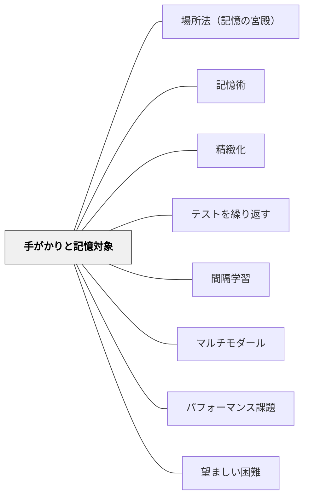

# 手がかりと記憶対象

> 「何を使って思い出すか」を設計することが、記憶の設計だ。

---

## [Pattern Connection]

**Jo Rokuhara（年不詳）統合（2026-05-21）：**

本書の核心原理「記憶はすべて『手がかり（cue）』と『記憶対象』の連合として成立する」を授業設計のパタンとして抽出した。

- **既存パタンとの関連**：[[パタン/精緻化]] の「新旧知識の結びつき」は、手がかりと記憶対象のネットワークを豊かにする操作として読み直せる。[[パタン/テストを繰り返す]] の「検索練習」は、手がかり→記憶対象の想起経路を繰り返し強化する操作だ。[[パタン/間隔学習]] は、時間経過後に手がかりから記憶対象へ到達する経路の耐久性を高める。
- **補強された点**：「記憶は手がかり依存である」という視点が、授業設計に新しい問いを与える——**「この授業で生徒が将来この知識を思い出すとき、何が手がかりになるか？」** 教師がこの問いを持つだけで、授業設計が変わる。
- **他のパタンへの波及**：[[パタン/場所法（記憶の宮殿）]] ——場所（ポイント）が手がかりとして機能し、配置されたイメージが記憶対象として引き出される。[[パタン/記憶術]] ——すべての記憶術は「手がかりと記憶対象の連合をいかに強化するか」の技術として統一的に理解できる。

---

## [The Pattern]

> 「何を使って思い出すか」を設計することが、記憶の設計だ。

### 背景（Context）

記憶を「頭の中への情報の保存」と捉えると、「よく入力する（繰り返し読む・書く）ことが記憶への道だ」という誤解が生まれる。しかし現代の記憶研究は、記憶の本質は**連合（アソシエーション）**だと示している。

**記憶は単独では存在できない。必ず「手がかり（cue）」があって初めて「記憶対象」が想起される。**

たとえば「青い鳥」という言葉（手がかり）から「メーテルリンク」（記憶対象）が想起される。この連合が成立していないと、どれほど「メーテルリンク」を繰り返し書いても試験の「青い鳥」という問題文から想起できない——これが「覚えたはずなのに書けない」の正体だ。

### 問題（Problem）

教師は「内容を教えること」に集中するあまり、「生徒が将来その内容を何から思い出すか」を設計していない。生徒も「覚えること」に集中し、「何をきっかけに思い出すか」を意識していない。その結果、学習した内容が「使える知識」にならない。

### 力のかたち（Forces）

- 記憶は「手がかりが提示されたとき初めて想起が可能になる」——手がかりなしに記憶を取り出すことはできない
- 学習した文脈（環境・感情・状態）が無意識の手がかりになる——試験会場の緊張が、リラックスして学習した内容の想起を妨げる
- 手がかりが複数あるほど、様々な状況での想起が可能になる
- 「1つの手がかりに複数の記憶対象を結びつける」のは混乱を生む（記憶の干渉）
- 「1つの記憶対象に複数の手がかりを結びつける」のは理想的——様々な方向から思い出せる
- 手がかりと記憶対象の連合が弱いと、覚えた直後は想起できても時間が経つと想起できない

### 解決（Solution）

**授業設計と学習指導の中に「手がかりの設計」を意識的に組み込む。教師は「何がこの記憶対象への手がかりになるか」を問いながら授業を設計し、生徒は「何を手がかりに思い出すか」を意識しながら学ぶ。**

---

#### 授業設計への適用：3つの問い

**問い1：「この内容を、生徒はどんな場面で思い出す必要があるか？」**

試験の穴埋め問題では「問題文の語句」が手がかりになる。論述問題では「テーマ・大見出し」が手がかりになる。日常生活での活用では「現実の場面・状況」が手がかりになる。手がかりが異なれば、授業での学習設計も変わる。

**問い2：「授業中に使っている手がかりと、テスト時に使える手がかりは一致しているか？」**

「黒板の左の図を見ながら覚えた」内容は、黒板がない試験会場では想起しにくい。授業中の学習経験を、テスト条件に近い形で設計する。

**問い3：「1つの記憶対象に、複数の手がかりを結びつけているか？」**

「音・意味・文脈・イメージ・身体感覚」という複数の種類の手がかりを同時に結びつけると、多様な状況での想起が可能になる（→ [[パタン/マルチモダール]]）。

---

#### 生徒への指導：手がかりを自分で設計する

1. **「この知識を、どんなとき使うか」を考えさせる**：「この公式、どんな問題でつかう？」「日常生活でこの言葉を使う場面は？」
2. **手がかりを明示させる**：「この単語を思い出すとき、何がヒントになる？」（音・絵・場面・別の単語など）
3. **複数の手がかりで練習する**：問題文の形式を変えて同じ知識を問う——「穴埋め」「並び替え」「説明」「図示」

---

#### 関係法（仲介役）：手がかりと記憶対象をつなぐ橋

手がかりAから記憶対象Bを直接結びつけられないとき、仲介役Xを設置する。

```
手がかりA → 仲介役X → 記憶対象B
「アラスカ」 → 「大政奉還」（同じ1867年） → 「1867年」
```

**仲介役の発見法**：
1. 記憶対象から連想できることをすべて挙げる
2. 手がかりから連想できることをすべて挙げる
3. 両者の重なり・音韻的類似を利用して仲介役を作る

この「仲介役の設計」は教師の仕事でもある——生徒が「なぜつながるかわからない」情報には、教師が橋渡しを提供する。

---

#### 穴埋め式 vs. 論述式：記憶対象の形式が変わる

| 問題形式 | 手がかり | 記憶対象 |
|---------|---------|---------|
| 穴埋め問題 | 問題文の語句 | 空欄に入る語 |
| 論述問題 | テーマ・見出し | そのテーマに関するすべての重要語 |
| 実生活での活用 | 現実の場面・状況 | その場面で必要な知識・技能 |

論述問題の準備では「見出し→重要語すべての想起」という連合を作る。穴埋め問題の準備では「文脈中の語句→特定の語」という連合を作る。

---

### 実践例

**例1（語彙指導）**：
"apple" を教えるとき、手がかりを複数作る——「a-p-p-l-eという綴り」「食べた時の食感（サクサク）」「赤いイメージ」「"An apple a day…"のフレーズ」——多様な手がかりから "apple" に到達できる。

**例2（歴史授業）**：
「大政奉還は何年か」を覚えるために——「大政奉還」→「徳川慶喜が政権を返した日本の出来事」→「1867年」という連合を、「語呂合わせ（一発ロック=1867）」という仲介役で強化する。

**例3（授業設計）**：
単元の目標を「テスト問題の形式で示す」——生徒は最初から「どんな手がかりでどんな知識を思い出すか」を理解した状態で学習する（→ [[パタン/パフォーマンス課題]] との接続）。

---

### 結果（Consequences）

- 「覚えたはずなのに思い出せない」が減る——学習条件とテスト条件の一致が高まるため
- 生徒が「どうやって覚えるか」を主体的に考えるメタ認知が育つ
- 教師が授業設計に「手がかりの視点」を持つことで、問い・板書・教材の設計が改善する
- 「理解はできているが語句が出ない」と「語句は言えるが使えない」の違いが分析できる
- 一方で、この原理を意識しすぎると「記憶技術の教育」に時間をとられ、内容の理解が後回しになるリスクがある

## 関連パタン

- [[パタン/場所法（記憶の宮殿）]] — 場所ポイントを手がかりにした記憶術の最強実装
- [[パタン/記憶術]] — 手がかりと記憶対象の連合を強化する6つの技術の全体マップ
- [[パタン/精緻化]] — 手がかりのネットワークを豊かにする「なぜ？」の問い
- [[パタン/テストを繰り返す]] — 手がかり→記憶対象の経路を繰り返し強化する検索練習
- [[パタン/間隔学習]] — 時間を空けて手がかり→記憶対象の経路を強化する
- [[パタン/マルチモダール]] — 多様な感覚チャンネルで手がかりを増やす
- [[パタン/パフォーマンス課題]] — 「実際の場面（手がかり）で使える知識（記憶対象）」の設計
- [[パタン/望ましい困難]] — 想起困難感が手がかり→記憶対象の連合を強化するメカニズム

## クラスター図



## Actionable Insight

- **単元の最初に「この単元で、どんな質問に答えられるようになるか」を伝える**——本物の手がかり（問題の形式）を先に示すことで、何と何を結びつければいいかが見える
- **板書やノートの見出しを「後で手がかりになる形」にする**——「本日のまとめ」より「大政奉還：なぜ、誰が、結果は？」の方が想起の手がかりになる
- **「この語、どんな場面で思い出す？」をたまに問う**——生徒が自分の手がかりを言語化する練習になる
- **宿題に「見出しだけ見て、その内容を書く」練習を入れる**——見出し（手がかり）→内容（記憶対象）の連合を自宅で強化する

---

## 出典

Jo Rokuhara（年不詳）『一流の記憶法：あなたの頭が劇的に良くなり「天才への扉」がひらく』知之鳥出版（Kindle版）

> 「情報は『手がかり』と『記憶対象』の結びつきによって成立する。手がかりが提示されることで初めて想起が可能になる。手がかりは『思い出すべき状況で提示されるであろう情報』である必要がある。」
