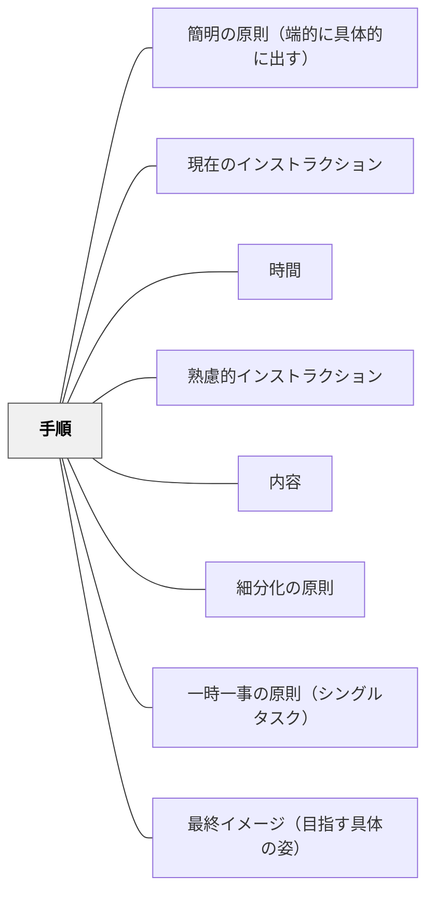

# 手順

> インストラクションの心臓部は、受け手が実際に何をするかを示す手順にある。

## 背景（Context）
ワーマンの「理解の秘密」では、インストラクションの内容を構成する6要素（使命・最終イメージ・手順・時間・予測・失敗）のうち、手順が中核をなすと位置づける。使命や時間などの要素はすべてこの手順を支えるために機能する。手順がなければインストラクションは完結しない。

## 問題（Problem）
教師が目的や背景ばかりを丁寧に説明し、肝心の「具体的に何をするか」が不明瞭なままになることがある。受け手は何をすれば良いかわからず、行動が止まってしまう。タスクベースの学習では、手順の明確さが活動の成否を左右する。

## 力のかたち（Forces）
- 手順が曖昧だと受け手は自分で解釈を補い、誤った行動をとる可能性がある
- 手順が詳細すぎると自律性を損ない、主体的な取り組みが失われる
- 手順は使命（なぜするか）と最終イメージ（どうなればよいか）に支えられて初めて意味をもつ

## 解決（Solution）
**手順は「動詞＋対象」の形で具体的に示し、受け手が迷わず行動に移れるレベルまで落とし込む。**

「ノートを開く」「タイトルを書く」「問題を読む」というように、動詞を明確にして一つひとつのステップを示す。細分化の原則と組み合わせ、一つの手順に複数の行動が含まれないよう設計する。最終イメージと手順をセットで伝えることで、受け手が方向を確認しながら進める。

## 結果（Consequences）
- 受け手が次に何をすべきかが明確になり、行動が止まらない
- 教師自身がインストラクションの抜け漏れに気づきやすくなる
- 手順の明示が、受け手の自己評価・修正を可能にする

## クラスター図

## Actionable Insight

- 指示の各ステップを「動詞＋対象」（「ノートを開く」「タイトルを書く」「問題を読む」）の形で1つずつ示す——動詞が明確になるだけで受け手が次に何をすればよいかが一読で分かる
- 指示を書いた後「この指示だけで誰でも動けるか？」と自問する——質問なしに行動に移れる水準が手順の明確さの基準となる
- 手順と最終イメージをセットで伝える——「どうなれば完了か」を知りながら手順を追える学習者は方向を確認しながら自律的に進める

## 出典

- 一つの教育のパタン・ランゲージ（岩井輝久）

## 関連パタン
- [[パタン/簡明の原則（端的に具体的に出す）]]
- [[パタン/現在のインストラクション]]
- [[パタン/時間]]
- [[パタン/熟慮的インストラクション]] — 親パタン
- [[パタン/内容]] — 手順を含む6要素システム
- [[パタン/細分化の原則]] — 手順を小さく分解する
- [[パタン/一時一事の原則（シングルタスク）]] — 一度に一つの手順を出す
- [[パタン/最終イメージ（目指す具体の姿）]] — 手順の到達点を示す
