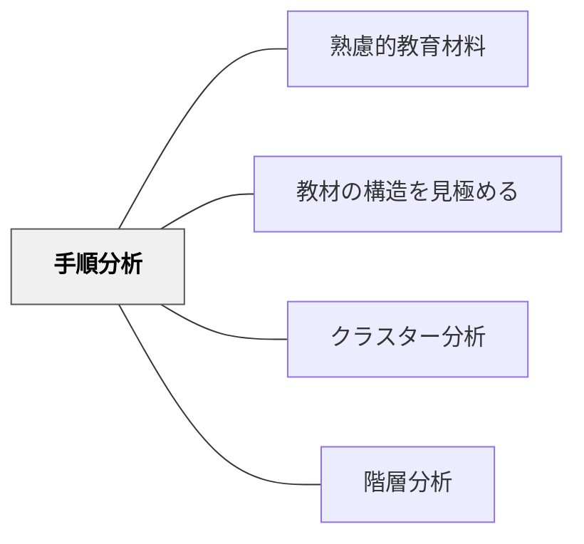

# 手順分析

> 手続き的なスキル・作業の手順を分解して分析し、教材設計に活かす。

## 背景（Context）

鈴木克明「教材設計マニュアル」の教材分析手法の一つ。料理・実験・プログラミング・楽器演奏など、一定の手順で行う「手続き的スキル」を段階的に分解・分析する。手順の各ステップが教材内容の単位になる。

## 問題（Problem）

手順を分析せずに教えると、どのステップでつまずいているかが分からず、適切な支援ができない。

## 力のかたち（Forces）

- 手順の明確化が学習者のつまずきを特定しやすくする
- 複雑な手順は小ステップに分解すると教えやすくなる

## 解決（Solution）

**手続き的なスキルの手順を詳細に分解し、各ステップが明確に学習できる教材を設計する。**

## 結果（Consequences）

- スキル習得が段階的・体系的に進む
- つまずき箇所の特定と支援が容易になる

## 関連パタン

- [[パタン/熟慮的教材教具]] — 親パタン
- [[パタン/教材の構造を見極める]] — 上位パタン
- [[パタン/クラスター分析]] — 並列的分析
- [[パタン/階層分析]] — 階層的分析

## クラスター図

## Actionable Insight

- 手続き的スキルを教える前に「全手順のリスト」を自分で書き出す——明示化によって抜け落ちていたステップや暗黙の前提が浮かび上がる
- 学習者がよくつまずくステップを特定し、そこに重点的な指導と練習を配置する——つまずき箇所の特定が支援の精度を上げる
- 複雑な手順を2〜3ステップのチャンクに分けて順に教える——小分けにすることでスキル習得が段階的・体系的に進む

## 出典

- 鈴木克明（2002）『教材設計マニュアル――独学を支援するために』北大路書房
