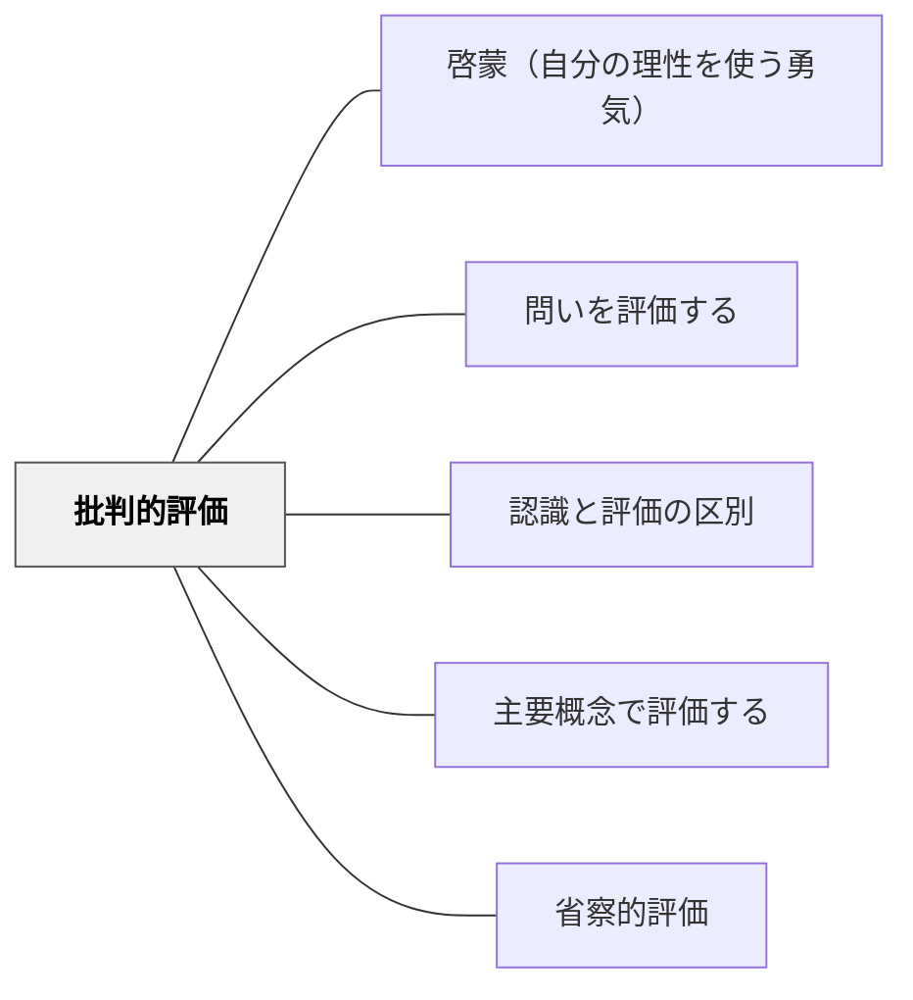

# 批判的評価

> 与えられた評価規準をただ受け入れず、その規準が何を大切にし、何を見落としているかを問い直す。

## 背景（Context）

評価は学習を方向づける。何を評価するかは、何を価値ある学びとみなすかを示している。

## 問題（Problem）

評価規準が外から与えられるだけだと、学習者は「どうすれば点が取れるか」には敏感になるが、「その規準は妥当か」「何を大切にしているか」を考えにくい。

## 解決（Solution）

**作品例・発言例・成果物を見ながら、評価規準そのものを学習者と問い直す。何を入れるべきか、何を重く見るべきか、何が見落とされているかを話し合う。**

## 結果（Consequences）

- 学習者が評価を外的な判定ではなく、価値判断として捉えられる
- 自分の作品や行動を、規準の意味から見直せる
- 評価への納得感と自律性が高まる

## クラスター図

## Actionable Insight

- ルーブリックを配ったあと、「この規準で本当に大事なことは見取れるか」と1分だけ問い直す
- 良い作品例を見せて「このよさは今の規準に入っているか」を話し合う

## 関連パタン

- [[パタン/啓蒙（自分の理性を使う勇気）]]
- [[パタン/問いを評価する]]
- [[パタン/認識と評価の区別]]
- [[パタン/主要概念で評価する]]
- [[パタン/省察的評価]]
