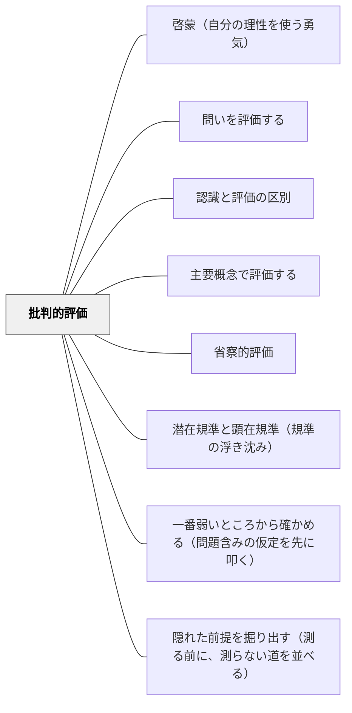

# 批判的評価

> 与えられた評価規準をただ受け入れず、その規準が何を大切にし、何を見落としているかを問い直す。

## 背景（Context）

評価は学習を方向づける。何を評価するかは、何を価値ある学びとみなすかを示している。

## 問題（Problem）

評価規準が外から与えられるだけだと、学習者は「どうすれば点が取れるか」には敏感になるが、「その規準は妥当か」「何を大切にしているか」を考えにくい。

## 力のかたち（Forces）

- **規準は方向づける力を持つ**: 何を評価するかは、何を価値ある学びとみなすかを示している。評価規準を問い直すことは授業の価値観を問い直すことでもある
- **問い直しは時間と心理的安全性を必要とする**: 「この規準は何を見落としているか」という問いは、慣れていない学習者には不安を引き起こすことがある。問い直しができる関係性と文化が先に必要
- **外から与えられた規準への服従と自律の葛藤**: テスト・ルーブリック・学習指導要領など、外的に与えられた規準には従わなければならない場面がある。その中でどこまで問い直せるかは文脈依存
- **教師自身の評価観が問われる**: 学習者に規準を問い直させると、教師も自分がなぜその規準を選んだかを問われる。教師にとっても省察の機会になる
- **規準の問い直しと習得のバランス**: 規準を疑う前に、その規準が何を大切にしているかを十分に理解していないと、問い直しが空虚になる

## 解決（Solution）

**作品例・発言例・成果物を見ながら、評価規準そのものを学習者と問い直す。何を入れるべきか、何を重く見るべきか、何が見落とされているかを話し合う。**

## 結果（Consequences）

- 学習者が評価を外的な判定ではなく、価値判断として捉えられる
- 自分の作品や行動を、規準の意味から見直せる
- 評価への納得感と自律性が高まる

## クラスター図

## Actionable Insight

- ルーブリックを配ったあと、「この規準で本当に大事なことは見取れるか」と1分だけ問い直す
- 良い作品例を見せて「このよさは今の規準に入っているか」を話し合う

## 出典

岩井輝久（2026）「教育のパタン・ランゲージ」（草稿）

## 関連パタン

- [[パタン/啓蒙（自分の理性を使う勇気）]]
- [[パタン/問いを評価する]]
- [[パタン/認識と評価の区別]]
- [[パタン/主要概念で評価する]]
- [[パタン/省察的評価]]
- [[パタン/潜在規準と顕在規準（規準の浮き沈み）]] — 与えられた規準の背後で待機している規準の存在に気づく力（Sadler, 1989）
- [[概念/質的判断（曖昧な規準とメタ規準）]] — 規準を使うための規準（メタ規準）を問う営みの理論的な裏づけ
- [[パタン/一番弱いところから確かめる（問題含みの仮定を先に叩く）]] — 「批判者から具体的な異議が出ている」は、その仮定が問題含みだと判定する四条件の一つ（Kane, 1990）。規準への問い直しは、どこを先に確かめるかを教える情報になる
- [[パタン/隠れた前提を掘り出す（測る前に、測らない道を並べる）]] — 与えられた枠組みを問い直す構えを、「測って分ける」という具体的な判断の場面に落としたもの。効果・交互作用・価値の三つの仮定を掘る
