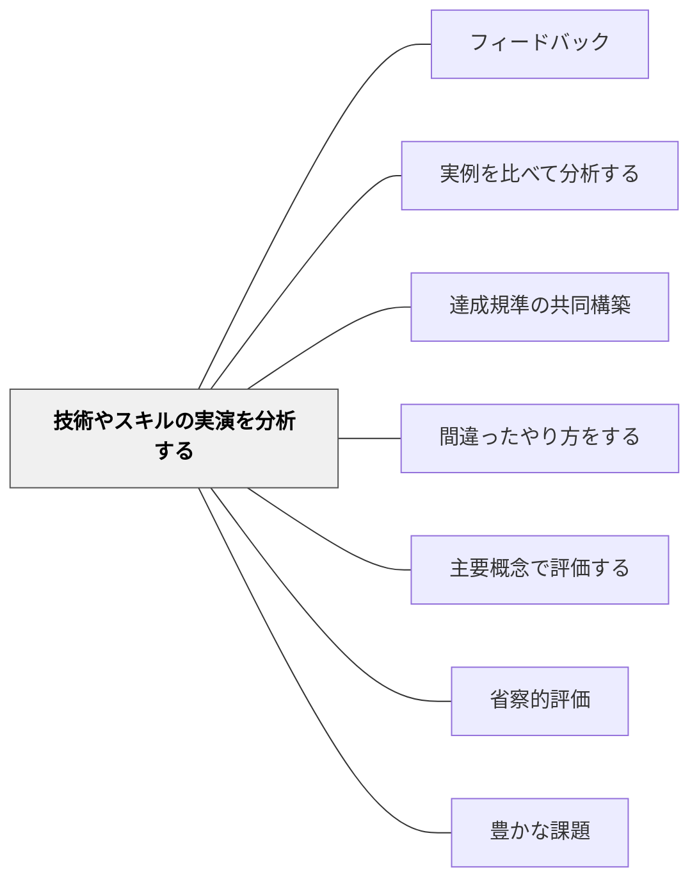

# 技術やスキルの実演を分析する

> 「こうやってみせる」ことで、スキルの要素が見えてくる。

## 背景（Context）

文章や作品だけでなく、体育・音楽・工作・実験などでは「どう動くか・どう演じるか」というパフォーマンスが重要になる。その場合、実演を分析することで、スキルを構成する要素が明確になり、達成規準として機能する。

## 問題（Problem）

「うまくやる」という目標は抽象的すぎる。実演を分解・分析しないと、学習者は何に注目すれば良いかわからない。

## 力のかたち（Forces）

- 実演は観察しやすいが、分析するには注目点の指定が必要
- スロー再生・繰り返し観察が実演分析を助ける
- 教師自身がやってみせる（モデリング）と効果が高い

## 解決（Solution）

**優れた実演を見せ、「どこが優れているか」「何をしているか」を分析する活動を通じて、スキルの達成規準を構築する。**

実践例：
- 水泳の模範映像を見て「腕の動き」「息継ぎのタイミング」を分析する
- 音読の読み聞かせを聞いて「声の大きさ」「間の取り方」を言語化する
- 教師が間違えてみせて、その後正しいやり方との違いを考える

## 結果（Consequences）

- スキルが「なんとなく」から「意識的に」できるようになる
- 自己観察・自己評価の視点が育つ

## クラスター図

## Actionable Insight

- 優れた実演を見せた後「何が良かったか、3つ挙げてみよう」と問う——観察に分析の目的を与えることでスキルの要素が言語化され達成規準として機能し始める
- 自分で実技を試みる前に、モデルの実演を観察して「注目するポイント」を学習者自身に挙げさせる——事前の分析が自己観察の視点を作り実践の質を上げる
- 映像や音声でゆっくり繰り返し見せながら「どの瞬間に何をしているか」を言語化させる——スロー分析が「なんとなく」から「意識的に」できるへの転換を促す

## 出典

- 一つの教育のパタン・ランゲージ（岩井輝久）

## 関連パタン

- [[パタン/フィードバック]] — 親パタン
- [[パタン/実例を比べて分析する]] — 作品分析の並列パタン
- [[パタン/達成規準の共同構築]] — 分析から規準を作る
- [[パタン/間違ったやり方をする]] — 対比のための誤演
- [[パタン/主要概念で評価する]] — 実演分析が主要概念の評価規準をつくる
- [[パタン/省察的評価]] — 実演の振り返りが技術向上を促す
- [[パタン/豊かな課題]] — 実演分析が豊かな課題の達成規準構築になる
