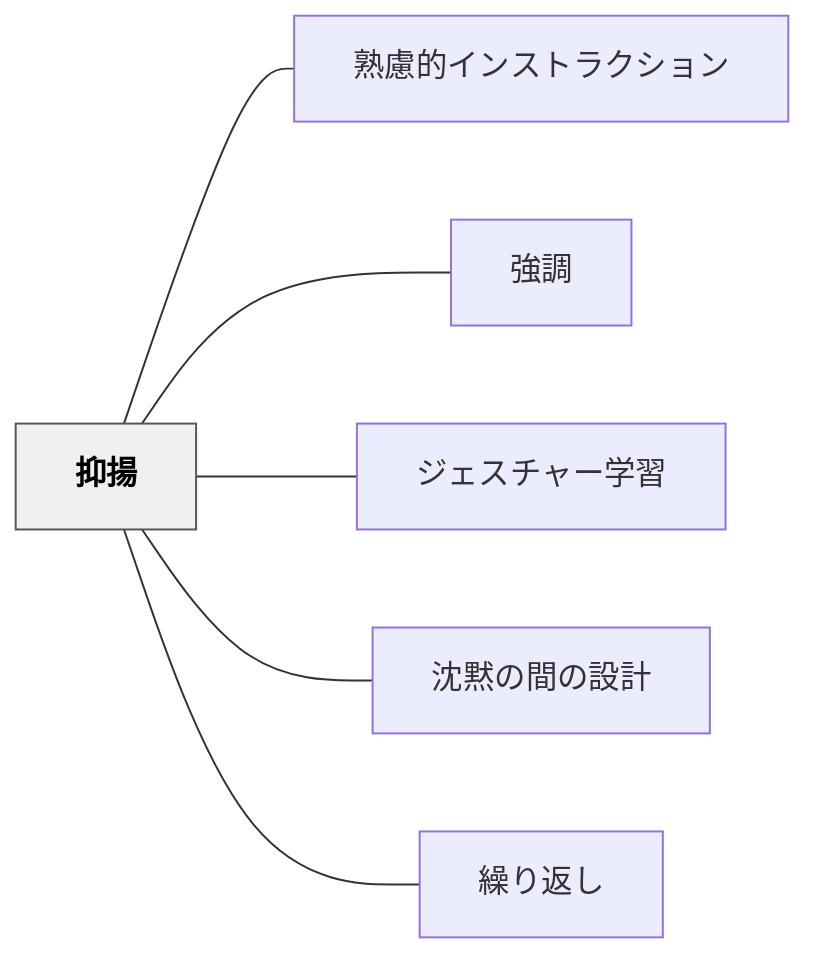

# 抑揚

> 声の高低・強弱・速度の変化が、意味・感情・重要性を言葉以上に伝える。

## 背景（Context）
音声コミュニケーションにおいて、言語の内容（何を言うか）と同等かそれ以上に、どのように言うか（パラ言語）が受け手に影響を与える。抑揚のない単調な声では、受け手の注意は持続せず、重要な部分も感情も伝わりにくくなる。教師の声の抑揚は、授業の空気・学習者の集中・情報の整理すべてに関与している。

## 問題（Problem）
単調な声で長時間話されると、受け手は注意が散漫になり眠気を誘われる。声の変化がなければ、どの部分が重要かも感情的な意味も伝わらない。緊張や疲労で声が単調になりやすい教育者は、意識しなければ抑揚のコントロールが失われてしまう。

## 力のかたち（Forces）
- 抑揚は自然に出るものだが、意図的にコントロールすることで伝達効果が高まる
- 過度な抑揚は不自然さや感情操作の印象を与えることがある
- 文化・年齢・関係性によって適切な抑揚の範囲が異なる
- 録音・録画で自分の声を客観的に確認することが上達の近道となる

## 解決（Solution）
**重要な情報では声を大きく・ゆっくりにする、問いかけでは語尾を上げる、感情を伴う内容では声のトーンを変える、単純な繰り返し部分では声を落とすなど、内容に合わせた声の変化を意図的に設計する。**
一文の中でも「最も伝えたい言葉」に最も強い抑揚を置く。沈黙（間）と組み合わせることで、重要な部分の前後に空白ができ、受け手の注意が集まる。授業の冒頭で聞き手の注意を引く高い声から始め、落ち着いた説明パートに移行するという変化が効果的である。

## 結果（Consequences）
- 受け手の注意が持続し、長時間の説明でも集中が保たれる
- 重要な情報と補足情報が声の変化によって自然に区別される
- 教師の感情・熱量・関心が伝わり、学習者との感情的なつながりが生まれる

## クラスター図

## Actionable Insight

- 「今日一番重要なこと」を言う瞬間だけ声を大きくゆっくりにする、という1点だけを意識して授業に臨む——局所的な強調だけでも伝わり方が変わる
- 問いかけの文末だけ語尾を上げることを意識する——語尾の変化だけで受け手の応答モードが切り替わる
- 自分の授業の一部を録音し「重要な箇所で声が変わっているか」を聞いてみる——客観的な確認が抑揚の意識化を促す

## 出典

- 一つの教育のパタン・ランゲージ（岩井輝久）

## 関連パタン
- [[パタン/熟慮的インストラクション]] — 親パタン
- [[パタン/強調]] — 声による強調との連動
- [[パタン/ジェスチャー学習]] — 身体表現との組み合わせ
- [[パタン/沈黙の間の設計]] — 間と抑揚の組み合わせ
- [[パタン/繰り返し]] — 繰り返しと抑揚の変化
