# 抽象と具象のはしご

> 抽象は、具象に降りられてこそ本物になる。一度昇って終わりではなく、何度も昇り降りすることで、概念は身体に根づく。

---

## [Pattern Connection]

**S. I. ハヤカワ（1949/1985）「抽象のはしご（abstraction ladder）」統合：**

ハヤカワは『Language in Thought and Action』（邦訳『思考と行動における言語』）で、ことばの意味を「抽象のはしご（abstraction ladder）」というモデルで示した。最下段には原子・分子レベルの「現象としての牛」、その上に「ベッシー（一頭の牛）」、さらに上に「牛」「家畜」「農場資産」「資産」「富」と、段を上がるにつれて指示対象が広がり具体性が剥がれていく。ハヤカワの主張は「賢い話し手・聞き手は、はしごの上下を自在に往復する」というものだった。下段だけにとどまれば些末な事実の羅列に、上段だけにとどまれば中身のない空語に陥る。

- **既存パタンとの関連**：
  - [[パタン/具体から抽象へ]] は「昇り」の一方向の配列を扱う。本パタンはそれを補完し、「昇った後に降りる」「降りた後にまた昇る」という双方向の往復を中心に据える。配列ではなく運動。
  - [[パタン/二つの世界の橋（現象と数式を往来する）]] は「橋」のメタファーで、現象と数式という異なる領域のあいだの**水平移動**を扱う。本パタンは「はしご」のメタファーで、同じ領域内での抽象度の**垂直移動**を扱う。橋とはしご——往来の二つのモード。
  - [[パタン/推論のはしご]] とは混同しやすいが、扱う対象が異なる。「推論のはしご」（アージリス／センゲ）は「事実→意味づけ→前提→結論→信念→行動」という**認知バイアスの階段**を意識化する道具。本パタン「抽象と具象のはしご」（ハヤカワ）は**言語の抽象度の階段**を自在に往復するための道具。前者は降りるためのはしご、後者は昇り降りするためのはしご。

- **補強される点**：
  - 「具体から抽象へ」が「一度の昇り」を強調するのに対し、本パタンは「何度も昇り降りする」運動を強調する。抽象が空語にならないためには、抽象に達した後、再び具象に降りて検証する必要がある。
  - 「わかったつもり」は、はしごの上段に滞在し続けた結果として発生する——これがハヤカワの中心的な警告。

- **他のパタンへの波及**：
  - [[パタン/実物（具体物）]] — はしごの最下段に常に戻れる素材としての具体物。
  - [[パタン/抽象的現実の感覚]] — 上段に昇ったときに失わない「具象とのつながりの感覚」。
  - [[パタン/感性と悟性の協働]] — カントの「直観なき概念は空虚、概念なき直観は盲目」が、はしごの往復という運動として実装される。

---

## 背景（Context）

[[パタン/熟慮的配列]] の応用形。[[パタン/具体から抽象へ]] が「具体的事例の比較から概念へ」という昇りの順序を扱うのに対し、子どもの理解はその一回の昇りでは安定しない。算数で「分数」を学んだ子が、次の単元で分数の式が出てきた瞬間に「これって何だっけ？」と止まる。国語で「優しさ」というテーマを話し合った後、実際の本文に戻れない。

抽象化は「上に昇ったら頂上に着く登山」ではなく、「上下に何度も移動して足場を確かめる作業」である。ハヤカワが「抽象のはしご」というモデルで示したのは、まさにこの往復運動の必要性だった。

## 問題（Problem）

抽象に昇ったきり降りられない子と、具象に留まったきり昇れない子が、同じ教室の中に同時に存在する。

- **昇ったきりの子**：記号操作はできるが、例を挙げられない。「分数の足し算ができる」けれど「分数って何？例えば？」と聞かれると詰まる。式の操作は得意だが、その式が表している現実の場面に降りられない。
- **留まったきりの子**：具体的な操作はできるが、一般化できない。「100円玉が3枚」は数えられるが「3×100」という式に昇れない。経験は豊かだが、それを抽象的な概念に束ねられない。
- **「わかったつもり」の発生**：高い抽象段にいるとき、自分が具象に降りられないことに気づきにくい。「優しさとは思いやりです」と言えるけれど、本文の中で「優しさが現れている一文」を選べない——この乖離が「わかったつもり」の正体である。

教師の側にも問題がある——「定義を言えるか」「公式を覚えているか」という上段の確認だけで理解を測ると、はしごの往復ができているかが見えない。

## 力のかたち（Forces）

- 抽象段の作業（式の計算・概念の定義）は時間効率がよく、テストでも問いやすい——上段に滞在する誘惑が常にある。
- 具象段の作業（具体物の操作・例の収集）は時間がかかり、評価しにくい——下段に降りるコストが高い。
- 一度昇った概念をもう一度具象に降ろす活動は「もう分かっているのに」と冗長に感じられがちで、教師も学習者も省略したくなる。
- しかしその省略こそが、抽象段の空語化を生む——使わなければはしごは錆びる。
- 子どもによって「昇るのが得意／降りるのが得意」の差が大きい——両方向の運動を意図的に設計しないと、片方の子だけが置き去りになる。

## 解決（Solution）

**抽象と具象のあいだを「一度昇って終わり」ではなく「何度も昇り降りする」往復運動として授業に設計する。昇った後には必ず「例を3つ挙げて」と降ろし、降りた後には必ず「これらに共通するのは何？」と昇らせる。**

「定義を問う」より「例を3つ挙げて」と降ろす問い、「答えを書いて」より「この式は何を表している？」と降ろす問いを、授業の標準装備にする。

---

### 具体例1：算数「分数」での昇り降り

| 段 | 内容 |
|---|---|
| 上段（記号・式） | 1/2 + 1/3 = 5/6 |
| 中段（図・モデル） | テープ図・ピザの絵での表現 |
| 下段（日常の文脈） | 「ピザを半分食べた後、もう1/3食べたら全部でどれだけ？」 |

授業の流れは「上から下、下からまた上」の往復で組む。式を導入したら「これを図で描いてみよう」（上→中）、「日常の場面で例を挙げてみよう」（中→下）。そして再び「では今の話を式で書くと？」（下→上）。一回の単元の中で、最低3往復させる。

---

### 具体例2：国語「優しさ」での昇り降り

物語文の主題を扱うとき、「優しさ」「友情」「成長」といった抽象語が中心に来る。ここでも昇り降りが要る。

| 段 | 内容 |
|---|---|
| 上段（抽象語） | 「優しさ」 |
| 中段（行動の類型） | 「困っている人に声をかける」「自分の時間を相手のために使う」 |
| 下段（本文の具体的描写） | 「主人公がランドセルを背負ったまま、転んだ子に駆け寄った」という一文 |

「優しさとは何だと思う？」（上段で議論）→「本文のどの場面に優しさが現れている？」（上→下、本文に降りる）→「他の場面ではどう？」（具体例の収集）→「ではあなたが今読んでいる別の本でも、同じような優しさは見つかる？」（下→上、一般化）。

「優しさとは思いやりです」という抽象的な答えに留まらせない。必ず本文の具体的な一文に指で触れさせる——これが「降りる」操作。

---

### 具体例3：「例を3つ挙げて」というルーチン化された問い

授業のあらゆる場面で使える単純な問い：

- 「比例ってどういうこと？」と聞いた後、答えが返ってきたら必ず「例を3つ挙げて」と返す。
- 「この物語のテーマは何？」と聞いた後、答えが返ってきたら必ず「本文のどの一文にそれが表れている？」と返す。
- 自分が説明した後、自分自身に「今の話の例を3つ挙げると？」と問い直す——教師自身のはしご降りの練習。

「定義を言えること」と「例を3つ挙げられること」を**同じ重さの理解の基準**として扱うことで、子どもの中に「昇ったら降りる」というリズムが定着する。

---

### 具体例4：算数デイリーでの自己往復（岩井の自己教育）

教師自身が学習者として実践する場面。新しい数学概念を学んだとき、次の三つを書く：

1. 定義（上段）
2. 自分の言葉での言い換え（中段）
3. 具体例を3つ（下段）

その上で「では具体例から逆に定義を導けるか」を試す。降りた後にもう一度昇れるかが、理解の確認になる。子どもに求める「往復」を、教師自身がまず自分で経験する。

## 結果（Consequences）

**利点：**
- 「わかったつもり」の高い抽象段での停止が減る。抽象語を口にした瞬間に「例を3つ」が反射的に返ってくる文化が育つ。
- 昇るのが得意な子と降りるのが得意な子が、同じ往復運動の中で互いを補完できる。「例を出すのが上手な子」と「まとめるのが上手な子」がペアになる場が作れる。
- 概念が「単元の中の一点」ではなく「上下に厚みを持つ柱」として記憶される——転移が起きやすくなる。
- 教師自身が自分の説明を「降りられるか」で点検する習慣ができる。

**注意点：**
- 往復には時間がかかる——カバレッジを優先する単元計画とは衝突する。「どの概念で往復を厚くするか」を選び取る判断が要る。
- 「例を3つ挙げて」が形骸化すると、子どもが「適当に3つ並べる」作業になる。例同士の差異・共通点を続けて問わないと、降りた意味がない。
- 下段に降りすぎて単なる事例の羅列に終わらないよう、再び昇る場面を必ず設ける。はしごは双方向。

## 関連パタン

- [[パタン/二つの世界の橋（現象と数式を往来する）]] — 領域間の水平移動。本パタンは抽象度の垂直移動。「橋」と「はしご」は往来の二つのモード。
- [[パタン/具体から抽象へ]] — 一方向の昇りの配列。本パタンはその昇りを「往復」へと拡張する。
- [[パタン/推論のはしご]] — 別の「はしご」。アージリス／センゲの認知バイアスを意識化するためのはしご。本パタンは言語の抽象度のはしご。混同しないこと。
- [[パタン/実物（具体物）]] — はしごの最下段に常に戻れる素材。
- [[パタン/抽象的現実の感覚]] — 上段に昇ったときに失わない、具象とのつながりの感覚。
- [[パタン/感性と悟性の協働]] — カントの「直観なき概念は空虚、概念なき直観は盲目」が、はしごの往復として実装される。
- [[パタン/例示は理解の試金石（具体例で理解を確かめる）]] — 「例を3つ挙げて」と降ろした例を学習者が自ら作れるかが、はしごを降りた理解の証明になる。

## クラスター図

```mermaid
flowchart LR
    ne68abde8b1a1e381a8e585b7e8b1a1e381aee381afe38197e38194["抽象と具象のはしご"]
    ne4ba8ce381a4e381aee4b896e7958ce381aee6a98befbc88e78fbee8b1a1e381a8e695b0e5bc8fe38292e5be80e69da5e38199e3828befbc89["二つの世界の橋（現象と数式を往来する）"]
    ne585b7e4bd93e3818be38289e68abde8b1a1e381b8["具体から抽象へ"]
    ne68ea8e8ab96e381aee381afe38197e38194["推論のはしご"]
    ne5ae9fe789a9efbc88e585b7e4bd93e789a9efbc89["実物（具体物）"]
    ne68abde8b1a1e79a84e78fbee5ae9fe381aee6849fe8a69a["抽象的現実の感覚"]
    ne6849fe680a7e381a8e6829fe680a7e381aee58d94e5838d["感性と悟性の協働"]
    ne4be8be7a4bae381afe79086e8a7a3e381aee8a9a6e98791e79fb3efbc88e585b7e4bd93e4be8be381a7e79086e8a7a3e38292e7a2bae3818be38281e3828befbc89["例示は理解の試金石（具体例で理解を確かめる）"]

    ne68abde8b1a1e381a8e585b7e8b1a1e381aee381afe38197e38194 --- ne4ba8ce381a4e381aee4b896e7958ce381aee6a98befbc88e78fbee8b1a1e381a8e695b0e5bc8fe38292e5be80e69da5e38199e3828befbc89
    ne68abde8b1a1e381a8e585b7e8b1a1e381aee381afe38197e38194 --- ne585b7e4bd93e3818be38289e68abde8b1a1e381b8
    ne68abde8b1a1e381a8e585b7e8b1a1e381aee381afe38197e38194 --- ne68ea8e8ab96e381aee381afe38197e38194
    ne68abde8b1a1e381a8e585b7e8b1a1e381aee381afe38197e38194 --- ne5ae9fe789a9efbc88e585b7e4bd93e789a9efbc89
    ne68abde8b1a1e381a8e585b7e8b1a1e381aee381afe38197e38194 --- ne68abde8b1a1e79a84e78fbee5ae9fe381aee6849fe8a69a
    ne68abde8b1a1e381a8e585b7e8b1a1e381aee381afe38197e38194 --- ne6849fe680a7e381a8e6829fe680a7e381aee58d94e5838d
    ne68abde8b1a1e381a8e585b7e8b1a1e381aee381afe38197e38194 --- ne4be8be7a4bae381afe79086e8a7a3e381aee8a9a6e98791e79fb3efbc88e585b7e4bd93e4be8be381a7e79086e8a7a3e38292e7a2bae3818be38281e3828befbc89

    classDef hub fill:#f0f0f0,stroke:#555,color:#000,font-weight:bold
    class ne68abde8b1a1e381a8e585b7e8b1a1e381aee381afe38197e38194 hub
```

## Actionable Insight

- **「例を3つ挙げて」を授業の口癖にする**——子どもが抽象語を口にしたら、即座に「例を3つ挙げて」と返す。定義を言えることと例を挙げられることを同じ重さの理解として扱う。
- **板書を上下三段に分けて書く**——上段に概念・式、中段に図・モデル、下段に日常の場面。1単元の中で「3段すべてが埋まる」ことを目標にし、空欄が残った段を次の授業の出発点にする。
- **振り返りに「降りる問い」を1つ入れる**——授業の終わりに「今日学んだことの例を、家の中で1つ見つけてきて」と宿題に出す。次の授業の冒頭で「見つけた例」を持ち寄ることで、はしごが教室の外まで伸びる。

---

## 出典

Hayakawa, S. I. (1949). *Language in Thought and Action*. Harcourt, Brace and Company.

ハヤカワ, S. I.（1985）『思考と行動における言語』大久保忠利訳, 岩波書店.

> 「賢い話し手・聞き手は、抽象のはしごを自在に上下する。下段にとどまれば些末な事実の羅列となり、上段にとどまれば中身のない空語となる。」——ハヤカワ（抽象のはしごの章より、要旨）
