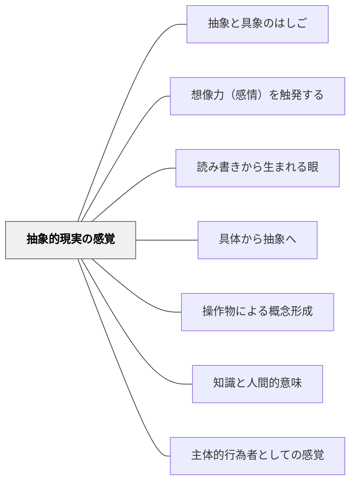

# 抽象的現実の感覚

> 抽象的な概念を身につけることで、世界に対する知覚と力覚が変わる

## 背景（Context）

抽象的な概念——民主主義、エネルギー、正義、資本——は、現実に強く働きかける力をもつ。ドゥルーズが「哲学は概念の創造である」と述べたように、概念そのものが現実を組織化する。

## 問題（Problem）

抽象概念の学習が「言葉の暗記」にとどまると、学習者は概念を現実の力として感じることができない。概念を身につけることで「見え方・感じ方・できること」が変わるという体験が欠けている。

## 力のかたち（Forces）

- 抽象概念は、それを知ることで新たな現実の側面が見えるようになる認識的道具である
- 「民主主義」を概念として理解した人は、それを知らない人とは異なる現実を生きている
- この「概念による力覚・知覚の変化」は、身体的体験と類似した実感をともなう
- しかし多くの授業では概念は説明の対象であり、体験の対象とならない

## 解決（Solution）

概念を「使う」体験を通じて習得させる。たとえば、「エネルギー保存則」を学ぶとき、その概念を使って現実の現象を説明・予測させ、「この概念がなければ見えなかったものが見えるようになった」という実感を引き起こす。

「概念の前と後で、同じ現象がどう違って見えるか」を明示的に問い、概念習得が知覚・感覚を変えることを意識させる。哲学的・社会科学的概念においても同様に、概念を使って現実に介入する活動を設計する。

## 結果（Consequences）

学習者は抽象概念を生きた道具として感じ、知識習得への意欲が高まる。概念を使う能力が育ち、転移可能性が増す。ただし、体験なしに概念の「力」を語るだけでは逆に概念への親近感が失われる危険もある。

## 関連パタン
- [[パタン/抽象と具象のはしご]]

- [[パタン/想像力（感情）を触発する]]
- [[パタン/読み書きから生まれる眼]]
- [[パタン/具体から抽象へ]]
- [[パタン/操作物による概念形成]]
- [[パタン/知識と人間的意味]]
- [[パタン/主体的行為者としての感覚]]

## クラスター図

## Actionable Insight

- 概念を教えた後、「この概念を使って、今日見た現象を説明してみよう」と問う——概念を使う体験が「言葉の暗記」から「道具の習得」へと変える
- 「この概念を知る前と後で、同じ現象がどう違って見えるか」を一言書かせる——概念による知覚の変化を意識させることが学習への動機を高める
- 哲学・社会科学的概念は「この概念を使って今の社会の何かを説明してみよう」という活動で使わせる——概念を現実に介入させる体験が抽象的現実の感覚を育てる

## 出典

キアラン・イーガン（2010）『想像力を触発する教育――認知的道具を活かした授業づくり』北大路書房
