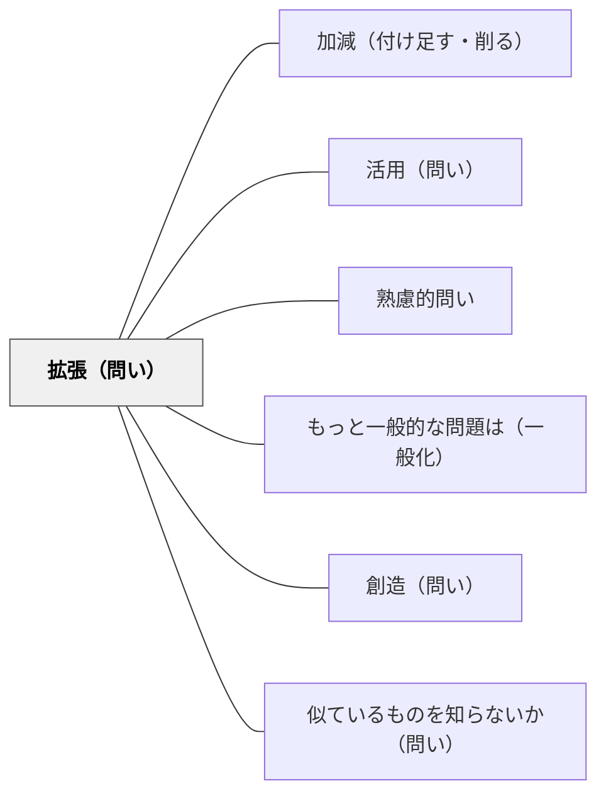

# 拡張（問い）

> 「もっと広げるとどうなるか？別のドメインに適用すると？」と発展・拡張を問い、知識の射程を広げる。

## 背景（Context）
ある文脈で学んだことを別の文脈に適用したり、特定の問題を超えて広い視野で考えることは、学習の転移と深い理解の証である。「拡張」の問いは、知識の境界を広げ、異分野への接続や応用を促す。一般化の問いとも重なるが、特にドメインを超えた適用や実践的な展開に焦点がある。

## 問題（Problem）
学習が特定の教科・単元の中に閉じてしまい、学んだことが「別の場面でも使える」という認識が育たないことがある。「これは数学の問題」「これは歴史の知識」というように教科の壁が思考の壁になり、知識の転移が妨げられる。

## 力のかたち（Forces）
- ドメインを超えた適用の試みが、知識の本質的な理解を試す
- 「もっと広げると」という問いが開放的で探究的な学びの態度を育てる
- 異なるフィールドへの応用は創造的思考と革新的な解法を生む
- 拡張の失敗（うまく当てはまらない場合）も、元の概念の限界を理解する機会になる

## 解決（Solution）
「この原理を別の分野に当てはめるとどうなるか？もっと大きなスケールで考えると？これを社会問題に応用するとしたら？」と問いかける。例えば「進化の概念を文化の変化に当てはめると何が言えるか？」「この数学的パターンを音楽や建築で見たことはないか？」のように学際的な拡張を促す。「どこまで当てはまるか？限界はどこか？」という問いも重要である。

## 結果（Consequences）
- 知識の転移（transfer）が促進され、広い応用力が身につく
- 学際的・横断的な思考力が育つ
- 学習が一つの教科・単元に留まらない広がりを持つようになる

## 関連パタン
- [[パタン/加減（付け足す・削る）]]
- [[パタン/活用（問い）]]
- [[パタン/熟慮的問い]] — 親パタン
- [[パタン/もっと一般的な問題は（一般化）]] — 一般化の視点からの拡張
- [[パタン/創造（問い）]] — 拡張から新しい創造へ
- [[パタン/似ているものを知らないか（問い）]] — ドメインをまたいだ類似性の探索

## クラスター図

## Actionable Insight

- 概念を教えた後に「これを別の分野や日常生活に当てはめるとどうなるか？」と問う——知識の転移を意識的に促すことで応用力が育つ
- 「この数学のパターンを音楽や建築で見たことはないか？」のような学際的な問いを1単元に1回入れる——ドメインを超えた探索が概念の本質的な理解を深める
- 拡張の問いの後に「どこまで当てはまるか？限界はどこか？」と続けて問う——知識の射程と限界を意識することが批判的思考を育てる

## 出典
- [[文献/熟慮的問いのパターンリスト（動画記録）]]
