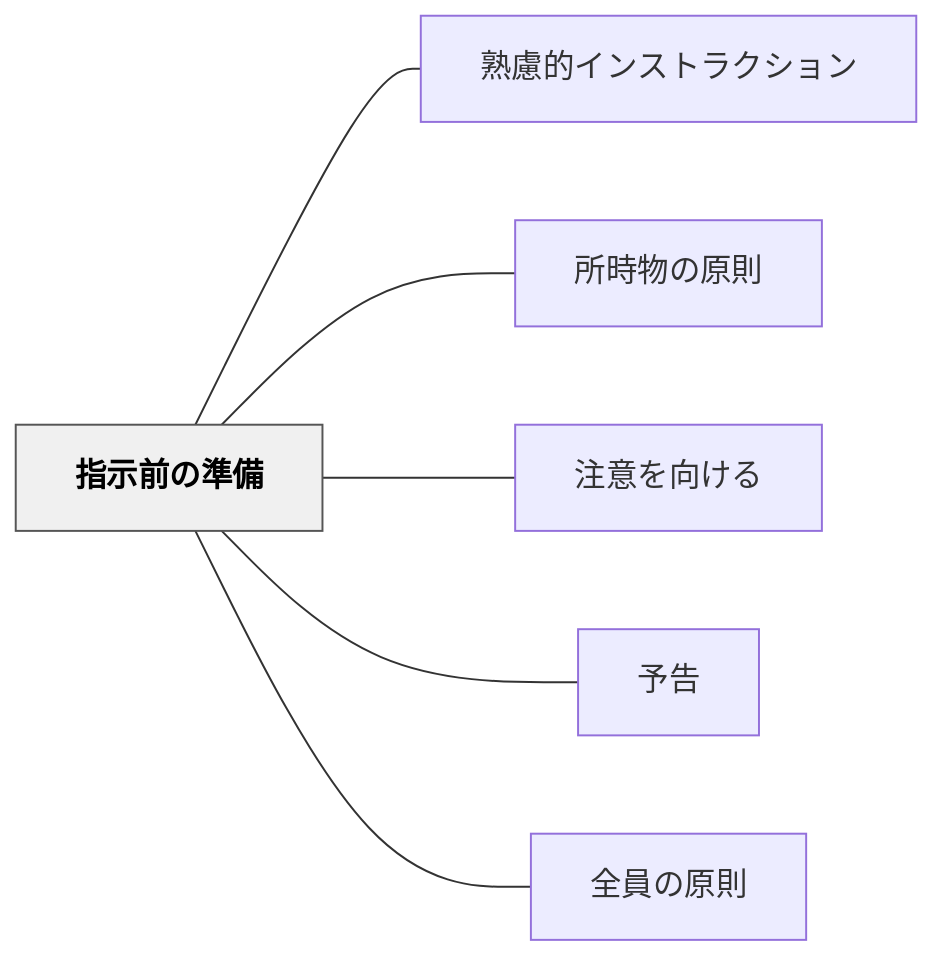

# 指示前の準備

> 環境・道具・気持ちが整ってから指示を出す。準備なき指示は届かない。

## 背景（Context）
インストラクションの効果は、指示を出す前の状態に大きく左右される。所時物の原則（向山洋一）と連動して、物が揃い・場所が決まり・受け手の注意が向いた状態になって初めて、インストラクションは届く準備が整う。

## 問題（Problem）
受け手がまだ前の活動の片付けをしている、道具を探している、よそ見をしている状態で指示を出すことがある。こうした状況では、指示が半分も届かず、活動が始まってから「先生、何するんですか？」という質問が増える。

## 力のかたち（Forces）
- 準備が整っていない状態で出した指示は繰り返さなければならず、時間が無駄になる
- 準備を整える時間そのものが、受け手の気持ちを切り替えるためのバッファになる
- 準備の確認が過剰だと活動開始が遅くなり、受け手のテンポが落ちる

## 解決（Solution）
**指示を出す前に「道具は手元にあるか」「活動の場所は決まっているか」「受け手の注意はこちらに向いているか」の三点を確認し、揃ってからインストラクションを始める。**

「ノートと鉛筆を出したら手を置いてください」のように、準備の完了を可視化してから指示に移る。物理的な準備（所時物）と心理的な準備（注意を向ける）の両方を意識して整える。

## 結果（Consequences）
- 指示が一度で全員に届くようになる
- 活動開始後の「何するんですか？」という質問が減る
- 受け手が「準備してから聞く」という習慣を身につける

## クラスター図

## Actionable Insight

- 指示を出す前に「ノートと鉛筆を出したら手を置いてください」と言って全員が揃うのを待つ——準備の完了を可視化してから指示に移ることで一度で全員に届く
- 活動の切り替わりに「前の活動の道具を片付けて、新しい道具を出したら座ってください」と手順を示す——片付けと準備をセットにした指示が次の活動への気持ちの切り替えを助ける
- 説明を始める前に「こちらを見ている人」と一言言って全員の注意が向くのを確認してから話し始める——注意が揃った状態でのインストラクションは繰り返しの手間を省く

## 出典

- 一つの教育のパタン・ランゲージ（岩井輝久）

## 関連パタン
- [[パタン/熟慮的インストラクション]] — 親パタン
- [[パタン/所時物の原則]] — 物的準備の原則
- [[パタン/注意を向ける]] — 心理的準備の前段
- [[パタン/予告]] — 準備を促すための事前予告
- [[パタン/全員の原則]] — 準備が整ったことを全員で確認する
