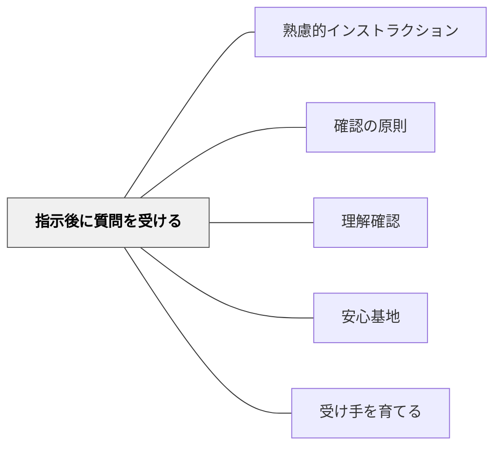

# 指示後に質問を受ける

> 指示・説明の後に質問の機会を設けることで、受け手は安心して集中できる。

## 背景（Context）
インストラクションのシステム（ワーマン「理解の秘密」）において、受け手のフィードバックはシステムを完結させる要素である。「説明が終わったら質問を受けます」と事前に宣言することで、受け手は「わからなくても後で聞ける」という安心感を持ち、説明中の集中度が上がる。

## 問題（Problem）
指示・説明の途中で質問が飛んでくると、説明の流れが途切れ、全体への指示が完結しないまま個別対応に入ってしまう。一方、質問の機会が全くないと、わからないまま活動が始まり、途中で混乱が生じる。

## 力のかたち（Forces）
- 質問の機会を事前に示すことで、受け手は「今は聞く」という集中モードに入れる
- 全体への指示が終わってから質問を受けることで、他の受け手の質問が自分の疑問も解消することがある
- 質問しにくい雰囲気では、機会を設けても活用されない

## 解決（Solution）
**「説明が終わったら質問の時間を取ります」「最後に聞いてよい時間を3分作ります」のように、指示・説明の前または後に、質問を受け付けるタイミングを明示する。**

指示後に「質問がある人？」と問いかけ、挙手や個別の相談の時間を設ける。活動中も「わからない人は途中で来ていいよ」という形で質問チャンネルを開けておく。質問しやすい雰囲気は事前の安心基地づくりと連動する。

## 結果（Consequences）
- 受け手が指示・説明に集中して聞けるようになる
- 理解不足が活動前に解消され、スタート後の混乱が減る
- 「わからないことを聞ける」という文化が学級に根付く

## クラスター図

## Actionable Insight

- 指示の最初に「説明が終わったら3分質問の時間を取ります」と宣言してから話す——「後で聞ける」とわかると学習者は説明中の集中モードに切り替わる
- 全体への指示が終わった後「わからないことがあれば今手を挙げて」と明示的に問いかける——質問タイミングを指定することで指示の流れを守りながら個別フォローもできる
- 活動開始直後に「最初の30秒でわからなくなったら来ていいよ」と伝える——スタート直後に質問チャンネルを開けることがつまずきを小さなうちに解消する

## 出典

- 一つの教育のパタン・ランゲージ（岩井輝久）

## 関連パタン
- [[パタン/熟慮的インストラクション]] — 親パタン
- [[パタン/確認の原則]] — 指示後の確認の一形態
- [[パタン/理解確認]] — 理解の到達度を確かめるパタン
- [[パタン/安心基地]] — 質問しやすい心理的安全性の基盤
- [[パタン/受け手を育てる]] — 質問する力を育てる受け手育成
