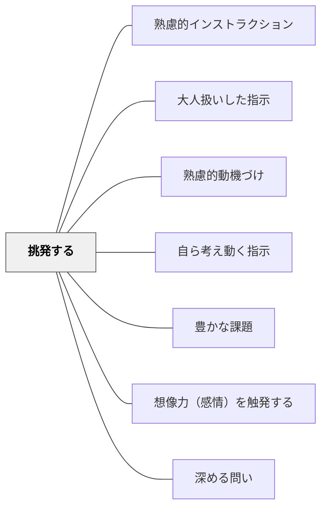

# 挑発する

> 適切な文脈・関係・状況で行う挑発的な指示が、挑戦意欲を引き出す。

## 背景（Context）
土居正博の指示論の一つである「挑発する」は、相手の挑戦意欲や負けたくない気持ちを意図的に刺激することで主体的な行動を引き出す技法である。ただし関係性・文脈・個人への配慮なしに使うと逆効果になるため、慎重な運用が必要である。

## 問題（Problem）
「やりましょう」という穏やかな指示だけでは、受け手の気持ちが乗らず、活動に消極的にしか取り組まない場面がある。特にルーティンになった活動では、刺激が足りず受け手の意欲が低下する。

## 力のかたち（Forces）
- 適切な挑発は受け手の「できるかもしれない」という自己効力感を引き出す
- 相手によって挑発が傷つきや反発につながることがある
- 信頼関係が十分でない状態では機能しない
- ユーモアや遊び心と組み合わせることで安全に使える

## 解決（Solution）
**「これは難しいかもしれないけれど、やってみる人は？」「先生にはできないと思っているけど、どうかな」のような形で、受け手の挑戦意欲を刺激する言葉を意図的に使う。**

使う場面は「受け手との信頼関係が十分にある」「ユーモアが通じる雰囲気がある」「失敗しても安全な課題である」の三条件が揃っているときに限定する。個人を傷つけるのではなく、課題の難しさに向けて挑発することが原則。

## 結果（Consequences）
- 受け手が自発的に挑戦しようとする気持ちが生まれる
- 活動への集中度・熱量が上がる
- 使いすぎると効果が薄れ、雰囲気がシラケることがある

## クラスター図

## Actionable Insight

- 「これは難しいかもしれないけど、やってみる人は？」という形で受け手の挑戦意欲を刺激する——課題の難しさへ向けた挑発が「できるかもしれない」という自己効力感を引き出す
- 信頼関係が十分にある・ユーモアが通じる雰囲気がある・失敗しても安全な課題、の三条件が揃ったときにのみ使う——条件なき挑発は傷つきと反発を生む
- 個人でなく課題の難しさに向けて挑発する——「あなたにはできない」でなく「この問題は難しい」という方向性が挑発を学習の燃料にする

## 出典

- 一つの教育のパタン・ランゲージ（岩井輝久）

## 関連パタン
- [[パタン/熟慮的インストラクション]] — 親パタン
- [[パタン/大人扱いした指示]] — 挑発の前提にある信頼
- [[パタン/熟慮的動機づけ]] — 動機付けの設計全体
- [[パタン/自ら考え動く指示]] — 挑発が目指す自律的な行動
- [[パタン/豊かな課題]] — 挑発的な問いが豊かな課題を生む
- [[パタン/想像力（感情）を触発する]] — 挑発が感情・想像力を動かす
- [[パタン/深める問い]] — 挑発が思考の深みへ誘う
