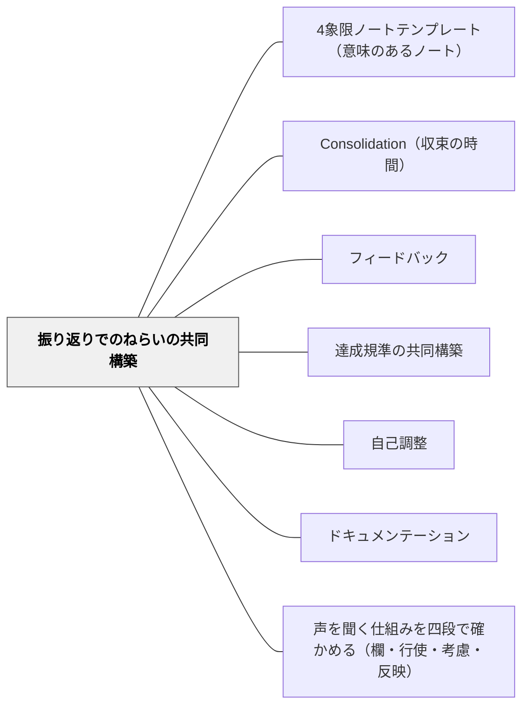

# 振り返りでのねらいの共同構築

> 学習の後に「何ができるようになったか」を振り返ることで、ねらいが更新される。

## 背景（Context）

達成規準は学習前に設定するだけでなく、学習後に振り返ることでも構築・更新できる。「やってみてわかったこと」「できるようになったこと」を言語化する振り返りは、次の学習のための新しい達成規準を生む。

## 問題（Problem）

事前にすべての達成規準を決めることは難しく、学習者が実際にやってみて初めて見えてくる「良さの条件」がある。それを捉えなければ、学習の深みが記録されない。

## 力のかたち（Forces）

- 振り返りは学習直後が最も生産的
- 集団での振り返りは個人では気づかない視点を引き出す
- 振り返りで出た言葉を「次の授業のめあて」に繋げることで連続性が生まれる

## 解決（Solution）

**学習活動の後に「今日できるようになったこと・気づいたこと」を言語化し、それをクラスで共有・整理することで、次の学習のねらいを共同構築する。**

実践例：
- 授業の終わりに「今日学んだことで大事だと思ったことは？」を問う
- 出てきた気づきを板書・Padletなどで集める
- 「私たちが発見した○○のコツ」としてまとめ掲示する

## 結果（Consequences）

- 学習者が自分の学びを主体的に言語化する力が育つ
- 教師が想定していなかった「学びのポイント」が発見される
- 次の授業へのつながりが生まれる

## クラスター図

## Actionable Insight

- 授業の終わりに「今日できるようになったこと」を1文ポストイットに書かせ黒板に貼る——学習者自身の言葉が集まることで、教師が想定していなかった学びのポイントが見える
- 集まった気づきをその場で3〜5つに絞って「私たちが発見したポイント」として板書する——共同構築された言葉は学習者にとって「自分たちのもの」として記憶に残る
- その板書を写真に撮り次の授業の冒頭で見せて「前回の自分たちの発見」を思い出させる——振り返りで構築したねらいが次の学習への橋渡しになる

## 出典

- 一つの教育のパタン・ランゲージ（岩井輝久）

## 関連パタン
- [[パタン/4象限ノートテンプレート（意味のあるノート）]]
- [[パタン/Consolidation（収束の時間）]]

- [[パタン/フィードバック]] — 親パタン
- [[パタン/達成規準の共同構築]] — 事後構築としての振り返り
- [[パタン/自己調整]] — 振り返りを通じた自己調整
- [[パタン/ドキュメンテーション]] — 振り返りの記録
- [[パタン/声を聞く仕組みを四段で確かめる（欄・行使・考慮・反映）]] — 子どもの声を取り入れる仕組みが、欄・行使・考慮・反映のどこまで立っているか

