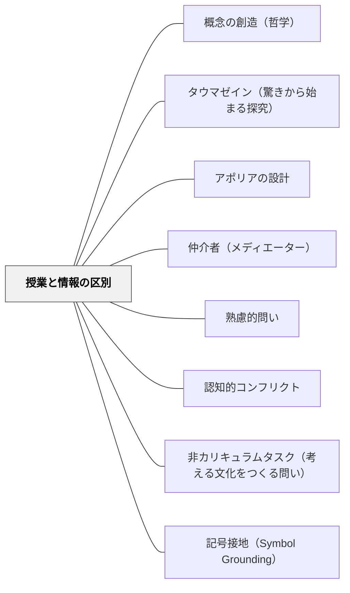

# 授業と情報の区別

> 授業とは、誰も事前には知らなかったことを探索することだ。誰もがすでに知っていることを確認するだけなら、それは情報処理であって授業ではない。

## [Pattern Connection]

### ドゥルーズ（1990）記号と事件——授業は情報伝達と根本的に異なる

ドゥルーズは映画監督ゴダールの仕事について語る文脈で、「授業（cours）」と「情報（information）」の根本的な違いを定式化した：

> 「授業とはつまり、人々が事前には何も知らなかったことについて説明することだ。情報とは逆に、誰もがすでに知っていることを聞くだけのものだ。」——ドゥルーズ（記号と事件, ゴダール論）

この区別の教育的含意は深い。「情報」とはすでに整理された知識を渡すことであり、受け手は「すでに知っていること」の確認にとどまる。「授業」はそこに何も「与える」のではなく、「誰も持っていない何か」が共同で現れる場を開くことだ。

**ドゥルーズのゴダール評価との接続：**
ドゥルーズはゴダールが「正しい理念」ではなく「ただの理念（just an idea）」を映画に持ち込んだと評価した。「ただの理念」とは、完成した答えとして渡されるものではなく、観客が「事前には知らなかった」感覚として出会うもの。授業における「ただの問い」は、これと同じ機能を果たす。

**「思考は危険を冒す」という補強：**
> 「思考するというのは、危険を冒すことだ。思考したとき、何かが変わる。何かが変わってしまう。だから人は思考を恐れる。」——ドゥルーズ

授業が「情報」にとどまるとき、思考の危険は回避される。「授業」が起きるとき、思考者は「変わってしまう」危険を冒す。これは教師にとっても同様——授業が「情報」にとどまる限り、教師自身も変わらない。

**既存パタンとの関連：**
- **補強点**：[[パタン/タウマゼイン（驚きから始まる探究）]] の「驚きが探究の唯一の入り口」という主張が、「授業と情報の区別」という教授論的定式で実装される。情報は驚きを殺す（すでに知っていることだから）。授業は驚きを起動する（誰も知らなかったから）。
- **接続点**：[[パタン/アポリアの設計]] — 「すでに知っていると思っていたことをわからなくする」アポリアは、「情報」から「授業」へと移行するための操作。
- **波及するパタン**：[[パタン/仲介者（メディエーター）]] — 「誰も知らなかったこと」が現れるには仲介者（教師・テキスト・他者）が必要；[[文献/記号と事件（ドゥルーズ）]] — 本統合の出典

---

## 背景（Context）

学校の授業の多くは「情報伝達」として機能している。教師が「正解」を知っており、それを「まだ知らない」生徒に渡す。ノートに写し、テストで確認する。この構造では、生徒は「すでに決定された知識」の受け手としてしか参加できない。

一方、真の「授業（cours）」はゴダール的な意味での「探索」——教師も含めた全員にとって「事前には知らなかったこと」が現れる場——として機能する。教師が「正解を持っている」場合でも、生徒にとって「初めて出会う驚き」として設計された授業は「情報」ではなく「授業」になる。

ドゥルーズは「知覚の教育法（pédagogie de la perception）」とも述べた——映画が観客の知覚を「教育する」ように、授業は感受性・知覚・思考の様式そのものを変える場でなければならない。

## 問題（Problem）

「教えなければならないこと（学習指導要領・単元目標）」があるとき、教師は「情報を正確に伝達すること」に集中しがちになる。これは「誰もがすでに知っていることを確認する」方向に授業を引き寄せる。結果として：
- 子どもは受動的な「情報受信者」になる
- 思考の危険（「変わってしまうこと」）は回避される
- 授業が「誰にも事前には知られていなかった何か」を生み出す場でなくなる

## 力のかたち（Forces）

- 学習指導要領には「教えるべきこと」が明記されており、それを「伝える義務」が生まれる
- 「正解を知っている教師」と「知らない生徒」という非対称が情報伝達の構造を生む
- 授業時間の制約が「効率的な情報伝達」を促す
- 「授業」として設計するには「事前には誰も知らなかった問い・素材・逆説」を用意する必要があり、設計コストが高い
- 生徒も「授業＝正解を教えてもらう場」という前提で参加していることが多い

## 解決（Solution）

**「誰も事前には知らなかったこと」が現れる問い・素材・逆説を設計する。教師が正解を「持っている」場合も、生徒が「自分では知らなかった」として出会う経路を作る。**

---

### 具体例①：授業を「情報」から「授業」に変える問いの変換

| 情報型（授業の問い） | 授業型（探索の問い） |
|---|---|
| 「分数はどう計算しますか？」 | 「半分と3分の1、どちらが大きいか——どうやって確かめる？」 |
| 「光合成とは何ですか？」 | 「植物は何を食べているんだろう？」 |
| 「民主主義の定義は？」 | 「クラスの給食メニューを多数決で決めたとき、何が問題だったか？」 |
| 「俳句の5・7・5とは？」 | 「なぜ5・7・5で書くと、散文より感じが変わるのか？」 |

情報型の問いは「すでに答えがある問い」。授業型の問いは「答えを探すことで何かが起きる問い」。

---

### 具体例②：「ただの理念」を授業に持ち込む（ゴダール的設計）

ゴダールが映画に「ただの理念（just an idea）」——完成した答えではなく、観客が「事前には知らなかった」として出会う断片——を持ち込んだように、教師は授業に「ただの問い」「ただの素材」「ただの不思議」を持ち込む。

- 正解を持たない問いを授業に持ち込む：「なぜ足し算は逆から計算しても同じになるんだろう？」
- 逆説・矛盾を素材にする：「同じ6個を2グループに分けた——なのに一方は多く見える」（数の保存）
- 「これはおかしい」と感じる体験を先に作る：既知の概念が突然機能しなくなる場面を設計する

---

### 具体例③：「知覚の教育法」としての授業

ドゥルーズは映画の仕事を「知覚の教育法」と呼んだ——映画が観客の「見る・聴く・感じる」を変えるように、授業は子どもの知覚・感受性を変える場であるべき。

- 算数：「1/2と1/3の大きさを身体で感じる」前に記号で教えない
- 国語：詩の文字情報を伝える前に、詩を声に出してどう感じるかを先に問う
- 理科：実験結果を「答え」として確認するのでなく、「なぜそうなったか」を感じながら観察させる
- 図工：「上手に描く方法」を教える前に、「これをどう感じるか」を問う

---

## 結果（Consequences）

- 子どもが「自分も知らなかった」という驚きを経験し、思考が起動する
- 授業が「知識を受け取る場」ではなく「何かが起きる出来事の場」になる
- 教師自身も授業の中で「知らなかったこと」に出会う体験ができる
- 「変わってしまうこと」への開放性が学習文化として育まれる

## 関連パタン
- [[パタン/概念の創造（哲学）]]

- [[パタン/タウマゼイン（驚きから始まる探究）]] — 情報は驚きを殺し、授業は驚きを起動する
- [[パタン/アポリアの設計]] — 「すでに知っているつもり」を崩すことで授業が始まる
- [[パタン/仲介者（メディエーター）]] — 「誰も知らなかったこと」を仲介するのが教師の仕事
- [[パタン/熟慮的問い]] — 「授業型の問い」を設計する実践的枠組み
- [[パタン/認知的コンフリクト]] — 情報から授業への移行を起こす認知的操作
- [[パタン/非カリキュラムタスク（考える文化をつくる問い）]] — 「誰も知らなかったこと」を文化として作る
- [[パタン/記号接地（Symbol Grounding）]] — 概念を「情報」ではなく「経験」として接地させること
- [[概念/ドゥルーズと出来事の哲学]] — 出来事としての授業の理論的基盤

## クラスター図

## Actionable Insight

- 今週の1つの授業で「この問いに、私（教師）は事前に完全な答えを持っているか？」と問う——答えが「完全に持っている」なら、それは「情報」かもしれない。「完全には持っていない」問いを設計してみる
- 既存の授業の問いを「情報型 vs 授業型」の二分で見直す——「○○とは何ですか？」は情報型。「なぜ○○は×× なのか？」「○○と△△はどちらが大きいか——どうやって確かめる？」に変換する
- 「知覚の教育法」として：概念を言葉で教える前に「身体で感じる5分」を最初に置く——その5分が「誰も事前には知らなかった」体験の場になる

## 出典

ドゥルーズ，G．（宮林寛訳）（1992）．『記号と事件——1972-1990年の対話』河出書房新社．（原著: Deleuze, G. (1990). *Pourparlers, 1972-1990*. Minuit.）

> 「授業とはつまり、人々が事前には何も知らなかったことについて説明することだ。情報とは逆に、誰もがすでに知っていることを聞くだけのものだ。」——ドゥルーズ（記号と事件, ゴダール論）
