# 授業の中で批評する

> 批評は個人を傷つけるためにあるのではなく、作品をより良くするためにある。

## 背景（Context）

学習物（作品・考え方・解法・文章など）を授業の中で全体に公開し、みんなで批評する実践は、シャーリー・クラークが形成的評価の中心的実践として位置づけているものだ。この実践では、個人の作品が全体の学習資源になるという考え方が根底にある。

ロン・バーガーが「An Ethic of Excellence」で描く批評の文化も同様であり、丁寧で・具体的で・助けになる（Kind, Specific, Helpful）批評が、作品の質と学習者の成長を同時に高めることを示している。

## 問題（Problem）

授業の中で学習者がそれぞれ課題に取り組んでいるだけでは、個々の学習物は「提出して終わり」になりやすい。作品の質についての対話が授業の中で行われなければ、学習者は自分の作品の強みと弱点を客観的に見る機会を持てない。

また、批評の文化が育っていない教室では、「他者の作品を批評する」ことに心理的抵抗があり、表面的なコメントしか生まれない。安全な批評の文化と枠組みが必要だ。

## 力のかたち（Forces）

- 批評はやり方を誤ると、個人攻撃や傷つきの経験になる
- 全体で一つの作品を批評することで、全員が同じ観点から学べる
- 批評の質は「具体的であること」「改善可能であること」「成功を認識することとセットであること」で高まる

## 解決（Solution）

授業の中で学習物の批評を実施するためのプロトコルを設ける。「成功している点（星）」を最低一つ、「改善できる点（願い）」を最低一つ挙げる形式（星と願い）は、批評を建設的に保つための枠組みだ。

批評する作品は無作為選択・本人志願・教師選択など状況に応じて選ぶ。匿名でも記名でも可能だが、最初は無作為・匿名選択が心理的安全を確保しやすい。批評後は必ず作品の改善時間を設け、フィードバックを受けて作品が変化するという経験を積ませる。継続することで、「批評される＝恥ずかしい」から「批評される＝成長のチャンス」へと文化が変わる。

## 結果（Consequences）

- 学習者が批評する・批評されるという双方の視点を経験し、評価リテラシーが高まる
- 全体で一つの作品を議論することで、質についての共通言語が育まれる
- 授業が「教師から学習者への一方向の知識伝達」ではなく、「学習者同士の知識構築の場」になる

## 関連パタン
- [[パタン/フィッシュボウル（金魚鉢）]]
- [[パタン/自分の学習物が学級で批評される]]
- [[パタン/授業中に学習パートナーが協働して成功を確認し改善案を示す]]
- [[パタン/被教育者は一時に一つの学習物を協働して話し合う]]
- [[パタン/無作為の学習物による改善のモデルを示す]]

- [[パタン/フィードバック]] — 親パタン
- [[パタン/授業中の学習のストップ（批評）]] — 同系の実践。授業の流れを止めて批評を行う
- [[パタン/共通概念やキャラクター（ナラティブ）の共有]] — 安全な批評文化を支える共通言語
- [[パタン/エクセレンスの文化]] — 批評が生きる文化的土台
- [[パタン/四つの問いで作品を判断する]] — 「星と願い」とは別の批評プロトコル。評価力の育成を主眼に問いの順序が設計されている
- [[パタン/質の幅ぜんぶに出会わせる（作品の束）]] — 批評の素材をどう用意するか。学級の作品だけでは質の幅が足りない
- [[概念/鑑識眼（コノサーシップ）]] — 批評を通して育てているものの正体
- [[パタン/質の根拠を見えるようにする（伝えることからの脱却）]] — 批評を、教師の判断を伝える場ではなく子どもが判断する場として設計する

## クラスター図

```mermaid
flowchart LR
    ne68e88e6a5ade381aee4b8ade381a7e689b9e8a995e38199e3828b["授業の中で批評する"]
    ne38395e382a3e38383e382b7e383a5e3839ce382a6e383abefbc88e98791e9ad9ae989a2efbc89["フィッシュボウル（金魚鉢）"]
    ne887aae58886e381aee5ada6e7bf92e789a9e3818ce5ada6e7b49ae381a7e689b9e8a995e38195e3828ce3828b["自分の学習物が学級で批評される"]
    ne68e88e6a5ade4b8ade381abe5ada6e7bf92e38391e383bce38388e3838ae383bce3818ce58d94e5838de38197e381a6e68890e58a9fe38292e7a2bae8aa8de38197e694b9e59684e6a188e38292e7a4bae38199["授業中に学習パートナーが協働して成功を確認し改善案を示す"]
    ne8a2abe69599e882b2e88085e381afe4b880e69982e381abe4b880e381a4e381aee5ada6e7bf92e789a9e38292e58d94e5838de38197e381a6e8a9b1e38197e59088e38186["被教育者は一時に一つの学習物を協働して話し合う"]
    ne784a1e4bd9ce782bae381aee5ada6e7bf92e789a9e381abe38288e3828be694b9e59684e381aee383a2e38387e383abe38292e7a4bae38199["無作為の学習物による改善のモデルを示す"]
    ne38395e382a3e383bce38389e38390e38383e382af["フィードバック"]
    ne68e88e6a5ade4b8ade381aee5ada6e7bf92e381aee382b9e38388e38383e38397efbc88e689b9e8a995efbc89["授業中の学習のストップ（批評）"]
    ne585b1e9809ae6a682e5bfb5e38284e382ade383a3e383a9e382afe382bfe383bcefbc88e3838ae383a9e38386e382a3e38396efbc89e381aee585b1e69c89["共通概念やキャラクター（ナラティブ）の共有"]
    ne382a8e382afe382bbe383ace383b3e382b9e381aee69687e58c96["エクセレンスの文化"]
    ne59b9be381a4e381aee5958fe38184e381a7e4bd9ce59381e38292e588a4e696ade38199e3828b["四つの問いで作品を判断する"]
    ne8b3aae381aee5b985e3819ce38293e381b6e381abe587bae4bc9ae3828fe3819be3828befbc88e4bd9ce59381e381aee69d9fefbc89["質の幅ぜんぶに出会わせる（作品の束）"]
    ne8b3aae381aee6a0b9e68ba0e38292e8a68be38188e3828be38288e38186e381abe38199e3828befbc88e4bc9de38188e3828be38193e381a8e3818be38289e381aee884b1e58db4efbc89["質の根拠を見えるようにする（伝えることからの脱却）"]

    ne68e88e6a5ade381aee4b8ade381a7e689b9e8a995e38199e3828b --- ne38395e382a3e38383e382b7e383a5e3839ce382a6e383abefbc88e98791e9ad9ae989a2efbc89
    ne68e88e6a5ade381aee4b8ade381a7e689b9e8a995e38199e3828b --- ne887aae58886e381aee5ada6e7bf92e789a9e3818ce5ada6e7b49ae381a7e689b9e8a995e38195e3828ce3828b
    ne68e88e6a5ade381aee4b8ade381a7e689b9e8a995e38199e3828b --- ne68e88e6a5ade4b8ade381abe5ada6e7bf92e38391e383bce38388e3838ae383bce3818ce58d94e5838de38197e381a6e68890e58a9fe38292e7a2bae8aa8de38197e694b9e59684e6a188e38292e7a4bae38199
    ne68e88e6a5ade381aee4b8ade381a7e689b9e8a995e38199e3828b --- ne8a2abe69599e882b2e88085e381afe4b880e69982e381abe4b880e381a4e381aee5ada6e7bf92e789a9e38292e58d94e5838de38197e381a6e8a9b1e38197e59088e38186
    ne68e88e6a5ade381aee4b8ade381a7e689b9e8a995e38199e3828b --- ne784a1e4bd9ce782bae381aee5ada6e7bf92e789a9e381abe38288e3828be694b9e59684e381aee383a2e38387e383abe38292e7a4bae38199
    ne68e88e6a5ade381aee4b8ade381a7e689b9e8a995e38199e3828b --- ne38395e382a3e383bce38389e38390e38383e382af
    ne68e88e6a5ade381aee4b8ade381a7e689b9e8a995e38199e3828b --- ne68e88e6a5ade4b8ade381aee5ada6e7bf92e381aee382b9e38388e38383e38397efbc88e689b9e8a995efbc89
    ne68e88e6a5ade381aee4b8ade381a7e689b9e8a995e38199e3828b --- ne585b1e9809ae6a682e5bfb5e38284e382ade383a3e383a9e382afe382bfe383bcefbc88e3838ae383a9e38386e382a3e38396efbc89e381aee585b1e69c89
    ne68e88e6a5ade381aee4b8ade381a7e689b9e8a995e38199e3828b --- ne382a8e382afe382bbe383ace383b3e382b9e381aee69687e58c96
    ne68e88e6a5ade381aee4b8ade381a7e689b9e8a995e38199e3828b --- ne59b9be381a4e381aee5958fe38184e381a7e4bd9ce59381e38292e588a4e696ade38199e3828b
    ne68e88e6a5ade381aee4b8ade381a7e689b9e8a995e38199e3828b --- ne8b3aae381aee5b985e3819ce38293e381b6e381abe587bae4bc9ae3828fe3819be3828befbc88e4bd9ce59381e381aee69d9fefbc89
    ne68e88e6a5ade381aee4b8ade381a7e689b9e8a995e38199e3828b --- ne8b3aae381aee6a0b9e68ba0e38292e8a68be38188e3828be38288e38186e381abe38199e3828befbc88e4bc9de38188e3828be38193e381a8e3818be38289e381aee884b1e58db4efbc89

    classDef hub fill:#f0f0f0,stroke:#555,color:#000,font-weight:bold
    class ne68e88e6a5ade381aee4b8ade381a7e689b9e8a995e38199e3828b hub
```

## Actionable Insight

- 批評する前に「批評の3条件：丁寧で・具体的で・助けになる」をクラスで確認する——枠組みを共有することで批評が安全に機能する
- 「星（成功）1つ・願い（改善）1つ」を全員に付箋に書かせてから共有する——全員参加の批評が観察力と評価リテラシーを育てる
- 批評後に作品を改善する時間を必ず設ける——「批評されたら必ず改善の機会がある」という文化が批評を恐怖から成長の道具に変える

## 出典

Clarke, S. (2014). *Outstanding Formative Assessment*. Hodder Education.
Berger, R. (2003). *An Ethic of Excellence*. Heinemann.
