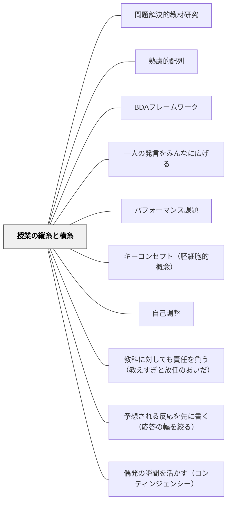

# 授業の縦糸と横糸

> 縦糸は単元全体に通る問いの連鎖、横糸は1時間の授業に通る資料→活動→評価の連動——この二つが揃うとき、授業は子どもの学びを支える布になる。

---

## 背景（Context）

授業は1時間の「横」の設計だけでは成立しない。「前時があるから本時がある」「本時から次時につなげる」という問いの連鎖が「縦」にあって初めて、子どもは「なぜ今日この問いを考えているのか」がわかる。

小倉勝登は、単元設計を「縦糸と横糸で仕組む」という比喩で表現した。縦糸が単元全体を貫く問いの連鎖、横糸が1時間の授業の内部構造（資料→活動→評価）だ。この二つが噛み合ってはじめて授業という「布」が完成する。

## 問題（Problem）

単元の各時間を独立した「このコマでやること」として設計すると、子どもから見て「今日の授業と前の授業がつながっている」実感が生まれない。また、教師が「授業で何を教えたいか」（結論先行）に引っ張られると、子どもを答えに向かって誘導する「追い込み漁」型の授業になる——教師が考えた結論に子どもを追い込む授業設計だ。

## 力のかたち（Forces）

- 問いの連鎖を設計するためには、単元全体を見渡す鳥瞰が必要——1時間ずつ考えていると縦糸が通らない
- 「教師が思った通りに進む授業」は授業として安定しているように見えるが、子どもの主体性が活きていない
- 1時間の逸脱（子どもが予想外の方向に動く）は、縦糸がしっかりしていれば許容できる——単元のゴールに向かっている限り、道のりはひとつでない
- まとめは「三人称で記述する」と知識になるが、「一人称で振り返る」と自分の問題になる

## 解決（Solution）

**単元を「問いの吹き出し」で俯瞰し、縦糸（問いの連鎖）と横糸（資料→活動→評価）を別々に設計してから組み合わせる。授業の仕掛けは8割が事前準備で決まる——「仕掛け8割・本番2割」。**

---

### 縦糸：問いの連鎖を設計する

指導計画を作成したあと、**「学習問題と各時間の問いだけを吹き出しにして並べる」**。問いがきちんとつながっているかを一目で確認できる。

**確認の問い**：
- 学習問題と各時間の問いに論理的なつながりがあるか？
- 「このコマを経験したから次のコマに進みたくなる」という流れになっているか？
- 単元末の問いが単元の出発点（学習問題）を解決しているか？

**学習問題の「一語」が問いの質を変える**：

| A先生の問い | B先生の問い |
|---|---|
| 「自然災害から暮らしを守るために、どのようなことをしているのだろう」 | 「自然災害から暮らしを守るために、**だれが**どのようなことをしているのだろう」 |
| → 活動・取り組みが浮かぶ | → 公助・共助・自助の主語が浮かぶ |

「**だれが**」という一語を加えるだけで、単元のねらい（主体の多様性の理解）が問いに織り込まれる。

---

### 横糸：1時間の授業の内部構造

1時間の授業で「資料 → 活動 → 評価」が連動しているかを確認する。

**三つの場面で丁寧に取り組む**：

**① 学習の見通しをもつ**
- 学習問題（問い）を子どもが把握し、予想し、学習計画を立てる
- 確認：「課題は本当に子どもに届いているか？」「予想から見通しをもてるか？」
- 届いていない課題では子どもが動かない——届けるための「導入の仕掛け」が必要

**② かかわり合いながら学ぶ**
- 「なぜ、わたしたちはこの話題について話し合うのか」の**目的共有が先決**
- 話し言葉の型を育てる（使えるようになると対話が深まる）：

| 機能 | 話し言葉の型 |
|---|---|
| 伝える | 「つまり…」「たとえば…」「なぜなら…」 |
| 聞く | 「それって、どういう意味？」 |
| つなげる | 「Aさんと関連して…」「Cさんと違って…」 |

**③ まとめる（三人称→一人称への転換）**
- 「地域の人々は…防災のために…している」という**三人称でまとめる**と、社会的事実の理解になる
- その後「私は…と考える。なぜなら…」という**一人称で振り返る**と、学んだことが「自分ごと」になる
- まとめで終わらせず、この一人称の振り返りまでが授業の完成形

---

### 仕掛け8割・本番2割

> 「授業の仕掛けは事前にほぼ完了している。ベルが鳴った瞬間に8割の仕掛けが済んでいる状態をつくる。」

本番（授業中）にできることは2割にすぎない。残りの8割は：
- 問題解決的な教材研究（→ [[パタン/問題解決的教材研究]]）
- 縦糸（問いの連鎖）の設計
- 学習問題の言語化
- 資料の選択と準備
- 学級の文化づくり（→ [[パタン/35プラス1]]）

**「想定外は想定内」**：単元の目標・教材研究・学習計画が揃っていれば、1時間の「逸脱」は問題ない。教師が不安を感じるとき、その根底には「子どもを信じきれていない」ことが多い。

**「追い込み漁」への批判**：  
教師が考えた結論に子どもを追い込む授業は「安定しているように見える」が、実はおもしろくない。子どもが予想外の発言をしても、教師はすぐに「そうだね、でも…」と修正しにくい。仕掛けが十分にできていれば、教師は「子どもの都合」で授業を展開できる。

---

## 結果（Consequences）

- 単元全体の学びの文脈が子どもに見えるようになり、「今日なぜこれを学ぶか」が腑に落ちる
- 教師が「次の問いへの橋渡し」を意識した授業設計ができる
- 三人称→一人称の転換で、子どもの学びが「知識」から「自分の問題意識」に深まる
- ただし、縦糸の設計には単元全体の俯瞰が必要——授業直前にはできない
- 話し言葉の型は指導しないと育たない——日常の対話で繰り返し使う機会を設ける必要がある

## 関連パタン

- [[パタン/問題解決的教材研究]] — 縦糸の問いの質を決める教材研究の方法
- [[パタン/熟慮的配列]] — 学習経験の順序設計の上位パタン
- [[パタン/BDAフレームワーク]] — Before/During/After の三段階設計と横糸の「三つの場面」は相互補強する
- [[パタン/一人の発言をみんなに広げる]] — 「かかわり合いながら学ぶ」場面を機能させる授業技術
- [[パタン/パフォーマンス課題]] — 単元末の「縦糸の着地点」として機能する評価課題
- [[パタン/キーコンセプト（胚細胞的概念）]] — 単元の縦糸を貫くコンセプトの設定
- [[パタン/自己調整]] — 一人称の振り返りが学習者の自己調整を促す

---

- [[パタン/教科に対しても責任を負う（教えすぎと放任のあいだ）]] — 教科の本質を単元の構造として設計し込む
- [[パタン/予想される反応を先に書く（応答の幅を絞る）]] — 横糸（1時間の流れ）のどこに反応の幅を置くか
- [[パタン/偶発の瞬間を活かす（コンティンジェンシー）]] — 偶発の瞬間を単元のどこに置くかの設計

## クラスター図

## Actionable Insight

- **次の単元の学習問題を書いて「だれが」という主語を入れてみる**——主語の有無で子どもの注目が変わる。「だれが何をしているか」が明確な問いは社会科的な見方・考え方を自然に引き出す
- **指導計画を書いたあと、各時間の問いだけを吹き出しで並べて一枚の紙に書く**——問いがつながって見えるか確認する。つながっていないコマを発見したら、前後のコマの問いを見直す
- **「かかわり合う時間」の前に「なぜ今日この話し合いをするのか」を1文だけ語る**——「この疑問を解決したいから話し合う」という目的を共有することで、話し合いが「活動のための活動」でなくなる

---

## 出典
- [[文献/社会科教師の授業・学級づくり「仕掛け学」（小倉勝登）]]

小倉勝登（2020）『社会科教師の授業・学級づくり「仕掛け学」』東洋館出版社

> 「仕掛けは縦糸と横糸で仕組む。前時があるから本時があり、本時から次時につなげる。」——小倉勝登

> 「授業は子どもの都合でつくるものだ。」——小倉勝登
