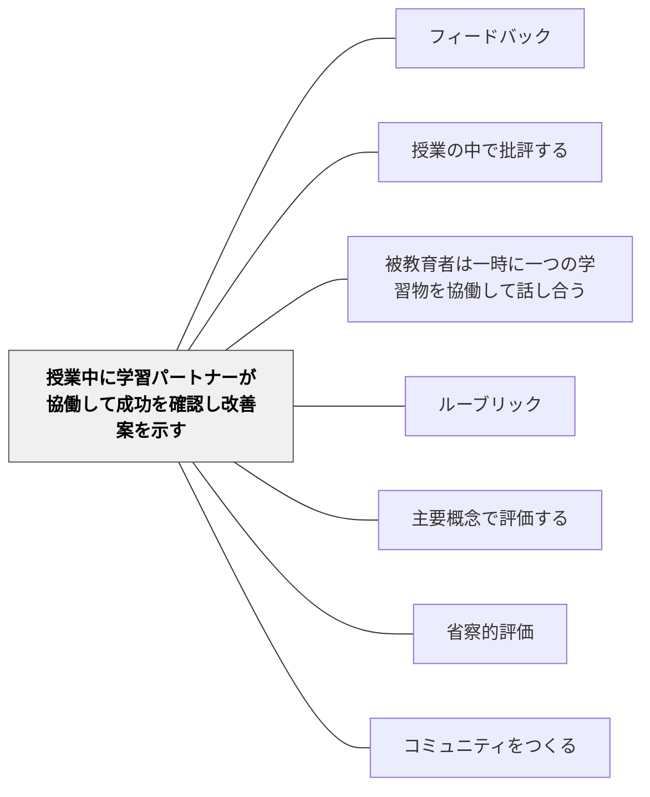

# 授業中に学習パートナーが協働して成功を確認し改善案を示す

> 友人から受けるフィードバックは、教師からのそれとは違う温度と説得力がある。

## 背景（Context）

ピアフィードバック（学習者同士のフィードバック）は、単に教師の評価負担を軽減するためのものではなく、フィードバックを与える側・受ける側の双方に深い学習効果をもたらす実践だ。学習パートナーと呼ばれる安定したペアを設定し、互いの作品を定期的に評価し合うことで、協働的な学習文化が育まれる。

シャーリー・クラークは、学習パートナーによるフィードバックを形成的評価の重要な柱として位置づけており、特に「成功している点の確認（Successes）」と「改善案の提示（Wishes/Improvements）」という両輪を一緒に行うことを重視している。

## 問題（Problem）

学習者が他者の作品を評価する際、ともすれば「良いと思う・良くないと思う」という漠然とした印象にとどまるか、あるいは改善点だけを指摘し、成功している点を見落とすことがある。

また、ピアフィードバックの経験が浅いと、学習者はどのように伝えればよいかわからず、表面的なコメント（「よくできてると思います」）しか生まれない。具体的なフィードバックの与え方の訓練とプロトコルが必要だ。

## 力のかたち（Forces）

- 学習パートナーとの関係の質がフィードバックの深さを左右する（関係性が良いほど正直な批評が生まれる）
- 成功の確認から始めることで、改善案が「攻撃」ではなく「助言」として受け取られやすくなる
- ルーブリックや成功規準を使った構造的なフィードバックが、質を高める

## 解決（Solution）

学習パートナーを設定し、定期的に互いの作品（文章・図・課題・プレゼンテーション）を交換してフィードバックを行う時間を授業に組み込む。フィードバックのプロトコルとして「まず成功している点を二つ見つける→次に一つの改善案を具体的に提案する」という手順を設ける。

ルーブリックや成功規準を使ってフィードバックを行うことで、「何に基づいて言っているか」が明確になる。最初は教師がモデルを示し（「私が学習パートナーとしてこのように言う」）、その後でペアに実践させる。フィードバックを受けた後、改善の時間を必ず設けることで、フィードバックが行動に結びつく。

## 結果（Consequences）

- フィードバックを与える経験が、評価規準への理解を深め、自分の作品への応用につながる
- 学習パートナーとの関係の中でフィードバックの文化が安全に育まれる
- 教師のフィードバック負担が軽減され、教師は深い個別対応に集中できる

## 関連パタン

- [[パタン/フィードバック]] — 親パタン
- [[パタン/授業の中で批評する]] — 全体批評とペアフィードバックの組み合わせ
- [[パタン/被教育者は一時に一つの学習物を協働して話し合う]] — 全体での集中討議との相補関係
- [[パタン/ルーブリック]] — ピアフィードバックの基準として機能する

- [[パタン/主要概念で評価する]] — 協働評価が主要概念への達成確認になる
- [[パタン/省察的評価]] — パートナーとの振り返りが深い省察を生む
- [[パタン/コミュニティをつくる]] — 協働評価の文化がコミュニティを育てる

## クラスター図

## Actionable Insight

- 学習パートナーを決めたら「まず成功点を2つ・次に改善案を1つ」というプロトコルをカードに書いて机に置く——構造があることでピアフィードバックの質が安定する
- 教師が最初に「こんなフィードバックをパートナーに返す」とモデルを見せる——手本を見てから実践することで学習者は何をすればいいかが分かる
- フィードバックを受けた後、改善する時間を5分必ず設ける——改善する機会なしのフィードバックは行動に結びつかない

## 出典

Clarke, S. (2014). *Outstanding Formative Assessment*. Hodder Education.
Topping, K. J. (1998). Peer Assessment Between Students in Colleges and Universities. *Review of Educational Research*, 68(3), 249–276.
