# 採点の形を中身の形に合わせる（構造的忠実性）

> 観点をどう合成するかは、事務の話ではない。足すのか、最低要件を置くのか、形として読むのか——その選択は「この教科の力はどういう構造をしているか」という主張である。誰も選ばないと、合計点が黙って主張する。

## [Pattern Connection]

- **既存パタンとの関連**：本パタンは Messick（1994）の**構造的側面（structural aspect）**、すなわち Loevinger（1957）の**構造的忠実性（structural fidelity）**を、この Wiki の評価パタン群へ接続する。[[パタン/ルーブリック]] も [[パタン/評定（成績評価）]] も [[パタン/テストを作成する]] も、規準を作ることと課題を作ることは扱ってきたが、**作った規準をどう合成して一つのスコアにするか**を主題にしたページはなかった。合成規則は、これまでどのページでも黙って「合計」だった
- **[[概念/質的判断（曖昧な規準とメタ規準）]] との接続**：あちらには Tversky（1969）を援用した一節がある——「一つの規準あたりの不足が許容限度内であっても、規準が多数あればその総和が最低品質の水準を下回りうる。全体としての不足は目につくが、個々の不足は目につかない」。これは**合計方式が構造的に取りこぼすもの**の記述そのものである。サドラーが「だから全体としての質を判断する練習が要る」と結論したのに対し、Messick は「だから採点モデルの構造を領域の構造に合わせろ」と結論する。同じ観察から出た二つの処方
- **[[パタン/ルーブリック]] への修正点（重要）**：あのページには「サドラー後期からの反論」節があり、後期サドラーはルーブリックを徹底的に拒絶する。Messick の立場は**別の角度からの要求**である。彼はルーブリックを捨てよとは言わない。言うのは「**そのルーブリックの構造は、あなたが測ろうとしている力の構造と合っているか**」である。**サドラーはルーブリックの存在を問い、Messick はルーブリックの形を問う**。この二つは同じ道具について正反対のことを言っているように見えるが、問いの層が違う（後述の独立節を参照）
- **[[パタン/理解のしるしを読む（fit と match）]] との関係**：あちらは「正答は理解の証拠にならない」を扱った。本パタンは「**正答の合計は力の証拠にならない**」を扱う。どちらも、集約された数値が集約前の中身を消してしまうことへの警戒である
- **自己教育への波及**：独学者はテキストの章末問題の正答数を到達の指標にする。しかしその合計は補償的である——計算問題の全問正解が、証明問題の白紙を埋め合わせている。埋め合わせてよいのかどうかは、その分野の構造の問題であって、集計の問題ではない
- **他のパタンへの波及**：[[パタン/つまずきを構造で記録する（診断の粒度設計）]] と [[パタン/見取ったあとの手を決めておく（データ利用のルール化）]] は、本パタンの下流にあたる。**プロファイルで採点することを決めて初めて、プロファイルを記録する意味が生まれる**

## 背景（Context）

学期末、観点別評価をつける。「知識・技能」が B、「思考・判断・表現」が A、「主体的に学習に取り組む態度」が B。評定はどう決まるか。多くの学校で使われている運用は、観点の評価を数値に置き換えて合計し、その合計を段階に切り分けるものである。単元テストも同じで、大問ごとの得点を足し上げて一つの得点にする。ルーブリックも同じで、5観点をそれぞれ4段階で評価し、重みをかけて合計する。

この「足す」という操作は、あまりに自然なので、選択として意識されない。しかし足すことは、**ある観点での良い出来が、別の観点での悪い出来を埋め合わせられる**という主張を含んでいる。測定の用語ではこれを**補償的（compensatory）**な採点モデルと呼ぶ。

Messick（1994）は構成概念妥当性の六側面のうち三番目に**構造的側面**を置いた。ここで問われるのは、採点モデルが構成概念領域の構造にどれだけ忠実か、である。

> 構成概念領域の理論は、関連する評価課題の選択・構成を導くだけでなく、**構成概念に基づく採点規準とルーブリックの合理的な開発をも導くべきである**。

理想は、こうである。行動の事例を組み合わせてスコアを作る仕方は、**それらの行動の背後にある過程が動的に組み合わさって結果を生む仕方**についての知識に基づくべきである。したがって評価の内的構造——採点される課題・下位課題のパフォーマンスのあいだの相互関係——は、構成概念領域の内的構造について分かっていることと一貫していなければならない。Loevinger（1957）はこの性質に **structural fidelity（構造的忠実性）** という名を与えた。

平たく言えば——**採点表の形が、中身の形に似ていること**である。

## 問題（Problem）

**採点モデルは、選ばれないまま働く。** 合計点方式は、それが一つの構造仮説であることを誰にも告げずに、その仮説を実装してしまう。

Messick は Kane（1992）の例を挙げる。Kane は、生徒を補習代数か微積分のどちらに配置するかを決める**配置テスト**の妥当化を、論証アプローチの模範例として示した。扱われた七つの仮定は、内容・実質・一般化可能性・外的・帰結的の五つの側面に触れている。しかし——

> **構造的側面は明示的に扱われていない。** したがって、通常の累積的な合計点が持つ補償的性質——一部の代数技能でよくできることが、他の技能での出来の悪さを埋め合わせられるという性質——は、吟味されないまま残る。

そして Messick は対案を並べる。**複数のカットスコアを置く採点モデル**、あるいは前提技能のプロファイル全体にわたって**最低要件を課す**採点モデル。問うべきはこうである——

> そうしたプロファイル型の採点モデルが、診断と補充のための有用な情報を生むだけでなく、**よりよい配置**をも生むのではないか。

同じ見落としは Shepard（1993）の分析にもある。彼女が扱ったのは**特別支援教育の配置決定**の妥当性で、そこで検討される評価・照会システムは認知・生物医学・行動・学業の技能の**プロファイル**を含んでいる。にもかかわらず、テスト結果と配置決定を結ぶ**構造モデルが吟味されていない**。複数の検査結果を並べたあと、どういう規則で配置を決めているのか——それが言語化されていない。日本の教育支援委員会にも、そのまま当てはまる。

教室に降ろすと、問題はこうなる。

- 作文の5観点を合計する運用は、「焦点が定まっていない作文でも、内容と構成と文体とメカニクスが良ければ十分な点になる」と主張している。ほんとうにそう思っているか
- 算数の単元テストで、前提となる技能の大問を落としたまま合計点で通過する子がいる。その子は次の単元へ進む。合計点は「通過した」と言い、教師は「気になる」と思う。**気になっているのは、合計点が置いている構造仮定に納得していないから**である
- 通知表の観点別評価で、「知識・技能」と「思考・判断・表現」を足して平均する運用は、**両者が互いを埋め合わせられる**という構造仮定を暗黙に置いている

いずれの場面でも、教師は「その仮定はおかしい」と感じている。しかし感じているだけでは運用は変わらない。**仮定が仮定として言語化されていないから、反対のしようがない**のである。

## 力のかたち（Forces）

- **合計点の運用しやすさ vs 構造の忠実さ**——足し算は速く、機械化でき、誰がやっても同じ結果になり、順序を入れ替えても変わらない。構造に忠実な採点モデルは、そのすべてを手放す。運用コストは確実に上がる
- **最低要件を置くことの厳しさ vs 救済の必要**——「どの観点も2以上」という一行を足した瞬間、一つの観点だけが低い子は、他が満点でも通過しなくなる。これは診断としては正しく、処遇としては残酷になりうる。**最低要件は、それとセットの再挑戦の道を用意しない限り、ただの門になる**（[[パタン/再提出を許す（リトライ・サイクル）]]）
- **保護者への説明可能性**——合計点は説明が要らない。「足しました」で終わる。プロファイル型の判断は、なぜその形が問題なのかを言葉にしなければならない。説明の負担は教師の側に全部乗る
- **教師が領域の構造を明示できるとは限らない**——「この教科の力はどういう構造をしているか」に答えられなければ、構造に合わせようがない。そして多くの場合、答えは教師の中に暗黙にある（[[パタン/評価的専門性を渡す（ギルド知識のダウンロード）]] の言うギルド知識）。**採点モデルの設計は、暗黙知の明示化を要求する**
- **観点別評価の様式が制度的に決まっている**——観点の数も名前も、教師が決められない。決められるのは、その枠の**内側**でどう合成するか、そして枠の外に何を書き添えるか、である。制約の中でできることを見誤らない
- **「厳しくする」と「構造に合わせる」の混同**——最低要件を置くことは、基準を上げることではない。**同じ基準を、別の形で読む**ことである。この区別が共有されないと、「先生が厳しくなった」と受け取られる
- **構造は学年で変わる**——低学年では並列でよかった観点が、高学年では前提関係を持つようになる。一度決めた合成規則を固定すると、今度はそちらが構造からずれていく

## 解決（Solution）

**観点をスコアに合成する規則を、「この領域の力はどういう構造をしているか」についての主張として、明示的に選ぶ。選ばないことは、補償的モデルを選ぶことである。**

手順は四段でよい。

**第一段：何を測るのかを一行で書く。** 「このテストで測るのは＿＿である」。構成概念が定まらないうちは、構造の議論に入れない。

**第二段：観点どうしの関係を一文で書く。** ここが本体である。書き方の型は三つある。

- 「**A も B も C も、それぞれ独立に効く。多く持っているほどよい**」——並列・加算的
- 「**A が成り立っていなければ、B も C も意味をなさない**」——前提関係がある
- 「**A が高く B が低い子と、A が低く B が高い子は、別の状態であって同じではない**」——形（プロファイル）が情報を持つ

**第三段：その一文に合う合成規則を選ぶ。**

| 領域の構造 | 合成規則 | 具体的な形 |
|---|---|---|
| 並列・加算的 | **補償的（合計）** | 重みつき合計点。得意が苦手を埋める |
| 前提関係がある | **連言的（最低要件）** | 「どの観点も2以上」「大問1が5割以上」。複数のカットスコア |
| 形が情報を持つ | **プロファイル（形として読む）** | 合計しない。観点別の値を並べたまま解釈し、手立てを分岐させる |

**第四段：合わない部分を明示する。** 制度上どうしても合計しなければならないなら、合計はする。そのうえで、**合計では消える情報を、消えない場所に書き残す**。所見の一文、支援計画の一行、次年度への申し送り。Messick が Shepard の分析に対して要求したのは、まさにこれである——**省略があるなら、その省略が擁護可能であるという論証を出せ**。

---

### 具体例1：作文の5観点を合計する運用と、「焦点」の構造的地位（国語・第5学年）

[[パタン/ルーブリック]] に収めてある Muschla（2006）の作文5基準——焦点20%・内容25%・構成25%・文体15%・メカニクス15%——を、そのまま合計で運用していた。そこには次の但し書きが付いている。

> 焦点（20%）は内容・構成に先立つ**メタ基準**——テーマが定まっていないと内容も構成も評価できない。

書いてある通りに読めば、これは**構造の記述**である。焦点は他の4観点と並列ではなく、他の4観点の**前提**として置かれている。

ところが合計方式は、この記述をまったく実装していない。焦点が0点でも、残り4観点が満点なら80点になる。「テーマが定まっていないと内容も構成も評価できない」と書いた紙が、テーマが定まっていない作品に80点を出す。

第二段の一文を書いてみた——「**焦点が定まっていなければ、内容がどれだけ豊かでも、構成がどれだけ整っていても、その作文は成立しない**」。書いてみて、これが自分の本音だと分かった。読んでいて「うまいけれど何の話か分からない」と感じる作品が毎年何本かあり、それに高い点がついてしまうことに、ずっと落ち着かなさがあった。

第三段。焦点だけを連言的に扱うことにした。**焦点が下位2段階のうちなら、合計を出す前に返す**。「点をつける前に、これは何の話かを一文にしてから持ってきてください」。他の4観点は従来どおり合計する。全部を連言にする必要はない——**構造がそうなっている観点だけを、そう扱えばよい**。

結果として起きたことが二つある。一つは、返される作品の数が最初の回だけ多かったこと。もう一つは、次の単元から子どもが書き始める前に「これは何の話か」を一文書くようになったことである。採点モデルの形が、書く順序を変えた。

なお、これを「厳しくした」と受け取った子がいた。そこで説明を変えた——「点を辛くしたんじゃない。**焦点は他の4つと同じ列にはいない**ということです」。基準を上げたのではなく、形を変えたのだと言い直すと、納得された。

---

### 具体例2：前提スキルが欠けているのに、合計点で通過する（算数・第5学年）

「分数のたし算・ひき算」の単元テスト。大問は5つで、①約分・通分、②同分母のたし算ひき算、③異分母のたし算ひき算、④帯分数を含む計算、⑤文章題。100点満点で、合格ラインを70点に置いていた。

A児は72点で通過した。内訳を見ると、①の通分がほぼ全滅で、②④⑤で点を取っている。②は同分母だから通分が要らない。④と⑤はたまたま通分が簡単な組み合わせだった。

これは Kane の配置テストの小学校版である。**一部の技能でよくできることが、他の技能での不出来を埋め合わせている。** そして埋め合わせが起きたことは、合計点からは見えない。次の単元は「分数のかけ算・わり算」で、そこでも約分は前提技能として使われる。A児は「通過した子」として次へ進む。

第二段の一文はこうなった——「**通分・約分は、他の内容と並列ではない。それが立たなければ、③④⑤は原理的に立たない**」。

第三段。合計点はそのまま出すが、**①に最低要件を置いた**。「①が半分未満なら、合計点にかかわらず、通分だけをもう一度やる」。これは成績を下げる操作ではない。合計点は72点のままである。変わるのは**次の時間に何をするか**だけである。

ここが実務上の要点になる。**採点モデルの構造を変えることと、評定を厳しくすることは別のことである。** 最低要件は評定の道具としてではなく、[[パタン/見取ったあとの手を決めておく（データ利用のルール化）]] の閾値として置くほうが、はるかに導入しやすく、はるかに効く。

翌年、単元テストの様式を一箇所だけ変えた。合計点の欄の下に、大問ごとの得点を並べる小さな枠を作った。**合計しか書かない紙は、プロファイルを見ないことを設計上強制している**。枠を作るだけで、見るようになる。

---

### 具体例3：部分の合計が全体の質を表さない——体育と音楽（第4学年・第6学年）

マット運動の発表会で、技を4つ選んで連続で行う。評価表は技ごとに3段階で、合計12点満点になっていた。

ところが見ていると、点数と印象が合わない。技を4つとも「できている」子の演技が、平板に見える。一方、一つの技がぐらついている子の演技のほうが、通しとしては良く見える。技と技のつなぎ、始めと終わりの間、リズム——採点表のどの欄にも入っていないものが、全体の質を作っていた。

これは [[概念/質的判断（曖昧な規準とメタ規準）]] が Tversky（1969）を援用して述べていることの裏返しである。あちらは「個々の不足が許容範囲内でも、総和が最低水準を下回りうる」と言う。ここで起きているのはその逆で、**個々が全部足りているのに、全体としては足りていない**。どちらの場合も、合計は全体の質を追いかけられていない。

第二段の一文——「**マット運動の力は、技の集合ではなく、技をつなぐ流れである**」。書いてみると、これは指導してきたことそのものだった。にもかかわらず、採点表は技の集合になっていた。

第三段。合計をやめ、**全体を先に見て一つの評価をつけ、そのあとで技ごとの記録を診断のために残す**形に変えた（[[パタン/四つの問いで作品を判断する]] と同じ順序である）。合計しないことを選ぶのも、立派な合成規則の選択である。

音楽の合奏でも同じことが起きていた。パートごとの正確さを合計しても、合奏の質にならない。**縦の線が揃うかどうかは、どのパートの欄にも書けない**——それは部分の属性ではなく関係の属性だからである。関係が質を決める領域では、部分の合計は原理的に忠実になりえない。

---

### 具体例4：自己教育での適用——章末問題の正答数は何を合成しているか（数学の独学）

数学の独学を続けていると、到達の指標は自然に「章末問題を何問解けたか」になる。10問中8問。これは合計点であり、補償的である。

第二段の一文を書いてみると、書けなかった。「計算問題ができることと、証明が書けることと、定義を自分の言葉で言い直せることは、互いを埋め合わせられるか」——これに即答できない。埋め合わせられるとは思えないが、では前提関係なのか、プロファイルなのかも決まらない。

分からないという結果自体が情報だった。**構造が分かっていない領域では、構造に忠実な採点モデルは作れない。** Messick が「領域理論が採点モデルを導く」と書いたことの裏面がここにある。理論がなければ導けない。

そこで、合計をやめてプロファイルにした。日々の記録を「計算／定義の言い直し／なぜその手順が正しいかの説明／別の文脈での使用」の四つに分け、合計せずに並べて記録する。すると、四つのうち一つだけが極端に痩せていることが、数週間で見えるようになった。合計していたときは、それが他の三つに埋め合わされて見えなかった。

つまり——**プロファイル型の記録は、構造が分からないときの正しい既定値でもある**。合計は構造を仮定するが、プロファイルは仮定しない。仮定を置けるようになってから合成規則を選べばよい。

---

### 特別支援の視点：最低要件は、門にも診断にもなる

連言的モデル（最低要件）は、支援を要する子にとって両刃である。

**危険の側**。「どの観点も2以上」という規則は、一つの領域に特異的な困難がある子を、他の領域がどれだけ強くても一律に通過させない。書字に困難がある子は、メカニクスの欄で必ず引っかかる。ここで最低要件は、診断の道具ではなく**門**として働く。しかもその門は、[[パタン/余計な難しさを外す（構成概念に無関係な分散）]] が扱う問題——測ろうとしているものと無関係な要素で低いスコアが出ること——と重なると、二重に不当になる。

したがって規則は一つ。**最低要件を置く前に、その観点が構成概念の関連部分かどうかを確かめる。** 作文で測りたいのが「考えを筋道立てて書く力」なら、メカニクスに最低要件を置く根拠はない。測りたいのが「読み手に届く文章を書く力」なら、根拠はある。**何を測るかを決めない限り、どこに最低要件を置いてよいかは決まらない。**

**有用の側**。一方で、合計点は特別支援においてしばしば**過少代表を隠す**。総合的に低い点が出たとき、それが全体的な遅れなのか、一点の特異的困難なのかが、合計からは分からない。プロファイルで見れば分かる。[[パタン/つまずきを構造で記録する（診断の粒度設計）]] が要求する粒度は、まさにこの分離のためにある。

そして Messick が挙げた Shepard（1993）の例が、ここに直接刺さる。**認知・生物医学・行動・学業のプロファイルを並べたあと、どういう規則で配置を決めているのか。** 検査結果を持ち寄る会議で、この規則が言語化されていないことは珍しくない。「総合的に判断する」は規則の名前ではない。誰かの頭の中にある合成規則が、記録されないまま子どもの配置を決めている。会議の冒頭で「今日は、この四つをどう合わせて結論を出すかを先に決めます」と置くだけで、議論は変わる。

---

### ⚠️ ルーブリックとの関係——サドラーは存在を問い、Messick は形を問う

この Wiki の [[パタン/ルーブリック]] には「サドラー後期からの反論」節がある。後期サドラー（2009, 2010）はルーブリックを徹底的に拒絶する。理由は、ルーブリックが**全体的な質よりも特定のクライテリアを優先づける傾向があるために、全体としての質の概念形成を阻害しうる**からであり、より深くは、規準を配ることが「**伝えること（as telling）**」に属するからである（[[パタン/質の根拠を見えるようにする（伝えることからの脱却）]]）。

Messick はこれと**まったく別の角度から**ルーブリックに要求を出す。彼はルーブリックを捨てよとは一言も言わない。むしろ、構成概念領域の理論が「構成概念に基づく採点規準と**ルーブリック**の合理的な開発を導くべきである」と、名指しで期待をかける。そのうえで問う——

**そのルーブリックの構造は、あなたが測ろうとしている力の構造と合っているか。**

整理すると、二人が問うているものはこうなる。

|  | 問い | 答えが「否」だったとき |
|---|---|---|
| **後期サドラー** | ルーブリックを**使ってよいのか** | 使うな。全体を先に判断させ、根拠を言わせ、そこから規準を立ち上げよ |
| **Messick** | そのルーブリックは**どういう形をしているか** | 形を直せ。合成規則を領域の構造に合わせよ |

**サドラーはルーブリックの存在を問い、Messick はルーブリックの形を問う。** 前者は道具そのものへの疑いであり、後者は道具の設計への要求である。

そして、この二つは実は同じ場所を指している可能性がある。後期サドラーが拒絶するルーブリックは、**規準を独立に並べて合計する型**——つまり補償的モデルである。「全体的な質よりも特定のクライテリアを優先づける」とは、全体の布置を部分の合計で置き換えることにほかならない。Messick の言葉で言えば、**構造的忠実性を欠いたルーブリック**である。

だとすれば、実務上の落としどころは一致する。**規準を並べて足す運用をやめる**。サドラーの側からは「全体を先に判断させ、規準は後から言葉にする」（[[パタン/四つの問いで作品を判断する]]）。Messick の側からは「合成規則を領域の構造に合わせて選び直す」。どちらの入口から入っても、合計欄が消える。

ただし違いは残る。サドラーの関心は**学習者に判断を渡すこと**にあり、Messick の関心は**判断を公共に対して正当化すること**にある。渡す場面では規準を先に配らないほうがよく、正当化する場面では合成規則を明示しなければならない。**同じ紙の上で両方をやろうとすると衝突する**——ここが日本の観点別評価の困難の所在でもある。詳しくは [[文献/Validity of Psychological Assessment（Messick, 1994）]] の「サドラーとの緊張」節。

## 結果（Consequences）

**利点**

- **暗黙の主張が言語化される**——「知識・技能と思考・判断・表現は互いを埋め合わせられる」という仮定は、書き出されるまで議論できない。第二段の一文を書くだけで、学年会の議論の対象になる。**書けないなら、それはその領域の構造がまだ分かっていないというしるし**であり、それ自体が有用な情報である
- **診断の情報が消えなくなる**——合計は、集約と引き換えに内訳を捨てる。プロファイルを残す設計にすると、[[パタン/見取ったあとの手を決めておく（データ利用のルール化）]] が使える形の情報が自動的に手元に残る
- **配置と手立ての判断が良くなる**——Messick が Kane に対して立てた問いはこれだった。プロファイル型の採点モデルは、診断に有用な情報を生むだけでなく、**よりよい配置**をも生むのではないか。単元の入り口でどの子に何をするかの判断が、合計点より確実に精度を上げる
- **教材研究と接続する**——「この領域の力はどういう構造をしているか」に答える作業は、そのまま内容の構造分析である。[[パタン/教材の構造を見極める]] と [[概念/概念型の目標と胚細胞モデル]] が扱ってきたことが、評価の側から要求される
- **子どもの側に構造が伝わる**——「焦点は他の4つと同じ列にはいない」と告げることは、その教科の力の形を渡すことでもある。順位づけの説明ではなく、質の構造の説明になる

**注意点・リスク**

- **最低要件が門になる**——最も重いリスク。連言的モデルは、特異的な困難がある子を一律に止める。**再挑戦の道（[[パタン/再提出を許す（リトライ・サイクル）]]）とセットにしない最低要件は、診断ではなく選抜として働く**
- **「厳しくした」と受け取られる**——形を変えることと基準を上げることは別だが、受け取る側には区別がつかない。導入時に「点を辛くしたのではない、並びを変えたのだ」と明示的に言い直す
- **構造が分からないのに構造を仮定する**——第二段の一文が書けないまま最低要件を置くと、根拠のない厳しさになる。**分からないときの既定値はプロファイル**である（具体例4）。合計もカットスコアも、構造の仮定を含む
- **観点を増やす方向へ流れる**——構造を精密にしようとすると観点が増え、記録が増え、続かなくなる。合成規則を変えることは、観点を増やすこととは無関係である。**観点はそのままで、合わせ方だけを変えられる**
- **制度の様式は変えられない**——通知表の観点も評定の出し方も、多くは教師の裁量の外にある。裁量があるのは、単元テストの合格判定、ルーブリックの内部、所見の書き方、次の時間の手立ての決め方である。**変えられる場所から変える**
- **説明の負担が教師に乗る**——合計は説明が要らないが、構造に合わせた採点は説明が要る。保護者会や懇談で説明する言葉を、あらかじめ一つ用意しておかないと、運用が孤立する
- **構造は固定されない**——学年が上がれば前提関係も変わる。一度決めた合成規則を毎年そのまま使うと、今度はそれが構造からずれる。年度ごとに第二段の一文を書き直す

## 関連パタン

- [[パタン/その過程が本当に働いたかを確かめる]] — 同じ Messick 論文の実質的側面。あちらは「課題が狙った過程を引き出せているか」、本パタンは「引き出したものをどう合わせるか」。設計の前半と後半にあたる
- [[パタン/ルーブリック]] — 本パタンが最も強く要求を出す相手。規準を並べるところまでは作れているが、合成規則が未選択のまま合計になっている
- [[概念/質的判断（曖昧な規準とメタ規準）]] — 分析的アプローチ（合計）と布置的アプローチ（全体判断が先）の対比。Tversky を援用した「個別には許容範囲でも総和が下回る」の議論が、本パタンの理論的な芯にあたる
- [[パタン/四つの問いで作品を判断する]] — 全体を先に判断して規準を後から言葉にする手順。合計しないことを選んだときの、具体的な代替手続き
- [[パタン/評定（成績評価）]] — 観点をどう合成して評定にするかは、まさに本パタンの問題。評定という暗号が何を圧縮しているかの中身
- [[パタン/テストを作成する]] — 逆向き設計にもう一段足す。何を問うかだけでなく、問うたものをどう合成するかまで設計に含める
- [[パタン/主要概念で評価する]] — 何に重みを置くかの決定。重みづけは合成規則の一部であり、その教科の構造についての主張である
- [[パタン/つまずきを構造で記録する（診断の粒度設計）]] — 本パタンの下流。プロファイルで採点することを決めて初めて、プロファイルを記録する意味が生まれる
- [[パタン/見取ったあとの手を決めておく（データ利用のルール化）]] — 最低要件を評定の門ではなく手立ての閾値として置くと、導入しやすく効果も大きい
- [[パタン/アフターフォロー①前提を捕捉する]] — 前提技能に最低要件を置く運用は、このパタンの実行トリガーになる
- [[パタン/再提出を許す（リトライ・サイクル）]] — 最低要件とセットで必要になる救済路。これがないと最低要件は選抜装置になる
- [[パタン/測れていないものを疑う（構成概念の過少代表）]] — 合計点は、抜けている次元があることを隠す。過少代表を見つけるにはプロファイルが要る
- [[パタン/余計な難しさを外す（構成概念に無関係な分散）]] — 無関係な要素が混ざった観点に最低要件を置くと、不当さが二重になる。最低要件を置く前に必ず点検する
- [[概念/妥当性（スコアの意味についての評価判断）]] — 上位の枠組み。構造的側面は構成概念妥当性の六側面のひとつ
- [[概念/帰結的妥当性（評価がもたらす結果まで問う）]] — 合成規則の選択は配置や進路という帰結を持つ。構造の選択は帰結の選択でもある
- [[パタン/教材の構造を見極める]] — 「この領域の力はどういう構造か」に答える作業そのもの。採点モデルの設計は教材研究を前提とする
- [[概念/概念型の目標と胚細胞モデル]] — 領域の背後にある転移可能な原理を特定する作業。領域理論が採点モデルを導くという Messick の要求の、この Wiki 側の受け皿
- [[文献/Validity of Psychological Assessment（Messick, 1994）]] — 出典。構造的側面は「Scoring Models As Reflective of Task and Domain Structure」節、Kane と Shepard の例は「Validity As Integrative Summary」節

## クラスター図

```mermaid
flowchart LR
    ne68ea1e782b9e381aee5bda2e38292e4b8ade8baabe381aee5bda2e381abe59088e3828fe3819be3828befbc88e6a78be980a0e79a84e5bfa0e5ae9fe680a7efbc89["採点の形を中身の形に合わせる（構造的忠実性）"]
    ne3819de381aee9818ee7a88be3818ce69cace5bd93e381abe5838de38184e3819fe3818be38292e7a2bae3818be38281e3828b["その過程が本当に働いたかを確かめる"]
    ne383abe383bce38396e383aae38383e382af["ルーブリック"]
    ne59b9be381a4e381aee5958fe38184e381a7e4bd9ce59381e38292e588a4e696ade38199e3828b["四つの問いで作品を判断する"]
    ne8a995e5ae9aefbc88e68890e7b8bee8a995e4bea1efbc89["評定（成績評価）"]
    ne38386e382b9e38388e38292e4bd9ce68890e38199e3828b["テストを作成する"]
    ne4b8bbe8a681e6a682e5bfb5e381a7e8a995e4bea1e38199e3828b["主要概念で評価する"]
    ne381a4e381bee3819ae3818de38292e6a78be980a0e381a7e8a898e98cb2e38199e3828befbc88e8a8bae696ade381aee7b292e5baa6e8a8ade8a888efbc89["つまずきを構造で記録する（診断の粒度設計）"]
    ne8a68be58f96e381a3e3819fe38182e381a8e381aee6898be38292e6b1bae38281e381a6e3818ae3818fefbc88e38387e383bce382bfe588a9e794a8e381aee383abe383bce383abe58c96efbc89["見取ったあとの手を決めておく（データ利用のルール化）"]
    ne382a2e38395e382bfe383bce38395e382a9e383ade383bce291a0e5898de68f90e38292e68d95e68d89e38199e3828b["アフターフォロー①前提を捕捉する"]
    ne5868de68f90e587bae38292e8a8b1e38199efbc88e383aae38388e383a9e382a4e383bbe382b5e382a4e382afe383abefbc89["再提出を許す（リトライ・サイクル）"]
    ne6b8ace3828ce381a6e38184e381aae38184e38282e381aee38292e79691e38186efbc88e6a78be68890e6a682e5bfb5e381aee9818ee5b091e4bba3e8a1a8efbc89["測れていないものを疑う（構成概念の過少代表）"]
    ne4bd99e8a888e381aae99ba3e38197e38195e38292e5a496e38199efbc88e6a78be68890e6a682e5bfb5e381abe784a1e996a2e4bf82e381aae58886e695a3efbc89["余計な難しさを外す（構成概念に無関係な分散）"]
    ne69599e69d90e381aee6a78be980a0e38292e8a68be6a5b5e38281e3828b["教材の構造を見極める"]

    ne68ea1e782b9e381aee5bda2e38292e4b8ade8baabe381aee5bda2e381abe59088e3828fe3819be3828befbc88e6a78be980a0e79a84e5bfa0e5ae9fe680a7efbc89 --- ne3819de381aee9818ee7a88be3818ce69cace5bd93e381abe5838de38184e3819fe3818be38292e7a2bae3818be38281e3828b
    ne68ea1e782b9e381aee5bda2e38292e4b8ade8baabe381aee5bda2e381abe59088e3828fe3819be3828befbc88e6a78be980a0e79a84e5bfa0e5ae9fe680a7efbc89 --- ne383abe383bce38396e383aae38383e382af
    ne68ea1e782b9e381aee5bda2e38292e4b8ade8baabe381aee5bda2e381abe59088e3828fe3819be3828befbc88e6a78be980a0e79a84e5bfa0e5ae9fe680a7efbc89 --- ne59b9be381a4e381aee5958fe38184e381a7e4bd9ce59381e38292e588a4e696ade38199e3828b
    ne68ea1e782b9e381aee5bda2e38292e4b8ade8baabe381aee5bda2e381abe59088e3828fe3819be3828befbc88e6a78be980a0e79a84e5bfa0e5ae9fe680a7efbc89 --- ne8a995e5ae9aefbc88e68890e7b8bee8a995e4bea1efbc89
    ne68ea1e782b9e381aee5bda2e38292e4b8ade8baabe381aee5bda2e381abe59088e3828fe3819be3828befbc88e6a78be980a0e79a84e5bfa0e5ae9fe680a7efbc89 --- ne38386e382b9e38388e38292e4bd9ce68890e38199e3828b
    ne68ea1e782b9e381aee5bda2e38292e4b8ade8baabe381aee5bda2e381abe59088e3828fe3819be3828befbc88e6a78be980a0e79a84e5bfa0e5ae9fe680a7efbc89 --- ne4b8bbe8a681e6a682e5bfb5e381a7e8a995e4bea1e38199e3828b
    ne68ea1e782b9e381aee5bda2e38292e4b8ade8baabe381aee5bda2e381abe59088e3828fe3819be3828befbc88e6a78be980a0e79a84e5bfa0e5ae9fe680a7efbc89 --- ne381a4e381bee3819ae3818de38292e6a78be980a0e381a7e8a898e98cb2e38199e3828befbc88e8a8bae696ade381aee7b292e5baa6e8a8ade8a888efbc89
    ne68ea1e782b9e381aee5bda2e38292e4b8ade8baabe381aee5bda2e381abe59088e3828fe3819be3828befbc88e6a78be980a0e79a84e5bfa0e5ae9fe680a7efbc89 --- ne8a68be58f96e381a3e3819fe38182e381a8e381aee6898be38292e6b1bae38281e381a6e3818ae3818fefbc88e38387e383bce382bfe588a9e794a8e381aee383abe383bce383abe58c96efbc89
    ne68ea1e782b9e381aee5bda2e38292e4b8ade8baabe381aee5bda2e381abe59088e3828fe3819be3828befbc88e6a78be980a0e79a84e5bfa0e5ae9fe680a7efbc89 --- ne382a2e38395e382bfe383bce38395e382a9e383ade383bce291a0e5898de68f90e38292e68d95e68d89e38199e3828b
    ne68ea1e782b9e381aee5bda2e38292e4b8ade8baabe381aee5bda2e381abe59088e3828fe3819be3828befbc88e6a78be980a0e79a84e5bfa0e5ae9fe680a7efbc89 --- ne5868de68f90e587bae38292e8a8b1e38199efbc88e383aae38388e383a9e382a4e383bbe382b5e382a4e382afe383abefbc89
    ne68ea1e782b9e381aee5bda2e38292e4b8ade8baabe381aee5bda2e381abe59088e3828fe3819be3828befbc88e6a78be980a0e79a84e5bfa0e5ae9fe680a7efbc89 --- ne6b8ace3828ce381a6e38184e381aae38184e38282e381aee38292e79691e38186efbc88e6a78be68890e6a682e5bfb5e381aee9818ee5b091e4bba3e8a1a8efbc89
    ne68ea1e782b9e381aee5bda2e38292e4b8ade8baabe381aee5bda2e381abe59088e3828fe3819be3828befbc88e6a78be980a0e79a84e5bfa0e5ae9fe680a7efbc89 --- ne4bd99e8a888e381aae99ba3e38197e38195e38292e5a496e38199efbc88e6a78be68890e6a682e5bfb5e381abe784a1e996a2e4bf82e381aae58886e695a3efbc89
    ne68ea1e782b9e381aee5bda2e38292e4b8ade8baabe381aee5bda2e381abe59088e3828fe3819be3828befbc88e6a78be980a0e79a84e5bfa0e5ae9fe680a7efbc89 --- ne69599e69d90e381aee6a78be980a0e38292e8a68be6a5b5e38281e3828b

    classDef hub fill:#f0f0f0,stroke:#555,color:#000,font-weight:bold
    class ne68ea1e782b9e381aee5bda2e38292e4b8ade8baabe381aee5bda2e381abe59088e3828fe3819be3828befbc88e6a78be980a0e79a84e5bfa0e5ae9fe680a7efbc89 hub
```

## Actionable Insight

- **次の単元テストを作ったら、合計点の欄の下に「大問ごとの得点を並べる小さな枠」を足す**——それだけでよい。合計しか書かない紙は、内訳を見ないことを設計上強制している。枠があれば見るようになる
- **今つけているルーブリックについて、「観点どうしの関係」を一文だけ書いてみる**——「A も B も独立に効く」「A が立たなければ B は意味をなさない」「A が高く B が低い子と、逆の子は別の状態である」の三つから選ぶ。**選べないなら、それが今日の発見**である
- **その一文が「前提関係がある」だったら、最低要件を一行足すかどうかを、意識して決める**——足すと決めても足さないと決めてもよい。**決めるべきことを決めていない状態から抜ける**ことが目的である
- **最低要件は、評定ではなく次の時間の手立てに紐づける**——「①が半分未満なら、合計点にかかわらず通分だけをもう一度」。成績は動かさない。動かすのは翌日の40分だけにする。導入の抵抗が一桁下がる
- **ケース会議・支援委員会の冒頭で「この四つの結果を、どういう規則で合わせて結論にするか」を先に決める**——検査結果を読み上げる前に置く。Shepard が指摘した「構造モデルが吟味されていない」状態から抜ける、最も安いやり方
- **体育・音楽・図工の評価表を一つ選び、「部分の合計が全体を表しているか」を自分に聞く**——表していないなら、合計をやめて全体を先に見る形に変える。合計しないことも、合成規則の正当な選択である
- **自己教育の記録を、合計から四つの並記に変える**——数学なら「計算／定義の言い直し／なぜ正しいかの説明／別の文脈での使用」。構造が分からないうちは、合計せずに並べるのが正しい既定値である

## 出典

Messick, S. (1994). *Validity of psychological assessment: Validation of inferences from persons' responses and performances as scientific inquiry into score meaning* (Research Report RR-94-45). Educational Testing Service. (ERIC Document Reproduction Service No. ED 380 496)

> "According to the structural aspect of construct validity, scoring models should be rationally consistent with what is known about the structural relations inherent in behavioral manifestations of the construct in question (Loevinger, 1957; Peak, 1953). That is, the theory of the construct domain should guide not only the selection or construction of relevant assessment tasks, but also the rational development of construct-based scoring criteria and rubrics."
>
> — 構成概念妥当性の構造的側面によれば、採点モデルは、問題になっている構成概念の行動的な現れに内在する構造的関係について知られていることと、合理的に整合していなければならない。すなわち、構成概念領域の理論は、関連する評価課題の選択・構成を導くだけでなく、**構成概念に基づく採点規準とルーブリックの合理的な開発をも導くべきである**。（Scoring Models As Reflective of Task and Domain Structure）

> "Ideally, the manner in which behavioral instances are combined to produce a score should rest on knowledge of how the processes underlying those behaviors combine dynamically to produce effects. ... This property of construct-based rational scoring models is called 'structural fidelity' (Loevinger, 1957)."
>
> — 理想的には、行動の事例をどう組み合わせてスコアを作るかは、それらの行動の背後にある過程が**動的にどう結合して効果を生むか**についての知識に基づくべきである。……構成概念に基づく合理的採点モデルのこの性質は「**構造的忠実性**」と呼ばれる（Loevinger, 1957）。（同節）

> "Yet the structural aspect is not explicitly addressed. Hence, the compensatory property of the usual cumulative total score, which permits good performance on some algebra skills to compensate for poor performance on others, remains unevaluated in contrast, for example, to scoring models with multiple cut-scores or minimal requirements across the profile of prerequisite skills. The question is whether such profile scoring models might yield not only useful information for diagnosis and remediation, but also better student placement."
>
> — しかし構造的側面は明示的に扱われていない。したがって、通常の累積的な合計点が持つ**補償的性質**——一部の代数技能でよくできることが、他の技能での出来の悪さを埋め合わせられるという性質——は、複数のカットスコアを置く採点モデルや、前提技能のプロファイル全体にわたって最低要件を課す採点モデルと対比したとき、**吟味されないまま残る**。問うべきは、そうしたプロファイル型の採点モデルが、診断と補充のための有用な情報を生むだけでなく、**よりよい配置**をも生むのではないか、ということである。（Validity As Integrative Summary）

> "The structural aspect of construct validity also receives little attention in Shepard's (1993) argument-based analysis of the validity of special education placement decisions. This is despite the fact that the assessment referral system under consideration involved a profile of cognitive, biomedical, behavioral, and academic skills that required some kind of structural model linking test results to placement decisions."
>
> — 構成概念妥当性の構造的側面は、シェパード（1993）による特別支援教育の配置決定の妥当性の論証的分析においても、ほとんど注意を払われていない。そこで検討されている評価・照会システムが、**認知・生物医学・行動・学業の技能のプロファイル**を含んでおり、テスト結果と配置決定を結ぶ何らかの構造モデルを必要としているにもかかわらず、である。（同節）

Loevinger, J. (1957). Objective tests as instruments of psychological theory. *Psychological Reports, 3*, 635–694 (Monograph Supplement 9).——構造的忠実性（structural fidelity）の初出

Peak, H. (1953). Problems of observation. In L. Festinger & D. Katz (Eds.), *Research methods in the behavioral sciences* (pp. 243–299). Dryden Press.——採点モデルと構成概念構造の整合について Messick が Loevinger と並べて挙げる文献

Kane, M. T. (1992). An argument-based approach to validity. *Psychological Bulletin, 112*, 527–535.——論証に基づく妥当化。補習代数／微積分の配置テストの例

Shepard, L. A. (1993). Evaluating test validity. *Review of Research in Education, 19*, 405–450.——特別支援教育の配置決定の妥当性分析。プロファイルと配置を結ぶ構造モデルの不在

Embretson (Whitely), S. (1983). Construct validity: Construct representation versus nomothetic span. *Psychological Bulletin, 93*, 179–197.——構成概念の表象と過程モデル。領域理論が採点を導くという主張の土台

Sadler, D. R. (2010). Beyond feedback: Developing student capability in complex appraisal. *Assessment and Evaluation in Higher Education, 35*(5), 535–550.——ルーブリックが全体としての質の概念形成を阻害しうるという後期サドラーの主張

Tversky, A. (1969). Intransitivity of preferences. *Psychological Review, 76*(1), 31–48.——個別には許容範囲内の不足が、総和では最低品質を下回るという議論（Sadler, 1989 経由）

Muschla, G. R. (2006). *Writing Workshop Survival Kit* (2nd ed.). Jossey-Bass.——作文評価の5基準と配点。具体例1で用いた
