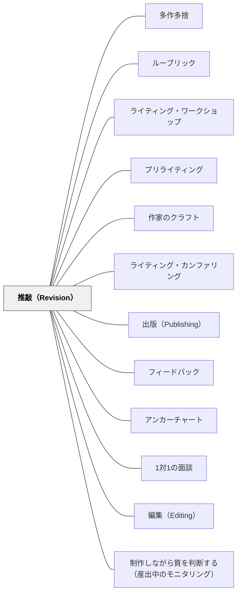

# 推敲（Revision）

> 推敲は「誤字を直すこと」ではない。推敲は「もう一度見ること（Re-vision）」——一歩下がって「これは言いたいことを言えているか？組み立てはよいか？流れているか？」を問う行為である。

---

## Pattern Connection

**出典**: Muschla, G. R.（2006）*Writing Workshop Survival Kit* (2nd ed.). Jossey-Bass.（統合：2026-05-19）

- **既存パタンとの関連**：[[パタン/ライティング・ワークショップ]] の書く時間（起草）の後に来る段階。[[パタン/フィードバック]] の「自分の作品への自己フィードバック」の最も具体的な形。[[パタン/作家のクラフト]] で学んだ技芸要素（書き出し・見せる描写・声）を実際の草稿に適用する機会
- **補強された点**：推敲と編集の区別——「内容・構成・声の改善（推敲）」と「表記・文法の修正（編集）」は別の作業であり、別の時間に行う。この順序を守ることで、子どもたちが最初から誤字修正だけで終わる「偽の推敲」をしなくなる
- **拡張された点**：Unity・Order・Conciseness の3原則は、「何をどう見直すか」を言語化したもの。この3語を子どもたちが使えるようになることで、「もっと詳しく書いて」という漠然とした指示から脱却できる
- **他のパタンへの波及**：[[パタン/ライティング・カンファリング]] の中核は推敲を支援すること。[[パタン/推敲（Revision）]] が機能するには [[パタン/心理的安全性（コンフォートゾーン）]]（旧「安心基地」を統合）が前提——「書いたものを変えることは失敗ではない」という文化が必要

---

### 俵万智（2004）考える短歌 統合（2026-06-02）：添削プロセスの可視化——「削って書き換える」推敲の実例集

俵万智の『考える短歌』は全8講を通じて「原歌→添削後」を並置する。この形式そのものが推敲の「前後を見せる」ことの実演であり、推敲指導の教材として直接使える。

**添削が示す推敲の観点：**

書き手の盲点（推敲で見つけるべきもの）として俵万智が繰り返し指摘するのは：

1. **「作者にとって自明な語」**：主観的形容詞（「嬉しい」「寂しい」「悲しい」）は書き手には意味が明確でも、読者には「その人にとってどんな感じか」が届かない。推敲でこれを見つけて削り、情景描写に置き換える
2. **焦点のぼけた語**：「も」「の」などのあいまいな助詞は書くときに気づきにくい。音読（声に出して読む）することで「ここが引っかかる」という感覚が生まれやすい
3. **重心の分散**：体言止めが複数・動詞が4つ以上——「どこに着地するかわからない」という状態。推敲で「どこに重心を置くか」を決める

**「前後を並べる」添削技法の教育的使用：**

- 俵万智が「原歌→添削後→なぜこう変えたか」を3段階で示す形式は、推敲のモデリングとして授業にそのまま使える
- 「どこが変わったか」「なぜ変えたか」を読み取る活動が、子どもたちの推敲眼を育てる

**Muschlaの3原則（Unity・Order・Conciseness）と俵万智の対応：**

| Muschlaの観点 | 俵万智の観点 | 主な操作 |
|---|---|---|
| Unity（統一感） | 比喩の統一感・体言止めは1つ | 複数の比喩・重心の分散を削る |
| Order（順序・流れ） | 句切れ・初句のつかみ | 切断位置と印象の設計 |
| Conciseness（簡潔さ） | 副詞を削る・主観的形容詞を削る | 余分な語を削って鮮明さを出す |

- **既存パタンとの関連**：本パタンの「Unity・Order・Conciseness」に、俵万智の8講が和語の具体事例と「削る」という視点を補う。特にConciseness（簡潔さ）が「副詞・主観的形容詞・あいまいな助詞を削る」という操作として具体化される
- **補強された点**：「推敲の観点を言語化する」ことの重要性を、俵万智の講座形式（なぜそう直すかを言葉で説明する）が具体的に示す
- **他のパタンへの波及**：[[パタン/作家のクラフト]] — 添削で学ぶ技芸要素；[[パタン/引き算＞足し算（教材）]] — 推敲の主要な操作が「削ること」である

[[文献/考える短歌（俵万智）]]

---

### 岩井輝久実践（2025-01-16）——「一行おき書き」と「作文も問題解決」

澤田英輔による授業観察記録（2025年1月16日）から、2年生の作家の時間における推敲指導の実例。

**一行おきに書く（推敲の余白）：**
ミニレッスンの内容は「一行おきにノートを書くこと」。子どものノートをモニターに映し、後から加筆・修正するために一行おきに書くことを伝えた。

> 「文章を書くときに一行おきに書くって、大事だよなー。」——澤田英輔（観察記録, 2025-01-16）

一行おき書きは「推敲の前提としての余白」を物理的に確保する技法。推敲記号のキャレット（^）・取り消し線・加筆が実際に書き込める余白がなければ推敲は絵空事に終わる。「後で直せる」という前提があって初めて「まず書く」に集中できる。

**「作文も問題解決」——推敲の再フレーミング：**
岩井のミニレッスンでの言葉：「作文も問題解決なんだよね。作文も算数や絵を描くことと似てて、絵を見て、寂しかったらつけ足すでしょ？作文でも音読したらあとで直したり付け足したりするんだよね」

「推敲 = もう一度見て不足を補う問題解決」という再フレーミングは、「推敲 = 誤字修正」という誤解を解くだけでなく、すでに子どもが知っている「問題解決」という概念と接続することで、推敲のプロセスを直感的に理解させる。絵を描いて「ここが寂しい→付け足す」という体験は、「作文を読んで→寂しい場所を探す→付け足す」という推敲の構造と同一である。

- **既存パタンとの関連**：Unity・Order・Conciseness の3原則が「何を変えるか」を言語化するとすれば、「作文も問題解決」は「なぜ変えるか」を動機づける再フレーミングとして機能する
- **補強された点**：「一行おき書き」が推敲の物理的前提として機能する。Revision Marks（キャレット・取り消し線）の使用を現実化する最も具体的な準備
- **他のパタンへの波及**：[[実践/作家の時間（2年生）]] — 本統合の出典実践；[[パタン/書きかえまねっこ（段階的足場の選択制）]] — モデル文→書く→一行おきで推敲する一体の流れ

---

## 背景（Context）

書くことの教育において、「書いた後」の指導が最も難しい。多くの教室で起きていること：子どもたちに「推敲しましょう」と言うと、誤字を直す・句読点を確認する・字をきれいに書き直す——これらで終わる。これは推敲ではなく「清書」か「編集」である。

推敲（Revision）の語源はラテン語の *re-visio*——「もう一度見る（re-see）」こと。起草（Draft）で書いたものを、意図・内容・構成・声の観点から捉え直し、より伝わるものへ変えていく行為である。

Nancie Atwell（1998）は「推敲は作家が作家になる場所だ」と言う。書いたものをもう一度見ることができる書き手は、表現を自分でコントロールできるという感覚——書き手のアイデンティティ——を育てる。

## 問題（Problem）

- 「推敲してください」と言われた子どもたちは誤字修正をして「終わった」と言う
- 推敲の観点（何をどう見直すか）を教えていないため、「何をすればいいか分からない」
- 自分が書いたものを変えることへの抵抗——「もう書いた」という達成感が、改善への動機と対立する
- 「内容の改善（推敲）」と「表記の修正（編集）」を同時にやろうとすると、どちらも浅くなる

## 力のかたち（Forces）

- 推敲は「書いた後」に始まるが、プリライティングと起草の質が推敲の深さを決める
- 「推敲するほど良くなる」という経験が、次の作品への推敲意欲を生む
- 推敲の観点（Unity・Order・Conciseness）を知ることで、「何を変えればいいか」が具体化される
- 推敲を一人でやると「見えなくなる」——時間を置く・読み上げる・仲間に聞く、という外部化が有効
- 推敲と編集を分けることで、それぞれに集中できる

## 解決（Solution）

**Unity・Order・Conciseness の3原則で推敲する観点を与え、推敲（内容・構成・声の改善）と編集（表記・文法の修正）を別の作業として順序を守って行う。推敲には自己評価・ピア推敲・カンファリングという3つの形態を使い分ける。**

---

### 推敲の3原則（Unity・Order・Conciseness）

Muschla（2006）が提示する推敲の3つの問い：

| 原則 | 問い | 見直すポイント |
|------|------|-------------|
| **Unity（統一性）** | 全ての文・段落がメインアイデアを支えているか？ | 話題が逸れている部分・余分なエピソードを削る |
| **Order（順序）** | 情報は最も伝わる順序で並んでいるか？ | 段落の入れ替え・場面の順序の再構成 |
| **Conciseness（簡潔さ）** | 不必要な語・文・段落がないか？ | 繰り返し・言い換えすぎ・脱線を取り除く |

この3原則を**アンカーチャートにして教室に掲示する**ことで、推敲の時間に子どもたちが自分で参照できる。

---

### 推敲と編集の分離

| 段階 | 作業 | タイミング |
|------|------|----------|
| **推敲（Revision）** | 内容・構成・声・語選択の改善 | 起草の後、最初に行う |
| **編集（Editing）** | 文法・句読点・誤字・表記の修正 | 推敲が終わった後に行う |

**なぜ分けるか**：両方を同時にやろうとすると、表記修正が先に目に入り、内容の改善が後回しになる。「まず作品を良くする、その後に正しくする」という順序を体験として繰り返すことで、推敲の本質が身につく。

---

### 推敲記号（Revision Marks）

| 記号 | 意味 | 使い方 |
|------|------|-------|
| `^` （キャレット）| 挿入 | 追加したい語や文の場所に印をつけ、欄外に書く |
| 取り消し線 | 削除 | 削除する語・文に横線を引く（消さずに残す） |
| → 矢印 | 移動 | 段落を別の場所に移動することを示す |
| 切り貼り | 大きな構造変更 | 段落単位で切り離し、順序を変える |

「取り消し線で消す（白く消さない）」が重要——消えた部分も後で読み返せるようにしておく。

---

### 推敲の3形態

**① 自己推敲（Self-Revision）**

一人で行う推敲。有効な手法：
- **音読推敲**——声に出して読む。「変だ」と感じる部分が自然に分かる。読んでいて詰まる場所＝書き直しの候補
- **時間を置く**——書き上げてすぐに推敲せず、次の日に読み返す。「他人の目」に近くなる
- **自己評価チェックリスト**——Unity・Order・Conciseness の3原則を確認項目として使う

**② ピア推敲（Peer Revision）——Author/Listener 法**

ペアで行う推敲カンファリング：

| 役割 | 行動 |
|------|------|
| **Author（書き手）** | 自分の作品を読み上げる。作品を見せない——音だけで聞いてもらう |
| **Listener（聞き手）** | 「聞いて分かったことは…」と要約して確認する |
| **Listener** | 「もっと知りたいのは…」「この部分がよく分からなかった」と問いを出す |
| **Author** | 聞き手の反応を聞く——指示ではなく「気づき」として受け取る |
| 役割交代 | 同じ手順で逆の役割をする |

聞き手が「ここを直して」と指示しない——「私には〜〜が聞こえた」「〜〜の部分がもっと知りたい」という「読者の反応」を伝える形にすることで、書き手が自分で判断する余地が生まれる。

**③ カンファリングによる推敲支援**

教師や仲間との1対1の会議の中で推敲が支援される。詳細は [[パタン/ライティング・カンファリング]] を参照。

---

### 推敲のためのチェックリスト（6+1 Traits 系）

自己評価・ピア評価両方に使える：

| 観点 | 確認する問い |
|------|------------|
| **焦点（Focus）** | 作品に一つの明確なメインアイデアがあるか |
| **内容（Content）** | 十分な詳細・具体例・証拠があるか |
| **構成（Organization）** | 書き出し・展開・終わりが論理的に流れているか |
| **声（Voice）** | この文章は書き手の個性が感じられるか |
| **語の選択（Word Choice）** | 正確で鮮やかな語が使われているか |
| **文の流暢さ（Sentence Fluency）** | 文の長さとリズムに変化があるか |

このチェックリストは推敲の段階で使う。編集のチェックリスト（文法・句読点）は別に持つ。

---

### 推敲とミニレッスン

推敲のスキルはミニレッスンで指導できる：

- **「音読推敲」ミニレッスン**（5分）：自分の作品を読み上げ、詰まった場所に印をつける。その場で1文を書き直す体験
- **「切り貼り推敲」ミニレッスン**（10分）：段落を物理的に切り離し、最良の順序を探す——体を使う推敲
- **「Unity テスト」ミニレッスン**（10分）：各段落が「メインアイデアを支えているか」をYes/Noで確認し、Noの段落を削るか書き直すかを決める

---

## 結果（Consequences）

- 子どもたちが「推敲した」と言うとき、誤字修正ではなく内容・構成・声の改善を指すようになる
- Unity・Order・Conciseness という言語が生まれることで、カンファリングで「具体的な問い」が生まれる
- 音読推敲の習慣がつくと、「文章が変だ」を自分で感じる感覚が育つ
- ただし推敲のスキルは一度教えれば身につくものではなく、作品を書くたびに繰り返し経験することで徐々に定着する

## 関連パタン
- [[パタン/多作多捨]]
- [[実践/言葉をよりすぐって俳句を作ろう]]
- [[実践/俳句と短歌を楽しもう]]
- [[パタン/ルーブリック]]

- [[パタン/ライティング・ワークショップ]] — 推敲が位置づく授業構造（起草の後・編集の前）
- [[パタン/プリライティング]] — 書く前の準備が推敲の深さを左右する
- [[パタン/作家のクラフト]] — 推敲の中で技芸要素を意識的に改善する
- [[パタン/ライティング・カンファリング]] — 推敲を支援する1対1の書く会議
- [[パタン/出版（Publishing）]] — 出版という本物の読者の存在が推敲の動機を生む
- [[パタン/フィードバック]] — 自己評価・ピア評価・教師フィードバックの統合
- [[パタン/アンカーチャート]] — Unity/Order/Conciseness をチャートで教室に掲示する
- [[パタン/1対1の面談]] — ライティング・カンファリングの基盤パタン
- [[文献/Writing Workshop Survival Kit（Muschla）]] — 本パタンの一次資料
- [[文献/考える短歌（俵万智）]] — 添削プロセスの可視化・削る観点の実例集（俵万智, 2004）
- [[パタン/編集（Editing）]] — 姉妹パタン。推敲が終わった後の最終段階。表記の規約を読者のために整える
- [[パタン/制作しながら質を判断する（産出中のモニタリング）]] — 推敲が書き終えた後に見るのに対し、こちらは書いている最中に見る（Sadler, 1989）

---

## クラスター図

## Actionable Insight

- **「推敲＝誤字修正」を解体する1回のミニレッスンを試す**——「推敲と編集は違います」と言うだけでなく、「今日は誤字を直さないで、内容だけを見直します」という制約を与えた推敲時間を1回設ける。この経験が「推敲とは何か」を体験させる
- **「音読推敲」を導入する**——「自分の作品を静かに声に出して読んでください」——詰まった場所に鉛筆で印をつけ、その1文だけ書き直す。10分でできる
- **Unity テストを1回やってみる**——「あなたの作品のメインアイデアは何ですか」と聞く。その後「この段落はそのメインアイデアを支えていますか？」を各段落に確認させる。支えていない段落が見つかることが推敲の入口になる
- **Author/Listener ペアを一度設ける**——「聞いて分かったことは〜〜」「もっと知りたいのは〜〜」の2つの文だけをフォーマットにして、ペアで読み合う。フォームのシンプルさが対話を深くする

---

## 出典

Muschla, G. R. (2006). *Writing Workshop Survival Kit* (2nd ed.). Jossey-Bass.
Atwell, N. (1998). *In the Middle: New Understandings About Writing, Reading, and Learning* (2nd ed.). Heinemann.
Calkins, L. (1994). *The Art of Teaching Writing* (2nd ed.). Heinemann.

> "Revision is not editing. Revision means 're-seeing' your work—stepping back and asking: Does this say what I mean? Is it organized? Does it flow?"

> "Revision is where writers become writers." —Nancie Atwell
