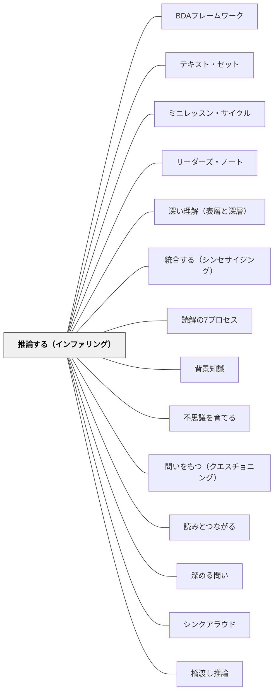

# 推論する（インファリング）

> 書かれていないことを読む——背景知識 ＋ テキストの手がかり ＝ 推論。

## [Pattern Connection]

Harvey & Goudvis（2007）の **Strategies That Work** が提唱する "Inferring" は、テキストに明示されていない意味を読者が能動的に構成する読解ストラテジー。これは [[パタン/橋渡し推論]] の「テキスト間の関係を補う推論」を、読書指導の実践として具体化したものである。

- **補強点**：[[パタン/経験から出発すること]] に「読者の背景知識がテキスト理解の基盤になる」という具体的な読書論を提供する
- **拡張点**：「推論」と「予測」の違いを明示することで、子どもたちが自分の思考を正確に認識できるようになる
- **他のパタンへの波及**：[[パタン/読みとつながる]]・[[パタン/深める問い]]・[[パタン/シンクアラウド]]

Debbie Miller（2002）の **Reading with Meaning** は「Inferring at a Glance（推論の要点）」を子ども向けに整理することで、低学年でも推論の概念を使いこなせることを示す。Miller は推論と予測の関係を「予測は推論の一部だが、推論はそれより大きい」と捉える（"Prediction is a piece of it, but our hunches were right: there is more to it."）。予測を推論の中に位置づけたうえで、推論がそれより広い思考であることを示している。[[実践/カンファリング（読書会議）]] において推論は最もよく現れるストラテジーの一つでもある。

**Miller（2002）推論指導の詳細（2026-05-18追補）：**

- **コリーとホワイトの電話修理**：授業前にコリーとホワイトが壊れた携帯電話を修理しようとしている。うまくいかない。ホワイトが2列ノート用紙を取り出して「電話の推論をしよう！」——この実際の出来事が「推論は学校の外でも使う」という生きたモデルになった
- **Chryse Hutchins のワークショップ**：PEBC のスタッフデベロッパーとのワークショップで、Miller 他が「推論と予測の違い」を初めて本気で考えた——「推論は予測より大きい」という直感を持ちながら、正確に説明できなかった。推論の定義（Anderson & Pearson, 1984）：推論 = すべての学習者の意味構築の核心
- **語の意味推論の2列チャート**：「語（Word）／推論した意味／何が役立ったか」の3列チャート。読み終わったら用語集で確認し、Confirmed（C）か Contradicted（C＋×）を記録
- **子どもの言葉**：コリン（「推論は頭から頭へとつながるワイヤー——みんなで一緒に推論するとき、考えが繋がっていく」）、ライリー（「推論はどこにでもついてくる——人生の謎を解くためにも使う」）、フランク（「推論は常にそばにいる」）、ニーナ（「なぜ？と思ったとき、本が教えてくれないならスキーマとテキストの手がかりで推論」）、マディソン（「推論はスキーマとつながりとメンタル・イメージを全部使って合わせる、今まで一番大きいストラテジー」）、ジャスティン（「犬も推論する——リードを取り出したらお散歩と推論して飛び跳ねる！」）
- **廊下への謎詩掲示**：Georgia Heard の詩を使った劇的解釈の後、子どもたちが自分でなぞなぞ詩を書いてライターズ・ワークショップに。廊下に答えなしで掲示→通行人が推論→1週間後に答えを書き加える

**Collins（2004）統合（2026-05-24）：**

*Growing Readers* は推論を「思考しながら読む」Chapter 6 の中で扱い、小学1年生レベルでの推論指導の具体像を示す。低学年での推論はTS（text-to-self）接続を深めることから始まる。

- **具体例（Francesとの推論カンファランス）**：FrancesがHenry and Mudge and the Careful Cousinを読み、sticky noteに「Like Ne Ne」と書いた。Collinsは「それはどういうつながり？」→「Ne Neも汚したくない」→「そのつながりはHenryの気持ちをどう理解させてくれる？」→「Henryはきっとうんざりしている……」という会話を通じて、**表面的なTS接続（同じ経験がある）から深い推論（キャラクターの気持ちを推察する）へ**と移行させた。「そのつながりは物語の理解をどう助ける？」という問いが鍵
- **補強された点（接続の深化）**：本パタンに記述されているTS/TT/TWの接続は、「接続を言えること」が目標ではなく「接続が物語理解を深めること」が目標——Collinsのカンファランスはその移行を示す実践例
- **拡張された点（予測の質）**：Collinsが読み聞かせの途中でパートナーと予測を話し合わせると、「ジュニーBはディズニーランドに逃げると思う」と言う二人組がいた——家出すると言っただけの主人公のことばをそのまま受け取り、その予測が現実的か、ジュニーBの人柄やこのシリーズの話の運びに合うかを考えていなかった。Collinsは「予測はどれも同じではない」と学んだと書く。別の日、*Little Polar Bear Finds a Friend* の読み聞かせで、氷山から足を垂らしている白くまの子の絵を見た子が「サメに食べられちゃう！」と言うと、Zoeが「そうはならないよ。そういう本じゃないもの」と返した——この本の中で作者が作っている世界と、子どもの本の話の運びについての知識から予測を退けたのである。本文の手がかりにもとづく予測の仕方は、低学年から指導できる
- **拡張された点（监理解モニタリングとの接続）**：わからなくなったとき「Huh?」と止まることは推論の前提条件——理解が崩れた箇所に戻り、どこで推論が切れたかを確かめることが推論力の実践的な使い方になる

---

**今井むつみ・秋田喜美（2023）言語の本質——アブダクション推論が「インファリング」の認知科学的基盤：**

Harvey & Goudvis の「BK + TC = I（背景知識＋テキスト手がかり＝推論）」という方程式は、読書指導の実践形式として推論を示す。一方、今井・秋田（2023）はその**認知科学的メカニズム**を「アブダクション推論」として特定する。

**アブダクション推論こそが「インファリング」の正体：**
テキストに書かれていないことを読み取る推論（インファリング）は、認知科学的に見ると「最もらしい説明仮説を立てる」アブダクション推論そのもの。「登場人物はなぜそうしたか」「この語はどういう意味か」を推論するとき、読者は「最もよく説明できる仮説H」を生み出している。

**演繹・帰納・アブダクションの区別が読解指導に与える示唆：**

| 読書中の推論 | 推論形式 | 特徴 |
|---|---|---|
| 「〇〇は次にこうする」という予測 | 帰納（パターンから） | 規則の適用——新しい仮説は生まない |
| 「なぜそうしたか、最もよく説明できる理由は？」 | **アブダクション** | 最もらしい仮説を新しく生み出す |
| 「仮説Hが真なら、次にこうなるはず」という検証 | 演繹 | 仮説の確認 |

インファリングを予測より大きなものとして捉える（Miller, 2002）ことの根拠の一つは、予測が「帰納的」であるのに対し、深い推論が「アブダクション的」だという認知の違いにある。

**子どもの言語習得における「アブダクション読解」：**
子どもが文脈から語の意味を推論するとき、まさにアブダクションが起きている。「Pullman porter」という語の意味を挿絵の手がかりから推論する活動（Harvey & Goudvis のベッシー・コールマンのレッスン）は、「BK + TC = I」という方程式を超えて、「最もらしい意味仮説を立てる」アブダクション推論の訓練でもある。

**「誤りが学習を進める」という逆説：**
今井・秋田（2023）は「誤りを犯すリスクがある推論こそが新しい知識を生む」と論じる。読書中に「I-（否定された推論）」が起きたとき——つまり推論が外れたとき——それは読解が深まるチャンスである。「なぜ外れたか」を問う経験こそが推論力を育てる。

**補強点**：推論の「正解/不正解」より「根拠があるか」を重視するという本パタンの立場が、アブダクションの認知科学的根拠によって裏付けられる。

**波及するパタン**：[[メタパタン/アブダクション（仮説形成）]] — インファリングの認知科学的基盤；[[パタン/記号接地（Symbol Grounding）]] — 語彙推論は記号接地の過程；[[文献/言語の本質（今井むつみ・秋田喜美）]] — 本統合の出典

---

## 背景（Context）

熟練した読者は、テキストが明示しないことをたえず補いながら読む。登場人物の動機、語られていない事実、行間に込められた感情——これらはすべて「推論」によって意味が構成される。しかし多くの子どもたちは「書いてあること」だけを答えようとし、書いていないことに気づかない。

Harvey & Goudvis は「推論」をすべての読解ストラテジーの中で最も複雑で、最も重要なものの一つと位置づける。そして推論のプロセスを次の方程式で示す：

**BK（Background Knowledge）＋ TC（Text Clues）＝ I（Inference）**

背景知識がなければ推論できず、テキストの手がかりに気づかなければ推論は起きない。どちらか一方だけでは不十分で、両者が出会ったときに推論が生まれる。

## 問題（Problem）

読後の問いに「テキストに書いてあること」だけを答えさせる指導では、子どもたちは「行間を読む力」を育てない。また「予測（Prediction）」と「推論（Inference）」を混同すると、論拠のある推論ではなく根拠のない想像になる。

## 力のかたち（Forces）

- 推論はテキストと読者が共同で生み出す意味——どちらが欠けても起きない
- 「予測」は「これから何が起きるか」、「推論」は「このテキストが何を意味するか」——区別することで思考が精緻化される
- 「行間を読む問い（Beyond-the-line questions）」が推論の練習機会になる
- 推論は「正解か不正解か」より「根拠は何か」を問うことが大切

## 解決（Solution）

**テキストに書かれていないことに気づき、自分の背景知識とテキストの手がかりを意識的に組み合わせることで意味を構成する。**

---

具体例①：「Tight Times」での推論（Harvey & Goudvis より）

Tight Times という本の最後で、父親が就職できたかどうかが明確に書かれていない。Curtis（生徒）は「書いてないけど、父親は職を見つけたと思う。だってお父さんがチャートを見ていた顔を描いた絵があって、それが笑顔だったから」と言った。

これはテキストの手がかり（笑顔の絵）＋背景知識（笑顔＝嬉しいことがある）という推論の典型例。

先生のシンクアラウド：
> 「私も同じことを推論しました。でも Curtis が教えてくれたのは絵の手がかり。私は文章の方から手がかりを見つけていた。同じ推論でも、手がかりが違うのは面白い」

---

具体例②：「Beyond-the-line questions（行間を読む問い）」

1〜2語で答えられる問い（閉じた問い）:
- 「主人公の名前は？」→ テキストに書いてある → 推論不要

行間を読む問い（開いた問い）:
- 「登場人物はなぜそうしたと思う？」
- 「この場面でこの人はどんな気持ちだったと思う？テキストには書いていないけど」
- 「この物語が伝えたいことは何だと思う？」

教師の問い方：「テキストには書いていないけど、あなたはどう思う？根拠は何？」

---

具体例③：「Inferring at a Glance」——子どもへの要点整理（Miller より）

Miller（2002）は推論の章の終わりに、Keene と PEBC のものをもとに、子どもにとっての要点（What's Key for Kids?）を5点にまとめている：

1. **知らない言葉の意味を考える**——スキーマ（知っていること）、文や絵の手がかり、読み返し、人との話し合いを使う
2. **予測して確かめる**——予測を立て、読み進めながら確かめたり打ち消したりする
3. **結論や解釈を引き出す**——知っていることと本文の手がかりから、結論や自分なりの解釈を作る
4. **答えが書いていないときに推論する**——問いの答えが本文にはっきり書かれていないとき、推論すればよいと分かっている
5. **解釈で読む経験を深める**——解釈を作って、本を読む経験を豊かにし深める

このチャートを [[パタン/アンカーチャート]] として教室に貼り、読書中に参照する。

---

具体例④：推論コーディングの使い方

読みながら付箋に「I」（Inference）と書き、自分の推論を一言添える：

```
I — 「主人公は怒ってると思う。笑っていないから」
I — 「この国は貧しいんだと思う。食べ物がないから」
```

後で「この I の根拠はどこから来た？」と問い返すことで、BK なのか TC なのかを整理できる。

---

具体例⑤：語彙の推論（Bessie Coleman レッスン）

ノンフィクション読書で知らない語に出会ったとき、推論の方程式 BK + TC = I を「語彙推論」として使う。Harvey & Goudvis は、3年生担任の James Allen が絵本 *Fly High: The Story of Bessie Coleman*（女性として初めて、かつアフリカ系アメリカ人として初めてのパイロットの物語）で行ったレッスンを紹介する。読み聞かせの途中で「Now Walter was a fine Pullman porter.」という文に子どもたちの手が挙がる。James は読み進めても読み返しても意味が分からなかったので、ページ上の挿絵——制服の男性がかばんを持ち、若い女性が列車から降りるのを手伝っている——を手がかりに、「乗客の乗り降りのときに荷物を運ぶ鉄道の係」と推論してみせた。手がかりは文だけでなく、絵にもある。

**4列シート（Word / Inferred Meaning / Clues / Sentence）を使った語彙推論**（クラスで作ったアンカーチャート）：

| 語（Word） | 推論した意味（Inferred Meaning） | 手がかり（Clues） | 文（Sentence） |
|---|---|---|---|
| Pullman porter | 荷物を運び、乗客を手伝う鉄道の係 | 挿絵 | The Pullman porter helped the woman off the train. |
| manicurist | 爪を整える人 | 読み進める | A manicurist trims nails. |
| The Defender | 何かの名前 | 大文字 | The Defender was a Chicago newspaper. |

最後の「文」の列は、語が分かったことを示すために、子どもと一緒に書く。

**指導のポイント**：
- 知らない語を辞書で引く前に「テキストの手がかりから意味を推論してみる」——辞書は確認のために使う
- 推論した意味と辞書の意味を比べることで、「推論の精度を評価する」経験ができる
- BK（語に似た語を知っているか）と TC（文脈から分かる手がかり）の両方を意識させる

---

具体例⑥：テーマの推論（Teammates レッスン）

Peter Golenbock の絵本 *Teammates*（Jackie Robinson と Pee Wee Reese の友情の話）を使ったテーマ推論のレッスン。

**2列チャート（Evidence from the Text / Themes）でテーマを推論する**：5年生の教室での例（根拠は「言葉・行動・絵」から取る）

| テキストからの根拠（Evidence from the Text） | テーマ（Themes） |
|---|---|
| Jackie は決してやり返さなかった（監督は、やり返さない自制心をもつ人を探していた） | 自制心（self-control） |
| Jackie には友だちが一人もいなかった。誰もそばに座らず、話しかけなかった | 孤独（loneliness） |
| Pee Wee は彼の友だちだった／チームのほとんどは、彼が黒人だという理由で友だちにならなかった | 友情・人種差別（friendship / racism） |

**指導の流れ**：
1. 前日に「筋（plot）」と「テーマ（theme）」の違いを、よく知っている昔話で確かめておく
2. 教師が読み聞かせながら考えを声に出し（シンクアラウド）、推論したテーマと根拠を2列のアンカーチャートに書いてみせる
3. 読み終えたら、根拠にもとづいてテーマを話し合う——この教室では話し合いが45分近く続き、人種の不平等・隔離・怒り・立場を取ること・勇気など、テーマと根拠の長いリストになった
4. 翌日、同じ見出しのシートを配り、子どもが読み返してテーマと根拠を書き込む

---

具体例⑦：I+/I- コーディング（確かめられた推論・否定された推論）

読み進む中で「推論が当たったか・外れたか」を確認するコーディング：

```
I — 「父親は仕事を見つけたと思う（笑顔の絵から）」
→ 読み続けたら「父親が新しい仕事に就いた」と書いてあった
→ I+ （確かめられた推論）

I — 「この子は悲しいと思う（泣いているから）」
→ 読み続けたら「嬉しくて涙が出た」と書いてあった
→ I- （否定された推論）
```

**意図**：推論は「正解か不正解か」でなく「根拠があるか」が大事——しかし読み続けることで推論が確かめられたり修正されたりすることを体験させる。I- が出たとき「なぜ違ったか」を考えることが推論能力を高める。

---

## 結果（Consequences）

- 「書いてあることを答える」から「書いていないことを考える」という読書の転換が起きる
- 子どもたちが「自分の考えに根拠を持つ」ことを習慣にする
- 推論を共有することで、同じテキストから異なる意味を引き出す体験ができる
- フィクション・ノンフィクション・詩・説明文など、テキスト種類に関わらず応用できる

## 関連パタン
- [[実践/リーダーズ・ノートの起動]]
- [[実践/テキストコーディング]]
- [[パタン/BDAフレームワーク]]
- [[パタン/テキスト・セット]]
- [[パタン/ミニレッスン・サイクル]]
- [[パタン/リーダーズ・ノート]]
- [[パタン/深い理解（表層と深層）]]
- [[パタン/統合する（シンセサイジング）]]
- [[パタン/読解の7プロセス]]
- [[パタン/背景知識]]
- [[パタン/不思議を育てる]]
- [[パタン/問いをもつ（クエスチョニング）]]

- [[パタン/読みとつながる]] — 背景知識（BK）はつながりから生まれる
- [[パタン/深める問い]] — 「行間を読む問い」は深める問いの実践形態
- [[パタン/シンクアラウド]] — 推論の思考過程をモデリングする
- [[パタン/橋渡し推論]] — 命題間の関係を補う推論の理論的基盤
- [[パタン/メタ認知的モニタリング]] — 「自分は推論しているか？予測しているだけか？」の自己監視
- [[パタン/精緻化]] — 推論することは知識を精緻化すること
- [[パタン/アンカーチャート]] — 「Inferring at a Glance」チャートを教室に掲示する
- [[実践/カンファリング（読書会議）]] — 推論がカンファリングで最もよく現れるストラテジー
- [[パタン/会話から問いを引き上げる（Lifting a Prompt）]] — 対話から引き上げた問いの多くが推論（インファリング）を要求する

## クラスター図



## Actionable Insight

- 読み語りの後に「テキストに書いていないけど、〇〇について何か感じた？根拠は？」と1回問う——子どもたちの推論能力は「問われる」ことで育つ
- 「これは予測？それとも推論？」を教室の区別の言葉にする——「まだ起きていないことへの見通し」と「すでにあるテキストから読み取ること」の違いを体感で覚える
- 子どもが「I」の付箋を書いたら「手がかりはどこにあった？」と聞く——BK と TC の両方を意識化させる

## 出典

Harvey, S., & Goudvis, A. (2007). *Strategies That Work: Teaching Comprehension for Understanding and Engagement* (2nd ed.). Stenhouse Publishers.

> "Background Knowledge + Text Clues = Inference. It is a formula of sorts for inferring. When we infer, we take what we know and merge it with clues in the text to draw a conclusion."

Miller, D. (2002). *Reading with Meaning: Teaching Comprehension in the Primary Grades*. Stenhouse Publishers.

> "So what is inferring? Prediction is a piece of it, but our hunches were right: there is more to it."

[[文献/Strategies That Work（Harvey & Goudvis）]]
[[文献/Reading with Meaning（Miller）]]
