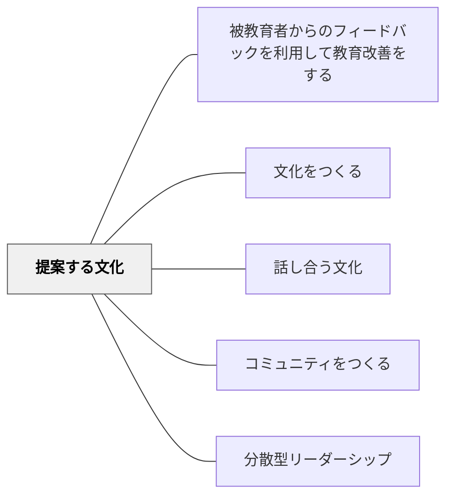

# 提案する文化

> 主体的に提案していく習慣が、学習者を能動的な市民にする。

## [Pattern Connection]

**小倉勝登（2020）統合（2026-05-21）——提案文化が育ったクラスの具体的な変容：**

本パタンは動画記録を出典として作成されたが、小倉（2020）の実践事例が具体的な根拠を与える。

**「提案しよう」約束が浸透したクラスで実際に出た子どもの発言**：

授業中：
- 「グループで話し合う時間をください」
- 「もう少し調べる時間をください」
- 「作戦会議を開きたいです、時間をください」

学校生活：
- 「練習の様子をビデオに撮って見てみたいです」
- 「お楽しみ会を開いて、みんなの得意なものを発表する時間をとれませんか？2時間必要です」
- 「跳び箱の3段の場所をつくってもいいですか」

**提案文化が変えるもの**：「先生、次は何をすればいいですか？」が「グループで話し合う時間をください」に変わる。学習者が指示を待つ存在から学習を設計する存在へと変わる。

**「作戦会議」が文化になった事例（台風の目・運動会）**：
1. 子どもから「作戦会議を開きたいです」と提案
2. 教師は録画映像を見せて「ポイントがわかるかな？」と問う
3. 子どもたちが自分で気づく（ノーミス・集まる・声かけ）
4. 教師は答えを知っていても「みんなはどうしたいの？」と問い返すだけ
5. 優勝後：子どもたち同士で抱き合って喜ぶ。以後「作戦会議」が学級の文化になる

**「提案を受け取る教師」の姿勢の重要性**：「提案しよう」という宣言が最初にあっても、教師が提案を「できない理由」で返し続けるとすぐに提案文化は萎む。「ありがとう、考えます」という受け取りと、翌日「あの提案、考えました」という報告のセットが不可欠。

- **既存パタンとの関連**：[[パタン/35プラス1]] — 学期はじめの6つの約束の第3番が「提案しよう」。学級の憲法として最初に言語化されることで土台ができる。
- **他のパタンへの波及**：[[パタン/授業の縦糸と横糸]] — 提案文化が育つと「なぜ今日これを学ぶか」を子どもが問い始め、授業設計に協力者が増える。

---

## 背景（Context）

コミュニティは、参加者が受動的に与えられるだけでなく、自ら何かを提案・貢献するときに活性化する。学校においても、学習者が「自分がここをこう変えたい」「こんなことをやってみたい」と提案できる文化があると、学習への当事者意識が生まれる。

## 問題（Problem）

「先生が決める・生徒はそれに従う」という構造が当たり前になると、学習者は指示を待つ受動的姿勢を内面化し、主体的に考え行動する力が育ちにくい。

## 力のかたち（Forces）

- 提案には拒否されるリスクが伴う；安全な文化がなければ提案は生まれない
- 全ての提案を採用することはできない；却下の仕方が文化を決める
- 提案を「やらせる」ことと、真に提案できる文化は異なる

## 解決（Solution）

**提案することを期待し、受け止め、フィードバックし、一部を実際に実現することで、提案文化を育てる。**

実践例：
- クラス会議で「提案コーナー」を設ける
- 学習者が授業設計の一部を提案・決定できる仕組みをつくる
- 却下の場合も「なぜか」を説明し、次の提案への道を開く
- 採用された提案の成果をコミュニティで祝う

## 結果（Consequences）

- 学習者がクラスを「自分たちのもの」と感じるようになる
- 提案→実現のサイクルが自己効力感を育てる
- 教師が気づかない問題・可能性を学習者が発見するようになる

## 関連パタン
- [[パタン/被教育者からのフィードバックを利用して教育改善をする]]

- [[パタン/文化をつくる]] — 親パタン
- [[パタン/話し合う文化]] — 提案を話し合いで洗練させる
- [[パタン/コミュニティをつくる]] — 提案を受け止めるコミュニティ
- [[パタン/分散型リーダーシップ]] — 提案することがリーダーシップの一形態

## クラスター図

## Actionable Insight

- クラス会議に「提案コーナー」を設け、学習者が「こうしたい」を1文書いて持ち寄る機会を月1回作る——提案することが当たり前の習慣になることで主体性の土台が育つ
- 採用できない提案には「なぜか」を説明し「次の提案への道を開く」言葉を添える——却下の仕方が「また提案してみよう」という意欲を守るか壊すかを決める
- 採用された提案とその成果を学級全体で祝う——提案→実現のサイクルが学習者の自己効力感を育てる最も強力な体験

## 出典
- [[文献/社会科教師の授業・学級づくり「仕掛け学」（小倉勝登）]]

- 動画記録：[[文献/コミュニティオブプラクティスと文化をつくるパタン（動画記録）]]
