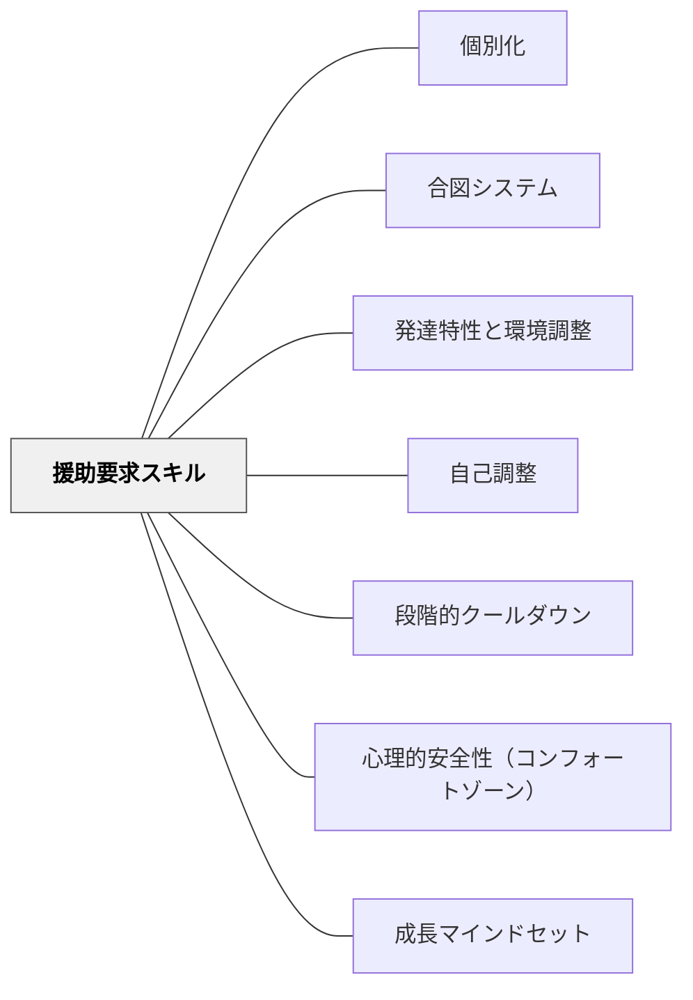

# 援助要求スキル

> 「助けてください」が言えない子の隣で、教師は何をデザインすべきか——「問題行動」と見える行動の多くは、援助要求スキルを身につける途上の段階から生まれている。

---

## Pattern Connection

**いるかどり（2023）統合（2026-05-20）**：

本パタンは、いるかどり（2023）の「援助要求スキル」概念を核に、既存の [[パタン/合図システム]] および [[パタン/自己調整]] とを接続して成立する。

- **既存パタンとの関連**：[[パタン/合図システム]]（Hammeken, 2007）が「援助要求の形式的な手段」（指1本で「助けが必要」）を設計するのに対し、本パタンはその背景にある「援助要求スキルの発達」そのものを扱う。合図システムは援助要求スキルを育てる足場として位置づけられる。[[パタン/自己調整]] との関係では、援助要求は「社会的リソースを活用する自己調整方略」（語攻略12方略の「③教師に聞く」「⑨友達と一緒に考える」に対応）の発達形態
- **補強された点**：「問題行動」と呼ばれる行動（騒ぐ・逃げる・暴言）の多くが、援助要求スキルの未獲得から来る「最終的な助けてのサイン」であることが明確になった。スキルとして教えることで根本的な解決につながる
- **修正・拡張された点**：援助要求スキルは「生まれつきある/ない」ではなく、**人的環境によって育つ**——教師・保護者・友達との関わりの積み重ねが援助要求スキルを形成する。環境が変われば発達する
- **他のパタンへの波及**：[[パタン/発達特性と環境調整]] — 援助要求スキルの育成は人的環境調整の核。[[パタン/段階的クールダウン]] — 感情が高まりそうなとき早期に援助要求できれば、クールダウン段階に入る前に介入できる

---

## 背景（Context）

「教えてください」「助けてください」などの援助要求は、人が社会の中で生きていくための基本的なコミュニケーションスキルだ。しかし発達上の理由や経験の不足から、援助要求スキルを獲得できていない子どもがいる。

いるかどり（2023）は、「問題行動」と呼ばれる行動の本質を次のように定義する：

> 「教師が『問題行動』と見る行動は、子どもたちからの最終的な『助けてのサイン』であり、その行動はその子の表現の形といえます」

援助要求スキルは成長とともに、保護者や教師や友達などとの関わりの中で身につけていく。つまり、**人的環境によって育つ**。

## 問題（Problem）

援助要求スキルが育っていないとき：

- 「困っている」「わからない」「つらい」という状態を、言葉で伝えられない
- 声を出すことへの心理的ハードルが高く、人前で「助けてください」と言うことが難しい
- 結果として、立ち歩く・騒ぐ・怒る・泣く・ものを投げるなどの行動が「表現の形」として表れる
- 教師はこれを「問題行動」として対処するが、根本的な解決にならないどころか、二次障害を誘発するリスクがある

## 力のかたち（Forces）

- 援助要求スキルは段階的に発達する——「まだ言葉で伝えられないから行動で示す」は発達の途上にある状態だ
- 援助要求スキルは**人的環境によって育つ**——「助けを求めたら応えてもらえた」という体験の積み重ねが次の援助要求につながる
- 「助けを求めることは恥ずかしい」「声に出すと周りの目が気になる」という心理が援助要求を妨げる
- 一方で、援助要求の手段（声・ジェスチャー・カード・合図）を明示的に教えると、子どもは使えるようになる
- 援助要求スキルが育つと、問題行動の多くは自然に減っていく

## 解決（Solution）

**援助要求スキルを「教えるべきスキル」として明示的に指導し、援助要求が起きやすい人的環境・物的環境を設計する。**

---

### 段階1：「問題行動」の背景を見直す

まず、「問題行動」に見えている行動を「援助要求スキルの途上段階」として再解釈する。

| 見える行動 | 援助要求の読み替え |
|-----------|----------------|
| 授業中に叫ぶ・走り回る | 「今の環境がつらい、助けてほしい」 |
| かんしゃくを起こす・暴言 | 「自分の思いを伝える言葉がない」 |
| 固まる・動けなくなる | 「何をすればいいか分からず途方に暮れている」 |
| ものを投げる・飛び出す | 「ここにいることがもうできない」 |

---

### 段階2：援助要求の手段を明示的に教える

「困ったときにどうするか」を事前に教え、練習する。

**言語的な援助要求**
- 「教えてください」「分かりません」「もう一度言ってください」などのフレーズを明示的に教える
- ロールプレイで練習する（「もし算数が分からなかったらどう言う？」）

**非言語的な援助要求**（声を出しにくい子に特に有効）
- ホワイトボードを常設し、書いて伝えられるようにする
- 小さなメモ（「困ったら〇〇先生に相談する」）を筆箱に入れておく

---

### 段階3：援助要求しやすい人的環境をつくる

援助要求スキルは人的環境によって育つ。教師の関わり方が最も大きな環境だ。

- 援助要求に素早く、静かに、目立たず応答する——「使っても無駄」と学習させない
- 「困ったら言っていいんだよ」というメッセージを繰り返し届ける
- 援助を求めることを「弱さ」ではなく「賢い選択」として価値づける
- 「〇〇さん、何か困ってる？」と教師から先に語りかける機会を作る（受動的な援助要求からの足場かけ）

---

### 段階4：「1日の流れを確認する」ルーティン

不安が大きい子どもには、「1日の始まりに一緒に確認する」ルーティンが有効。予定がわかると不安が減り、援助を求めやすくなる。

- 「今日どんな予定がある？」「心配なことある？」を朝に一対一で確認する
- 板書・カード・ホワイトボードで「今日やること」を可視化する

---

### 発達段階別の援助要求支援

| 段階 | 支援の方向 |
|------|----------|
| まだ言葉で伝えられない段階 | 行動の読み替え（「これは助けてのサインだ」）。代替手段（カード・合図）を先に準備 |
| 言葉は知っているが使えない段階 | ロールプレイで練習。使えたときにすぐ応答して強化 |
| 使えるが場面が限定される段階 | 「〇〇先生にも言っていいよ」と人を広げる。状況の一般化を支援 |
| 自然に使える段階 | 「今日、自分で言えた」という経験を振り返りで確認し、自信につなげる |

---

## 結果（Consequences）

- 援助要求スキルが育つにつれて、問題行動（叫ぶ・投げる・逃げる）が減っていく
- 「言葉で伝えられた」体験が自己効力感を育て、次の援助要求への動機になる
- 教師が「問題行動への対処」から「スキル育成」へと思考が転換する
- 援助要求スキルは学校だけでなく生涯にわたって機能する社会的スキルとなる
- ただし、援助要求スキルの発達には時間がかかる。即座の「問題行動消滅」を期待しないことが重要

## 関連パタン
- [[特別支援/特別支援で使えるパタン]]
- [[学級経営/心理的安全性]]
- [[実践/発達特性別の環境調整]]
- [[パタン/個別化]]

- [[パタン/合図システム]] — 援助要求の「声に出さない手段」を設計する
- [[パタン/発達特性と環境調整]] — 援助要求スキルは人的環境調整の核
- [[パタン/自己調整]] — 援助要求は「社会的リソースを活用する自己調整方略」
- [[パタン/段階的クールダウン]] — 援助要求が早期にできれば、クールダウンへの移行がスムーズになる
- [[パタン/心理的安全性（コンフォートゾーン）]] — 援助要求は心理的安全があってこそ起きる
- [[パタン/成長マインドセット]] — 「助けを求めることは強さ」という価値観が援助要求を促す
- [[文献/子どもの発達障害と環境調整のコツがわかる本（いるかどり）]] — 一次資料

## クラスター図

## Actionable Insight

- **「問題行動」を1つ選んで「何を助けてほしいのか？」に読み替えてみる**——騒ぐ・逃げるの背景に「どんな困り感があるか」を観察する。答えが見えると対処が変わる
- **今週1人の子どもと「困ったときのサイン」を1つ決める**——「困ったら指1本立ててね」だけでもよい。合図を使ったら必ず静かに応答する
- **「困ったら先生に言っていいよ」を授業のはじめに一言添える**——繰り返し届けることで「援助要求が許されている」という安心感が育つ
- **援助要求できた瞬間に「言えたね！」と認める**——行動直後の承認が次の援助要求を育てる

## 出典

いるかどり（2023）. 『子どもの発達障害と環境調整のコツがわかる本』ソシム.

> 「援助要求スキルは、成長とともに、保護者や教師や友達などとの関わりのなかで身につけていくものです。私たちをふくむ、人的環境によって育つことを理解しておく必要があります」——いるかどり（2023）
