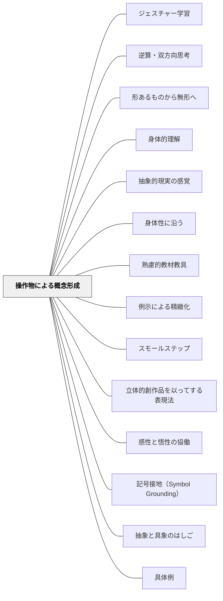

# 操作物による概念形成

> 触れて動かす経験が、記号では届かない概念の理解を身体に根付かせる。

## Pattern Connection

### ペスタロッチ（1801）ゲルトルート児童教育法——数・形・言語の三元素と実物の役割

ペスタロッチは本書で実物教授の哲学的根拠を「三元素」として体系化した：

- **三元素との接続**：「対象物のあらゆる外的特質の総和が、その輪郭の円形（形）と数の比例（数）において一体化され、言語を通じて私の意識となる」——実物・操作物を前にした子どもは必然的に「これはいくつか（数）」「どんな形か（形）」「何と呼ぶか（言語）」という三つの問いに向かう。操作物はこの三方向からの認識の出発点として機能する。
- **近さの法則**：「あなたを常に取り囲んでいるものは、あなたの五感にとって近いので明瞭かつ明確にすることは容易である」——身近な実物・操作物が感覚と概念の距離を縮め、「混乱した見解」を「明確な概念」へと導く起点となる。
- **知識と技能の並行発展**：ペスタロッチは「知識（洞察）」だけでなく「技能（Können）」の形成を強調した。操作物を使って「行動し、できるようになる」経験が不可欠である。
- **波及するパタン**：[[パタン/感性と悟性の協働]] — 直観教授の哲学的構造；[[文献/ゲルトルート児童教育法（ペスタロッチ）]] — 本統合の出典

---

### 牧口常三郎（1931）——実物教授の歴史的位置づけと「第三段階」への発展

牧口は *創価教育学体系 第3巻* において、実物教授の歴史的な位置を明確にしつつ、その「先」を示した。

**ペスタロッチの真価**：牧口はペスタロッチを「経験と学究的真面目の両面を具足した」教育改革者として高く評価した。ペスタロッチが実物・標本・模型による教授を切り開いたことは「教師本務の第二段階」を実現した歴史的業績である。

**しかし「実物教授」は通過点である**：牧口は実物教授を重要と認めながら、それが教師の本務の**最終段階ではない**と論じた。第三段階の教師は「教室に実物を持ち込む」のではなく、「自然・社会環境の中に学習者を連れ出し、環境そのものを教材とする」役割に移行する。

| 段階 | 実物・操作物の使い方 |
|---|---|
| 第二段階（ペスタロッチ） | 実物・標本・模型・操作物を教室に「持ち込む」 |
| 第三段階（産婆役） | 自然・社会・生活の場に学習者を「連れ出す」 |

- **他のパタンへの波及**：[[パタン/産婆役としての教師]] — 実物・操作物教授の「次」を示す；[[パタン/学習と勤労の並行]] — 「教室に持ち込む」を超え「生活の場に出る」へ

---

## 背景（Context）

※旧パタン「実物（具体物）」を本ページに統合（2026-06-13）

[[パタン/身体性に沿う]] として、身体的な経験を通じて学びを深めたい。特に算数・理科・国語の概念学習では、言葉や図の説明だけでは「頭ではわかるが体がわからない」という状態が起きやすい。抽象概念を「触れる・動かす・並べる・積む」という手の動きと結びつけることで、理解が身体に根を下ろす。

## 問題（Problem）

抽象的な概念（数・量・関係・構造）を言語・記号だけで学ぶと、操作できる対象として理解が定着しにくい。記号を手順通りに処理はできるが、「なぜそうなるのか」という意味の理解が伴わない。

## 力のかたち（Forces）

- ピアジェの具体的操作期（7〜11歳頃）では、物を実際に操作することが概念形成の前提になる
- 操作物は導入として有効だが、いつまでも使い続けると抽象化への移行が遅れることもある
- 操作物の種類・使い方が設計されていないと、遊びで終わる危険がある
- 手の操作と頭の思考が連動するときに理解が深まる（身体化された認知）
- 直接体験・身体感覚が概念の理解を支える
- 具体物は低学年ほど重要だが高学年でも有効
- 本物の入手・管理にコストがかかる

## 解決（Solution）

**概念の理解を目指す場面で、具体的に触れて動かせる操作物（マニピュラティブ）を用いて学習活動を設計する。**

操作物は「正解を出す道具」ではなく「考えるための道具」として位置づける。操作しながら「なぜそうなるか」を問い、言語化させることで、具体から抽象への橋渡しが起きる。

**実践例：**
- 算数：おはじき・タイルで「3×4と4×3が同じ数になる理由」を並べて確かめる
- 算数：数直線を床に貼り、学習者が歩いて「+5」「-3」を体で経験する
- 算数：分数を折り紙で折って「1/2が2/4と同じ」を手で確認する
- 理科：粘土で地球の断面を作り、地層を指で確かめる
- 国語：物語の場面順序を短冊に書いて並べ替える

**移行のデザイン（重要）：**
操作物 → 半具体（図・絵）→ 記号・数式 という段階的な抽象化を意識する。操作物が「つなぎ」になるよう設計する。

## 結果（Consequences）

- 「わかった」という感覚が身体を伴ったものになり、記憶に定着しやすくなる
- 操作の過程で「なぜ」が生まれ、説明・議論・精緻化につながる
- 特に具体的操作期の子どもや特別支援の文脈で、言語的説明より早く理解が成立することがある
- 概念の理解が身体感覚と結びつき定着する
- 学習者の好奇心・探究心が高まる

## クラスター図

## Actionable Insight

- 算数の分数・かけ算の単元で折り紙・タイル・おはじきを1回使ってみる——「なぜそうなるか」を手で確認することが記号だけでは届かない理解を生む
- 操作の後に「今やったことを言葉で説明してみよう」と促す——具体物から言語化への移行が抽象化の橋渡しになる
- 操作物→半具体（図）→記号・数式の3段階を1単元で意識してみる——いきなり抽象に飛ばないことが全ての子の理解を支える
- 単元の導入に「今日の学習に関連する実物（植物・道具・食材・標本など）」を1つ持ち込む——本物に触れることが言葉や図では生まれない身体感覚を通じた理解を生む
- 実物を観察した後「この実物から気づいたことを1つ言おう」と問いかける——直接体験からの気づきが探究心と学習への感情的関与を高める

## 出典

- 一つの教育のパタン・ランゲージ（岩井輝久）
- [[文献/創価教育学体系 3（牧口常三郎）]]
- [[文献/ゲルトルート児童教育法（ペスタロッチ）]]
- [[文献/熟慮的教育材料のパターンリスト（動画記録）]]

## 関連パタン
- [[特別支援/特別支援で使えるパタン]]
- [[特別支援/身体と学習]]
- [[教科/算数]]
- [[教科/分数パズル（youcubed）]]
- [[教科/算数・数学で使うパタン]]
- [[パタン/ジェスチャー学習]]
- [[パタン/逆算・双方向思考]]
- [[パタン/形あるものから無形へ]]
- [[パタン/身体的理解]]
- [[パタン/抽象的現実の感覚]]

- [[パタン/身体性に沿う]] — 身体的インタラクションを学びに組み込む上位パタン
- [[パタン/熟慮的教材教具]] — 操作物のアフォーダンス設計
- [[パタン/例示による精緻化]] — 操作物は「動く具体例」として精緻化を助ける
- [[パタン/スモールステップ]] — 操作物はステップの足場として機能する
- [[パタン/立体的創作品を以ってする表現法]] — 作ることによる学びの実装形態（工作・工芸への接続）
- [[特別支援/太田ステージ]] — 初期ステージでは操作物が概念形成の中心になる
- [[パタン/感性と悟性の協働]] — 操作物が「感性段階（直観体験）」を担い、「なぜそうなるか」の言語化が「悟性段階（概念化）」を担う。本パタンは感性と悟性の協働サイクルの実践的入口
- [[パタン/記号接地（Symbol Grounding）]] — 操作物が記号と意味の接地を支える
- [[パタン/抽象と具象のはしご]] — 操作物から抽象への段階的移行の構造
- [[パタン/具体例]] — 操作物は動く具体例として機能する
- [[パタン/切り貼り]] — 操作・組み替えによる理解の共通基盤
- [[パタン/熟慮的教材教具]] — 操作物を含む教育材料設計の上位パタン
- [[パタン/半具体物]] — 操作物から半具体（図・絵）への橋渡し段階
- [[パタン/具体から抽象へ]] — 操作物が具体段階を担う学習配列の原則
- [[パタン/産婆役としての教師]] — 操作物を使った探究を支える教師の役割
- [[パタン/学習と勤労の並行]] — 「教室に持ち込む」を超え「生活の場に出る」への発展
- [[パタン/経験から出発すること]] — 操作物による直観体験が概念構成の基盤になる
## このパタンが働く実践
- [[実践/個別教材の設計]]

| 実践パタン | どのように操作物で概念を形成しているか |
|------------|------------------------------------------|
| [[実践/10や100を単位にして計算しよう]] | 数カードやまとまりの図を使い、50を「10が5こ」、300を「100が3こ」と操作・説明できる形にする |
| [[実践/個別支援級の複式算数：重さと面積をわたり・ずらしで学ぶ]] | 積み木・1円玉・自作天びんなどを使い、重さを比べる経験から単位理解へつなげる |
