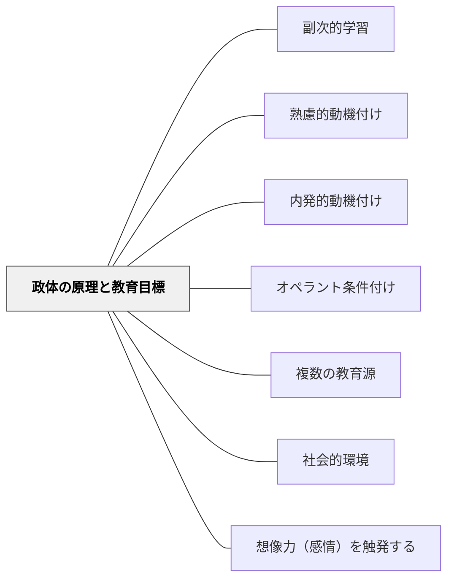

# 政体の原理と教育目標

> 教育の法はいやでも政体の原理と関係する。

## Pattern Connection

### モンテスキュー（1748）——Livre IV「教育の法」

Livre IVのタイトルが命題そのもの：
> 「Que les lois de l'éducation doivent être relatives aux principes du gouvernement」

- **既存パタンとの関連**：[[メタパタン/価値を目標とする]] が「何の価値を目標とするか」を問うが、本パタンはその前提として「どんな政体（制度・環境）の中に置かれているか」が教育目標を規定することを示す。[[パタン/熟慮的動機付け]] の動機付け設計は、この政体原理の診断なしには空回りしうる。
- **補強された点**：動機付けの類型（内発・外発・強化）は、モンテスキューの三原理（徳・名誉・恐怖）と対応する。現代の「動機付け設計」は実質的に「どの政体原理に乗るか」の選択である。
- **エレクトロニクス時代への拡張**：18世紀の「政体」は共和・王政・専制の三類型だったが、デジタル時代には **プラットフォームのアルゴリズム**が第四の「政体」として機能する。その原理を診断せずに教育目標だけを決めても、環境の原理が目標を打ち消す。

| 政体 | 原理 | 動機付けの型 | 現代の対応物 |
|---|---|---|---|
| 共和政 | 徳（vertu）・愛国心・平等愛 | 内発的・共同体貢献 | 協働学習・市民教育 |
| 王政 | 名誉（honneur）・卓越・作法 | 社会的承認・競争 | 成績・ランキング・SNSいいね |
| 専制 | 恐怖（crainte）・服従 | 外発的強化・罰 | 試験の恐怖・叱責・過度な管理 |
| **デジタル（第四）** | **エンゲージメント・注目経済** | **依存的・間欠強化** | **アルゴリズム推薦・通知** |

---

## 背景（Context）

教育の目標は、教師や学校が単独で決めるものではない。子どもたちが浸かる社会・制度・文化の「原理」が、どんな教育目標をも根底から規定している。18世紀の学校は国家の「政体」の中にあった。21世紀の教室は、国家に加えてデジタルプラットフォームという新たな「政体」の中にある。

モンテスキューは明言する：政体の原理（共和政の徳、王政の名誉、専制の恐怖）が変われば、教育の法も変わる。これは「政体に奉仕する教育」への批判ではなく、**教育とその環境の不可分な連動の記述**である。

## 問題（Problem）

「主体的・対話的で深い学び」という目標を掲げても、教室の実際の動機付け構造が「失点を避けるための恐怖」や「点数による競争（名誉）」で動いていれば、目標と環境の原理は矛盾する。さらに子どもたちは放課後を「エンゲージメントを最大化するアルゴリズム」の環境で過ごす。この矛盾を意識しないまま教育目標を設計すると、空回りが続く。

## 力のかたち（Forces）

- 子どもたちの動機付けは学校だけで形成されない——家庭、地域社会、デジタル環境がすべて「政体」として機能する
- 「恐怖」の原理で動く環境では、副次的学習として「失敗は恥だ」「間違えるな」という態度が形成される
- 「名誉/承認」の原理（SNS・競争）は短期的には強力だが、内発的な探究を侵食する
- 「徳/共同体貢献」の原理は最も教育的だが、意識的に設計しなければ消える
- デジタルプラットフォームは「間欠的強化」（予測不能な報酬）という最も強い依存形成の原理で動いている

## 解決（Solution）

**自分の教室・授業がどの「政体の原理」の中で動いているかを診断し、目指す教育目標と一致する原理を意識的に設計する。デジタル環境の「政体」にも同じ診断を行い、その原理と教室の原理の矛盾または協働を意図的に扱う。**

### 実践：政体診断チェックリスト

| 診断の問い | 「恐怖」サイン | 「名誉」サイン | 「徳」サイン |
|---|---|---|---|
| 子どもはなぜこの活動をするか | 失点・怒られたくないから | 褒められたい・一番になりたいから | 面白いから・役立てたいから |
| 間違いへの反応 | 隠す・謝る・固まる | 恥ずかしい・笑われる | 次の手がかりとして歓迎 |
| 評価をどう感じているか | 脅威・判定 | 勝負・ランキング | 自分の成長の確認 |
| 協力場面で | 「やらなければならない」 | 「目立ちたい」 | 「一緒にやりたい」 |

目指す方向：「徳」の原理に近づける設計——個人の競争ではなく共同体への貢献、恐怖ではなく内発的探究。

### デジタル環境との対話

子どもたちがどんな「デジタル政体」の中にいるかを確認し：
- **アルゴリズムの仕組みを一緒に考える**（メタ認知）：「なぜこの動画が次に出てくるのか」
- **学校の「徳」の原理をデジタルの「名誉」原理と対比させる**：「学校での学びとSNSでの学びは何が違うか」
- **デジタル空間を「徳」の原理で使う**：共同編集、地域への発信、誰かの役に立つ創作

## 結果（Consequences）

- 教育目標と動機付け環境の一致が増え、実践の空回りが減る
- 「なぜこの子たちに動機付けが起きないのか」の診断軸が生まれる
- デジタル環境を批判するだけでなく、その原理を教材として使える
- 副次的学習として形成される「態度」の設計に、政体診断が加わる

## 関連パタン

- [[パタン/副次的学習]] — 政体の原理が副次的学習として態度を形成する
- [[パタン/熟慮的動機付け]] — 動機付け設計の三原理との対応（徳・名誉・恐怖）
- [[パタン/内発的動機付け]] — 「徳」の原理に最も近い動機付けの型
- [[パタン/オペラント条件付け]] — 「恐怖」の原理の基礎メカニズム
- [[パタン/複数の教育源]] — 家庭・学校・デジタルの三教育源の矛盾
- [[パタン/社会的環境]] — 「世界への参入」としての社会教育（王政的）
- [[パタン/想像力（感情）を触発する]] — 情熱・感動の共有（徳への動機）
- [[メタパタン/価値を目標とする]] — どの価値（徳・名誉・恐怖）を目標とするかの選択
- [[文献/法の精神（モンテスキュー）]] — 本パタンの出典

## クラスター図

## Actionable Insight

- **今週の授業の「政体診断」**：授業の最大の動機が「恐怖（失点・怒られ）」「名誉（点数・ランキング）」「徳（面白さ・貢献）」のどれか、1分で考えてみる。
- **「徳」に近づける一手**：班活動のゴールを「誰かの役に立つ何かを作る」という共同体貢献に設定する。競争ではなく共同を原理にする。
- **デジタル政体を教材に**：「YouTube/TikTokはなぜ私たちを長く見させようとするのか」を6年生と一緒に考える授業を組む——アルゴリズムのengage原理を批判的に読む力が育つ。

## 出典

- Montesquieu（1748）. *De l'esprit des lois*, Livre IV.
- 斎藤正二著作集7（2003）「モンテスキュー教育思想の研究所説（承前）」
- [[文献/法の精神（モンテスキュー）]]

> 「Que les lois de l'éducation doivent être relatives aux principes du gouvernement.」（Livre IV, Titre）
