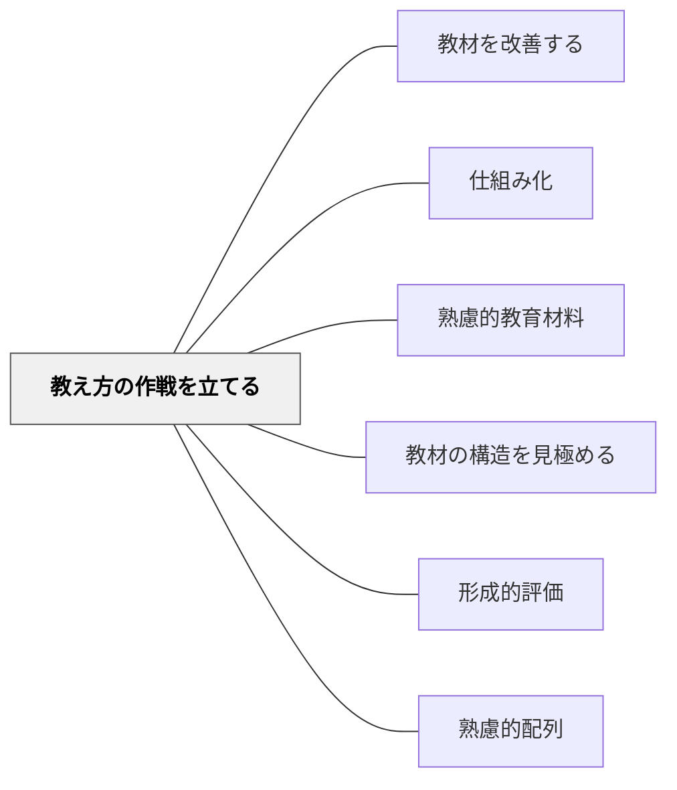

# 教え方の作戦を立てる

> 教材の構造を踏まえ、どの順序・方法・メディアで教えるかの作戦を立てる。

## 背景（Context）

鈴木克明「教材設計マニュアル」の設計ステップ。教材の構造分析を終えたら、具体的にどのような指導方略（説明・実例・練習・フィードバック）でどの順に教えるかを計画する。

## 問題（Problem）

内容を把握しても「どう教えるか」の作戦がなければ、授業・教材が行き当たりばったりになる。

## 力のかたち（Forces）

- 指導方略の選択は学習目標の種類（知識・スキル・態度）によって変わる
- 多様な方法の組み合わせが学習効果を高める

## 解決（Solution）

**学習目標と教材の構造を踏まえ、提示・実例・練習・フィードバックのサイクルを設計し、最適な指導方略を選択する。**

## 結果（Consequences）

- 学習の流れが設計され、無駄のない授業・教材になる
- 学習者の多様なスタイルへの対応が可能になる

## 関連パタン
- [[パタン/教材を改善する]]
- [[パタン/仕組み化]]

- [[パタン/熟慮的教材教具]] — 親パタン
- [[パタン/教材の構造を見極める]] — 前のステップ
- [[パタン/形成的評価]] — 次のステップ
- [[パタン/熟慮的配列]] — 配列の設計

## クラスター図

## Actionable Insight

- 授業設計の前に「提示→実例→練習→フィードバック」の4ステップを1枚のメモに書き出す——作戦を言語化することで行き当たりばったりの授業を防げる
- 学習目標の種類（知識・スキル・態度）に応じて指導方略を使い分ける——知識は説明、スキルは実演と練習、態度は経験と振り返りが中心になる
- 作戦を立てた後「この方法で学習者は本当に目標に達せるか？」と自問する——設計の妥当性への問いが無駄のない教材の質を高める

## 出典

- 鈴木克明（2002）『教材設計マニュアル――独学を支援するために』北大路書房
