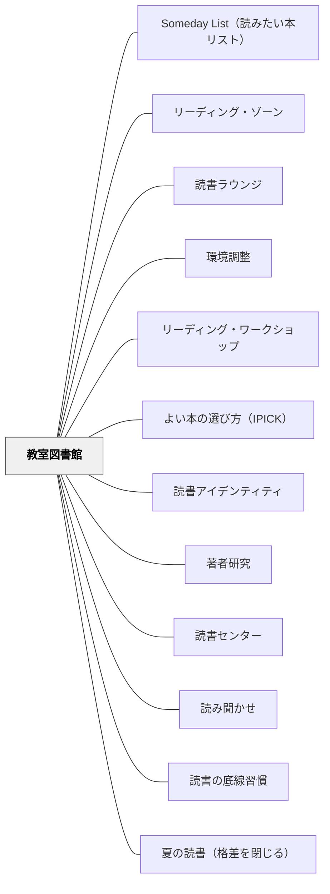

# 教室図書館

> 図書館のように整理するのではなく、書店のように売れ——子どもが「読みたい」と感じる本との出会いは、本の見せ方で決まる。

---

## Pattern Connection

**Allington & McGill-Franzen（2013）統合（2026-06-03）：**

*Summer Reading: Closing the Rich/Poor Reading Achievement Gap* は、教室図書館の貧困という問題を学力格差の構造的要因として実証する。

- **補強された点**：「本の見せ方」より前に「本が存在するかどうか」という問題がある。Duke（2000）の調査では高貧困校の教室蔵書は平均わずか3.8冊。Neuman & Celano（2001）は、豊かな地域で購入可能な児童書16,000冊 vs. 貧しい地域55冊という驚異的な格差を示す。本パタンが扱う「どう見せるか」の問いは、まず「そこに本があるか」という前提が満たされてこそ機能する
- **拡張された点**：「指先でアクセスできる（fingertip access）」という概念——Allington は「学年を通じて常に、そして夏休みも」独立読書レベルの本が何百冊も手元にある状態を理想として示す。教室図書館は学年中のアクセス装置だが、夏休みに学校が閉まると低所得層の子どもは本へのアクセスを完全に失う。[[パタン/夏の読書（格差を閉じる）]] は教室図書館設計の「夏休み版」として機能する
- **修正された点**：教室図書館の目的は「ワークショップを支える」だけでなく「アクセス格差を補正する公正の装置」でもある。特に高貧困校では、教室図書館の充実が読書格差の縮小に直結する
- **他のパタンへの波及**：[[パタン/夏の読書（格差を閉じる）]] — 学年末のブックフェアで子どもが選んで持ち帰る本は、実質的に「夏休み版の教室図書館」として機能する

---

## 背景（Context）

リーディング・ワークショップの「独立読書」の質は、子どもが毎日自分でJust-Right Booksを見つけられるかどうかにかかっている。その「探す場」としての教室図書館が、単なる本の保管庫ではなく**読書への動機づけ装置**として機能するかどうかが、ワークショップ全体を支える。

Collins（2004）は教室図書館を「書店と博物館の中間」として設計するよう提案する——本を「売る」ためのディスプレイと、「探究する」ための整理の両方が必要だという考え方だ。

## 問題（Problem）

教室の本棚が背表紙を向けて並んでいると、子どもは「何があるかわからない」状態になる。アルファベット順・レベル別の整理は管理しやすいが、読み手にとっては「探す手がかりがない」。結果として、子どもは「自分に合う本がない」「何を読めばいいかわからない」と感じ、選書が教師依存になる。

## 力のかたち（Forces）

- 子どもは表紙を見て本を選ぶ——背表紙の整理は管理者の論理であり読み手の論理ではない
- レベル別の見える整理（色ラベル等）は読み手を「自分のレベルの箱」に縛りつける
- ジャンル・テーマ・著者による整理は「好みで探す」自然な選書行動を支援する
- 教師が定期的に本を「紹介する」行為が図書館の鮮度を保つ
- 本の数が多すぎると選べない——「バスケット（ひとまとまり）」単位の提示が機能する

## 解決（Solution）

Collins（2004）が示す教室図書館設計の核心は、**「読み手の視点で陳列する」**ことにある。

---

### 陳列の原則

**①　表紙を見せる（Face-Out Display）**
特集本・新着本・教師の推し本は表紙が見えるように立てる。書店が新刊を平積みするのと同じ原理——「見えない本は存在しない」。

**②　バスケット（テーマ別かご）で分類する**
本を束にして、テーマ・ジャンル・著者別のバスケットに入れて棚に置く。ラベルは「こわいはなし」「動物もの」「ノンフィクション：虫」「Mem Fox」のように読み手の言葉で書く。

バスケットの例：
| バスケット名 | 内容 |
|------------|------|
| 著者バスケット | 一人の著者の本をまとめて10冊前後 |
| シリーズバスケット | ヘンリーとマッジ、カエルとガマなど |
| ジャンルバスケット | 詩・コミック・ノンフィクション・昔話 |
| テーマバスケット | 「ともだち」「家族」「冒険」 |
| 先生の推し本バスケット | 教師が読み聞かせた本・おすすめ本 |

**③　レベルを隠す**
「Aレベル」「Bレベル」などのラベルは子どもに見えない形にする（バスケット裏・ファイル管理）。Just-Right Booksの選び方は[[パタン/よい本の選び方（IPICK）]]で指導するが、レベル表示が見えると子どもは「自分のレベルだから選ぶ」という外的基準に縛られる。

---

### Book Talk（本の宣伝）

週に1〜2回、教師が1〜2分で1冊を「宣伝」する。教師が熱量を持って語ることで、その本への関心が全体に広がる（Contagious Enthusiasm）。Book Talkは教師だけでなく子どもも担当できる——子どもが「この本、すごかったから話したい」と自発的に話す文化が読書アイデンティティを育てる。

---

### Book Baggie（ブック・バギー）

個人の「読書かばん」として、子どもが自分のJust-Right Booksを5〜10冊入れておく袋。毎週「ショッピング」の時間を設け、教室図書館から本を選んで入れ替える。このシステムが機能すると：

- 朝の読書時間に即座に本を取り出せる
- 「今日は何を読もうか」の選択コストが下がる
- 読み終えた本を自分で管理する習慣ができる

---

### 「ショッピング」の時間を設計する

Book Baggie の補充は単なる物の管理ではなく、**読書コミュニティの儀式**として設計する。

- 週1回（例：月曜日）の10分間
- 子どもが自由に棚を回り、気になる本を手に取る
- 友達と「これ読んだ？」「おもしろい？」と自然に話す
- 教師はこの時間を観察に使い、どのバスケットが人気か・どの本が選ばれていないかを把握する

---

## 結果（Consequences）

- 「何を読めばいいかわからない」という停滞が減り、朝の独立読書が即座に始まる
- 本を「見る」「触る」「友達と話す」体験が積み重なり、読書が社会的な楽しみになる
- 教師のBook Talkが読書コミュニティに「話題の本」を生み出す——リーディング・ゾーン体験への入口になる
- 著者バスケットを見た子が自然と著者研究への興味を持ちやすくなる

## 関連パタン
- [[パタン/Someday List（読みたい本リスト）]]
- [[パタン/リーディング・ゾーン]]
- [[パタン/読書ラウンジ]]

- [[パタン/環境調整]] — 教室図書館は読書環境の物的調整の中核
- [[パタン/リーディング・ワークショップ]] — 独立読書の質を支える物的基盤
- [[パタン/よい本の選び方（IPICK）]] — ショッピング時間での自己選書を支えるストラテジー
- [[パタン/読書アイデンティティ]] — 「自分の棚」「好きな著者」の感覚がアイデンティティを作る
- [[パタン/著者研究]] — 著者バスケットが著者研究の入口になる
- [[パタン/読書センター]] — テーマバスケットが読書センターの教材になる
- [[パタン/読み聞かせ]] — 読み聞かせ後にその本を特集棚に出すことで関心をつなぐ
- [[パタン/読書の底線習慣]] — 「本を大切にする」習慣は図書館の管理文化と連動する
- [[パタン/夏の読書（格差を閉じる）]] — 教室図書館は学年中の本へのアクセスを支える基盤、夏休みは学校外へのアクセス格差を補う設計が必要

---

## クラスター図

## Actionable Insight

- 1つのバスケットを選んで「Book Talk週間」を設ける——月曜日に教師が1冊紹介し、金曜日に「誰か読んだ？どうだった？」を聞く。1週間で本棚がコミュニティの話題になる
- 「先生の推し本」バスケットを1つ作り、読み聞かせをした本を入れていく——「あの本もあった」という親しみが再読・選書につながる
- ショッピングの日に「今日の一言おすすめ」を子どもが付箋に書いて本に貼る活動を加える——本に子どもの声が宿り、図書館が生きた場所になる

---

## 出典

Collins, K.（2004）*Growing Readers: Units of Study in the Primary Classroom*. Stenhouse Publishers. → [[文献/Growing Readers（Collins）]]

> "The classroom library should feel like a place readers want to be, where books are celebrated and where finding just the right book is possible." ——Collins（2004）
