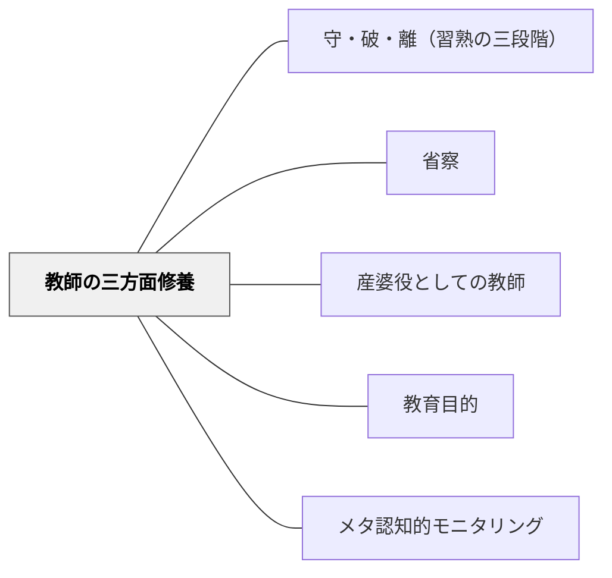

# 教師の三方面修養

> 教材の学修・教授法の修練・師範人格の修養、この三方面は順番ではなく常に並行して進めなければならない——牧口常三郎

## Pattern Connection

### 牧口常三郎（1931）——師範教育の三方面並行

牧口は *創価教育学体系 第3巻* において、師範教育（教員養成）が並行して取り組むべき三つの方面を明示した。

| 方面 | 問い | 内容 |
|---|---|---|
| **①教育材料の学修** | 何を教えるか | 各教科・領域の知識・概念・教材についての確実な理解 |
| **②教育方法の修練** | どう教えるか | 授業技術・教授法・学習支援の実践的な技能 |
| **③師範人格の修養** | どんな人間であるか | 社会意識・道徳的人格・教育への献身・自己の内面的成長 |

牧口が強調したのは、この三方面を**同時並行**で進めることの必要性だ。順番に行うのではなく、どの授業・どの研究・どの自己との対話も、この三方面すべてに向き合いながら進める。

さらに牧口は、三方面のうち**「師範人格の修養」が本質的に最重要**であると論じた。なぜなら、教育は単なる情報の伝達ではなく「価値の創造」であり、教師の人格そのものが教育内容になるからである。技術や知識がどれほど優れていても、道徳的な社会意識を持たない教師は真の教育者になれないと牧口は断言した。

**守・破・離との対応**：三方面のそれぞれに守・破・離の習熟がある。教材知識にも、教授法にも、人格的成長にも、守（型を学ぶ）→破（広げる）→離（自らの境地を拓く）の段階がある。しかし三方面のうち人格だけは「離の完成」がなく、生涯にわたって続く修養として位置づけられる。

**「省察」との接続**：師範人格の修養は、[[パタン/省察]] の「自分の経験・行為・信念を問い返す」実践と深く重なる。省察なき教授技術の向上は「巧みだが空虚な教師」を生む。

- **他のパタンへの波及**：[[パタン/産婆役としての教師]]（産婆役になるには三方面がそろっている必要がある）・[[パタン/教育目的]]（師範人格 = 価値の担い手としての教師像）

### 牧口常三郎（1930）——教育道（信・行・学）：三方面修養の完成形

牧口は *創価教育学体系 第4巻*（教育技術論）において、三方面修養をさらに深め「**教育道**」という概念として統合した。

**教育道の三大要素（信・行・学）**

| 要素 | 内容 | 三方面との対応 |
|---|---|---|
| **信（信仰・信念）** | 人生最高の目的観念・正法への確信。「なぜ教育するか」の根拠となる価値観の確立 | 師範人格の修養（最深層） |
| **行（実習・熟練）** | 教育方法の実地練習と技術の熟練積み重ね | 教育方法の修練 |
| **学（学術・理論）** | 教育学の知識・原理の理解と深化 | 教育材料・教授学の学修 |

> 「教育に就いての信・行・学の三大要素の統合渾一が乃ちそれである。人格の中心たる人生最高の目的観念の確立に必要なる正法の信仰と、教育方法の実習及び熟練と、之が理解説明に欠くべからざる教育学との渾然たる統一が乃ちそれである。」（第4巻 第七編）

**三方面修養との違い・深化**

第3巻の「三方面（教材知識・教授法・人格）」に比べ、第4巻の「信・行・学」は：
1. **「信」が最深層**：単なる「人格」ではなく「価値観・使命感・信念の確立」が強調される
2. **統合の強調**：三方面を「渾然たる統一」として実現することが目標——どれかだけを深めても不十分
3. **教育道としての格**：日本の「剣道・茶道」と同じ「道」の水準に教師の専門性を位置づけた

**師範教育への提言**

牧口は「教育道場」として三機関の整備が必要だと提言した：
1. **教育技術練習所**（小中学校）——実際に子どもを教える実習の場
2. **教育学研究所**——理論・方法論の探究の場
3. **人格修養所**（信仰修養所）——信念・目的観の深化の場

現在の師範学校はこの三機関のどれも完備していない、と牧口は批判した。

**修正点**：三方面修養に「信（使命感・目的観）」という基底要素を加える。教育方法の習熟と教材知識の深化は「なぜ教育するか」という根拠的問いなしに表面的な上達にとどまる。

- **他のパタンへの波及**：[[パタン/守・破・離（習熟の三段階）]]（教育道の「行」は守・破・離の技術習熟層と対応する）・[[パタン/内発的動機付け]]（「信」の確立が教師の第四階級動機の基盤）

---

## 背景（Context）

教師の成長を「スキルの習得」として捉えると、教授技術だけを磨く研修が中心になりやすい。しかし実際の教室では「何を教えるか」「どう教えるか」「どんな人間として教えるか」の三つが一体となって機能している。どれか一方面だけを切り出して研磨しても、残りが追いつかなければ教育全体の質は上がらない。

## 問題（Problem）

教師の自己研鑽が特定の方面に偏りやすい。技術研修（教授法）は研究会・研修で外から促されるが、教材知識の深化は自力で進めにくく、師範人格の修養は「個人の内面の問題」として制度的に放置されがちである。その結果「技術はあるが教材理解が浅い」「知識はあるが授業が伝わらない」「技術も知識もあるが教育への信念が薄い」という偏りが生まれる。

## 力のかたち（Forces）

- 三方面は相互に影響し合う——教材理解が深まると教授法の選択肢が広がり、人格的な問いが深まると教材の意味が変わる
- 師範人格の修養は可視化しにくく、自己評価も他者評価も難しい
- 時間は有限であり、全方面を同時に深めることには意識的な設計が必要
- 「方法だけを磨く」ことへの制度的・文化的誘引力（研修・研究会は授業技術が中心になりやすい）
- 人格の修養を「後でやる」と決めると、一生後回しになる

## 解決（Solution）

**三方面を意識的に並行して修養する。一つの授業・一つの研究・一つの経験を振り返るとき、「今日は教材知識・教授法・人格のどれを磨いたか」を問う習慣をつくる。**

実践的な設計の例：

1. **教材知識の深化**——単元前に「この内容の本質は何か」を一次資料に当たって確かめる。教材を知らないまま授業しない
2. **教授法の修練**——授業の後「今日の指示・問い・介入は適切だったか」を1〜2分でメモする。観察された学習者の反応から修正仮説を立てる
3. **師範人格の修養**——「なぜ教師をしているのか」「今日の子どもへの関わりは自分が正しいと信じるものか」を定期的に問い返す時間をつくる（省察ジャーナル・同僚との対話など）

---

**具体例：一つの授業を三方面で振り返る**

算数で「分数のたし算」を教えた後：
- **①教材**：今日教えた「通分」の概念を自分は本当に深く理解していたか。子どもが「なぜ分母を揃えるのか」と問われたとき、納得できる説明ができたか
- **②方法**：具体物（紙を折る・絵を描く）の使い方は適切だったか。どの子が理解に詰まっていたかを把握できたか。次回はどう変えるか
- **③人格**：今日A児が「わからない」と言ったとき、自分はどう応じたか。「なぜ分からないのか」より「どうすれば分かるか」を考えていたか。子どもへの信頼があったか

## 結果（Consequences）

- 教師としての成長が特定方面に偏らず、立体的に進む
- 「技術だけが高い教師」「人格は立派だが授業が伝わらない教師」の偏りが解消される方向に向かう
- 師範人格の修養が制度的研修の外側で自律的に続く仕組みができる
- 三方面の相互影響により、一つの深化が他の方面を引き上げる循環が生まれる

## 関連パタン

- [[パタン/守・破・離（習熟の三段階）]] — 三方面それぞれに守・破・離の習熟段階がある
- [[パタン/省察]] — 師範人格の修養は省察の実践として起きる
- [[パタン/産婆役としての教師]] — 三方面がそろって初めて産婆役として機能できる
- [[パタン/教育目的]] — 師範人格の修養は教育目的（価値創造者を育てる）と教師自身の一致を目指す
- [[パタン/メタ認知的モニタリング]] — 三方面を「今どこにいるか」観察することがメタ認知の実践

## クラスター図

## Actionable Insight

- 今週の授業を一つ選び、終わった後に「教材・方法・人格の三方面で何を感じたか」を各1文だけ書く——三方面の観察を習慣化する最小単位
- 「研修や勉強会で学んでいること」を三方面に分類してみる——どれかに偏っていれば、残りの方面を意識的に補う週を設ける
- 同僚と「今月の自分の成長」を話すとき、「方法だけ」でなく「教材理解」と「人格的な問い」を一つずつ加えて話す——三方面の言語化が相互の省察を深める

## 出典

牧口常三郎（1931/2017）『創価教育学体系 第3巻（教育改造論）』聖教新聞社（電子版）

> 「師範教育は教育材料の学修・教育方法の修練・師範人格の修養、この三方面を常に並行して進めなければならない」——牧口常三郎（趣意）
