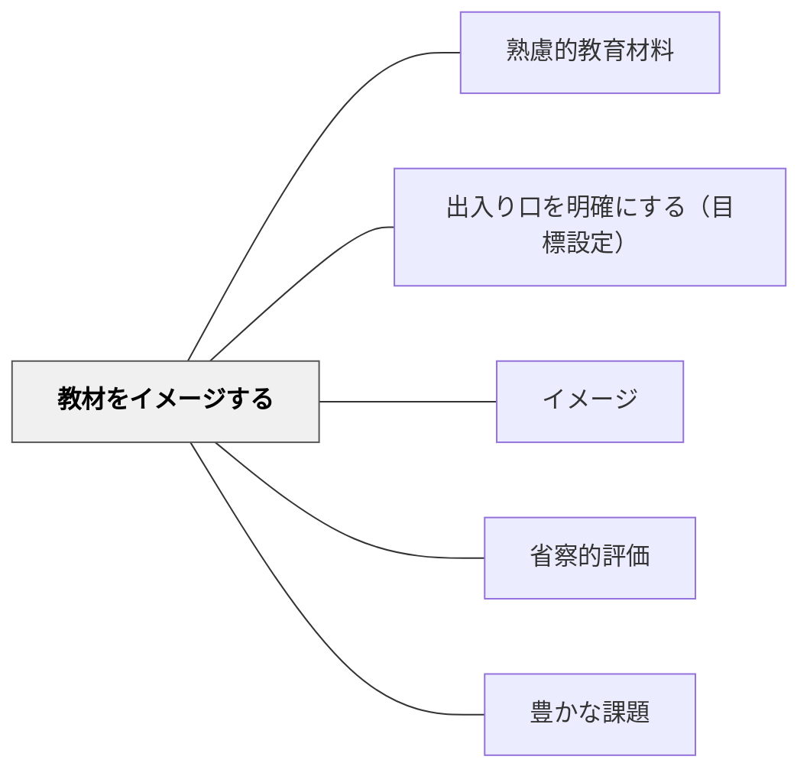

# 教材をイメージする

> 設計を始める前に完成した教材がどんなものかをイメージする。

## 背景（Context）

鈴木克明「教材設計マニュアル」の教材設計プロセスの第一ステップ。どんな教材が必要で、どのような形になるのかを最初にイメージすることで、設計の方向性が定まる。

## 問題（Problem）

ゴールのイメージなしに教材作成を始めると、試行錯誤が増えて非効率になり、完成しても目的にそぐわないものになりやすい。

## 力のかたち（Forces）

- イメージが明確なほど設計の判断が速くなる
- 最終イメージは学習者のニーズ・目標から逆算される
- 過度に詳細なイメージは柔軟性を失わせる

## 解決（Solution）

**教材設計の最初に「完成形はどんな教材か・学習者はどう使うか」を具体的にイメージし、設計の指針にする。**

## 結果（Consequences）

- 設計の方向性が定まり、無駄な試行錯誤が減る
- 学習者視点での教材設計が促進される

## 関連パタン

- [[パタン/熟慮的教材教具]] — 親パタン
- [[パタン/出入り口を明確にする（目標設定）]] — 次のステップ
- [[パタン/イメージ]] — 良いイメージを持つこと

- [[パタン/省察的評価]] — 教材イメージを実践後に振り返ることで次の設計が改善される
- [[パタン/豊かな課題]] — 完成形イメージから豊かな課題の設計へ
- [[メタパタン/経験から出発する]] — 学習者体験から教材イメージを構築する
- [[概念/理論の構成と運用]] — 教材設計理論をイメージに活かす認識論的背景

## クラスター図

## Actionable Insight

- 教材を作り始める前に「学習者はこの教材を使った後、何ができるようになるか」を1文で書く——完成形の言語化が設計の方向性を定め無駄な試行錯誤を減らす
- 「学習者がどう使うか」を頭の中でシミュレーションしてから設計を始める——使用場面のイメージが学習者視点の設計を促進する
- 完成イメージを同僚に30秒で説明し「それなら学習者にとって意味があるか」とフィードバックをもらう——外部の目が過度に詳細なイメージを柔軟な設計に修正する機会をつくる

## 出典

- 鈴木克明（2002）『教材設計マニュアル――独学を支援するために』北大路書房
