# 教科に対しても責任を負う（教えすぎと放任のあいだ）

> 教師は学習者の代わりに学ぶことはできない。だが「私は教えない、参加者の一人だ」と言うこともできない。教師は子どもの声に対してと、その子が参入していく教科に対して、二重に責任を負う。

## [Pattern Connection]

このWikiには「手を引く」側のパタンが厚く積まれている。[[パタン/段階的手放し]]（責任を徐々に学習者へ渡す）、[[パタン/非可視の教師]]（教師が消えるとき学習者が主役になる）、[[パタン/産婆役としての教師]]（知識は伝達し得べからず）、そして [[メタパタン/足場は消えるために組む（フェードアウト）]]（撤去されない足場は依存である）。方向としてはどれも正しい。

しかしこの束には、**逆側の歯止めを正面から名指すページがなかった**。「もっと手を引け」と言うパタンは並んでいるのに、「引きすぎることもまた責任放棄である」を主題として書いた一枚がない。結果として、これらのパタンは単独で読まれたとき「教師は黙っているほど良い」という方向へ滑りやすい。本パタンはその歯止めを一枚として立てる。

接続の要点は三つある。

第一に、**これは手放しパタンへの反論ではなく、同じ軸の反対端である**。Black & Wiliam（2009）は両極をどちらも斥ける。一方に「学習者の代わりに自分が学んでやれると信じているかのように振る舞う」教師がおり、他方に「自分は教えない、ただ司会をするのだ」と主張する実践者がいる。著者らは後者を「教師の責任の放棄（an abdication of the teacher's responsibility）」と呼ぶ。したがって [[パタン/段階的手放し]] と本パタンは矛盾しない。**手放す量の話ではなく、手放しても手放さなくても残り続けるものの話**である。

第二に、その残り続けるものが「**教科の本質（the essence of the discipline）**」である。著者らは、学習環境の設計に生徒の声を取り入れることを認めたうえで、「教師が教科の本質を学習環境の中に設計し込まないなら、それは致命的である」と書く。ここで [[パタン/キーコンセプト（胚細胞的概念）]] や [[概念/概念型の目標と胚細胞モデル]] が接続する。教科の本質とは網羅すべき内容一覧ではなく、その教科を貫く核の概念と、その教科で何が良い説明・良い問い・良い証拠とされるかの規範である。

第三に、著者らが使う語 **enculturated（文化的に参入していく）** が本パタンの背骨になる。生徒は教科を「習得する」のではなく、教科という文化に**参入していく**。だから教師の責任の相手は生徒だけではない。生徒が入っていこうとしているその文化に対しても責任がある。教科を知識の集合と見るかぎり、この二重の責任は理解できない。

このパタンは [[緊張関係マップ]] の「⚖ 4. 教師が問いを設計するか、子どもの問いを待つか」に直結する。あの節は「設計は足場であり、創発がゴールである」という発達的解消を提示しているが、本パタンはそこに一本の下限を引く——**創発がゴールであっても、教科の本質は創発を待っていては現れない**。

## 背景（Context）

日本の小学校の授業観は、この二十年で明確に「教師が引く」方向へ動いた。子どもが主語の授業、主体的・対話的で深い学び、探究、個別最適な学び。研究授業の協議会で「教師がしゃべりすぎ」は最も出やすい指摘であり、逆に「教師が出なさすぎ」はほとんど指摘されない。

若い教師ほど「教え込みは悪」という規範を強く内面化している。そして実際、この規範の多くは正しい。一斉講義の時間を減らし、子どもが考える時間を増やしたことで良くなった授業は無数にある。

だが同時に、教室ではもうひとつの事態が進行している。

- 算数で多様な考えが出て、黒板に並び、「いろんな考えがありましたね」で終わる
- 国語で感想を出し合い、どれも尊重され、本文に戻らないまま終わる
- 総合的な学習の時間で、教師が「ファシリテーターに徹する」と決めた結果、調べたことの発表会で終わる

どの場面でも教師は熱心であり、子どもの声をよく聞いている。にもかかわらず、**その教科でしか学べないことが学ばれていない**。教師が悪意なく引いた結果である。

Black & Wiliam（2009）がこの論点に触れるのは、形成的評価の理論を構築する途中——教師の学習意図（learning intention）を論じる箇所である。彼らは Knight（2008）が示唆した「教師が学習意図を持つこと、および学習を生み出す責任を教師に置くことは、生徒の自律性の創出を損なう」という議論を取り上げ、正面から斥ける。

## 問題（Problem）

**「教えない」ことは、それ自体では良いことではない。教師が引いた場所に、その教科の本質が設計されていなければ、引いたぶんだけ学習は薄くなる。**

Black & Wiliam の議論はこう組み立てられている。

まず彼らは、教師が学習意図を持つことを前提に置く。ただしそれは「全生徒に対する単一の事前決定されたゴール」のような狭いものではない。異なる生徒が異なるゴールに向かって取り組んでいてよいし、達成される学習成果が何になるか**教師自身にも明確でないことがある**。彼らはそれを認めたうえで、それでもこう主張する——そうした状況でも教師は、**どれほど暗黙であっても学習の意図を持っている。さもなければ「何でもあり（anything goes）」の状況になってしまう**。

そして Knight（2008）が示唆したような議論——学習意図を要求し学習創出の責任を教師に置くことは生徒の自律性を損なう——について、著者らはこう書く。**そうした議論は、ある種の「発見学習」に特徴的な極端にまで押し進められるなら、教師と学習者それぞれの責任の性質についての不適切なモデルに基づいているように思われる**。

ここから両極を順に斥ける。

**一方の極**——「多くの状況、とりわけ高い利害のかかったテストが重要な役割を果たす状況では、教師はしばしば**学習者の代わりに自分が学習してやれると信じているかのように振る舞い、悲惨な結果を招く**」。これは彼らも認める。

**もう一方の極**——「他方の極には、**自分は教えないのだ、ただ他の参加者の一人として振る舞うのだ、あるいは学習の議論の司会をするのだと主張する実践者たちがいる。これは我々には教師の責任の放棄と見える**」。

そして中間の定式が置かれる。「**教師は学習者の代わりに学ぶことはできないが、学習者が学ぶ機会、および／または学習の自律性を育てる機会が最大化されるような状況を設計（engineer）することはできる**」。

問題の核はここから先にある。「**そうした学習環境の設計にあたって生徒の声は考慮に入れられるべきだが、教師がその教科の本質を学習環境の中に設計し込まないなら、それは致命的である（it is fatal）**」。

つまり教師の責任は二重である。「**教師は、合理的に実行可能な範囲で生徒のニーズや選好を受け入れるという意味で生徒に対して責任を負わねばならないが、同時に、生徒がやがてその教科の中で有能な学習者として活動できるように、彼らが文化的に参入していく（enculturated）その教科に対しても責任を負わねばならない**」。

日本の教室でこの問題が最も見えにくいのは、**引きすぎた授業ほど見た目が良い**からである。子どもがよく話し、多様な考えが出て、教師の発言は少ない。参観者の目には理想的に映る。教科の本質が設計し込まれていないことは、その時間の中では誰にも見えない。数か月後、あるいは次の学年で、初めて欠落として現れる。

## 力のかたち（Forces）

- **子どもの声を取り入れる責任 vs 教科に対する責任**：どちらも本物の責任である。原文の答えは「どちらかを選べ」ではなく「**両方を負え**」。ただし両者は具体的な場面ではしばしば衝突する。子どもが出した考えを尊重することと、その考えを教科の規範に照らして吟味することは、同じ一分間の中では両立しにくい
- **自律性を育てたい vs 何でもありにはできない**：自律を育てるには手を引くしかない。しかし引いた先が「何でもあり（anything goes）」なら、育つのは自律ではなく無方向である。原文は「どれほど暗黙であっても学習の意図はある」という一点で線を引く
- **手放したい vs 教科の本質は自然発生しない**：多様な考えを出せば、そこから効率や一般化可能性という数学の価値が自然に立ち上がる——という期待は、たいてい外れる。教科の規範は、教師がその場に設計し込まないかぎり教室に現れない
- **「教えない自慢」の魅力 vs それが責任放棄になる境目**：「私はほとんど何も言いませんでした」は、現在の授業文化で最も称賛されやすい自己申告である。この称賛が、教師に「引く」方向のインセンティブだけを与える。**引きすぎを指摘する言葉が現場に不足している**
- **高い利害のかかったテストの圧力**：原文が指摘するとおり、テストの圧力は教師を反対の極——「代わりに学んでやる」極——へ押し出す。同じ教師が、単元の前半では引きすぎ、テスト直前には教え込みすぎるという振れ方をする。両極は別々の教師に宿るのではなく、**同一の教師の中で時期によって入れ替わる**
- **教科の本質を持っているか vs 持っていないか**：設計し込むには、その教科で何が良い説明・良い問い・良い証拠とされるかを教師自身が持っていなければならない。これは重い要求であり、多くの場合「引く」判断の背後にあるのは思想ではなく、**持っていないことの回避**である
- **教科によって規範が違う vs 共通するものもある**：原文は「数学の教室で良い説明とされるものと、歴史の教室で良い説明とされるものは異なる、ただし共通するものもある」と書く。だから「教科に対する責任」は全教科共通の標語には還元できず、教科ごとに具体を持つ必要がある

## 解決（Solution）

**引くか出るかを量で決めるのをやめ、「この時間、その教科の本質のどこを学習環境に設計し込むか」を先に一つ決める。そのうえで、その一点だけは自然発生に任せず、教師の責任として場に出す。それ以外は手放してよい。**

Black & Wiliam の定式を実務に翻訳すると、次の三つになる。

1. **学習意図を、暗黙でよいから必ず持つ**——単一の到達目標である必要はない。異なる子が異なるゴールに向かってよい。しかし「今日は子どもたちに任せます」だけでは「何でもあり」である。意図は、内容ではなく**この教科らしさのどこを働かせるか**で持つ
2. **その教科の規範を、活動の設計に埋め込む**——教師が説明するのではなく、規範が働かざるを得ない場面を作る。「どちらが速い？」と問えば効率が、「これは他の数でも言える？」と問えば一般化可能性が話題に上る。規範は言葉で教えるのではなく、**問いと手順の形で環境に埋める**
3. **子どもの声は設計の材料にするが、設計の全権は渡さない**——「合理的に実行可能な範囲で」生徒のニーズと選好を受け入れる。これは原文の言い方であり、無制限の受容ではない

---

### 具体例1：算数「多様な考えが出て終わる」授業に、数学の価値を戻す

五年生「面積」。平行四辺形の面積の求め方を各自で考え、四つの方法が黒板に並ぶ。切って移す、二つ合わせて長方形にする、対角線で分ける、公式を思い出す。教師は全部を認め、「いろんな考えが出ましたね」でまとめる。

この授業には**数学が入っていない**。四つの方法は並んだが、比べられていない。

Black & Wiliam が引く高橋（2008）の「練り上げ（neriage）」の記述は、まさにここを言う——共有された考えを、教師に注意深く導かれながら、生徒が批判的に分析し、比較し、対比する局面であり、そこで検討されるのは「**効率（efficiency）、一般化可能性（generalizability）、既習の考えとの類似性**」である。

やり方を変える。四つが並んだ時点で、教師は次の三つのうち一つだけを場に出す。

- **効率**——「一番手数が少ないのはどれ？　やってみて」（実際に別の数値で全員がやる）
- **一般化可能性**——「この四つのうち、台形でも使えそうなのはどれ？」
- **既習との類似**——「この中で、去年の長方形の考え方と一番近いのはどれ？」

このどれかを出さないかぎり、四つの考えは**四つのままで終わる**。そして重要なのは、この問いは子どもからは出てこないということである。効率や一般化可能性が価値だという規範は、数学という文化のものであって、十歳の子が自然に持っているものではない。**教師が設計し込まなければ、教室に存在しない**（[[パタン/練り上げ（比較検討の全体交流）]]）。

引くべきところは変わらない。四つの方法を思いつく時間は完全に手放してよい。手放してはいけないのは、この一問である。

---

### 具体例2：国語「感想を言い合う」授業に、本文へ戻る規範を立てる

四年生、物語文。「主人公の気持ちを話し合いましょう」。子どもは活発に話す。「かわいそうだと思った」「ぼくならこうする」「前に読んだ本と似ている」。教師は全部を受け止め、板書し、時間が来る。

これも教師は何も間違っていない。子どもの声を最大限尊重している。しかし**国語が入っていない**。

国語という教科の規範のひとつは、「**読みは本文から根拠を引く**」である。感想は自由でよいが、どこからそう読んだかは自由ではない。この規範を設計し込む最小の操作は、問いの形を一つ変えることである。

- ×「主人公はどんな気持ちだったと思いますか」
- ○「主人公の気持ちが変わったのは何行目ですか。そこの言葉を写してから、どう変わったか書いてください」

そして交流の場面では、教師の返しを一種類に固定する。誰が何を言っても、**「どこからそう読んだ？」**を返す。これは評価ではなく規範の提示であり、五、六回繰り返されると子ども同士の交流の中に移る。子どもが子どもに「どこ？」と聞き始めたとき、規範が環境に定着したことになる（[[パタン/確認の原則]]）。

ここでも教師は解釈を教えていない。教えているのは**根拠を引くという教科の作法**であり、これがなければ話し合いは感想の交換になる。感想の交換は悪くないが、それは国語の時間でなくてもできる。

---

### 具体例3：逆の極——テスト前に「まとめて教え込む」

同じ教師が、単元テストの一週間前になると別人になる。板書を写させ、要点を読み上げ、「ここ出るよ」と言い、練習問題を解かせる。子どもは静かに写す。

これは原文が名指しているもう一方の極である——「高い利害のかかったテストが重要な役割を果たす状況では、教師はしばしば**学習者の代わりに自分が学習してやれると信じているかのように振る舞い、悲惨な結果を招く**」。

「悲惨な結果（disastrous consequences）」という語は強いが、実際に起きることは地味である。テストの点は少し上がる。そして次の単元でまた同じことをする。子どもの側には「わからなくなったら先生がまとめてくれる」という期待が形成され、自分で意味を作る作業が起きなくなる（[[概念/教授学的契約（やり過ごしの均衡）]]）。

重要なのは、**この教師と、具体例1・2で引きすぎていた教師が同一人物である**ことだ。両極は別々の教師に宿るのではない。同じ教師の中で、単元の前半と直前とで入れ替わる。だからこのパタンの点検は「私は引くタイプか、出るタイプか」ではなく、「**この一週間で、私はどちらの極に触れたか**」で行う。

---

### 具体例4：総合的な学習の時間——「ファシリテーターに徹する」が放棄になるとき

六年生の探究。テーマ設定から子どもに任せ、教師は相談に応じるだけと決める。子どもたちは調べ、まとめ、発表する。発表は「わかったこと」の羅列になり、出典はインターネットの一次ヒットで、反対の証拠は出てこない。

ここで教師が放棄しているのは内容ではなく、**探究という営みの規範**である。総合には教科書がないぶん、規範は教師が設計し込むしかない。最小のものは三つである。

- **出典を二つ以上、種類の違うものから引く**（本と Web、当事者の話と統計）
- **自分の主張に反する情報を一つ探して載せる**
- **「わかったこと」と「まだわからないこと」を分けて書く**

これらは内容の指示ではないから、子どもの自律を損なわない。テーマも方法も子どものものである。しかしこの三つがなければ、探究は調べ学習の発表会にしかならない。原文の言い方をそのまま当てはめれば、教師は生徒に対して責任を負っている（テーマを尊重した）が、**生徒が参入していこうとしている営みに対して責任を負っていない**。

「ファシリテーターに徹する」という自己規定は、この二つ目の責任を最初から視野の外に置いてしまう点で危うい。原文はこれを、参加者の一人として振る舞うと主張する実践者への評——「**教師の責任の放棄**」——として名指している。

---

### 特別支援の視点：「その子のペースで」と「その教科の本質」が最も鋭くぶつかる場所

※ ここから先は原文の主張ではなく、原文の枠組みを特別支援の実務に当てはめた岩井の判断である。Black & Wiliam（2009）は特別支援について論じていない。

特別支援学級・通級では、この二重の責任がもっとも鋭く衝突する。個別の指導計画は、その子のニーズと選好から出発する——これは原文の「生徒に対する責任」そのものであり、制度としてよく整備されている。だが「その教科に対する責任」を書く欄は、実質的にはない。

その結果、次のような状態が起こりやすい。

- 算数で、計算の手続きだけが積み上がり、「どちらが速いか」「他の数でも言えるか」を問われた経験が一度もないまま学年が上がる
- 国語で、音読と語彙だけが扱われ、「どこからそう読んだ？」を問われたことがない
- 「その子のペースで」という配慮が、**その教科の本質に触れる機会をゼロにする配慮**になっている

これは手を引きすぎた形の放任である。しかも善意で、しかも制度的に正当化された形で起こる。

見分ける境目として、実務上こう置いている。**手を引いてよいのは「量・速度・手順の細かさ」であり、引いてはいけないのは「その教科の中心的な問いに一度も出会わせないこと」**である。前者は個別化の対象、後者は個別化の対象ではない。

具体的には、扱う数を小さくしてよい。手順を分けてよい。時間を三倍かけてよい。しかし「2と3を足すのと、3と2を足すのは、同じ？」という問いは、扱う数を小さくしたまま出せる。教科の本質は難度と独立であり、**易しくすることと、教科を抜くことは別の操作**である（[[パタン/主要概念で評価する]]）。

逆側の失敗もある。「みんなと同じ内容を」という要請が、その子にとって意味の作れない量の教え込みになるとき、それは原文のもう一方の極——代わりに学んでやろうとする振る舞い——である。ここでも点検は同じ形になる。**この子は今週、この教科の中心的な問いに一度でも出会ったか。そして、その出会いを私が代わりに済ませてしまっていないか。**

---

### 自己教育での適用：独学は「引きすぎ」だけが起こる構造をしている

大人の独学には教師がいない。だから構造的に、常に引いた側に振れている。自分で選び、自分のペースで、自分の興味に従う——これは子どもの授業でいえば「ファシリテーターに徹する」を一人でやっている状態である。

数学の独学でこれが露呈するのは、**問題は解けるが、その分野の規範を知らない**という形である。答えが出れば先に進む。別解を比べない。一般化を試さない。教科書の証明を「読んだ」で済ませる。効率・一般化可能性・既習との類似という三つの問いを、誰も出してくれないからである。

対処は教室と同じで、**規範を環境に埋める**ことになる。一問解いたら「他の数でも言えるか」を必ず書く欄を作る。別解が浮かんだら二つを並べて速いほうに印をつける。自分に対して「どこからそう読んだ？」と書く。自分が生徒であると同時に、自分に対して**教科に対する責任を負う教師**の役も引き受けるという構造である（[[パタン/自己選択自己決定]] は前者を、本パタンは後者を扱う）。

## 結果（Consequences）

**利点**

- **「引く／出る」の量の議論から抜けられる**——授業研究の協議が「先生がしゃべりすぎ／少なすぎ」で止まらなくなる。問いが「今日、この教科の何を設計し込んだか」に変わる。これは量ではなく内容の問いなので、答え合わせができる
- **手放す場所がはっきりする**——本質を一点に絞ると、それ以外は安心して手放せる。「全部を設計しなければ」という圧が減り、結果として教師の発話は**減る**ことが多い。本パタンは教え込みへの回帰ではなく、手放しの精度を上げる装置として働く
- **見た目の良い授業を疑える**——子どもがよく話し、多様な考えが出ている授業でも、「で、この教科は入っていたか」と問える。この問いは参観者としても自分の授業に対しても使える
- **教科ごとの具体を持つよう強制される**——「良い説明」の中身は教科で違う。抽象的な授業論ではなく、算数の良い説明・国語の良い説明を自分の言葉で持つ方向に押される（[[パタン/素材研究から発問内容を見出す]]）
- **二つの極が同一人物の中にあると自覚できる**——単元前半の引きすぎとテスト前の教え込みが、対立する二つの立場ではなく同じ振れ幅の両端だと見えるようになる

**注意点・リスク**

- **このパタンは「教え込みへの回帰」ではない**。ここが最大の誤読リスクである。原文は両極を**どちらも**斥けている。教え込みの側は「悲惨な結果（disastrous consequences）」と書かれ、司会に徹する側は「教師の責任の放棄」と書かれる。本パタンが主張しているのは中間の定式——**代わりに学ぶことはできないが、機会が最大化される状況を設計することはできる**——だけである。「やはり教師が教えるべきだ」という結論を取り出すのは原文の誤読である
- **[[パタン/段階的手放し]]・[[パタン/非可視の教師]]と矛盾して見えるが、矛盾ではない**。あれらは「責任をどう渡していくか」を扱い、本パタンは「渡しても残るものは何か」を扱う。同じ軸の両端であり、どちらか一方だけを読むと必ず歪む。単独で引用しないこと。**[[メタパタン/足場は消えるために組む（フェードアウト）]] の言い方を借りれば、外すのは足場であって、建物ではない**。教科の本質は足場ではなく建物の側にある
- **「教科の本質」を教師が持っていなければ設計し込めない——この要求は重い**。本パタンは実質的に、教材研究に戻れという要求である。しかも指導書を読むことではない。その教科で何が良い説明・良い問い・良い証拠とされるかを、自分が一度その位置に立って持つ必要がある（[[パタン/素材研究から発問内容を見出す]]・[[パタン/キーコンセプト（胚細胞的概念）]]）。この重さを認めずに標語だけ持ち出すと、「教科の本質を大事に」という中身のない言葉になる
- **「本質」の名で内容を増やしてしまう**——最も起こりやすい失敗が、本質を一点に絞れず、あれもこれも設計し込もうとして時間が足りなくなることである。原文は「機会が最大化される状況」と言っているのであって、内容の網羅を求めていない。**一時間に一つ**が上限だと考えてよい
- **教科によって規範が違うことを忘れると、全教科共通の作法として押しつける**——「根拠を示す」は国語でも算数でも社会でも言えるが、中身は同じではない。算数の根拠は既習の性質であり、国語の根拠は本文の語であり、社会の根拠は資料である。原文自身が「数学の教室で良い説明とされるものと、歴史の教室で良い説明とされるものは異なる。ただし共通するものもある」と留保している。**共通部分だけを取り出した汎用の型は、どの教科の本質でもなくなる**
- **子どもの声を軽んじる口実になりうる**——「教科に対する責任があるから」は、子どもの意見を採らない理由として非常に使いやすい。原文の定式は二重の責任であり、片方を理由にもう片方を消してよいとは書いていない。「合理的に実行可能な範囲で」生徒のニーズと選好を受け入れることは、同じ文の中に並置されている
- **高い利害のかかった評価の圧力は、このパタンの実行を歪める**——テストが近づくと「教科の本質」は「テストに出る内容」に容易にすり替わる。すり替わっていないかの点検として、**その設計がテストに出なくても価値があると言えるか**を自問する

## 関連パタン

- [[パタン/段階的手放し]] — 同じ軸の反対端。あちらは責任をどう渡していくかを扱い、本パタンは渡しても残るものは何かを扱う。矛盾ではなく対をなす
- [[パタン/非可視の教師]] — 教師が消えることの価値を説くパタン。本パタンはその「消え方」に下限を引く。消えてよいのは説明者としての教師であり、教科への責任者としての教師ではない
- [[パタン/産婆役としての教師]] — 「知識は伝達し得べからず」は本パタンの前半（代わりに学ぶことはできない）と一致する。ただし産婆は何を産ませるかを知っている——後半の教科への責任がそこに対応する
- [[メタパタン/足場は消えるために組む（フェードアウト）]] — 上位の枠。外すのは足場であって建物ではない、という区別が本パタンの実務的な言い換えになる
- [[パタン/練り上げ（比較検討の全体交流）]] — 具体例1の実装。多様な考えを効率・一般化可能性・既習との類似で比べる局面こそ、教師が教科を設計し込む場所である
- [[パタン/予想される反応を先に書く（応答の幅を絞る）]] — 事前の準備の側。教科の本質をその場で設計し込めるのは、出てくる反応を先に想定してあるときだけである
- [[パタン/キーコンセプト（胚細胞的概念）]] — 「教科の本質」を具体化する道具。一時間に一つ設計し込むものを選ぶときの選択肢がここにある
- [[概念/概念型の目標と胚細胞モデル]] — 網羅ではなく核で目標を立てる考え方。「本質の名で内容を増やす」失敗への歯止め
- [[パタン/主要概念で評価する]] — 教科の本質がどこにあるかを、評価の重みづけで子どもに示す方法。設計し込みの一形態
- [[パタン/素材研究から発問内容を見出す]] — 教科の本質を教師が持つための前段。指導書からではなく自分で教材をやってみることから始めるという順序が、本パタンの重い要求への具体的な答えになる
- [[パタン/深める問い]] — 設計し込む一点を問いの形にする技術。規範は説明ではなく問いとして環境に埋める
- [[パタン/授業の縦糸と横糸]] — 単元を貫く問いの連鎖という縦糸が、教科への責任の時間的な形にあたる
- [[パタン/空白禁止の原則]] — 手放した時間に何も起きないことを防ぐ。引くことと放置することの違いを、時間の設計の側から扱う
- [[パタン/確認の原則]] — 具体例2の「どこからそう読んだ？」を返し続ける操作。規範は一度言うだけでは環境に埋まらない
- [[パタン/自己選択自己決定]] — 子どもの声・選好の側の責任。本パタンはこれと対で読むべきで、片方だけでは原文の二重の責任にならない
- [[パタン/形成的評価]] — 本パタンの出典が理論を構築している対象。学習意図（learning intention）を持つことは形成的評価の前提であり、本パタンはその前提の正当化にあたる
- [[概念/形成的評価の5つの戦略（3×3の枠組み）]] — 同じ論文の枠組み。第一の戦略「学習意図と成功規準の明確化・共有」が本パタンの主題と直結する
- [[概念/教授学的契約（やり過ごしの均衡）]] — 具体例3の背景。教え込みが常態化すると「わからなくなったら先生がまとめてくれる」という均衡が形成される
- [[文献/Developing the Theory of Formative Assessment（Black & Wiliam, 2009）]] — 出典論文
- [[文献/Assessment and Classroom Learning（Black & Wiliam）]] — 姉妹文献。1998年レビューの実証的知見が本論文の理論構築の土台になっている
- [[緊張関係マップ]] — 「⚖ 4. 教師が問いを設計するか、子どもの問いを待つか」に本パタンが下限を与える

## クラスター図

```mermaid
flowchart LR
    ne69599e7a791e381abe5afbee38197e381a6e38282e8b2ace4bbbbe38292e8b2a0e38186efbc88e69599e38188e38199e3818ee381a8e694bee4bbbbe381aee38182e38184e381a0efbc89["教科に対しても責任を負う（教えすぎと放任のあいだ）"]
    ne6aeb5e99a8ee79a84e6898be694bee38197["段階的手放し"]
    ne99d9ee58fafe8a696e381aee69599e5b8ab["非可視の教師"]
    ne794a3e5a986e5bdb9e381a8e38197e381a6e381aee69599e5b8ab["産婆役としての教師"]
    ne7b7b4e3828ae4b88ae38192efbc88e6af94e8bc83e6a49ce8a88ee381aee585a8e4bd93e4baa4e6b581efbc89["練り上げ（比較検討の全体交流）"]
    ne4ba88e683b3e38195e3828ce3828be58f8de5bf9ce38292e58588e381abe69bb8e3818fefbc88e5bf9ce7ad94e381aee5b985e38292e7b59ee3828befbc89["予想される反応を先に書く（応答の幅を絞る）"]
    ne382ade383bce382b3e383b3e382bbe38397e38388efbc88e8839ae7b4b0e8839ee79a84e6a682e5bfb5efbc89["キーコンセプト（胚細胞的概念）"]
    ne4b8bbe8a681e6a682e5bfb5e381a7e8a995e4bea1e38199e3828b["主要概念で評価する"]
    ne7b4a0e69d90e7a094e7a9b6e3818be38289e799bae5958fe58685e5aeb9e38292e8a68be587bae38199["素材研究から発問内容を見出す"]
    ne6b7b1e38281e3828be5958fe38184["深める問い"]
    ne68e88e6a5ade381aee7b8a6e7b3b8e381a8e6a8aae7b3b8["授業の縦糸と横糸"]
    ne7a9bae799bde7a681e6ada2e381aee58e9fe58987["空白禁止の原則"]
    ne7a2bae8aa8de381aee58e9fe58987["確認の原則"]
    ne887aae5b7b1e981b8e68a9ee887aae5b7b1e6b1bae5ae9a["自己選択自己決定"]
    ne5bda2e68890e79a84e8a995e4bea1["形成的評価"]

    ne69599e7a791e381abe5afbee38197e381a6e38282e8b2ace4bbbbe38292e8b2a0e38186efbc88e69599e38188e38199e3818ee381a8e694bee4bbbbe381aee38182e38184e381a0efbc89 --- ne6aeb5e99a8ee79a84e6898be694bee38197
    ne69599e7a791e381abe5afbee38197e381a6e38282e8b2ace4bbbbe38292e8b2a0e38186efbc88e69599e38188e38199e3818ee381a8e694bee4bbbbe381aee38182e38184e381a0efbc89 --- ne99d9ee58fafe8a696e381aee69599e5b8ab
    ne69599e7a791e381abe5afbee38197e381a6e38282e8b2ace4bbbbe38292e8b2a0e38186efbc88e69599e38188e38199e3818ee381a8e694bee4bbbbe381aee38182e38184e381a0efbc89 --- ne794a3e5a986e5bdb9e381a8e38197e381a6e381aee69599e5b8ab
    ne69599e7a791e381abe5afbee38197e381a6e38282e8b2ace4bbbbe38292e8b2a0e38186efbc88e69599e38188e38199e3818ee381a8e694bee4bbbbe381aee38182e38184e381a0efbc89 --- ne7b7b4e3828ae4b88ae38192efbc88e6af94e8bc83e6a49ce8a88ee381aee585a8e4bd93e4baa4e6b581efbc89
    ne69599e7a791e381abe5afbee38197e381a6e38282e8b2ace4bbbbe38292e8b2a0e38186efbc88e69599e38188e38199e3818ee381a8e694bee4bbbbe381aee38182e38184e381a0efbc89 --- ne4ba88e683b3e38195e3828ce3828be58f8de5bf9ce38292e58588e381abe69bb8e3818fefbc88e5bf9ce7ad94e381aee5b985e38292e7b59ee3828befbc89
    ne69599e7a791e381abe5afbee38197e381a6e38282e8b2ace4bbbbe38292e8b2a0e38186efbc88e69599e38188e38199e3818ee381a8e694bee4bbbbe381aee38182e38184e381a0efbc89 --- ne382ade383bce382b3e383b3e382bbe38397e38388efbc88e8839ae7b4b0e8839ee79a84e6a682e5bfb5efbc89
    ne69599e7a791e381abe5afbee38197e381a6e38282e8b2ace4bbbbe38292e8b2a0e38186efbc88e69599e38188e38199e3818ee381a8e694bee4bbbbe381aee38182e38184e381a0efbc89 --- ne4b8bbe8a681e6a682e5bfb5e381a7e8a995e4bea1e38199e3828b
    ne69599e7a791e381abe5afbee38197e381a6e38282e8b2ace4bbbbe38292e8b2a0e38186efbc88e69599e38188e38199e3818ee381a8e694bee4bbbbe381aee38182e38184e381a0efbc89 --- ne7b4a0e69d90e7a094e7a9b6e3818be38289e799bae5958fe58685e5aeb9e38292e8a68be587bae38199
    ne69599e7a791e381abe5afbee38197e381a6e38282e8b2ace4bbbbe38292e8b2a0e38186efbc88e69599e38188e38199e3818ee381a8e694bee4bbbbe381aee38182e38184e381a0efbc89 --- ne6b7b1e38281e3828be5958fe38184
    ne69599e7a791e381abe5afbee38197e381a6e38282e8b2ace4bbbbe38292e8b2a0e38186efbc88e69599e38188e38199e3818ee381a8e694bee4bbbbe381aee38182e38184e381a0efbc89 --- ne68e88e6a5ade381aee7b8a6e7b3b8e381a8e6a8aae7b3b8
    ne69599e7a791e381abe5afbee38197e381a6e38282e8b2ace4bbbbe38292e8b2a0e38186efbc88e69599e38188e38199e3818ee381a8e694bee4bbbbe381aee38182e38184e381a0efbc89 --- ne7a9bae799bde7a681e6ada2e381aee58e9fe58987
    ne69599e7a791e381abe5afbee38197e381a6e38282e8b2ace4bbbbe38292e8b2a0e38186efbc88e69599e38188e38199e3818ee381a8e694bee4bbbbe381aee38182e38184e381a0efbc89 --- ne7a2bae8aa8de381aee58e9fe58987
    ne69599e7a791e381abe5afbee38197e381a6e38282e8b2ace4bbbbe38292e8b2a0e38186efbc88e69599e38188e38199e3818ee381a8e694bee4bbbbe381aee38182e38184e381a0efbc89 --- ne887aae5b7b1e981b8e68a9ee887aae5b7b1e6b1bae5ae9a
    ne69599e7a791e381abe5afbee38197e381a6e38282e8b2ace4bbbbe38292e8b2a0e38186efbc88e69599e38188e38199e3818ee381a8e694bee4bbbbe381aee38182e38184e381a0efbc89 --- ne5bda2e68890e79a84e8a995e4bea1

    classDef hub fill:#f0f0f0,stroke:#555,color:#000,font-weight:bold
    class ne69599e7a791e381abe5afbee38197e381a6e38282e8b2ace4bbbbe38292e8b2a0e38186efbc88e69599e38188e38199e3818ee381a8e694bee4bbbbe381aee38182e38184e381a0efbc89 hub
```

## Actionable Insight

- **明日の一時間について、「この時間、この教科の何を設計し込むか」を一つだけ書き出す**——内容ではなく、その教科らしさ（効率／一般化可能性／根拠の引き方／反証を探すこと）で書く。一つに絞る。書けなければ、その時間は引きすぎている可能性が高い
- **算数で多様な考えが並んだら、「一番手数が少ないのはどれ？」「これは他の数でも言える？」のどちらかを必ず一回出す**——並べて終わらない。この一問がないかぎり、四つの考えは四つのままである
- **国語の交流で、返す言葉を「どこからそう読んだ？」に固定して一単元通す**——教師が解釈を教えるのではなく、根拠を引くという作法を環境に埋める。子ども同士がそれを言い始めたら定着した合図
- **この一週間を振り返り、自分がどちらの極に触れたかを確認する**——「代わりに学んでやろうとした場面」と「参加者の一人に徹して放置した場面」を各一つ挙げる。両方挙がるのが普通である
- **個別の指導計画に「その教科の中心的な問いに、今学期どこで出会わせるか」を一行足す**——量・速度・手順は個別化してよいが、中心的な問いに一度も出会わせないことは個別化ではない。扱う数を小さくしたまま出せる問いを一つ用意する
- **総合・探究では、内容ではなく作法を三つだけ指定する**——出典を種類の違うものから二つ／反対の情報を一つ載せる／「まだわからないこと」を分けて書く。テーマと方法は完全に手放してよい
- **「本質」として設計し込もうとしているものが、テストに出なくても価値があると言えるか自問する**——言えなければ、それは教科の本質ではなく出題範囲である

## 出典

Black, P., & Wiliam, D. (2009). Developing the theory of formative assessment. *Educational Assessment, Evaluation and Accountability, 21*(1), 5–31.

※ 参照した稿は著者校正前のプレプリント（"Revise of 3rd November 08"）のため、本文からの引用に頁番号は付さず、節（§）で示す。

**§5「教師による学習の統制（The teacher's control of learning）」**

> However, it is our contention that in such situations, the teacher does have learning intentions however implicit, for otherwise the situation would be that "anything goes".
> — しかしながら我々の主張は、そうした状況においても教師は、どれほど暗黙であっても学習の意図を持っているということである。さもなければ、状況は「何でもあり」になってしまうからである。

> This is an important point, because some authors (e.g., Knight, 2008) have suggested that requiring the teacher to have learning intentions, and to place the responsibility for the creation of learning with the teacher, is somehow to undermine the creation of student autonomy. Such an argument, if taken to the extremes characteristic of some forms of "discovery learning" seems to us to be based on an inappropriate model of the nature of the respective responsibilities of the teacher and the learner.
> — これは重要な論点である。なぜなら、教師が学習の意図を持つことを求め、学習を生み出す責任を教師に置くことは、どこか生徒の自律性の創出を損なうものだと示唆する論者（例えば Knight, 2008）がいるからである。そうした議論は、ある種の「発見学習」に特徴的な極端にまで押し進められるなら、我々には、教師と学習者それぞれの責任の性質についての不適切なモデルに基づいているように思われる。

> We would accept that in many situations, particularly those in which high-stakes tests play an important role, teachers often behave as if they believed that they could do the learning for the learner, with disastrous consequences.
> — 我々も認めるが、多くの状況、とりわけ高い利害のかかったテストが重要な役割を果たす状況においては、教師はしばしば、学習者の代わりに自分が学習してやれると信じているかのように振る舞い、悲惨な結果を招く。

> At the other extreme, however, are the practitioners who claim not to teach, but to merely act as other participants, or to chair the learning discussions. This seems to us an abdication of the teacher's responsibility.
> — しかし他方の極には、自分は教えないのだ、ただ他の参加者の一人として振る舞うのだ、あるいは学習の議論の司会をするのだと主張する実践者たちがいる。これは我々には、教師の責任の放棄と見える。

> While the teacher cannot do the learning for the learner, the teacher can engineer situations in which the opportunities either for the learner to learn, and/or to develop learning autonomy, are maximized.
> — 教師は学習者の代わりに学ぶことはできないが、学習者が学ぶ機会、および／または学習の自律性を育てる機会が最大化されるような状況を、教師は設計することができる。

> And while the voice of the student should be taken into account in the engineering of such learning environments, it is fatal if the teacher does not engineer into the learning environment the essence of the discipline.
> — そして、そうした学習環境の設計にあたって生徒の声は考慮に入れられるべきだが、教師がその教科の本質を学習環境の中に設計し込まないならば、それは致命的である。

> The teacher must be accountable to the students in terms of taking on board, as far as reasonably practicable, the students' needs, preferences, and so on, but they must also be accountable to the discipline into which the students are being enculturated so that they can eventually operate as effective learners in that discipline.
> — 教師は、合理的に実行可能な範囲で生徒のニーズや選好などを受け入れるという意味において、生徒に対して責任を負わねばならない。しかし同時に、生徒がやがてその教科の中で有能な学習者として活動できるように、彼らが文化的に参入していく（enculturated）その教科に対しても責任を負わねばならない。

**§7「結論（Conclusions）」——教科固有の規範**

> Boaler and Humphreys (2005) have highlighted the importance of social norms in the creation of effective classroom environments, and the work of Paul Cobb and his colleagues have underlined the importance of subject-specific norms (e.g., McClain & Cobb, 2001). We would certainly accept that what counts as a good explanation in the mathematics classroom would be different from what counts as a good explanation in the history classroom, although they would also share certain commonalities.
> — Boaler & Humphreys（2005）は効果的な教室環境の創出における社会的規範の重要性を強調しており、Paul Cobb らの研究は教科固有の規範の重要性を明らかにしてきた（例えば McClain & Cobb, 2001）。数学の教室で良い説明とされるものと、歴史の教室で良い説明とされるものは異なるということを、我々は確かに認める。ただし両者は一定の共通点も共有しているだろう。

**§5——練り上げ（neriage）における比較の観点**

> During this phase, students, carefully guided by the teacher, critically analyze, compare and contrast the shared ideas. They will consider issues like efficiency, generalizability, and similarity to previously learned ideas. （Takahashi, 2008 p.8 を Black & Wiliam が引用）
> — この局面では、生徒たちは教師に注意深く導かれながら、共有された考えを批判的に分析し、比較し、対比する。彼らは効率、一般化可能性、既習の考えとの類似性といった論点を検討することになる。

Knight, P. (2008). Assessing complex achievement. In G. Joughin (Ed.), *Assessment, learning and judgement in higher education*. Springer.（Black & Wiliam が本論文で反論の対象として挙げる論者。学習意図を教師に求めることが生徒の自律性を損なうという示唆）

Takahashi, A. (2008). *Beyond show and tell: Neriage for teaching through problem-solving*. （練り上げの定義。Black & Wiliam, 2009 §5 に引用）

Boaler, J., & Humphreys, C. (2005). *Connecting mathematical ideas: Middle school video cases to support teaching and learning*. Heinemann.（社会的規範）

McClain, K., & Cobb, P. (2001). An analysis of development of sociomathematical norms in one first-grade classroom. *Journal for Research in Mathematics Education, 32*(3), 236–266.（教科固有の規範）
