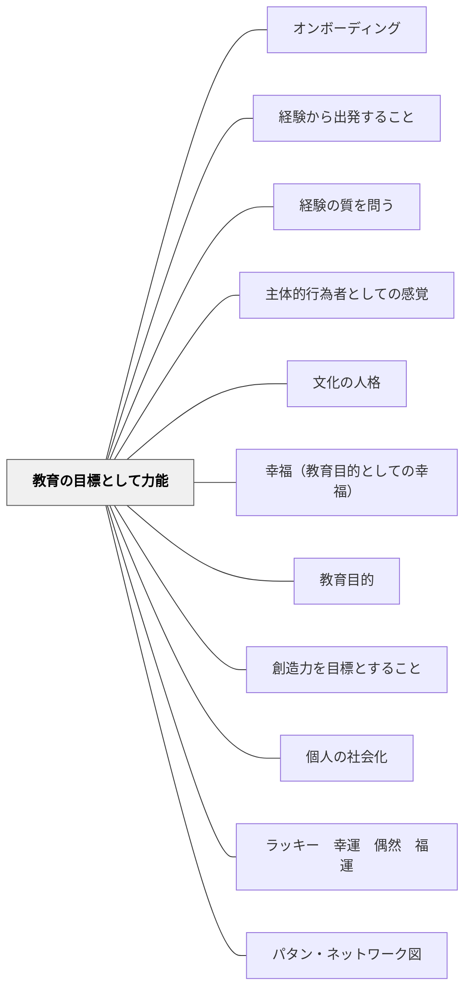

# 教育の目標として力能

> スピノザ哲学では「神すなわち自然（宇宙）」は無限の力能から成る実体であり、個物（人間を含む）はその表現としてそれぞれ独自の力能（なしうる力・コナトゥス）をもつ。教育の目的は、この力能を増大させること——より多くのことができるようになること——にある。

## 背景（Context）

スピノザの哲学が一言で形容されるように「神すなわち自然（宇宙）」は無限であり、その無限の自然／宇宙（すなわち神）は、無限の力能・属性から成る実体です。ここからスピノザは、私たちなどのあらゆる個物もこの神（自然／宇宙）の表現・変化であり、この世界の本質は力（力能）であると考えます。

力（力能）をもっています。太陽はこの世界を照らします。植物には光合成する力があります。この電子書籍も紙の本も書かれたものとして繰り返し読まれる可能性のあるものとしての機能（力能）があります。一つの本は読まれて、ある人には薬となるかもしませんし、毒となるかもしれません。食べ物は、その人に合えば力となります。このように、この自然のあらゆる存在は、神という無限の力能・属性からなる実体の現れ（変化・表現）であると考えると同時に、その現れ（私たちを含む個物）にも力能があると考えるのです。わたしたち個物が神（自然）の現れ（変化・表現）だというのは、國府功一郎さんが例として紹介していますが、シーツに襞ができるようなものです。ある時、シーツに襞ができて、ぴんとシーツが伸びると襞が消える。私たちも宇宙ではこのようなものだというのです。

ここからさらに「善悪は組み合わせによる相対的なものである」というスピノザの重要な考えが出てきます。

## 問題（Problem）

教育の目標をどこに置くべきか。知識の詰め込み・行動の制御・資格の取得が目標になると、学習者が実際に「何ができるようになったか」——すなわちその人の力能が増大したかどうか——が問われなくなる。よい教育とは何かという問いに対して、普遍的な答えを固定することも難しい。なぜなら、善悪は関係（組み合わせ）によって決まるからです。

スピノザはこの点について次のように述べます。

「我々は我々の存在の維持に役立ちあるいは妨げるもの〔・・・〕、言いかえれば〔・・・〕我々の活動能力を増大しあるいは減少し、促進しあるいは阻害するものを善あるいは悪と呼んでいる。」（スピノザ『エチカ』第四部定理八証明）

力能と活動能力は同じ意味だと考えてください。わたし達の力能を増大するものが善で、減少するものが悪と呼ばれているのです。

例えば、音楽は落ち込んでいるときに力となってくれるかもしれません。しかし、疲れすぎているときには、うるさく感じ、私たちの力を低下させるかもしれません。

良書はそもそもあるのだろうか——という問いもここから生まれます。

## 力のかたち（Forces）

- 教育者の意図と学習者の実態のギャップ
- 個々の状況に応じた柔軟な対応の必要性
- 経済性（無駄なコスト・苦しみを省く）の原理

## 解決（Solution）

良書が力能を増大させることもあれば、減少させることもあります。その本が力となるかは、その本と人の組み合わせ・関係によって決まります。もし良書があるとしたら、良書とは、多くの人にとって良い本であると言えるかもしれません。その関係によっては、善くも悪くもない組み合わせもあります。文字が読めない人には、本の文字はインクのしみに過ぎないでしょう。

あまり綺麗な例ではありませんが、便秘の薬は、便秘の人には薬として働きますが、健康な時に飲むと、便が緩くなりすぎて毒となるかもしれません。

この善悪は関係である、組み合わせであるという考え方は教育においても、とても重要です。この考え方から、全ての人に絶対に善い教育は存在しないということ、またいわゆる個別的な教育が必要であることが言えるからです。これは個別的な教育だけでよいということではありません。状況に応じて、人間に共通するところに訴えるような工夫を重ねると同時に、差異に応じた個別的な教育が必要であるということが理論的に言えると思います。

よい教育とは、何か。私は、スピノザの哲学をふまえて、力能を増大させる教育が、よりよい教育であると考えます。そのよい教育は、先ほどの食べ物や音楽の例と同様に、教育と被教育者との関係・組み合わせによって決まるのです。ただ力能が増大すれば、その教育のプロセスがどうでもいいのかということではありません。そのプロセスがいくら楽しくて幸せでも（もちろん楽しくて幸せな方がいいです！）、子どもの力能の増大に繋がらなければ、よい教育とは決して言えないということです。

「教育は児童に幸福なる生活をなさしめるのを目的とする」牧口常三郎

牧口常三郎は、教育の目的は、児童の幸福な生活にあると考えました。この幸福な生活があるとしたら、それはその人の力能が十分に発揮された状態——コナトゥスが阻害されず、なしうることを実際になしている状態——と解釈できます。力能の増大とは、単に知識・技能が増えるということではなく、「生きたいと思う人生を実際に生きられる力」が育つことです（アマルティア・センのケイパビリティ・アプローチとも接続します）。

**教師の手立て（コナトゥス論的アプローチ）**

---

**手立て1: 力能の言語化**  
単元の始めと終わりに「あなたは今回の学びで、何が前よりできるようになりましたか」と問う。「知っている」ではなく「できる・なしうる」の言語で自己評価を促す。

---

**手立て2: 阻害要因の除去**  
力能が増大しない原因は、しばしば内容ではなく環境にある。「なぜ力にならないのか」を「組み合わせ・関係」の視点で問い直す。この子にとってこの課題・この場・この教師はどのような関係か。

---

**手立て3: 個別の組み合わせを試す**  
「全員に同じ教育が善い」という前提を手放し、同じ目標に向かう複数の経路を用意する。Mild / Main / Spicy の3段階タスク設計は、「力能を引き出す組み合わせ」を試みる具体的な実装。

---

## 結果（Consequences）

- 学習者の力能（なしうる力）が増大する
- パタンの圧縮による教育の経済性が実現する
- 関連パタンと重ね合わせることで効果が高まる

## 関連パタン
- [[パタン/オンボーディング]]
- [[パタン/経験から出発すること]]
- [[パタン/経験の質を問う]]
- [[パタン/主体的行為者としての感覚]]
- [[パタン/文化の人格]]

- [[パタン/幸福（教育目的としての幸福）]] — ケイパビリティ・アプローチにおいて力能は幸福の構成要素
- [[パタン/教育目的]] — 力能の増大は教育目的の中心に据えられる
- [[パタン/創造力を目標とすること]] — 創造力は力能のうち最も人間的な次元
- [[パタン/個人の社会化]] — 個人の力能が社会参加の資源になる
- [[概念/パタン・ランゲージ概論]]
- [[パタン/ラッキー　幸運　偶然　福運]] — 偶然を受け取る力・人徳の蓄積も力能の増大として捉えられる
- [[パタン/パタン・ネットワーク図]] — 力能パタンを含む教育パタン・ネットワークの可視化

## クラスター図

## Actionable Insight

- 「この学習で学習者は何ができるようになるのか」を一文で書く——知識の習得より「力能（なしうる力）」の増大を目標の起点にする
- 子どもが「これが自分にとって何の役に立つのか」を言えるよう、授業の最初または最後に一緒に考える
- アマルティア・センのケイパビリティアプローチで問う：「この教育でその子が生きたいと思う人生を実際に生きられるようになるか」——答えが「No」なら目標を見直す

## 出典
- [[文献/教育のパタン・ランゲージ図解バージョン変遷記録（動画記録）]]
- [[文献/メタパタンのパターンリスト（動画記録）]]
- [[文献/一つの教育のパタン・ランゲージ]]

岩井輝久「岩井輝久『一つの教育のパタン・ランゲージ』」（2026-04-29 vault収録）
