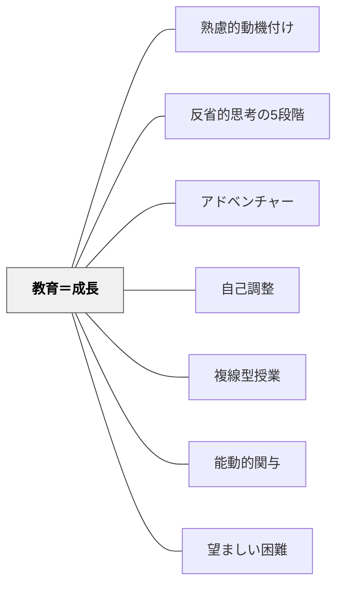

# 教育＝成長

> 教育に外部の終点はない。成長すること自体が目的であり、今この瞬間の経験の質が教育の基準である。

## Pattern Connection

### 細谷恒夫（1957）

細谷の *教育の哲学 人間形成の基礎理論* は、Deweyの「成長」概念をより広い「人間形成（Menschenbildung）」の哲学的視野に接続する。

- **既存パタンとの関連**：Deweyが「成長すること自体が教育の目的」と言うとき、その「成長」の実質とは何か。細谷の人間形成論は、成長が**四つの層（習慣的→知性的→理性的→覚醒）**で同時並行的に起きることを示す。
- **補強された点**：「教育＝成長」は、学校教育という組織的・意図的な教育だけでなく、生活全体を通じた人間形成の中に位置づけられる。教育は人間形成の一部にすぎない——これは成長の源泉を学校の外にも見出す視点を与える。

**人間形成（Menschenbildung）の広がり**

細谷は「教育」と「人間形成」を峻別する：

> 「組織的な学校教育や、教師の行なう方法的な教育が、人間を人間にするのに、極めて大きな力をもっていることは、決して否定できないけれども、それだけで人は人間になるのではない。人はそれぞれの環境のうちに生活し、さまざまの人たちと交渉しつつ人間になってゆくのである」

「教育への問を根源的に提起するとき、哲学的な問として最も根源的なものは、**『人間が人間になること』への問**である」という洞察は、このパタンの「成長すること自体が目的」という命題の哲学的根拠を深める。

| | Dewey（1916） | 細谷（1957） |
|---|---|---|
| 焦点 | 成長プロセスとその質 | 人間形成の全体構造 |
| 広がり | 経験の継続的再構成 | 生活全体を通じた形成（自然・文化・他者との交渉） |
| 成長の層 | 経験の質・連続性 | 四段階の行為様式（習慣→知性→理性→覚醒） |
| 覚醒 | 副次的学習・態度の形成 | 覚醒（Erweckung）として独立した形成様式 |

- **他のパタンへの波及**：[[パタン/人間形成の様式]]（成長の四つの層とその条件）・[[パタン/コミュニティをつくる]]（学校コミュニティが成長の場として機能するための構造）

---

### Dewey（1916）

**既存パタンとの関連**：[[メタパタン/経験から出発する]] が「認識は経験とともに始まる」という出発点を担うのに対し、本パタンは「経験を通じて何に向かって育つか」という方向性を担う。[[パタン/熟慮的動機付け]] のARCS「S（満足）」や「内発的価値」とは、成長の実感そのものが動機であるという点で深く連動している。

**補強された点**：Deweyの「immaturity（未熟性）は積極的な力」という命題は、発達を「欠如の解消」ではなく「可能性の展開」として捉え直す哲学的根拠を与える。子どもの好奇心・可塑性・開放性は、成人が「目標に向けて修正すべき未発達な状態」ではなく、**それ自体が教育的に価値ある資源**である。

**修正・拡張された点**：「準備としての教育（education as preparation）」という概念への根本批判。「今のために学ぶ」のか「将来のために学ぶ」のかという議論に、Deweyは「今この瞬間に成長しているかどうか」という第三の基準を提示する。

**他のパタンへの波及**：[[パタン/アドベンチャー]] の「リスクを負うことで成長する」体験学習、[[パタン/複線型授業]] の自己調整、[[パタン/自己調整]] の内的プロセス——いずれも「成長すること自体が目的」という哲学と整合する。

---

## 背景（Context）

教育はしばしば「何かを準備するためのもの」として設計される——受験のための学習、将来の職業のための訓練、社会で通用するスキルの習得。この「準備としての教育」は学習者の現在の経験を犠牲にして未来の目標を追わせる。

しかしDeweは問う：成人した後の生活が教育の価値を決めるのであれば、成人後の生活は何のためにあるのか？成長の連鎖の終点はどこにあるのか？

## 問題（Problem）

「将来のために今を我慢する」という発想が支配的になると、今の学びの質が軽視される。子どもの好奇心・開放性・可塑性が「修正すべき未発達な状態」として扱われ、教育が「欠如を埋める作業」になってしまう。その結果、学習者は内発的な学びの動機を失い、外から動機づけられなければ動かない状態になる。

## 力のかたち（Forces）

- 「準備のための教育」は現在の経験と未来の目標を分断する——現在の意味を空洞にする
- 子どもの未熟性（immaturity）は確かに経験が不足しているが、同時に可塑性（plasticity）という積極的な力を持っている
- 成長は外部から強制できない——外側から定義された「成熟した状態」に向けて子どもを押し込めば、成長ではなく従順を育てる
- 成人も成長を止めた時点で衰退する——成長は子どもに特有のものではなく生涯の課題

## 解決（Solution）

**「今この瞬間に成長しているか」を教育の基準にする。教育に外部の終点はなく、成長すること自体が目的である。**

---

### 未熟性＝積極的な力

Deweyは「immaturity（未熟性）を欠如と見るのは誤りだ」と断言する。未熟性の本質は2つの積極的な力にある：

1. **依存性（dependence）**：他者に頼れること。社会的関係を作る力。孤立できないことが社会的学習の基盤になる
2. **可塑性（plasticity）**：経験から学ぶ能力。以前の経験から後の状況に役立つものを保持する力

可塑性は単なる柔軟性（flexibility）ではない。**習慣（habit）を形成する力**、すなわち「自分の行為の道具を作る力」である。習慣は技能であり、技能は将来の経験への能動的な態度を生む。

---

### 成長の意味

> "Life is development, and that developing, growing, is life. Translated into its educational equivalents, that means (i) that the educational process has no end beyond itself; it is its own end; and that (ii) the educational process is one of continual reorganizing, reconstructing, transforming."（Dewey, 1916, Ch.4）

成長とは何かへの到達点でなく、**成長する能力そのものの拡大**。子どもが経験の中で「さらに経験しようとする意欲（desire for continued growth）」を持ち、それを現実にする手段を身につけていること——これが学校教育の価値基準。

---

### 「準備としての教育」批判

Deweyが批判する「準備（preparation）」教育の問題：

| 準備教育の発想 | Deweyの批判 |
|---|---|
| 「今を犠牲にして将来に備える」 | 現在の経験を空洞化し、何かに向かう情動的連結を壊す |
| 子どもの興味を抑えて教師の目標に従わせる | 強いられた目的は知性を機械的な手段選択に限定する |
| 成熟＝固定した大人の状態に達すること | 成長を止めた時点で知的・道徳的衰退が始まる |

---

### 好奇心と開放性——子どもが持つ教育的な力

Deweyは指摘する：成人は子どもに「開放性と好奇心を持て」と言うが、自分たちは子どもから開放性と好奇心を学ぶべきではないか？

- 子どもの**好奇心（curiosity）**：世界への直接的で全身的な関与。疑問を恥ずかしいとは思わない
- 子どもの**開放性（open-mindedness）**：固定した観点に縛られず新しい証拠を受け入れる態度
- 子どもの**全面的な関与（whole-heartedness）**：没頭する能力

これらは教育によって育てるべき態度であると同時に、子どもがすでに持っている資源でもある。教育とはこれらを「矯正」するのでなく「方向づける」ことである。

## 結果（Consequences）

- 「今の学びの質」が教育の基準になり、学習者の現在の経験が尊重される
- 子どもの好奇心・開放性・可塑性が「修正すべき未発達な状態」ではなく「積極的な教育的資源」として見直される
- 「将来のため」という外発的動機ではなく、成長の実感そのものが学びの動力になる
- 「成長しているかどうか」という問いが、教師の自己評価・授業設計・子どもの見方を変える
- ただし、「成長それ自体が目的」という原則は、教育の社会的役割（知識・文化の伝達）との緊張を生む——どのように方向づけるかは別途設計が必要

## 関連パタン

- [[メタパタン/経験から出発する]] — 成長の素材は経験にある
- [[パタン/熟慮的動機付け]] — 成長の実感が最も深い内発的動機
- [[パタン/反省的思考の5段階]] — 成長のプロセスとしての思考のサイクル
- [[パタン/アドベンチャー]] — リスクと挑戦を通じた成長の設計
- [[パタン/自己調整]] — 自ら成長の方向を選ぶ能力
- [[パタン/複線型授業]] — 個人の成長の方向を学習者自身が選ぶ
- [[パタン/能動的関与]] — 能動的関与が成長の条件
- [[パタン/望ましい困難]] — 成長を促す適切な困難の設計

---

## クラスター図

## Actionable Insight

- 授業の目的を「〜を習得させる」ではなく「〜についてさらに知りたいという気持ちを育てる」に書き換えてみる——「継続成長への欲求」を育てているかが教育の真の基準
- 子どもが「それってどういうこと？」と聞いてきたとき、その好奇心自体を成功として受け止める——好奇心は欠如のサインではなく、可塑性（plasticity）という積極的な力の現れ
- 「将来のため」ではなく「今日この経験の中で何が面白かったか」を振り返りで問う——現在の経験の質を基準にすることで、内発的な成長の動力が育まれる

---

## 出典

Dewey, J. (1916). *Democracy and Education: An introduction to the philosophy of education*. Macmillan. (Ch. 4–5)

> "The criterion of the value of school education is the extent in which it creates a desire for continued growth and supplies means for making the desire effective in fact."

> "The inclination to learn from life itself and to make the conditions of life such that all will learn in the process of living is the finest product of schooling."

- [[文献/Democracy and Education（Dewey）]]
