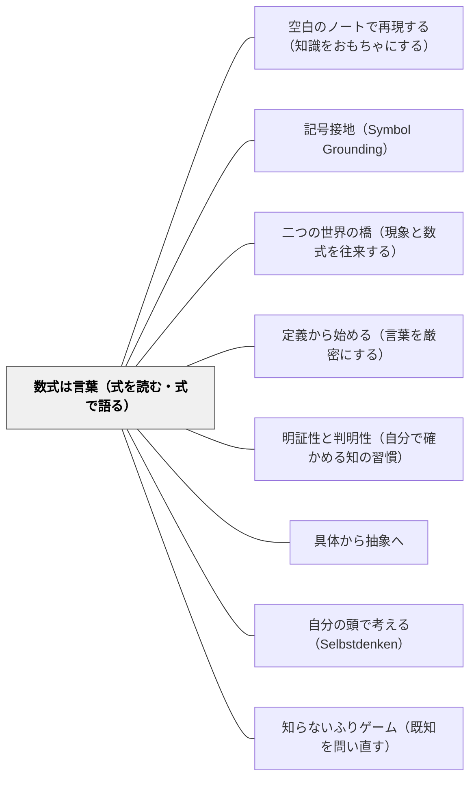

# 数式は言葉（式を読む・式で語る）

> 「言葉が考える道具でもあり伝える道具でもあるのと同じだ。数式も考える道具でもあり伝える道具でもある。」（第5章 ミルカ）

本パタンは式を「語彙・言語」として読み書きする側面を扱う。式が現実とのモデルとして機能する側面は [[パタン/二つの世界の橋（現象と数式を往来する）]] を参照。

---

## [Pattern Connection]

**数学ガールの物理ノート／ニュートン力学（結城浩, 2024）統合：**

ミルカが第5章「宇宙へ飛び出そう」のクライマックスで語る言葉——「数式は考える道具であり伝える道具である」——は、数式と言語の構造的同一性を主張する認識論的宣言。数式を「答えを出す機械」ではなく「思考を整理し他者と共有するための言語」として扱うことで、読む・書く・語るという言語的実践が数学教育に入り込む。

- **既存パタンとの関連**:
  - [[パタン/記号接地（Symbol Grounding）]] との根本的な接続——記号が身体的・経験的な意味に接地することと、数式が「言語として機能すること」は同じ現象の両面。「収入と貯金」比喩（仕事とエネルギーの関係）は記号接地の典型的実践。
  - [[パタン/明証性と判明性（自分で確かめる知の習慣）]] との接続——「自分の言葉で説明できるか」という明証性の確認に、「自分の数式で語れるか」が加わる。算数・数学における「判明に理解した」基準が、式を読み語れることになる。
  - [[パタン/定義から始める（言葉を厳密にする）]] との接続——言葉を厳密にすることと数式を正確に使うことが同じ認識論的営みとして結ばれる。「判明に区別できること」（デカルト）の数学版。

- **補強された点**:
  - [[パタン/具体から抽象へ]] の終着点を「抽象的言語としての数式」として明示する。具体操作→数式という道筋の「到達点」が言語的能力として具体化される。
  - [[パタン/自分の頭で考える（Selbstdenken）]] の数学版として機能する——「数式で考える」は「数式という道具で自分の頭を使う」こと。

- **他のパタンへの波及**:
  - [[パタン/二つの世界の橋（現象と数式を往来する）]] — 数式が「言語」であるなら、物理現象↔数式の往来は「翻訳」になる。この橋は言語の橋でもある。
  - [[パタン/知らないふりゲーム（既知を問い直す）]] — 数式を「知らない言語」として再出発するのが「知らないふりゲーム」。言語の再学習に近い。

---

## 背景（Context）

算数・数学の授業で、式を「立てる」「計算する」「答えを出す」——この三段階で式との関わりが終わる子どもがいる。式は「正解へのルート」であり、正解を出したら役割を終える道具だ。

しかし言語として見ると、数式は「読める」「語れる」「問いを立てられる」ものになる。`v = v₀ + at` はただの計算式でなく、「速度は初速と、加速度に時間をかけた分だけ増える」という文章だ。読めれば意味が分かる。書けば思考が整理される。

数式を「言語」として扱う文化が教室にあれば、「この式は何を言っているの？」という問いが自然に生まれる。

## 問題（Problem）

数式が「計算機械」として使われ、思考・理解と切り離される：

- 公式を覚えて「入れれば答えが出る」が、式の意味を説明できない
- 式を「書く」ができるが「読む」ができない——何が何を表すか言えない
- 文章題で「どの式を立てるか」が分からない——状況と式が接続していない
- 「数式で考える」という発想がなく、考えるときは言語（言葉）だけで、式は計算フェーズでのみ使う

## 力のかたち（Forces）

- 計算の正確さと式の理解は別の能力——計算が得意でも式の意味が曖昧な子どもは多い
- 「式を読む」経験が少ない——授業での式は多くの場合「計算する対象」として提示される
- 「自分の言葉で数式を語る」機会の欠如——式を語る場面を意図的に設計しないと生まれない
- 「抽象的だが、あいまいではない」（ミルカ）——抽象的な数式に意味があると信じられないと、記号の操作だけになる

## 解決（Solution）

**数式を「言語」として扱う教室文化を作る。「この式は何を言っているの？」「この式でどんな場面を表せる？」という問いを、式の直後に入れる。式を「立てる・計算する・答える」から「読む・語る・問いを立てる」に広げる。**

---

### 数式を言語として扱う三実践

**1. 式を声に出して「読む」**
`a = F/m`（加速度=力÷質量）を「力が大きいほど、重さが軽いほど、よく動く」と読む。式を読む練習が「意味を理解する」練習になる。算数なら `速さ = 道のり ÷ 時間` を「1秒間（1分間）で何m進むかを表している」と読む。

**2. 式を「翻訳する」**
数式→日本語、日本語→数式を往来する。「速さ×時間=距離」を `d = vt` に、`vt = d` を「速さで t 時間走ると d 進む」に変換できる力が、言語としての数式能力。

**3. 「この式で何が言えるか」を問う**
「この式が正しいとしたら、何が分かる？」——式からの推論が数学的言語使用の核心。テトラが「ということは…」と続ける思考の展開がこれにあたる。

---

### 具体例

**例1: 小学校「速さ=道のり÷時間」**
「この式は何を言ってる？」——「速さは、1秒間（1分間）に進む距離のことだよって言ってる」。式が「定義の言葉」であることが見える。正解/不正解でなく、式を語る対話が生まれる。

**例2: 中学「F = ma」**
式の「言葉訳」を複数作る——「力は質量と加速度の積」「同じ力なら重いものは動きにくい」「同じ質量なら力が強いほど速く動く」。一つの式から複数の「読み」が取れることが、式の豊かさを示す。

**例3: 算数の文章題**
「どんな場面？」→「式で書くとどうなる？」の順で進む。場面から式への翻訳、式から場面への翻訳を両方練習する。「式が場面を表している」という認識が文章題の苦手感を変える。

**例4: 岩井の数学デイリー**
「この式が何を言っているかを自分の言葉で書く」——計算後に一行で「この式が言っていること」を書く練習が、明証性の確認（判明に理解したか）になる。「答えは合っていたが、式の意味は言えなかった」という発見が理解の点検を促す。

## 結果（Consequences）

- 「式を立てられない」が減る——場面と式の接続が「翻訳」の感覚で行われるようになる
- 「答えは出たが意味が分からない」という学習から脱する——式の読み書きが理解のバロメータになる
- 数学的コミュニケーションが生まれる——「この式はこう読める」という対話が教室で起きる
- ただし: 式を「読む」訓練は、計算習熟より時間がかかる——カリキュラムの進度との調整が必要

## 関連パタン
- [[パタン/空白のノートで再現する（知識をおもちゃにする）]]

- [[パタン/記号接地（Symbol Grounding）]] — 記号に身体的・経験的意味を与えること
- [[パタン/二つの世界の橋（現象と数式を往来する）]] — 現象↔数式の往来が「翻訳」
- [[パタン/定義から始める（言葉を厳密にする）]] — 言葉の厳密化と数式の正確な使用
- [[パタン/明証性と判明性（自分で確かめる知の習慣）]] — 「式で語れるか」が理解の確認基準に
- [[パタン/具体から抽象へ]] — 具体→抽象の到達点としての数式言語
- [[パタン/自分の頭で考える（Selbstdenken）]] — 数式という道具で考えること
- [[パタン/知らないふりゲーム（既知を問い直す）]] — 式を「知らない言語」として再体験
- [[文献/数学ガールの物理ノート・ニュートン力学（結城浩）]] — 本パタンの出典

---

## クラスター図

## Actionable Insight

- 式を板書した後「この式は何を言ってるの？」と聞く一言を習慣にする——正解を求める問いでなく「式を読む」練習になる
- 文章題の前に「式と場面の翻訳ゲーム」——教師が日本語で場面を語り、子どもが式で書く。または式を示して「どんな場面？」と聞く。往来の練習が接続を作る
- 計算ノートに「この式が言っていること:」の欄を設ける——一行で式の意味を書く習慣が、言語としての数式使用を訓練する

---

## 出典

結城, 浩（2024）.『数学ガールの物理ノート／ニュートン力学』SBクリエイティブ. 第5章.

> 「言葉が考える道具でもあり伝える道具でもあるのと同じだ。数式も考える道具でもあり伝える道具でもある。」（第5章 ミルカ）
