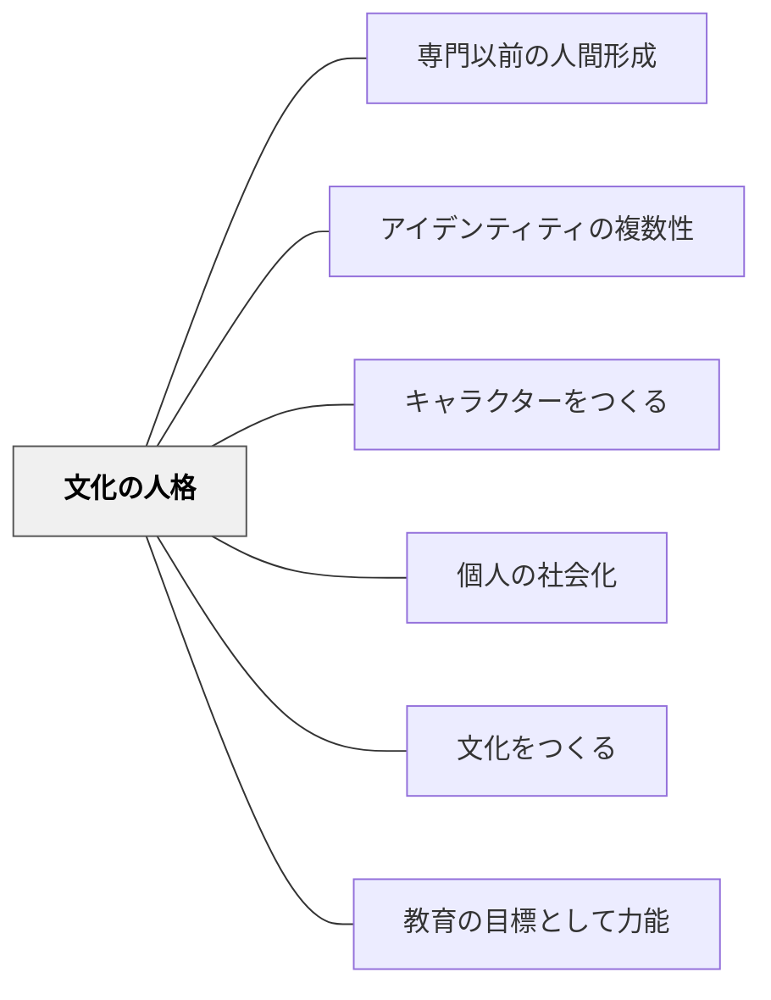

# 文化の人格

> 文化の人格は、教育の目的である。文化の人格は、教育の軌道である。

## Pattern Connection

### モンテスキュー（1748）——「依人の依法化」の哲学的根拠

牧口常三郎の第四指標「依人の依法化」は、仏教の「依法不依人」を源流とするが、モンテスキューの『法の精神』がその哲学的な補強を与える。

モンテスキューは冒頭で宣言する：

> 「Je n'ai point tiré mes principes de mes préjugés, mais de la nature des choses.」
> （私は原理を自らの偏見から引き出したのではなく、事物の本性から引き出した。）

この宣言こそが「依法化」の認識論的な表明である——人の権威・偏見・思い込み（依人）ではなく、事物の本性に潜む必然的な構造（依法）から判断する。

さらに斎藤正二（創価大学）の読解（斎藤正二著作集7）によれば、この「法」概念はケプラー・ニュートンの自然法則、カッシーラーの認識論と連続する：**構造の必然性を認識すること＝真の知識**。つまり依法化とは「自然法則を認識するのと同じ知的態度で、社会・教育の法則を認識すること」である。

- **教育のパタン・ランゲージとの接続**：「あの先生の授業がうまい」を「あの先生だから」（依人）でなく「このパタンが働いているから」（依法）として記述・共有できるようにすること——これが教育パタン・ランゲージの本質的な意義であり、第四指標の実践形態である。
- **第四指標の補強**：牧口の説明（数学・科学で思い込みから脱却）にモンテスキューが加えるのは「社会・人間関係・教育にも同じ必然的構造がある」という視野の拡張。科学的法則だけでなく教育的法則も「依法化」の対象。

[[文献/法の精神（モンテスキュー）]]

---

## 背景（Context）

「人格の完成」とは何か——日本の教育基本法にも「人格の完成」が教育の目的として掲げられているが、これだけでは漠然としすぎている。そもそも「人格って何なのか」「人格の完成ってどういう状態なのか」を考えることが大事だ。「思いやりのある人」「優しい人」といった抽象的なイメージを超えた、具体的な指標が必要である。

**教育自体には善悪はない。** 例えば泥棒を育成するための学校があったとしよう。その学校の中では、優秀な泥棒を育てることが「良い教育」となる。しかしその世界に生きている1人1人や社会にとってはどうだろうか。優秀な泥棒をたくさん育てることで私たちは幸せになれるのか——ならない。教育自体に善悪はなく、何が良い教育かはその教育の目的によって決まる。（なお「泥棒学校」という絵本が実際にある。）

しかし教育には**適切な目的・軌道**があると考えている。その目的・軌道で考えて、やってみて、試行錯誤している間は教育の道を大きく外すことはないと考えている。

## 問題（Problem）

教育の目的が曖昧であれば、どんな教育実践も「それでいいのかどうか」を判断できない。目的のないまま実践を重ねても、道を大きく外すことはないかもしれないが、目指す方向が定まらない。

## 力のかたち（Forces）

- 「人格の完成」という言葉には共感を覚えるが、具体的に何を目指しているのか不明確になりがち
- 教育自体には善悪がない——目的の設定によって「何が良い教育か」は変わる
- 個人の幸福と社会の発展を両立させる目標設定が必要である
- 人格の形成は社会のあり方と繋がっている——切り離して考えることはできない

## 解決（Solution）

「学問は綱渡りや皿回しとは違う。芸を覚えるのは末のことである。人間が出来るのが目的である。大小の区別のつく、軽重の等差を知る。好悪の判然する、善悪の分界を呑み込んだ、賢愚、真偽、正邪の批判を謬らざる大丈夫が出来上がるのが目的である。」——夏目漱石

教育には適切な目的・軌道がある。**文化の人格**は、牧口常三郎が「創価教育学体系」1〜2巻と3〜4巻をつなぐ「創価教育6大指標」として3巻冒頭に図示したものである。牧口は各指標について具体的な説明を加えていないが、著書などを通してその意味を考えることができる。**自然の個性**から**文化の人格**への形成プロセスとして、6つの指標が示されている。

---

### 自然の個性 → 文化の人格

```
自然の個性
  一　感情の理性化
  二　自然の価値化
  三　個人の社会化
  四　依人の依法化
  五　他律の自律化
  六　放縦の統一化
文化の人格
```

---

### 一　感情の理性化

スピノザ「エチカ」より：

> 「感情を翻し、抑制することができないことを隷属と呼ぶ。感情に翻弄される人間は自己の支配の元にはなくて運命の支配の元にある。」

感情の理性化とは、理性によって感情を統御・抑制する力を育てることだ。感情は人生の幸福や社会の発展に欠かせないものだ。しかし全ての感情をそのまま表出すれば多くのトラブルを生み出すことになるだろう。感情に翻弄されず自己の主人公となること——それが最初の指標である。

---

### 二　自然の価値化

牧口常三郎（創価教育学体系 第6巻）より：

> 「価値を帯びぬ自然の状態に働きかけ手を加えて価値を生ぜしめること。また生まれたままの自然状態の人を価値を自覚し、価値の創造に向かう価値を有した人格に形成すること。」

私たちは大地に働きかけることで野菜や果物を育てる。作物が育たない大地でも人が働きかけることで収穫できるようになる。科学技術の発展によって自然状態にない素材を人類が生み出してきたことも、自然の価値化の現れである。人も同様に、自然状態のままでなく、価値の創造に向かう人格へと形成されていく。

---

### 三　個人の社会化

個人の社会化とは、個人が社会の一員として必要とされる価値観・行動様式・ルール・知識・技能などを習得して社会に適応していく過程を指す。言語・文化・価値観の習得、社会規範やルールの理解、コミュニケーション能力の向上、協調性や共同作業能力の発達などが含まれる。

**学校の学習との接続**：社会に出てやり取りする時に言葉が扱えないと困る。ある程度の計算ができないと困る場面は多い。算数や国語の学習は、まさに今の社会で必要なものを習得していく社会化の過程だ。1つ1つの知識をちゃんと理解して活用できるようになっていくことが、そのまま社会化であり、人格の形成であり、人格の完成に向かうプロセスなのだ。

---

### 四　依人の依法化

仏教の「依法不依人（人に依らず法に依れ）」がルーツにある指標。依人の依法化は、数学・科学などで思い込みから脱却して、法やパターンを判断材料に生活できるようになることである。人に頼るのではなく、物理学の法則やそういったものを判断材料として生活できるようになること。

全ての知識は感情・関心・欲望から完全に無縁ではない。しかし数学や統計学は、完全ではないにしても、そういった主観・思い込みからある程度切断した知識を生み出す道具になる。人の権威ではなく法による支配（法の支配）、そして科学的法則の発見と応用——これらも依法化の現れである。

**モンテスキューとの接続**：モンテスキューは『法の精神』冒頭で「私は原理を自らの偏見（préjugés）からではなく、事物の本性（nature des choses）から引き出した」と宣言した。これは依法化の認識論的宣言である。斎藤正二はこの「事物の本性から生じる必然的な関係」という法概念を、ニュートン・ケプラーの自然法則と連続するものとして読む——科学で自然の法則を発見するのと同じ知的態度で、社会・教育の法則を認識せよ、という教育論。

**パタン・ランゲージとの接続**：アレグザンダーの「パタン」も「実践の本性から発見される必然的な関係」として定義される。教育のパタン・ランゲージを学ぶことは、教育現象の依法化——名人の属人的な勘（依人）を発見可能な構造（依法）として記述・共有すること。

---

### 五　他律の自律化

他律の自律化とは、自己の意思や判断に基づいて自らの行動を決定・実行できるようになることだ。外部からの指示や制約に左右されず、より創造的な活動を展開することができる。

**ローレンス・コールバーグの道徳的発達段階**は、他律の自律化を目指したものだといえる。人が道徳的判断を行う過程でどのような成長を経験するかを示した理論で、6段階を経て他律から自律へと成長していく：

| 段階 | モラル | 内容 |
|------|------|------|
| 1 | 罰と服従 | 報酬があるからやる、罰があるからやらない |
| 2 | 自己利益 | 自分の利益に基づいた行動を取る |
| 3 | 社会的モラル | 社会のルールに従い他者との関係に配慮する |
| 4 | 法と秩序 | 法律や秩序を重視し社会的に認められた基準に従う |
| 5 | 社会契約 | 普遍的な道徳原理を尊重し自己決定権や自由意思を重視する |
| 6 | 抽象的原理 | より高次の普遍的な道徳原理に基づいた行動を取る |

コールバーグは、このような段階的な道徳的発達が人がより高次の倫理的価値を理解できるようになるため重要だと考えた。道徳的な発達が適切に促進される環境を整えることが社会の発展につながると主張した。

---

### 六　放縦の統一化

放縦（わがまま・勝手きまま）の状態を、均衡のとれた統一ある状態へ向かわせることだ。文化の人格には、自らの言動に矛盾のない人格的な統一性が求められる。言っていることとやっていることが一致している——その一致を目指していくことでもある。

---

「文化の人格を形成することによって、個人の幸福や世界の平和に少しずつ近づいていくことができる」。

---

### 人格の形成と社会の繋がり

人格の形成と社会のあり方は切り離して考えるべきではない——繋がっていると考えている。

いくら社会の仕組みを整えたとしても、人が良くなければその仕組みは絶対的なものではない。良い仕組みであっても、権力を持っている人たちの都合のいいように変えられてしまうかもしれない。1人1人が人格を形成して力をつけていくことが、より良い社会の形成・維持に役立っていく。

キルケゴールの指摘——1人1人が賢くなっていけば、権力を持った人たちがズルをやりにくくなる。私たちが無関心で見抜く力がなければ、権力の乱用を許してしまうかもしれない。教育はその意味でも社会の基盤である。

教育の正しい軌道——人に押し付ける気はないが、人間や人間の社会にとっての「正しい軌道」というものは存在すると考えている。泥棒をたくさん育てても皆の幸せには繋がっていかない。教育基本法にある「人格の完成」という目的は妥当だ。

## 結果（Consequences）

- 「人格の完成」という曖昧な目標が、6つの具体的指標として立ち現れる
- 教育実践の振り返りに判断基準が生まれる（どの指標に働きかけているか）
- 文化の人格は最も外側の大きな円——この方向性の中にすべてのパタンが位置づけられる
- 人格の形成が社会の質の維持・向上につながるという大きな視点が生まれる

## 関連パタン
- [[パタン/専門以前の人間形成]]
- [[パタン/アイデンティティの複数性]]
- [[パタン/キャラクターをつくる]]
- [[パタン/個人の社会化]]

- [[メタパタン/価値を目標とする]] — 教育の目的=価値の実現
- [[メタパタン/経験から出発する]] — 自然の個性という出発点
- [[パタン/文化をつくる]] — 文化の人格を育む文化づくり
- [[パタン/教育の目標として力能]]
- [[文献/法の精神（モンテスキュー）]] — 「依人の依法化」の哲学的根拠・事物の本性から法則を引き出す認識論

## クラスター図



## Actionable Insight

- 今の授業実践が6指標のどれを育てているかを1つ考える——「感情の理性化」か「個人の社会化」か——目的が明確になると授業の見方が変わる
- 子どもが感情に翻弄されているとき「今の感情は何？どう扱えばいい？」と一緒に考える——感情の理性化の入口
- 授業で「なぜこれを学ぶのか・社会でどう使うのか」を1つ伝える——個人の社会化を意識した一言が学習に意味をもたせる

## 出典

牧口常三郎「創価教育学体系」第3巻（創価教育6大指標）・第6巻（自然の価値化）  
スピノザ「エチカ」（感情の理性化）  
夏目漱石（学問の目的）  
ローレンス・コールバーグ（道徳的発達段階理論）  
仏教「依法不依人」（依人の依法化）  
岩井輝久「教育のパタン・ランゲージ図解バージョン変遷記録（動画記録）V12（2025/08/17）」  
岩井輝久「パタン　文化の人格（動画記録）」https://youtu.be/MSGdqlkpSNQ
