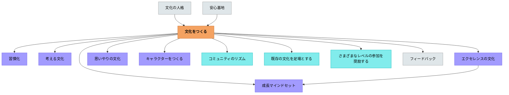

# 文化をつくる

**一文でいうと**：価値・規範・習慣を意図的に積み重ね、学び方そのものをクラスの文化にする。

## 使いどころ・使いすぎ注意

| 観点         | 内容                                         |
| ------------ | -------------------------------------------- |
| 使いどころ   | 繰り返される価値や習慣を育てたいとき。       |
| 使いすぎ注意 | 文化を急いで作ろうとすると、標語だけになる。 |

> 新しい文化が根付くまでの近道はなく、長期間にわたるコミットメントが必要です。学校のあり方そのものを変えなくてはなりません。— ロン・バーガー

---

## Pattern Connection

**Senge et al.（2000/2012）統合（2026-05-14）：**

_Schools That Learn_ の共有ビジョン（Shared Vision）とシステム思考（Systems Thinking）は、本パタンの「コミュニティをつくる」構造にシステム的な視点を加える。

- **補強された点**：本パタンが「文化の種類」と「コミュニティ設計の原則」を扱うのに対し、Sengeは「なぜ文化変革が失敗しやすいか」をシステム・アーキタイプで説明する。「文化変革の努力→短期成果への圧力→根本変革が後退→問題の再燃」というFixes That Failのパターンが文化づくりの最大の障壁になる。
- **接続した概念**：共有ビジョン——「うちの学校をこんな場所にしたい」というビジョンが管理職からでなく、教師・保護者・子どもが問いから始めて育てるとき、それは文化の土台になる。外から与えられたビジョンは文化にならない。
- **他のパタンへの波及**：[[パタン/学習する学校]] が組織全体の学習能力の構造を扱い、本パタンと相互補完関係にある。

---

## 背景（Context）

文化とは、特定の集団が共有する信念・価値観・習慣・言語・技術・芸術など、あらゆる知識と行動の総体である。学校には、意図するしないにかかわらず、つねに文化がある。「チャレンジは恥ずかしい」という文化も、「失敗から学ぶのが当たり前」という文化も、どちらも文化である。

**文化をつくること＝コミュニティをつくること**。キーワードは「コミュニティ」「当たり前」「習慣」。

## 問題（Problem）

何も意図しなければ、学校の文化は「点数」「競争」「間違えないこと」を中心に自然形成されやすい。その文化の中では、教師がどれほど優れた授業設計をしても、学習者が本来の学びへ向かわない。

## 力のかたち（Forces）

- 文化は明示されないため、変えようとすること自体が難しい
- 文化変革には数年単位の時間がかかる
- 個人の努力だけでは変わらない；コミュニティ全体の変化が必要
- 既存の文化には継承すべき価値もあり、全否定はかえって逆効果

## 解決（Solution）

**意図的に、段階的に、コミュニティとしての「当たり前」を育てる。**

「エクセレンスの秘密は、文化にあります。家庭や地域コミュニティや学校に、質の高い作品を生み出すことを期待し、支援を惜しまない文化があると、子どもたちはその文化に適応しようとするのです。」— ロン・バーガー

文化には大きく二つの次元がある。一つは**どんな文化を育てるか**（文化の種類）、もう一つは**どうやってコミュニティとして育てるか**（設計の原則）。

### 文化の種類（何を育てるか）

| パタン                              | 内容                                     |
| ----------------------------------- | ---------------------------------------- |
| [[パタン/コミュニティをつくる]]     | 実践コミュニティを土台とする             |
| [[パタン/当たり前をつくる]]         | 望ましい規範を「当たり前」にする         |
| [[パタン/習慣化]]                   | ルーティンが自動化されるまで反復する     |
| [[パタン/考える文化]]               | 思考が毎日の当たり前の経験の一部になる場 |
| [[パタン/贈与し合う文化]]           | ペイフォワード的な与え合いのリズム       |
| [[パタン/思いやりの文化]]           | 学びの安全基地を支える相互ケア           |
| [[パタン/読み書きの文化]]           | 民主主義と自己表現の土台                 |
| [[パタン/話し合う文化]]             | 民主主義の実践としての対話               |
| [[パタン/聴き合う文化]]             | 真の対話を支える聴くことの文化           |
| [[パタン/提案する文化]]             | 主体的に提案していく習慣                 |
| [[パタン/エクセレンスの文化]]       | 卓越を目指し批評し改善し続ける           |
| [[パタン/フィードバック文化]]       | フィードバックが学習を駆動する           |
| [[パタン/間違いや失敗から学ぶ文化]] | フィードバックを支える土台               |
| [[パタン/成長マインドセット]]       | 能力は努力で伸びるという信念             |
| [[パタン/キャラクターをつくる]]     | 学習に向かう姿勢を共通言語化する         |

### コミュニティ設計の原則（どうやって育てるか）

ウェンガー『コミュニティ・オブ・プラクティス』をもとに：

| パタン                                            | 内容                                             |
| ------------------------------------------------- | ------------------------------------------------ |
| [[パタン/進化的設計]]                             | 発展を導く触媒として、設計は少なく実行は十分に   |
| [[パタン/内部と外部それぞれの視点を取り入れる]]   | 内側の知識と外部の刺激の両方が必要               |
| [[パタン/さまざまなレベルの参加を奨励する]]       | コア・アクティブ・周辺の3層を意識する            |
| [[パタン/公と私それぞれのコミュニティ空間を作る]] | 全体イベントと1対1の私的つながりの両方           |
| [[パタン/親近感と刺激を組み合わせる]]             | 安心の定例と刺激的な冒険の組み合わせ             |
| [[パタン/コミュニティのリズムを生み出す]]         | リズムが文化の活気を最もよく表す                 |
| [[パタン/分散型リーダーシップ]]                   | コミュニティは内部のリーダーシップを糧に発展する |
| [[パタン/公式と非公式のダンス]]                   | 公式要件と個人の情熱の緊張を正面から扱う         |
| [[パタン/コミュニティの価値を可視化する]]         | コミュニティにいる価値を見えるようにする         |
| [[パタン/既存の文化を足場とする]]                 | 既存の文化を1から作り直そうとしない              |
| [[パタン/文化活動のペースを調整する]]             | 文化変革には5年以上かかることを前提にする        |

## 結果（Consequences）

- 学習が「やらされること」でなく「当たり前のこと」になる
- 教師の個別指導の効果が文化によって増幅される
- 一つの良い文化は関連する文化も引き寄せる（文化の共鳴）

## このパタンが働く実践

| 実践                                          | どのように働くか                                                         |
| --------------------------------------------- | ------------------------------------------------------------------------ |
| [[実践/ライティング・ワークショップ年度初め]] | 書く時間・白紙の冊子・作家の椅子を通して、書くことを教室の当たり前にする |
| [[実践/デイリー5の起動]]                      | 独立読書・書く・言葉の活動を日課にし、自立した読み書き文化を育てる       |
| [[実践/リテラシー・ワークステーションの起動]] | ステーションで、教師がいない場でも学びが続く環境と役割を作る             |
| [[実践/リテラチャー・サークルの起動]]         | 役割を持った読書対話を重ね、読むことを共同探究の文化にする               |
| [[実践/学習する学校をつくる]]                 | クラスを超えて、学校全体で学び続ける文化を設計する                       |

## 関連パタン
- [[学級経営/学級経営で使えるパタン]]
- [[学級経営/心理的安全性]]
- [[学級経営/文化をつくる]]
- [[パタン/間違いや失敗から学ぶ文化]]
- [[パタン/考える文化]]
- [[パタン/聴き合う文化]]
- [[パタン/読み書きの文化]]
- [[パタン/間接的に説明するメッセージ（会話のメタメッセージ）]]
- [[パタン/思いやりの文化]]
- [[パタン/習慣化]]
- [[パタン/当たり前をつくる]]
- [[パタン/エクセレンスの文化]]
- [[パタン/キャラクターをつくる]]
- [[パタン/コミュニティのリズムを生み出す]]
- [[パタン/コミュニティの価値を可視化する]]
- [[パタン/コミュニティをつくる]]
- [[パタン/さまざまなレベルの参加を奨励する]]
- [[パタン/フィードバック文化]]
- [[パタン/学習する学校]]
- [[パタン/既存の文化を足場とする]]
- [[パタン/公と私それぞれのコミュニティ空間を作る]]
- [[パタン/公式と非公式のダンス]]
- [[パタン/親近感と刺激を組み合わせる]]
- [[パタン/進化的設計]]
- [[パタン/成長マインドセット]]
- [[パタン/贈与し合う文化]]
- [[パタン/多方興味]]
- [[パタン/提案する文化]]
- [[パタン/内部と外部それぞれの視点を取り入れる]]
- [[パタン/分散型リーダーシップ]]
- [[パタン/文化活動のペースを調整する]]
- [[パタン/話し合う文化]]

- [[パタン/安心基地]] — 文化をつくるための心理的安全
- [[パタン/フィードバック]] — フィードバック文化の具体的実践
- [[パタン/ロールモデル]] — エクセレンスの文化を支える
- [[パタン/文化の人格]] — 文化を体現した人格モデル
- [[パタン/アドベンチャー]] — 挑戦の文化を作るための冒険設計
- [[パタン/ビッグメッセージ]] — 文化の価値観を一つの強い言葉で届ける
- [[パタン/好奇心から多方興味へ]] — 好奇心を文化として育てる
- [[パタン/環境調整]] — 文化を支える物理的・社会的環境を整える
- [[パタン/ブック・トーク]] — 読む文化をクラス全体に広げる
- [[パタン/世界観]] — 教師の世界観がクラス文化の種になる
- [[パタン/アイデンティティの複数性]] — 多様なアイデンティティが共存できる文化をつくる

## クラスター図
<!-- cluster: manual -->

## Actionable Insight

- 「クラスで大切にしたいこと」を子どもたちと1つ言語化する——押しつけでなく子どもが作った言葉が文化の種になる
- 良い行動・学びの姿を見かけたら、その場で全体に共有する——「今の◯◯さんの聴き方がよかった」が文化を形成する最小単位
- 「失敗した→話し合う→修正する」のサイクルを1回クラスで経験させる——失敗から学ぶ文化は体験なしには根付かない

## 出典

- Berger, R. (2003). _An Ethic of Excellence: Building a Culture of Craftsmanship with Students_. Heinemann.（邦訳（2023）『子どもの誇りに灯をともす』英治出版）
- Wenger, E., McDermott, R., & Snyder, W. M. (2002). _Cultivating Communities of Practice_. Harvard Business School Press.（邦訳（2002）『コミュニティ・オブ・プラクティス』翔泳社）
- 動画記録：[[文献/コミュニティオブプラクティスと文化をつくるパタン（動画記録）]]

---

## 下位パタン一覧

| パタン                                            | サマリー                                                                                                     |
| ------------------------------------------------- | ------------------------------------------------------------------------------------------------------------ |
| [[パタン/さまざまなレベルの参加を奨励する]]       | コミュニティへの参加は強制できない。焚き火を起こし、そのぬくもりに引き寄せる。                               |
| [[パタン/キャラクターをつくる]]                   | 学習に向かう姿勢を共通言語として具体化するために、それを体現したキャラクターをつくる。— シャーリー・クラーク |
| [[パタン/コミュニティの価値を可視化する]]         | コミュニティにいる価値が見えにくい。可視化することで、積極的な関与を促す。                                   |
| [[パタン/公と私それぞれのコミュニティ空間を作る]] | コミュニティの中心にあるのはメンバーの人間関係の繋がりであり、日常的なやり取りの大半が1対1の関係で起こ…      |
| [[パタン/内部と外部それぞれの視点を取り入れる]]   | 優れたコミュニティを設計するためには、コミュニティの本質を見抜くことのできるインサイダーの観点が不可欠だ…    |
| [[パタン/思いやりの文化]]                         | 学びは脆弱さを要求する。脆弱さは安全を要求する。安全はケアを要求する。                                       |
| [[パタン/提案する文化]]                           | 主体的に提案していく習慣が、学習者を能動的な市民にする。                                                     |
| [[パタン/文化活動のペースを調整する]]             | 文化変革には5年以上かかる場合もある。期待は控えめに、自然なリズムで。                                        |
| [[パタン/既存の文化を足場とする]]                 | コミュニティに基づくアプローチの強みは、より強固な学習文化を組織全体ではなくもっと小さな規模で築くことか…    |
| [[パタン/習慣化]]                                 | 習慣は第二の天性である。— アリストテレス                                                                     |
| [[パタン/親近感と刺激を組み合わせる]]             | 成功しているコミュニティはメンバーにとって故郷のような心やすい場所であると同時に、興味を引く変化に富んだ…    |
| [[パタン/話し合う文化]]                           | 話し合いは民主主義の基礎である。                                                                             |
| [[パタン/贈与し合う文化]]                         | お金ではなく互いに与え合う。ペイフォワード的な増与のリズム。                                                 |
