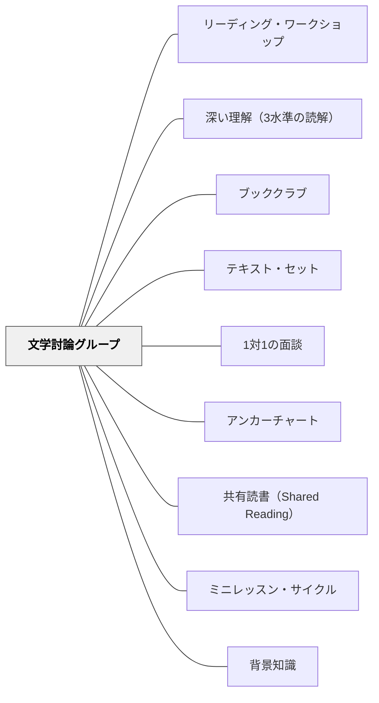

# 文学討論グループ

> 本について語り合うことは、本を読むことと同じくらい強力な読解行為だ——言語が理解を形作る。

---

## Pattern Connection

**出典**: Dorn, L. J., & Soffos, C.（2005）*Teaching for Deep Comprehension: A Reading Workshop Approach*（Ch.7）. Stenhouse Publishers.（統合：2026-05-19）

- **既存パタンとの関連**：本パタンは [[パタン/リーディング・ワークショップ]] の「小グループ指導」コンポーネントのうち「文学討論グループ（Literature Discussion Groups）」を詳細展開する。[[パタン/ブッククラブ]] が「子どもたちが自律的に本について語り合う」場であるのに対して、本パタンは教師が足場として参加する「徒弟制モデル（Apprenticeship）」の文学討論を扱う
- **補強された点**：**リテラル言語（Literate Language）**という概念が加わった——日常語（automatic language）とは異なる「本の言語」を習得することが深い読解の条件。文学討論グループはその習得の場になる
- **拡張された点**：7コンポーネントの構造（導入→黙読→1対1カンファリング→グループ討論→ピア討論→テキストマッピング→文学的拡張）が、文学討論をシンプルな「感想発表」から「徒弟制的な読みの成長」へと設計し直す枠組みを提供する
- **他のパタンへの波及**：[[パタン/深い理解（3水準の読解）]] — 討論が第3水準・省察的知識を引き出す場になる。[[パタン/テキスト・セット]] — ジャンル研究・著者研究のテキスト編成に接続。[[パタン/アンカーチャート]] — 討論の参照資料として機能。[[パタン/1対1の面談]] — 個別カンファリングコンポーネントの設計

---

## 背景（Context）

文学討論グループ（Literature Discussion Groups）は、小グループで同じ本について対話する活動だ。1980年代の文学を中心とした読書指導の時代に広まり、教師主導の一斉指導から「子どもたちが本について語り合う」場への転換を推進した。

Dorn & Soffos（2005）は文学討論グループを3つの理論で位置づける：

- **Rogoff の徒弟理論**：学習は社会的文脈の中で、より知識のある者（教師）が初学者を「後ろから導く（leading from behind）」ことで起きる。文学討論では教師が直接正解を教えるのではなく、子どもたちが思考する環境を設計する
- **Vygotsky の「より知識のある他者（MKO）」**：教師は子どもの思考を「より高い心理的な平面」に引き上げるために言語を使う。徒弟的足場から参加者・観察者へ、役割が変化する
- **Wood のスケール・オブ・ヘルプ**：文学討論での教師の足場も高支援→中支援→低支援と動的に調整する

## 問題（Problem）

読書後の「感想発表」は：

- 子どもが「何を言えばいいか」が分からず、表面的な感想（「おもしろかった」）で終わる
- 教師が質問し子どもが答える構造（IRE：開始–応答–評価）になり、対話が成立しない
- 読解の「第1水準の確認」で終わり、第2・第3水準へ進まない
- 一人の話が続かず、「他の人の意見を聞く」経験が積まれない

## 力のかたち（Forces）

- 「本について話せる」ということはスキルである——明示的なモデリングと練習が必要
- 子どもたちが「本の言語（Literate Language）」を使えるかどうかが討論の深さを左右する
- 教師が討論をリードしすぎると、子どもは「受け手」のままになる
- 教師が手を引くのが早すぎると、討論が表面的になる——タイミングの判断が難しい

## 解決（Solution）

**7つのコンポーネントを予測可能な枠組みとして組み立て、教師が「徒弟制的な足場」として機能しながら、子どもたちが本について深く語り合える力を育てる。**

---

### 文学討論グループの7コンポーネント

**コンポーネント1：本の導入と選択**

- 教師が複数の本（同一テーマ・ジャンル・著者内）のブックトークを行う
- 子どもが第1〜第3希望を選ぶ。最も人気の本が討論の対象になる
- 選ばれなかった本は教室図書館へ——選書・バディ読書・後の討論グループに使う
- 独立読書に入る前に：「付箋で思考をフラグする」「読書ログに記録する」「テキストマップ」等の道具の使い方を確認

---

**コンポーネント2：黙読**

- 子どもが快適な場所で独立して読む（テキストの長さによって数日かかる）
- 短い章書籍：丸ごと読む。長い本：章ごとに分けて読み、途中で討論の機会を設ける
- 読みながら：付箋・読書ログ・テキストマップで思考を可視化する

---

**コンポーネント3：教師との1対1カンファリング**

- 黙読中に教師が1人ずつ3〜4分のカンファリングを行う（1日7〜8名が可能）
- 開始の問い：「読みながら話したいところはありますか？」
- 討論を深める3つの問いの方向：

| 方向 | 問いの例 |
|---|---|
| **物語への反応** | 「この物語はどんな気持ちにさせてくれましたか？」「どのキャラクターが好きでしたか？なぜ？」 |
| **著者への問いかけ** | 「著者はここで何を言いたいと思う？」「著者がこの言葉を使った理由は？」 |
| **理解のアセスメント** | 「この話のテーマは何だと思いますか？」「主人公は何を学びましたか？」 |

---

**コンポーネント4：グループ討論**

- 全員が本と読書ログ（付箋でフラグ済み）を持ち寄る
- 教師の足場の段階：
  - **初期**（子どもが討論の仕方を学んでいるとき）：高〜中程度の足場。言語プロンプトで思考を引き出す
  - **発展期**（子どもが自律的に討論できてきたとき）：参加者・観察者として、必要なときだけ介入

教師が使う言語プロンプトの例：
- 「もっと話してくれますか？」
- 「誰かが言ったことに賛成ですか？反対ですか？」
- 「なぜそう思うのか、テキストからの証拠を教えて。」
- 「別の見方はできますか？」

---

**コンポーネント5：ピア討論**

- 教師なしで子どもたちが対話を続ける
- 教師は外から観察し、自己評価の振り返りを促す：「今日の討論で、一番うまくいったことは？」

---

**コンポーネント6：テキスト・マッピングとフォーカス・グループ**

- **テキスト・マップ（Story Map）**：登場人物・設定・問題・解決・テーマ等の地図。小グループ・独立・教師ガイドで作る
- **フォーカス・グループ**：1つの要素（著者のスタイル・登場人物分析・視点等）に絞って深く分析する

---

**コンポーネント7：文学的拡張**

本について語り合った後、読みを新しい形で表現・探求する：

- 続きをピアグループで討論する
- 同じ著者の別の本を読む
- 著者・テーマについてインターネット調査をする
- 著者への手紙を書く
- 登場人物のインタビューを書く
- 詩・タイムライン・キャラクター分析を作る

---

### リテラル言語（Literate Language）の育て方

Mel Levine（2002）は2種類の言語を区別する：

- **日常語（Automatic Language）**：日常会話で自動的に使う言語
- **リテラル言語（Literate Language）**：「本の言語」。複雑なパターン・比喩・象徴・文学的表現を含む

リテラル言語を持たない子どもは、高次の読解に困難を抱える。文学討論グループはリテラル言語の習得の場だ：

- 読み聞かせ・共有読書で多様な文体・語彙に浸る
- 討論の中で「著者の言葉を借りて話す」経験を積む
- 教師が「文学的な言葉」を意図的に使って対話する

---

### ジャンル研究（Genre Study）

ジャンル研究は文学討論グループに深みを与える。10ステップの手順：

| ステップ | 内容 |
|---|---|
| 1 | ジャンルを紹介し、そのテキスト特性を共有する |
| 2 | 典型的な1冊を読み聞かせする |
| 3 | テキスト特性を確認し、空欄チャートに記入する |
| 4 | 複数の本のブックトークを行う |
| 5 | 子どもが3択し、最多票の本が討論対象になる |
| 6 | 黙読・テキストマップ記入・読書ログ記録。教師はカンファリング |
| 7 | グループでテキストマップを共同で完成させる |
| 8 | そのジャンルの他の本を読む |
| 9 | 文学的拡張：そのジャンルの本を書く |
| 10 | グループ共有の時間に発表する |

---

### 著者研究（Author Study）

著者研究は「作家のスタイル・テーマ・視点を理解する」ことで深い読解を開く。3つの発達段階向け手順が用意されている：

| 段階 | 特徴 |
|---|---|
| 新興〜初期読者 | 教師が著者を選び、読み聞かせ中心。チャートを共同作成 |
| 後期初期〜移行期読者 | 子どもが自分の本を選び、ピア討論グループを形成 |
| 流暢読者 | 子どもが著者を自分で研究。伝記・書誌・書評・口頭発表まで自律的に展開 |

---

## 結果（Consequences）

- 子どもたちが「本について話す言語」——リテラル言語——を習得する
- 討論の中で第3水準（応用的理解）と省察的知識が育まれる
- 教師の足場が徐々に外れることで、子どもが自律的な討論者になる
- 読書ログ・付箋・テキストマップが「討論の準備」として機能し、子どもが読書と討論を接続する
- ただし、最初に「良い討論のモデル」を示さないと（ビデオ・旅するブッククラブ等）、子どもは何をすればいいか分からない

## 関連パタン

- [[パタン/リーディング・ワークショップ]] — 文学討論グループが機能するワークショップ構造
- [[パタン/深い理解（3水準の読解）]] — 討論が第3水準・省察的知識を引き出す
- [[パタン/ブッククラブ]] — 子ども主体の自律的な書籍討論
- [[パタン/テキスト・セット]] — ジャンル研究・著者研究のテキスト編成
- [[パタン/1対1の面談]] — コンポーネント3（個別カンファリング）の基本構造
- [[パタン/アンカーチャート]] — 討論のガイドラインと思考の蓄積
- [[パタン/共有読書（Shared Reading）]] — 文学討論に入る前の共同読書経験
- [[パタン/ミニレッスン・サイクル]] — 討論の技法（付箋・ログ・テキストマップ）のミニレッスン設計
- [[パタン/背景知識]] — テーマ討論の前に背景知識を構築する

## クラスター図

## Actionable Insight

- **「旅するブッククラブ」を試す**：文学討論グループを初めて導入するとき、他のクラスから「上手に議論する子どもたち」を招いて討論を見せるか、ビデオを見せる。「どんな行動が良い討論を作るか」を観察プロトコルとして先に共有することで、子どもが目標を持ってスタートできる
- **7コンポーネントのステップ3（個別カンファリング）を黙読期間に組み込む**：子どもが読んでいる間に3〜4分の個別カンファリングを行う。「今どこを読んでいますか？」「話したいところはありますか？」から始めると、読書ログへの書き込みが増え、グループ討論が豊かになる
- **教師の「聴く量」を増やす**：討論中に「自分が何%話しているか」を意識する。もし60%以上話していたら、次の討論は「参加者・観察者」に徹し、必要なときだけ問いを投げる——「もっと話してくれますか？」「誰か賛成・反対は？」
- **ジャンル研究のチャートを子どもと共同作成する**：「このジャンルの特徴は？」を先に教えるのではなく、一冊読んだ後に「気づいたことは？」を集めてチャートを作る。次の本を読む前にチャートを参照することで、子どもが「ジャンルの目」を持って読み始める

## 出典

Dorn, L. J., & Soffos, C. (2005). *Teaching for Deep Comprehension: A Reading Workshop Approach*. Stenhouse Publishers.
Britton, J. (1970). *Language and Learning: The Importance of Speech*. Portsmouth, NH: Heinemann.
Levine, M. (2002). *A Mind at a Time*. New York: Simon and Schuster.
Rogoff, B. (1990). *Apprenticeship in Thinking: Cognitive Development in Social Contexts*. New York: Oxford University Press.

> 「最高の理解は、テキストについて誰かと話すことで起きる。第三年生がRuby Bridgesについて語り合う——『彼女は祈っていた……憎んでいる人々のために』——この一言が、個人の黙読では決して届かなかった深さを開く。」——Dorn & Soffos（2005）
