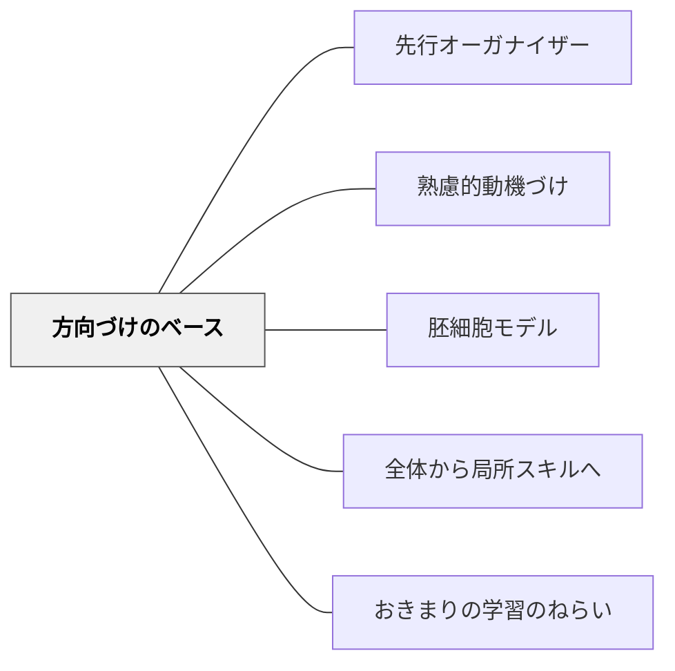

# 方向づけのベース

> 何を学ぶのかの全体像を先に示すことで、学習者は安心して深く入っていける。

## 背景（Context）
エンゲストロームが言うオリエンテーション・ベーシス（方向づけのベース）や、オーズベルの先行オーガナイザーなど、学習の方向性・全体像・文脈を事前に与えることの重要性は多くの学習理論が指摘している。「これから何をどう学ぶのか」という見通しが、動機と理解の両方を支える。

## 問題（Problem）
学習者が全体像や目的を把握しないまま細部に入ると、何のために学んでいるのかわからなくなり、動機が低下する。「こんなことを学ぶとは思っていなかった」という驚きや迷子感が、学習への抵抗感を生む。

## 力のかたち（Forces）
- 全体像を先に見せることで、学習内容が有意味な文脈に置かれる
- 方向づけが強すぎると自律的な探究を妨げる
- 学習者の既有知識によって、適切な方向づけの詳しさが変わる
- 方向づけはモチベーションの問題であると同時に、認知負荷の問題でもある

## 解決（Solution）
**学習の開始前に、全体的な地図（何を・なぜ・どう学ぶか）を提示し、学習者が見通しを持てるようにする。**

単元の最初に「今回学ぶことの全体像」を図や概念マップで示す。「最終的にどんなことができるようになるか」を具体的に伝える。学習の進行とともに「今はここ」を随時確認させることで、方向づけを維持する。

## 結果（Consequences）
- 学習者が学習の意味・文脈を理解して取り組めるようになる
- 迷子になる感覚が減り、心理的安全感が高まる
- 知識の体系的な統合が促進される

## クラスター図

## Actionable Insight

- 単元の最初に「今回学ぶことの全体像」を概念マップや図で示す——全体像が先にあることで学習内容が有意味な文脈に置かれ動機と理解の両方が支えられる
- 「最終的にどんなことができるようになるか」を具体的に伝える——見通しが明確なほど学習者は迷子になる感覚が減り心理的安全感を保ちながら深く入っていける
- 学習の進行とともに「今はここ」を随時確認させる——方向づけは最初だけでなく継続的な確認が知識の体系的な統合を促す

## 出典

- 一つの教育のパタン・ランゲージ（岩井輝久）

## 関連パタン
- [[パタン/先行オーガナイザー]]
- [[パタン/熟慮的動機づけ]] — 親パタン
- [[パタン/胚細胞モデル]] — 全体構造の核心から始める関連パタン
- [[パタン/全体から局所スキルへ]] — 全体把握からの学習配列
- [[パタン/おきまりの学習のねらい]] — 方向づけの具体的な実装
