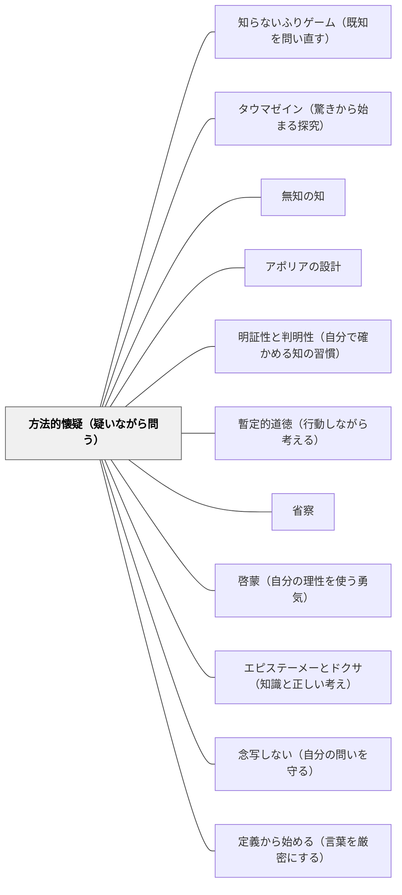

# 方法的懐疑（疑いながら問う）

> 「私の採用する第一の規則は、私が明証的に真であると認識するものでなければ、いかなるものも真として受け入れないことであった。」（デカルト『方法叙説』第二部）。「疑いようがない」と思い込んでいるものを一旦括弧に入れる——それが、より確かな理解への出発点になる。

---

## [Pattern Connection]

**方法叙説（デカルト, 1637）統合：**

デカルトの「方法的懐疑（doute méthodique）」は、「懐疑論（skepticism）」と区別される。懐疑論が「確かなことは何もない」という結論を目指すのに対し、方法的懐疑は「疑い続けることで疑えないものを見つける」という方法——懐疑を道具として真理を探す。

- **既存パタンとの関連**:
  - [[パタン/タウマゼイン（驚きから始まる探究）]] との深い接続——タウマゼインは「世界はどうなっているのか」という驚きから始まる問い; 方法的懐疑は「これは本当にそうなのか」という問い返し。驚き（タウマゼイン）が問いを生み、方法的懐疑がその問いを徹底する。
  - [[パタン/無知の知]] との相補関係——ソクラテスの無知の知は「知らないことを知る」という自己認識；デカルトの方法的懐疑は「思い込んで知っていると思っているものを括弧に入れる」という認識論的操作。両者は「知の前提を疑う」という実践を共有する。
  - [[パタン/アポリアの設計]] との接続——アポリア（問題の行き詰まり）は学習者が「わからない」と感じる局面; 方法的懐疑はその「わからない」局面を意図的に設計する教師側の意図と重なる。
- **補強された点**:
  - [[パタン/省察]] の既存 Pattern Connection（ソクラテスの吟味・バサニゼイン）に哲学的深度が加わる。バサニゼイン（思考の真偽を問い返す）とデカルトの方法的懐疑は同じ方向を指す——「これは本当にそうか」という一手間。
  - [[パタン/啓蒙（自分の理性を使う勇気）]] の「自分の理性を使う」という実践に、その「使い方」の具体的方法論が与えられる。
- **他のパタンへの波及**:
  - [[パタン/明証性と判明性（自分で確かめる知の習慣）]] — 方法的懐疑の結果として「明証的なもの」を基準にする習慣が生まれる
  - [[パタン/定義から始める（言葉を厳密にする）]] — 「この言葉が明証的に分かるか」という懐疑が厳密な定義の必要を生む
  - [[パタン/エピステーメーとドクサ（知識と正しい考え）]] — 方法的懐疑はドクサ（意見）をエピステーメー（知識）に高める実践として読める

---

## 背景（Context）

教室で「なぜ？」と聞くと、よく「教科書にそう書いてあるから」「先生がそう言ったから」という答えが返ってくる。知識が権威から来るとき、それは本当の意味では「知っている」と言えるのか。

デカルトは1637年、若い頃の学問への不満を語る。「私は、感官をだます偉大な書物を読むよりも、自分の中にある書物——つまり世界という大きな書物——を読もうとした」。伝統的な権威（書物・学者・慣習）を鵜呑みにせず、自分の理性で確かめる習慣——これが方法的懐疑の出発点である。

ただしデカルトは、すべてを疑い続ける懐疑論者になったのではない。方法的懐疑は「より確かなものを見つけるための方法」であって、「何も確かではない」という結論ではない。懐疑は道具であり、目的ではない。

## 問題（Problem）

「当たり前」として受け入れられている前提が、学習の障壁になることがある：

- 「先生がそう言ったから」という受動的な受け入れが、理解を浅くする
- 「この解き方が正しい」という思い込みが、別の見方を遮断する
- 「自分には向いていない」という固定した自己評価が、成長の可能性を閉じる
- 「これが常識だから」という文化的前提が、別の文化・視点への感受性を閉じる
- 疑いを「反抗」と捉える学習文化が、知的誠実さを萎縮させる

## 力のかたち（Forces）

- 疑いは問いの始まりだが、際限なく疑うと知識の基盤が崩れる——方法は「疑い方」を持つこと
- 子どもは権威（教師・教科書）を信頼する傾向がある——その信頼は学びを助けるが、同時に批判的思考を抑制しうる
- 「なぜ？」という問いを大切にする文化があれば、方法的懐疑は自然に育つ
- 方法的懐疑は孤独な作業ではない——対話・問い返し・仲間の視点が懐疑を深める
- 完全な確信が持てるまで行動しないのでは実践が止まる——懐疑と行動の両立が必要（→ [[パタン/暫定的道徳（行動しながら考える）]]）

## 解決（Solution）

**「明証的でないものは一旦括弧に入れる」という姿勢を教室文化に組み込む。権威・慣習・思い込みに対して「本当にそうか」という問いを一手間かける習慣を、教師自身が実演し、子どもがそれを真似る機会を設計する。**

---

### 方法的懐疑の三段階

**段階1：「何を知っているつもりか」を確認する**
「これは知っているか？」「なぜ知っているか？」——前提を意識にのぼらせる。教師の問いかけ：「あなたがそう考えるのはなぜ？」「それはいつ誰が決めたこと？」

**段階2：「もし違ったら？」を試す**
「これが違ったとしたら、何が変わる？」——反事実的問いで、前提の依存度を確かめる。数学なら「この公式が使えないとしたら、どう解く？」。生活場面なら「そのルールがなかったとしたら、何が困る？」

**段階3：「自分で確かめたか」を問う**
「自分の目で（頭で）確かめたか？」——他者の言葉でなく、自分自身の認識として受け入れられるか。「教科書にそう書いてあるから」は理由ではなく、「なぜそうなるか自分で分かるか」が問題。

---

### 教師が方法的懐疑を実演する

デカルト自身、書物の知識を疑い、世界に直接学びに出た。教師が「実は私もこれは自分で確かめたい」「この説明で本当に分かるか、一緒に確かめよう」という姿勢を見せることで、懐疑が「反抗」でなく「誠実さ」として文化に定着する。

- 「教科書のこの説明、あなたたちに分かる？私にはここが気になった」
- 「なぜこの公式が成り立つか、一緒に考えてみよう——暗記より先に理由を確かめる」
- 「昨日私が言ったこと、実は正確じゃなかったかもしれない——見直してみたら...」

---

### 具体例

**例1：算数・「なぜそのやり方で解けるのか」**
「この解き方でなぜ答えが出るか分かる？」と問うことで、手続きの暗記から意味の理解へ。方法的懐疑は「この手順が本当に正しいか」を自分で確かめる習慣。

**例2：社会・「当たり前」の再検討**
「なぜこのルールがあるのか」「ずっとこうだったのか」——歴史的・文化的前提を問い返す。「みんなそう言っているから」を一旦括弧に入れる。

**例3：授業後の教師の省察**
「今日の授業、子どもが理解したと私は思い込んでいたけれど、本当に分かっていたか？」——自分の授業判断に方法的懐疑をかける。「うまくいった」という思い込みを一旦外すことで、より鋭い観察が生まれる。

**例4：読書**
「著者がこう主張しているが、本当にそうか？反証はないか？別の解釈はないか？」——テキストへの方法的懐疑。受動的な読書から能動的な吟味へ。

## 結果（Consequences）

- 「教科書（先生）がそう言ったから」が根拠になる文化から、「自分で確かめたから」が根拠になる文化へと移行しやすくなる
- 子どもが「わからない」と言える場面が増える——方法的懐疑は「わからない状態」を異常でなく誠実な状態として位置づける
- 教師の権威が「正解の所持者」から「問いの道連れ」へと変容する
- ただし、方法的懐疑の文化が定着するには時間がかかる——「疑うことは失礼」という文化的前提が根強い場合、段階的な導入が必要
- 際限のない懐疑への抑制も必要——「今は前提として受け入れ、先に進む」という段階を設けることで、懐疑と学習の前進を両立する

## 関連パタン
- [[パタン/知らないふりゲーム（既知を問い直す）]]

- [[パタン/タウマゼイン（驚きから始まる探究）]] — 驚きが問いを生み、方法的懐疑がその問いを徹底する
- [[パタン/無知の知]] — ソクラテスの「知らないことを知る」との哲学的共鳴
- [[パタン/アポリアの設計]] — 行き詰まりを意図的に設計することで懐疑の入口を作る
- [[パタン/明証性と判明性（自分で確かめる知の習慣）]] — 方法的懐疑の先にある認識の基準
- [[パタン/暫定的道徳（行動しながら考える）]] — 懐疑しながらも行動するための実践知
- [[パタン/省察]] — 「これは本当にそうか」を自分の実践に向ける実践
- [[パタン/啓蒙（自分の理性を使う勇気）]] — 「自分の理性を使う勇気」の方法論
- [[パタン/エピステーメーとドクサ（知識と正しい考え）]] — 意見を知識に高める認識論的道程
- [[パタン/念写しない（自分の問いを守る）]] — 他者の見解を鵜呑みにしない姿勢の実践
- [[パタン/定義から始める（言葉を厳密にする）]] — 「この言葉の意味、本当に分かるか」という懐疑の入口
- [[文献/方法叙説（デカルト）]] — 本パタンの出典

---

## クラスター図

## Actionable Insight

- 授業の冒頭に「これについて、なぜそうなるか自分で説明できる人？」と問いかける一言を習慣にする——「分かっているつもり」を可視化する最初の一手
- 教師自身が「私にはここが分からなかった」「これ、本当にそうなのか確かめてみたい」という言葉を週一回使う——方法的懐疑が「教師のすることではない」という思い込みを崩す
- 子どもが「教科書にそう書いてあるから」と言ったとき、「なぜ教科書はそう書いているのだろう？」と問い返す一言を持つ——権威から理由へ、受動から能動へ

---

## 出典

デカルト, ルネ（1637/2022）.『方法叙説』小泉義之訳. 講談社学術文庫.

Descartes, René (1637). *Discours de la méthode pour bien conduire sa raison, et chercher la vérité dans les sciences*. Leiden.

> 「私は書物から得られる学問をすべて捨て去り、もはや私自身の中、あるいは世界という大きな書物の中に見いだせる学問だけを探求することに決め、若い時間をそのために使った。」（第一部）
