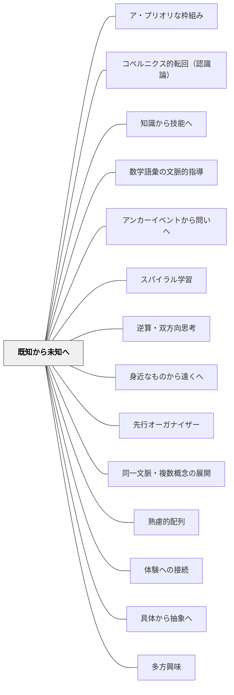

# 既知から未知へ

> 新しい知識は、すでに知っていることに根を張ってはじめて育つ。

## 背景（Context）

[[パタン/熟慮的配列]] において最も基本的な次元の一つ。どの学習者も、何らかの既有知識・経験・信念をもって教室に入ってくる。その土壌を無視して新しい内容を植えつけようとしても、根づかない。

## 問題（Problem）

既有知識との接続なしに新しい内容を提示すると、学習者はそれを宙に浮いた情報として丸暗記するしかない。文脈なき知識は定着せず、転用もきかない。

## 力のかたち（Forces）

- 学習者の既有知識は個人によって大きく異なる
- 「既知」を確認する時間が確保できないことがある
- 既知から出発しすぎると、本来教えたい「未知」に到達するのが遅れる
- 既有知識が誤概念である場合、それを足場にすると誤った方向に学習が進む

## 解決（Solution）

**新しい内容を導入する前に、学習者がすでに知っていることを意図的に活性化し、そこに新しい内容をつなぐ問いや活動を設計する。**

実践例：
- 「〇〇について知っていることを書き出してみよう」（KWLチャートのK）
- 既習単元や日常経験との類比から始める（「これは先週学んだ△△に似ているね」）
- 新しい概念の名前を出す前に、その現象を経験させ「これはどう説明できる？」と問う

誤概念がある場合は、それを可視化したうえで「なぜそうは言えないのか」を問いとして扱う。

## 結果（Consequences）

- 新しい知識が既存の知識ネットワークに統合され、長期記憶に残りやすくなる
- 学習者が「わかる」という感覚（有能感）を持ちながら新しい領域に進める
- 誤概念が可視化され、修正の機会が生まれる

## クラスター図

## Actionable Insight

- 新しい単元の最初に「○○について知っていることを3つ書き出してみよう」を2分間設ける——既有知識を活性化することで新しい内容が根付く土台ができる
- 新概念を導入する前に「これは先週学んだ△△に似ているね、どこが似てると思う？」と問う——類比から入ることで既知と未知のつなぎ目が学習者に見える
- 誤概念が出てきたとき、すぐに否定せず「なぜそう思ったか」を一緒に探る——誤概念を可視化して問いに変えることが深い修正学習につながる

## 出典

- 一つの教育のパタン・ランゲージ（岩井輝久）

## 関連パタン
- [[パタン/ア・プリオリな枠組み]]
- [[パタン/コペルニクス的転回（認識論）]]
- [[パタン/知識から技能へ]]
- [[パタン/数学語彙の文脈的指導]]
- [[教科/算数・数学で使うパタン]]
- [[パタン/アンカーイベントから問いへ]]
- [[パタン/スパイラル学習]]
- [[パタン/逆算・双方向思考]]
- [[パタン/身近なものから遠くへ]]
- [[パタン/先行オーガナイザー]]
- [[パタン/同一文脈・複数概念の展開]]

- [[パタン/熟慮的配列]] — 上位パタン
- [[パタン/体験への接続]] — 経験という既知との接続
- [[パタン/具体から抽象へ]] — 具体的な既知から抽象的な未知へ
- [[パタン/多方興味]] — 既知の観念に新しい観念を類化させることで興味が生まれる
## このパタンが働く実践

| 実践パタン | どのように既知から未知へ進むか |
|------------|--------------------------------|
| [[実践/10や100を単位にして計算しよう]] | 位取りや10のまとまりという既習を足場に、何十・何百の加減計算へ進む |
| [[実践/個別支援級の複式算数：重さと面積をわたり・ずらしで学ぶ]] | 長さ・かさ・数直線などの既習を足場に、重さや面積の新しい単位へ進む |
