# 既知から未知へ

> 新しい知識は、すでに知っていることに根を張ってはじめて育つ。

## [Pattern Connection]

**ペスタロッチ（1801）ゲルトルート児童教育法 統合——認識論的「近さ」としての既知の優先：**

- **本パタンの歴史的起源の明確化**：ペスタロッチは「あなた自身であるすべては、あなたの外側にあるすべてよりも、あなたにとって明確ではっきりしたものにしやすい。あなたが自分自身について意識していることは、すべてあなたが確かに意識していることであり……明確な概念への道は、他のどの道よりも、この道においてより容易かつ確実に開かれる」と述べた。「既知（自己・内側）」は「未知（外部・外側）」よりも常に明確であり、学習はその明確な既知から出発しなければならないという認識論的必然として定式化されている。
- **「近さの法則」の認識論的次元**：`身近なものから遠くへ` がペスタロッチの「物理的・空間的な近さ」を扱うのに対し、本パタンはその「認識論的な近さ」の次元を実装する。「五感に近いもの→遠いもの」（空間的）と「すでに知っていること→まだ知らないこと」（認識論的）は、同じ「近さの法則」の二つの側面である。
- **「混乱から明確へ」の出発点**：ペスタロッチの直観教授は「混乱した見解を一つひとつ視覚化し、最後にそれらを学習者の他の知識の輪全体と関連させる」プロセスである。「他の知識の輪」とは学習者がすでに持っている知識ネットワーク——これが「既知」であり、新しい知識はこの輪に連結されることで初めて「明確な概念」になる。
- **西洋教育史での位置づけ**：「既知から未知へ」はペスタロッチ主義の配列原則として後の教員養成（1883年「改正教授術」）に引き継がれた最も基本的な原則の一つ。`身近なものから遠くへ` `具体から抽象へ` `単純から複雑へ` と並んで、ペスタロッチが1801年に定式化した心理学的順序の中核をなす。
- **波及するパタン**：[[パタン/身近なものから遠くへ]] — 同じ近さの法則の空間的次元；[[パタン/感性と悟性の協働]] — 既知の感性的直観を出発点に悟性が働く；[[文献/ゲルトルート児童教育法（ペスタロッチ）]] — 本統合の出典

---

**Dewey（1910）How We Think 統合（2026-05-31）：**

*How We Think* Ch.14「観察と情報」は、apperception principle（統覚の原則）を通じて本パタンを補強する。Deweyの論点：新しい情報が「生きた問いへの関連性」をもたない限り、「学校の知識と学校外の経験の断絶」を生む。

**apperception principle（Ch.14）：**  
新しい情報は学習者の先有経験（prior experience）に接続されなければ、学習者の知識ネットワークに統合されない——これがDeweyのapperception principleである。ペスタロッチの「既知の優先」と同じ原則を、Deweyは「情報提供のタイミングと方法」として具体化する。

**「学校の知識と学校外経験の断絶」批判：**  
Deweyは Ch.14 で「学校で学ぶ知識が、学校外の日常経験と切り離されている」という断絶を批判する。これは本パタンの「既有知識との接続なしに新しい内容を提示すると、学習者はそれを宙に浮いた情報として丸暗記するしかない」という問題意識と完全に一致する。

**「先週の授業で学んだことは？」ではなく「あなたが見たり聞いたりしたことは？」：**  
先有経験への接続で重要なのは、「学校内の既習事項」だけでなく「学校外の生活経験」まで含めることである。Deweyはこの点を強調する——「知っていること」の範囲を学校知識に限定すると、apperception principleが半分しか機能しない。

**情報提供の原則①（Ch.14）：**  
Deweyは「情報提供は直接観察できないものに限る」と述べる——学習者が自分で観察できることは自分で観察させ、どうしても観察できないことについてのみ情報を提供する。これは「既知から未知へ」の配列原則と「観察の前に答えを与えない」という設計原則を統合する。

- **補強された点**：ペスタロッチ（1801）が「認識論的な近さ」として定式化した本パタンを、Deweyが「情報提供の具体的設計原則」として実装する。「いつ情報を提供するか」という実践的な問いへの答えが加わる
- **修正・拡張された点**：「先有経験」の範囲が「学校内の既習事項」から「学校外の生活経験」まで広がる——「あなたが日常で見たり聞いたりしたことと、今日の学習内容はつながるか？」という問い方の価値が明確になる
- **他のパタンへの波及**：[[パタン/体験への接続]] — 生活経験を接続点として使う設計；[[文献/How We Think（Dewey）]] — 本統合の出典

---

## 背景（Context）

[[パタン/熟慮的配列]] において最も基本的な次元の一つ。どの学習者も、何らかの既有知識・経験・信念をもって教室に入ってくる。その土壌を無視して新しい内容を植えつけようとしても、根づかない。

## 問題（Problem）

既有知識との接続なしに新しい内容を提示すると、学習者はそれを宙に浮いた情報として丸暗記するしかない。文脈なき知識は定着せず、転用もきかない。

## 力のかたち（Forces）

- 学習者の既有知識は個人によって大きく異なる
- 「既知」を確認する時間が確保できないことがある
- 既知から出発しすぎると、本来教えたい「未知」に到達するのが遅れる
- 既有知識が誤概念である場合、それを足場にすると誤った方向に学習が進む

## 解決（Solution）

**新しい内容を導入する前に、学習者がすでに知っていることを意図的に活性化し、そこに新しい内容をつなぐ問いや活動を設計する。**

実践例：
- 「〇〇について知っていることを書き出してみよう」（KWLチャートのK）
- 既習単元や日常経験との類比から始める（「これは先週学んだ△△に似ているね」）
- 新しい概念の名前を出す前に、その現象を経験させ「これはどう説明できる？」と問う

誤概念がある場合は、それを可視化したうえで「なぜそうは言えないのか」を問いとして扱う。

## 自己教育での適用例

**数学デイリー（岩井の実践）：** 高校数学を学ぶとき、小学校・中学校で培った数の感覚や計算の直観を足場にして新しい概念へ接続する。例えば整数・分数の感覚から実数の体系へ、四則演算の感覚から関数・極限の考えへと進む。

- **子どもとの共通点**：新しい概念は既有知識に根を張ることで初めて定着するという認知的原理は同じ
- **大人ならではの差**：自分の「既知」の境界が自分でわかる。どこから入れば腑に落ちるかを自分で判断し、接続点を選べる。子どもは教師が足場を設計してくれるが、自己教育では自分で「どの既知とつなぐか」を設計する必要がある

---

## 結果（Consequences）

- 新しい知識が既存の知識ネットワークに統合され、長期記憶に残りやすくなる
- 学習者が「わかる」という感覚（有能感）を持ちながら新しい領域に進める
- 誤概念が可視化され、修正の機会が生まれる

## クラスター図

```mermaid
flowchart LR
    ne697a2e79fa5e3818be38289e69caae79fa5e381b8["既知から未知へ"]
    ne6a682e5bfb5e381aee88aafe38292e381a4e3818be38280efbc88e59cb0e58a9be381aee5ada6e381b3e696b9efbc89["概念の芯をつかむ（地力の学び方）"]
    ne8a898e58fb7e68ea5e59cb0efbc8853796d626f6c2047726f756e64696e67efbc89["記号接地（Symbol Grounding）"]
    ne79bb4e68ea5e8a68be38188e381aae38184e5afbee8b1a1e381b8e381aee9a19ee68ea8efbc88e8aa8de8ad98e8ab96e79a84e381abe59bb0e99ba3e381aae69687e88488efbc89["直接見えない対象への類推（認識論的に困難な文脈）"]
    ne98193e585b7e381aee99990e7958ce3818be38289e696b0e6a682e5bfb5e381b8efbc88e697a2e79fa5e381aee5a381e38292e5ada6e381b3e381aee585a5e58fa3e381abefbc89["道具の限界から新概念へ（既知の壁を学びの入口に）"]
    ne6988ee79eade58c96e383bbe980a3e59088e383bbe4bd93e7b3bbe58c96e383bbe696b9e6b395efbc88e59b9be6aeb5e99a8ee69599e68e88e9818ee7a88befbc89["明瞭化・連合・体系化・方法（四段階教授過程）"]
    ne382a2e383bbe38397e383aae382aae383aae381aae69ea0e7b584e381bf["ア・プリオリな枠組み"]
    ne382b3e3839ae383abe3838be382afe382b9e79a84e8bba2e59b9eefbc88e8aa8de8ad98e8ab96efbc89["コペルニクス的転回（認識論）"]
    ne79fa5e8ad98e3818be38289e68a80e883bde381b8["知識から技能へ"]
    ne695b0e5ada6e8aa9ee5bd99e381aee69687e88488e79a84e68c87e5b08e["数学語彙の文脈的指導"]
    ne382a2e383b3e382abe383bce382a4e38399e383b3e38388e3818be38289e5958fe38184e381b8["アンカーイベントから問いへ"]
    ne382b9e38391e382a4e383a9e383abe5ada6e7bf92["スパイラル学習"]
    ne98086e7ae97e383bbe58f8ce696b9e59091e6809de88083["逆算・双方向思考"]
    ne8baabe8bf91e381aae38282e381aee3818be38289e981a0e3818fe381b8["身近なものから遠くへ"]
    ne58588e8a18ce382aae383bce382ace3838ae382a4e382b6e383bc["先行オーガナイザー"]

    ne697a2e79fa5e3818be38289e69caae79fa5e381b8 --- ne6a682e5bfb5e381aee88aafe38292e381a4e3818be38280efbc88e59cb0e58a9be381aee5ada6e381b3e696b9efbc89
    ne697a2e79fa5e3818be38289e69caae79fa5e381b8 --- ne8a898e58fb7e68ea5e59cb0efbc8853796d626f6c2047726f756e64696e67efbc89
    ne697a2e79fa5e3818be38289e69caae79fa5e381b8 --- ne79bb4e68ea5e8a68be38188e381aae38184e5afbee8b1a1e381b8e381aee9a19ee68ea8efbc88e8aa8de8ad98e8ab96e79a84e381abe59bb0e99ba3e381aae69687e88488efbc89
    ne697a2e79fa5e3818be38289e69caae79fa5e381b8 --- ne98193e585b7e381aee99990e7958ce3818be38289e696b0e6a682e5bfb5e381b8efbc88e697a2e79fa5e381aee5a381e38292e5ada6e381b3e381aee585a5e58fa3e381abefbc89
    ne697a2e79fa5e3818be38289e69caae79fa5e381b8 --- ne6988ee79eade58c96e383bbe980a3e59088e383bbe4bd93e7b3bbe58c96e383bbe696b9e6b395efbc88e59b9be6aeb5e99a8ee69599e68e88e9818ee7a88befbc89
    ne697a2e79fa5e3818be38289e69caae79fa5e381b8 --- ne382a2e383bbe38397e383aae382aae383aae381aae69ea0e7b584e381bf
    ne697a2e79fa5e3818be38289e69caae79fa5e381b8 --- ne382b3e3839ae383abe3838be382afe382b9e79a84e8bba2e59b9eefbc88e8aa8de8ad98e8ab96efbc89
    ne697a2e79fa5e3818be38289e69caae79fa5e381b8 --- ne79fa5e8ad98e3818be38289e68a80e883bde381b8
    ne697a2e79fa5e3818be38289e69caae79fa5e381b8 --- ne695b0e5ada6e8aa9ee5bd99e381aee69687e88488e79a84e68c87e5b08e
    ne697a2e79fa5e3818be38289e69caae79fa5e381b8 --- ne382a2e383b3e382abe383bce382a4e38399e383b3e38388e3818be38289e5958fe38184e381b8
    ne697a2e79fa5e3818be38289e69caae79fa5e381b8 --- ne382b9e38391e382a4e383a9e383abe5ada6e7bf92
    ne697a2e79fa5e3818be38289e69caae79fa5e381b8 --- ne98086e7ae97e383bbe58f8ce696b9e59091e6809de88083
    ne697a2e79fa5e3818be38289e69caae79fa5e381b8 --- ne8baabe8bf91e381aae38282e381aee3818be38289e981a0e3818fe381b8
    ne697a2e79fa5e3818be38289e69caae79fa5e381b8 --- ne58588e8a18ce382aae383bce382ace3838ae382a4e382b6e383bc

    classDef hub fill:#f0f0f0,stroke:#555,color:#000,font-weight:bold
    class ne697a2e79fa5e3818be38289e69caae79fa5e381b8 hub
```

## Actionable Insight

- 新しい単元の最初に「○○について知っていることを3つ書き出してみよう」を2分間設ける——既有知識を活性化することで新しい内容が根付く土台ができる
- 新概念を導入する前に「これは先週学んだ△△に似ているね、どこが似てると思う？」と問う——類比から入ることで既知と未知のつなぎ目が学習者に見える
- 誤概念が出てきたとき、すぐに否定せず「なぜそう思ったか」を一緒に探る——誤概念を可視化して問いに変えることが深い修正学習につながる

## 出典

- 一つの教育のパタン・ランゲージ（岩井輝久）
- [[文献/ゲルトルート児童教育法（ペスタロッチ）]]
- [[文献/How We Think（Dewey）]] — apperception principle（Ch.14）・学校知識と学校外経験の断絶批判の出典

## 関連パタン
- [[パタン/概念の芯をつかむ（地力の学び方）]]
- [[パタン/記号接地（Symbol Grounding）]]
- [[パタン/直接見えない対象への類推（認識論的に困難な文脈）]]
- [[パタン/道具の限界から新概念へ（既知の壁を学びの入口に）]]
- [[パタン/明瞭化・連合・体系化・方法（四段階教授過程）]]
- [[パタン/ア・プリオリな枠組み]]
- [[パタン/コペルニクス的転回（認識論）]]
- [[パタン/知識から技能へ]]
- [[パタン/数学語彙の文脈的指導]]
- [[教科/算数・数学で使うパタン]]
- [[パタン/アンカーイベントから問いへ]]
- [[パタン/スパイラル学習]]
- [[パタン/逆算・双方向思考]]
- [[パタン/身近なものから遠くへ]]
- [[パタン/先行オーガナイザー]]
- [[パタン/同一文脈・複数概念の展開]]

- [[パタン/熟慮的配列]] — 上位パタン
- [[パタン/体験への接続]] — 経験という既知との接続
- [[パタン/具体から抽象へ]] — 具体的な既知から抽象的な未知へ
- [[パタン/多方興味]] — 既知の観念に新しい観念を類化させることで興味が生まれる

## このパタンが働く実践

| 実践パタン | どのように既知から未知へ進むか |
|------------|--------------------------------|
| [[実践/10や100を単位にして計算しよう]] | 位取りや10のまとまりという既習を足場に、何十・何百の加減計算へ進む |
| [[実践/個別支援級の複式算数：重さと面積をわたり・ずらしで学ぶ]] | 長さ・かさ・数直線などの既習を足場に、重さや面積の新しい単位へ進む |
